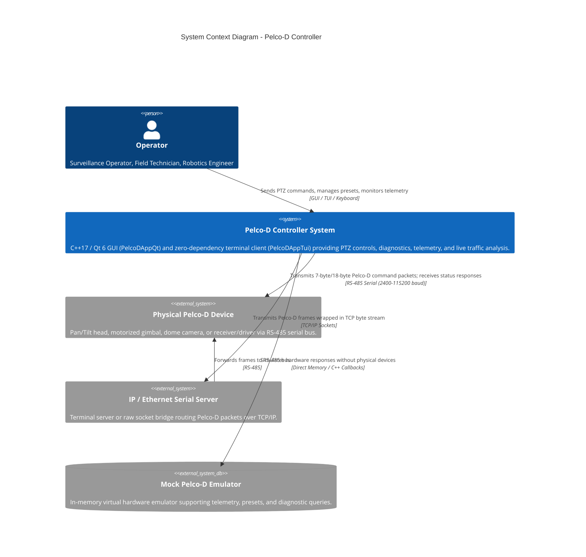
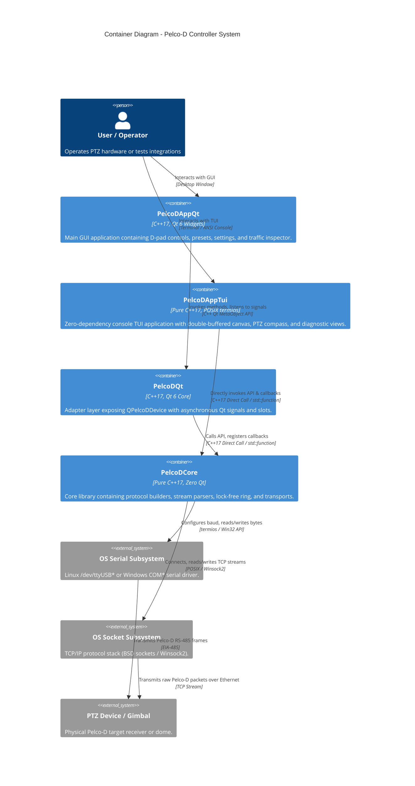
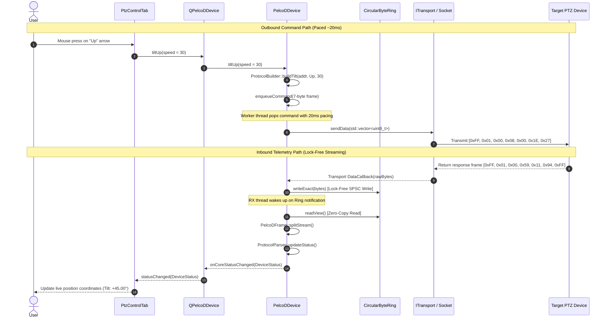

# Pelco-D Controller — C4 Architecture Documentation

This document describes the software architecture of the Pelco-D Controller system using the **C4 Model** (Context, Containers, Components, and Code/Flows). Each architectural tier is illustrated with both **ASCII diagrams** and **Mermaid diagrams**.

---

## 1. Level 1: System Context Diagram

The System Context diagram outlines the Pelco-D Controller boundary, its human operators, and external hardware / network systems.

### ASCII Diagram

```text
+-------------------------------------------------------------------------------+
|                                 OPERATOR                                      |
|            (Surveillance Operator, Field Technician, Robotics Engineer)       |
+-------------------------------------------------------------------------------+
                                      |
                                      | Interacts with GUI / Terminal / Commands
                                      v
+-------------------------------------------------------------------------------+
|                           PELCO-D CONTROLLER SYSTEM                           |
|                                                                               |
|  - Desktop GUI Application (PelcoDAppQt)                                      |
|  - Zero-Dependency Terminal Client (PelcoDAppTui)                             |
|  - Qt 6 Asynchronous Signal/Slot Adapter (PelcoDQt)                           |
|  - Pure C++17 Protocol & Hardware Abstraction Engine (PelcoDCore)             |
+-------------------------------------------------------------------------------+
           |                                  |                        |
           | RS-485 Half/Full Duplex          | TCP/IP (Raw Socket)    | Direct Memory
           v                                  v                        v
+-----------------------+          +--------------------+    +------------------+
|  PHYSICAL PTZ DEVICE  |          |  IP SERIAL SERVER  |    |  MOCK EMULATOR   |
| (Pan/Tilt Head, Dome, |          | (Moxa, Perle, ESP) |    | (In-Memory PTZ   |
|  Gimbal, Receiver)    |          |         |          |    |  Virtual Device) |
+-----------------------+          +---------+----------+    +------------------+
                                             | RS-485
                                             v
                                   +--------------------+
                                   | PHYSICAL PTZ DEVICE|
                                   +--------------------+
```

### Mermaid Diagram



---

## 2. Level 2: Container Diagram

The Container diagram illustrates the high-level software containers that form the Pelco-D Controller solution, their technology stacks, and communication paths.

### ASCII Diagram

```text
+-----------------------------------------------------------------------------------------------+
|                                      PELCO-D CONTROLLER                                       |
|                                                                                               |
|  +--------------------------------------------+  +-----------------------------------------+  |
|  | PelcoDAppQt (Desktop Executable)           |  | PelcoDAppTui (Console Executable)       |  |
|  | Technology: C++17, Qt 6 Widgets, Modern QSS|  | Technology: Pure C++17, POSIX termios   |  |
|  | Responsibility: Full GUI, D-Pad, Tabs.     |  | Responsibility: TUI Canvas, PTZ Compass |  |
|  +--------------------------------------------+  +-----------------------------------------+  |
|                         |                                             |                       |
|                         | Qt Signals / Slots                          | Direct C++ API        |
|                         v                                             | & Callbacks           |
|  +--------------------------------------------+                       |                       |
|  | PelcoDQt (Static / Shared Library)         |                       |                       |
|  | Technology: C++17, Qt 6 Core               |                       |                       |
|  | Responsibility: QPelcoDDevice facade.      |                       |                       |
|  +--------------------------------------------+                       |                       |
|                         |                                             |                       |
|                         | Pure C++ Calls / std::function Callbacks    |                       |
|                         v                                             v                       |
|  +-----------------------------------------------------------------------------------------+  |
|  | PelcoDCore (Static Library - Zero Qt Dependencies)                                      |  |
|  | Technology: Pure C++17, POSIX / Win32, glog, CMake Compiler Flags                       |  |
|  | Responsibility: Protocol framing, lock-free ring buffer, command queue                  |  |
|  |                 pacing (15-20ms), transport abstraction, telemetry.                     |  |
|  +-----------------------------------------------------------------------------------------+  |
|                         |                                             |                       |
+-------------------------|---------------------------------------------|-----------------------+
                          |                                             |
                          | Native OS System Calls                      | Native Socket Calls
                          v                                             v
              +-----------------------+                     +-----------------------+
              | Linux termios /       |                     | Linux BSD Sockets /   |
              | Win32 Comm API        |                     | Windows Winsock2      |
              +-----------------------+                     +-----------------------+
                          |                                             |
                          v                                             v
                [ Hardware Serial Port ]                       [ Ethernet Network ]
```

### Mermaid Diagram



---

## 3. Level 3: Component Diagram (PelcoDCore)

The Component diagram details the internal modular structure of `libs/PelcoDCore`.

### ASCII Diagram

```text
+-------------------------------------------------------------------------------+
|                                  PelcoDCore                                   |
|                                                                               |
|  +-------------------------------------------------------------------------+  |
|  |                             PelcoDDevice                                |  |
|  |  - High-level coordinator & thread-safe facade                          |  |
|  |  - Paced outbound command queue (15-20 ms delay, max 256 items)         |  |
|  |  - Background telemetry polling loop                                    |  |
|  |  - State management (DeviceStatus, DeviceInfo)                          |  |
|  +-------------------------------------------------------------------------+  |
|         |                     |                           |          |        |
|         | Uses                | Feeds RX bytes            | Parses   | Uses   |
|         v                     v                           v          |        |
|  +----------------+    +------------------+    +----------------+    |        |
|  |ProtocolBuilder |    | CircularByteRing |    | ProtocolParser |    |        |
|  | - buildMotion  |    | - SPSC lock-free |    | - parseGeneral |    |        |
|  | - buildSetPan  |    | - alignas(64)    |    | - parsePan/Tilt|    |        |
|  | - buildPreset  |    | - Zero-alloc     |    | - parseQuery   |    |        |
|  | - buildAux/Zone|    +------------------+    +----------------+    |        |
|  +----------------+             |                      ^             |        |
|         |                       | Reads frames         |             |        |
|         | Produces              +----------------------+             |        |
|         v                                                            |        |
|  +--------------------------------------------------------------+    |        |
|  |                         PelcoDFrame                          |    |        |
|  |  - SyncByte (0xFF), Standard (7-byte), General (4-byte)      |    |        |
|  |  - Query (18-byte), Modulo-256 Checksum, Stream Framing      |    |        |
|  +--------------------------------------------------------------+    |        |
|                                                                      |        |
|  +-------------------------------------------------------------------+-----+  |
|  |                           ITransport (Interface)                        |  |
|  +-------------------------------------------------------------------------+  |
|          ^                               ^                        ^           |
|          | Implements                    | Implements             | Implements|
|  +--------------------+       +--------------------+    +------------------+  |
|  |  SerialTransport   |       |    TcpTransport    |    | MockPelcoDDevice |  |
|  | (termios / Win32)  |       | (POSIX / Winsock2) |    | (Virtual Memory) |  |
|  +--------------------+       +--------------------+    +------------------+  |
+-------------------------------------------------------------------------------+
```

### Mermaid Diagram

```mermaid
C4Component
    title Component Diagram - PelcoDCore Library

    Container_Boundary(core, "PelcoDCore (Static Library)")
        Component(device, "PelcoDDevice", "C++17 Class", "Main facade. Coordinates command pacing (~20ms), RX consumer thread, and telemetry polling.")
        Component(builder, "ProtocolBuilder", "C++17 Static Utility", "Constructs standard motion, speed clamping, presets, auxiliaries, zones, and query frames.")
        Component(frame, "PelcoDFrame", "C++17 Struct / Methods", "Validates 4, 7, and 18-byte frames, calculates modulo-256 checksums, splits bounded streams.")
        Component(ring, "CircularByteRing", "C++17 SPSC Template", "Lock-free circular buffer with cacheline padding (64 bytes) for asynchronous RX ingestion.")
        Component(parser, "ProtocolParser", "C++17 Static Utility", "Parses general responses, pan/tilt/zoom telemetry, device type, and sanitized query text.")
        Component(itransport, "ITransport", "C++17 Pure Interface", "Defines open, close, sendData, and data/state callbacks.")
        Component(serial, "SerialTransport", "C++17 Implementation", "Cross-platform serial transport (POSIX termios / Win32 Comm API) with baud rate validation.")
        Component(tcp, "TcpTransport", "C++17 Implementation", "Cross-platform TCP socket transport (BSD sockets / Winsock2) with hostname checks.")
        Component(mock, "MockPelcoDDevice", "C++17 In-Memory Emulator", "Simulates PTZ motors, angles, preset registers, and query replies in memory.")
        Component(status, "DeviceStatus / Info", "C++17 Data Structures", "Telemetry state holding coordinates, alarm flags, preset states, and model info.")
    Container_Boundary_End()

    Rel(device, builder, "Builds command frames", "Static calls")
    Rel(builder, frame, "Creates valid frames with checksum", "PelcoDFrame::create")
    Rel(device, itransport, "Sends paced byte packets", "ITransport::sendData")
    Rel(itransport, serial, "Implemented by")
    Rel(itransport, tcp, "Implemented by")
    Rel(itransport, mock, "Implemented by")
    Rel(itransport, device, "Notifies incoming raw bytes", "std::function callback")
    Rel(device, ring, "Pushes bytes from transport", "writeExact")
    Rel(device, frame, "Splits stream into frames", "splitStream")
    Rel(device, parser, "Decodes received frames", "updateStatus")
    Rel(parser, status, "Updates telemetry state", "Direct mutation")
```

---

## 4. Level 3: Component Diagram (PelcoDAppQt & PelcoDQt)

The Component diagram details the GUI layer (`app-qt`) and its bridge (`PelcoDQt`).

### ASCII Diagram

```text
+-------------------------------------------------------------------------------+
|                                   PelcoDAppQt                                 |
|                                                                               |
|  +-------------------------------------------------------------------------+  |
|  |                               MainWindow                                |  |
|  |  - Central widget host, tabbed dashboard, status bar, notifications    |  |
|  +-------------------------------------------------------------------------+  |
|         |                   |                   |                             |
|         v                   v                   v                             |
|  +-----------------+ +--------------------+ +------------------------------+  |
|  |ConnectionWidget | |TrafficInspector    | | Tab Widgets:                 |  |
|  | - Port/Baud     | | - Live hex monitor | | - PtzControlTab (D-Pad)      |  |
|  | - Host/Port     | | - Filter (TX/RX)   | | - PresetsTab (1-255, Tours)  |  |
|  | - Mock selector | | - Raw packet send  | | - DeviceSettingsTab (Optics) |  |
|  +-----------------+ +--------------------+ | - AuxZonesTab (Relays, Zones)|  |
|                                             | - OsdScreenTab (OSD Text)    |  |
|                                             | - SystemTab (Diagnostics)    |  |
|                                             +------------------------------+  |
|                                                            |                  |
+------------------------------------------------------------|------------------+
                                                             | Qt Signals/Slots
                                                             v
+-------------------------------------------------------------------------------+
|                                    PelcoDQt                                   |
|                                                                               |
|  +-------------------------------------------------------------------------+  |
|  |                              QPelcoDDevice                              |  |
|  |  - QObject wrapper inheriting QObject                                   |  |
|  |  - Signals: statusChanged, trafficLogged, queryResponseReceived, etc.   |  |
|  |  - Slots: connectSerial, connectTcp, connectMock, panLeft, tiltUp, etc. |  |
|  |  - Encapsulates PelcoDDevice instance                                   |  |
|  +-------------------------------------------------------------------------+  |
|                                     |                                         |
|                                     v (Invokes C++ API)                       |
|                          [ PelcoDCore::PelcoDDevice ]                         |
+-------------------------------------------------------------------------------+
```

### Mermaid Diagram

```mermaid
C4Component
    title Component Diagram - PelcoDAppQt and PelcoDQt

    Container_Boundary(appBoundary, "PelcoDAppQt (Qt 6 Executable)")
        Component(mainWindow, "MainWindow", "QMainWindow", "Orchestrates sub-widgets, tabs, telemetry ticker, and QSS dark theme.")
        Component(connWidget, "ConnectionWidget", "QWidget", "Provides controls for Serial, TCP, and Mock simulator connection.")
        Component(trafficWidget, "TrafficInspectorWidget", "QWidget", "Hex packet table viewer with TX/RX color tagging and manual hex sender.")
        Component(ptzTab, "PtzControlTab", "QWidget", "8-direction interactive D-Pad with hold-to-move, speed sliders, and coordinates.")
        Component(presetTab, "PresetsTab", "QWidget", "Manages 255 presets with Set, Go To, Clear, quick buttons, and auto tour.")
        Component(settingsTab, "DeviceSettingsTab", "QWidget", "Optics controls: Auto Focus, Auto Iris, AGC, BLC, White Balance, Shutter, Gain.")
        Component(auxTab, "AuxZonesTab", "QWidget", "Toggles 8 Aux relays, configures 8 sector zones, and triggers 4 guard patterns.")
        Component(osdTab, "OsdScreenTab", "QWidget", "OSD character generator for columns 0-39 and alarm reset controls.")
        Component(sysTab, "SystemTab", "QWidget", "Diagnostic query runner (Pan, Tilt, Zoom, Device Type) and polling setup.")
    Container_Boundary_End()

    Container_Boundary(qtBoundary, "PelcoDQt (Qt 6 Adapter)")
        Component(qdevice, "QPelcoDDevice", "QObject", "Translates Qt signals and slots to/from pure C++ PelcoDDevice.")
    Container_Boundary_End()

    Rel(mainWindow, connWidget, "Embeds", "Layout")
    Rel(mainWindow, trafficWidget, "Embeds", "Layout")
    Rel(mainWindow, ptzTab, "Hosts in QTabWidget", "Layout")
    Rel(mainWindow, presetTab, "Hosts in QTabWidget", "Layout")
    Rel(mainWindow, settingsTab, "Hosts in QTabWidget", "Layout")
    Rel(mainWindow, auxTab, "Hosts in QTabWidget", "Layout")
    Rel(mainWindow, osdTab, "Hosts in QTabWidget", "Layout")
    Rel(mainWindow, sysTab, "Hosts in QTabWidget", "Layout")

    Rel(connWidget, qdevice, "Triggers connect/disconnect", "Qt Slots")
    Rel(ptzTab, qdevice, "Sends motion and coordinate requests", "Qt Slots")
    Rel(presetTab, qdevice, "Invokes preset actions", "Qt Slots")
    Rel(settingsTab, qdevice, "Invokes optical and motor actions", "Qt Slots")
    Rel(auxTab, qdevice, "Controls relays and zones", "Qt Slots")
    Rel(osdTab, qdevice, "Writes text and clears alarms", "Qt Slots")
    Rel(sysTab, qdevice, "Queries diagnostics and sets polling", "Qt Slots")
    Rel(trafficWidget, qdevice, "Sends manual raw hex packet", "Qt Slots")

    Rel(qdevice, mainWindow, "Emits statusChanged, connectionStateChanged", "Qt Signals")
    Rel(qdevice, trafficWidget, "Emits trafficLogged", "Qt Signals")
    Rel(qdevice, sysTab, "Emits queryResponseReceived", "Qt Signals")
```

---

## 5. Level 3: Component Diagram (PelcoDAppTui / app-tui)

The Component diagram details the zero-dependency Terminal User Interface layer (`app-tui`).

### ASCII Diagram

```text
+-------------------------------------------------------------------------------+
|                        PelcoDAppTui (Container: app-tui)                      |
|                                                                               |
|  +-------------------------------------------------------------------------+  |
|  |                                 TuiApp                                  |  |
|  |  - Main event loop coordinator (30-50 FPS render ticker)                |  |
|  |  - Input router (hotkeys 1-6, F1-F6, modal focus, view delegator)       |  |
|  |  - Owns Terminal, Canvas, and PelcoDDevice instance                      |  |
|  +-------------------------------------------------------------------------+  |
|         |                   |                   |                             |
|         | Controls          | Draws into        | Delegates to                |
|         v                   v                   v                             |
|  +----------------+  +----------------+  +---------------------------------+  |
|  |    Terminal    |  |     Canvas     |  | View Components (app-tui/views/)|  |
|  | - Raw termios  |  | - Double buffer|  | - HeaderView (Status & Tabs)    |  |
|  | - Alt screen   |  | - Delta ANSI   |  | - PtzView (Compass & Sliders)   |  |
|  | - Mouse/SIGWINCH  | - UTF-8 cells  |  | - PresetsView (1-32 Table)      |  |
|  | - Escape parser|  | - Box & meters |  | - SettingsView (Optics & Baud)  |  |
|  +----------------+  +----------------+  | - AuxOsdView (Relays & OSD)     |  |
|         |                   ^            | - DiagnosticsView (Sensors)     |  |
|         | Flushes output    |            | - TrafficView (Hex Monitor)     |  |
|         v                   |            | - ConnectionModal (Setup)       |  |
|     [ Console ]             +------------| - FooterView (Hotkeys & Logs)   |  |
|                                          +---------------------------------+  |
|                                                           |                   |
+-----------------------------------------------------------|-------------------+
                                                            | Pure C++ Calls
                                                            | & Callbacks
                                                            v
                                              [ PelcoDCore::PelcoDDevice ]
```

### Mermaid Diagram

```mermaid
C4Component
    title Component Diagram - PelcoDAppTui (app-tui)

    Container_Boundary(tuiBoundary, "PelcoDAppTui (Console Executable)")
        Component(tuiapp, "TuiApp", "C++17 Class", "Main coordinator. Runs 30-50 FPS loop, routes keyboard/mouse inputs, manages view lifecycle.")
        Component(term, "Terminal", "C++17 RAII Wrapper", "Manages termios raw mode, alternate screen buffer, SIGWINCH resize handler, and escape sequence parser.")
        Component(canvas, "Canvas", "C++17 Double Buffer", "2D cell matrix supporting UTF-8 graphemes, 24-bit TrueColor/ANSI, box drawing, and differential delta rendering.")
        
        Component(headerView, "HeaderView", "C++17 View", "Renders title, camera ID, connection status badge, and clickable/hotkey tab selector.")
        Component(ptzView, "PtzView", "C++17 View", "PTZ compass crosshair, real-time azimuth/elevation angles, and fractional speed/optic meters.")
        Component(presetView, "PresetsView", "C++17 View", "Preset table (1-32) with Set, GoTo, Clear, 180° Flip, and Zero Pan actions.")
        Component(settingsView, "SettingsView", "C++17 View", "Configures AF, AI, AGC, BLC, AWB, line lock delay, white balance, and remote baud rates.")
        Component(auxOsdView, "AuxOsdView", "C++17 View", "Auxiliary 1-8 relays with active cursor selection, zone scan triggers, and OSD menu keypad.")
        Component(diagView, "DiagnosticsView", "C++17 View", "Telemetry query triggers, internal temperature, optical sensor ID, and ACK/NAK history.")
        Component(trafficView, "TrafficView", "C++17 View", "Live rolling packet monitor with colorized hex stream and decoded Pelco-D opcodes.")
        Component(connModal, "ConnectionModal", "C++17 Modal View", "Popup dialog to configure and switch between Mock, Serial, and TCP transports.")
        Component(footerView, "FooterView", "C++17 View", "Bottom hotkeys reference bar and dynamic status notifications.")
    Container_Boundary_End()

    Rel(tuiapp, term, "Reads input & flushes ANSI buffer", "termios / poll / write")
    Rel(tuiapp, canvas, "Clears, resizes, and renders delta", "Canvas API")
    Rel(tuiapp, headerView, "Renders", "Layout")
    Rel(tuiapp, footerView, "Renders", "Layout")
    Rel(tuiapp, connModal, "Renders & routes input", "Modal Focus")
    Rel(tuiapp, ptzView, "Hosts Tab 1", "Active View")
    Rel(tuiapp, presetView, "Hosts Tab 2", "Active View")
    Rel(tuiapp, settingsView, "Hosts Tab 3", "Active View")
    Rel(tuiapp, auxOsdView, "Hosts Tab 4", "Active View")
    Rel(tuiapp, diagView, "Hosts Tab 5", "Active View")
    Rel(tuiapp, trafficView, "Hosts Tab 6", "Active View")

    Rel(ptzView, canvas, "Draws into", "Canvas primitives")
    Rel(headerView, canvas, "Draws into", "Canvas primitives")
    Rel(footerView, canvas, "Draws into", "Canvas primitives")
    Rel(connModal, canvas, "Draws into", "Canvas primitives")

    Rel(tuiapp, device, "Controls device & registers callbacks", "PelcoDCore API")
    Rel(ptzView, device, "Sends motion & speed commands", "PelcoDCore API")
    Rel(presetView, device, "Sends preset commands", "PelcoDCore API")
    Rel(settingsView, device, "Sends setting commands", "PelcoDCore API")
    Rel(auxOsdView, device, "Sends aux & scan commands", "PelcoDCore API")
    Rel(diagView, device, "Sends telemetry queries", "PelcoDCore API")
```

---

## 6. Level 4: Data Flow & Sequence Diagram

This diagram demonstrates the end-to-end round-trip execution of both an outbound command and an asynchronous incoming telemetry response.

### ASCII Diagram

```text
[ User ]        [ PtzControlTab ]     [ QPelcoDDevice ]    [ PelcoDDevice ]     [ ITransport ]      [ Hardware / Mock ]
   |                    |                    |                    |                    |                    |
   |-- Press "UP" ----->|                    |                    |                    |                    |
   |                    |-- tiltUp(speed) -->|                    |                    |                    |
   |                    |                    |-- tiltUp(speed) -->|                    |                    |
   |                    |                    |                    |-- buildTilt() ---->| (ProtocolBuilder)  |
   |                    |                    |                    |-- enqueueCommand ->|                    |
   |                    |                    |                    |   [Paced Queue]    |                    |
   |                    |                    |                    |   (sleep ~20ms)    |                    |
   |                    |                    |                    |-- sendData(frame)->|                    |
   |                    |                    |                    |                    |-- Write to Wire -->|
   |                    |                    |                    |                    |   [0xFF,0x01, ...] |
   |                    |                    |                    |                    |                    |
   |                    |                    |                    |                    |<-- RX Bytes -------|
   |                    |                    |                    |<-- onDataReceived -|   [0xFF,0x01, ...] |
   |                    |                    |                    |    (writeExact)    |                    |
   |                    |                    |                    |          |         |                    |
   |                    |                    |                    |    [Lock-Free Ring]|                    |
   |                    |                    |                    |          |         |                    |
   |                    |                    |                    |    (splitStream)   |                    |
   |                    |                    |                    |          |         |                    |
   |                    |                    |                    |    (updateStatus)  |                    |
   |                    |                    |<-- statusCallback -|                    |                    |
   |                    |<-- statusChanged --|                    |                    |                    |
   |<-- Update GUI -----|                    |                    |                    |                    |
   |    (Tilt: 45.00°)  |                    |                    |                    |                    |
```

### Mermaid Sequence Diagram



---

## 7. Security Hardening & Robustness Guarantees

As detailed in the architecture and verified by our automated test suite:

1. **Lock-Free Concurrency:** Single-Producer Single-Consumer (SPSC) lock-free ring buffer with `alignas(64)` eliminates mutex contention between inbound I/O drivers and stream parsers.
2. **Deterministic Memory Footprint:**
   - Command pacing queue bounded to 256 items with drop-oldest overflow strategy.
   - Stream splitter capped at 1 MB per chunk and 2048 frames per cycle to prevent memory exhaustion.
3. **Input Sanitization:** Query payloads are character-by-character sanitized with `std::isprint` to protect user interfaces and system logs from terminal escape sequences and non-printable control characters.
4. **Binary Hardening:** Complies with modern hardening standards (`-fstack-protector-strong`, `-fstack-clash-protection`, `-fcf-protection=full`, `_FORTIFY_SOURCE=2`, `/GS`, `/guard:cf`, `ASLR`, `DEP`, `-pie`).
