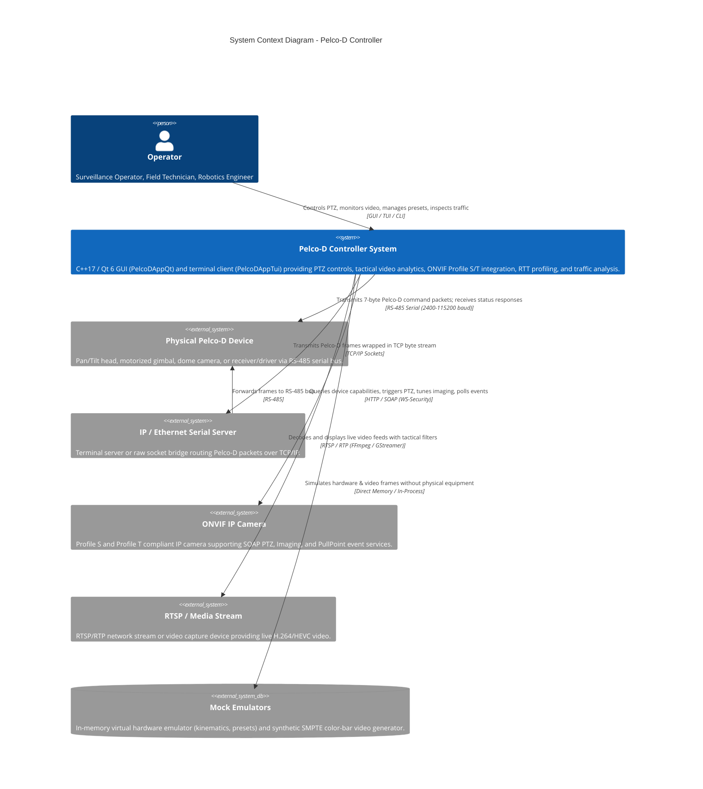
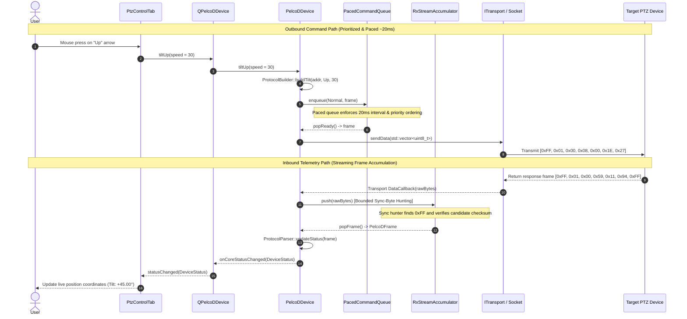
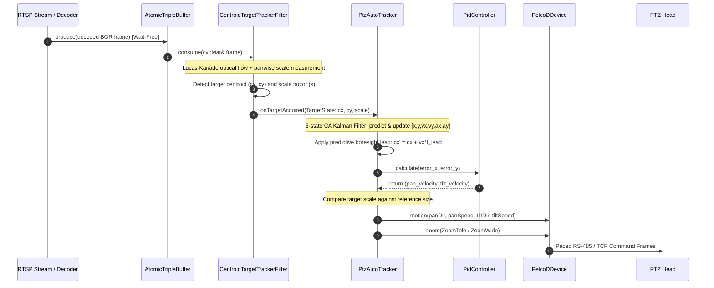

```mermaid
C4Container
    title Container Diagram - Pelco-D Controller System
    
    Person(user, "Operator", "Operates PTZ hardware, monitors live video feeds, tracks targets")

    Container(appQt, "PelcoDAppQt", "C++17, Qt 6 Widgets", "Main GUI application with live video canvas, tactical HUD, D-pad, ONVIF Profile S/T tab, RTT profiler, and bus scanner.")
    Container(appTui, "PelcoDAppTui", "Pure C++17, termios / Win32", "Zero-dependency console application with double-buffered canvas, terminal Braille video playback, PTZ compass, and ONVIF CLI discovery tools.")
    Container(qtAdapter, "PelcoDQt", "C++17, Qt 6 Core", "Qt adapter layer wrapping core C++ objects (QPelcoDDevice, QVideoStreamWorker, QOnvifDevice, QRttProfiler).")
    Container(coreLib, "PelcoDCore", "Pure C++17, Zero Qt/Socket/Math/Vendor", "Core domain library containing protocol framing, command pacing, abstract ITransport port, BusScanner, PatrolController, MacroPlayer, and RttProfiler.")
    Container(transLib, "PelcoDTransport", "Pure C++17, Zero Qt, Sockets/Serial", "Dedicated I/O transport layer implementing concrete adapters: SerialTransport (RS-485 via Win32/termios), TcpTransport, UdpTransport, BaseTransport, and SocketUtils.")
    Container(fujiLib, "PelcoDFujinon", "Pure C++17, Zero Qt", "Specialized camera protocol extensions for Fujinon SX800/SX801 series. Subclasses PelcoDDevice with proprietary packet encoders/decoders.")
    Container(simLib, "PelcoDSim", "Pure C++17, Zero Qt", "Virtual device emulation and kinematics simulation. Implements MockPelcoDDevice (ITransport), KinematicsSimulator, and LatencyPipeline.")
    Container(trackLib, "Tracking", "Pure C++17, Zero Qt", "Closed-loop visual tracking, EKF/UKF spherical kinematic estimation, PtzCameraModel projective geometry, PID control, latency estimation, and plant identification.")
    Container(mathLib, "Math", "Pure C++17, Zero External Dependencies", "Mathematical transforms (FFT, DCT, DWT, STFT), digital filters (NotchFilter), motion estimation (PhaseCorrelation), integral images, and matrix algebra.")
    Container(videoLib, "Video", "Pure C++17, FFmpeg, GStreamer", "Lightweight video decoding pipeline with AtomicTripleBuffer, decoders, IFrameProcessor port, and BrailleRenderer. Zero OpenCV dependencies.")
    Container(filtersLib, "VideoFilters", "Pure C++17, OpenCV", "Standalone computer vision library implementing IFrameProcessor: Color, Spatial, Geometric, Thermal, Tracking, and Overlay filters.")
    Container(onvifLib, "Onvif", "Pure C++17, libcurl, pugixml", "ONVIF Profile S and T SOAP client/server handling WS-Discovery, WS-Security, Media, PTZ, Imaging, thermal radiometry, and PullPoint event streams. Contains protocol adapters in adapters/.")

    System_Ext(serialPort, "Serial Port (RS-485)", "Native POSIX termios or Win32 Comm API.")
    System_Ext(tcpSocket, "Ethernet Serial Server", "Raw TCP/IP stream forwarding Pelco-D frames.")
    System_Ext(rtspSource, "RTSP / Video Source", "RTSP/RTP network stream or capture device.")
    System_Ext(onvifCam, "ONVIF IP Camera", "Network camera responding to SOAP Profile S/T requests.")

    Rel(user, appQt, "Interacts with GUI", "Desktop Window")
    Rel(user, appTui, "Interacts with TUI", "ANSI / Braille Console")
    Rel(appQt, qtAdapter, "Invokes methods, listens to signals", "Qt MetaObject API")
    Rel(appQt, fujiLib, "Invokes Fujinon optics & OIS", "Direct C++ API")
    Rel(appQt, simLib, "Controls virtual dynamics & presets", "Direct C++ API")
    Rel(appQt, trackLib, "Invokes auto-tracking & estimation", "Direct C++ API")
    Rel(appQt, videoLib, "Renders frames from AtomicTripleBuffer", "Direct C++ API")
    Rel(appQt, filtersLib, "Applies OpenCV filter pipeline", "Direct C++ API")
    Rel(appTui, coreLib, "Invokes PTZ & bus scanner", "Direct C++ API")
    Rel(appTui, fujiLib, "Invokes Fujinon controls", "Direct C++ API")
    Rel(appTui, simLib, "Configures offline mock device", "Direct C++ API")
    Rel(appTui, trackLib, "Invokes plant diagnostics", "Direct C++ API")
    Rel(appTui, videoLib, "Renders Braille stream", "Direct C++ API")
    Rel(appTui, onvifLib, "Invokes CLI discovery & diagnostics", "Direct C++ API")
    Rel(qtAdapter, coreLib, "Calls API, forwards telemetry", "Direct C++ Call / std::function")
    Rel(qtAdapter, fujiLib, "Wraps QFujinonSX800Device", "Direct C++ Call")
    Rel(qtAdapter, onvifLib, "Dispatches SOAP calls asynchronously", "Direct C++ Call")
    Rel(fujiLib, coreLib, "Subclasses PelcoDDevice & uses frames", "Inheritance / C++ API")
    Rel(simLib, coreLib, "Implements ITransport & processes PelcoDFrames", "Interface implementation")
    Rel(trackLib, coreLib, "Steers camera via motor commands", "Direct C++ Call")
    Rel(trackLib, mathLib, "Invokes matrix math & DSP transforms", "Direct C++ Call")
    Rel(videoLib, mathLib, "Utilizes phase correlation & focus metrics", "Direct C++ Call")
    Rel(filtersLib, videoLib, "Processes decoded video frames", "IFrameProcessor port")
    Rel(transLib, serialPort, "Reads/writes RS-485 frames", "termios / Win32 API")
    Rel(transLib, tcpSocket, "Reads/writes raw TCP packets", "BSD Sockets / Winsock2")
    Rel(videoLib, rtspSource, "Demuxes and decodes video streams", "FFmpeg / GStreamer")
    Rel(onvifLib, onvifCam, "Sends SOAP envelopes & parses XML", "HTTP POST (libcurl)")
```

# Pelco-D Controller — C4 Architecture Documentation

This document describes the software architecture of the Pelco-D Controller system using the **C4 Model** (Context, Containers, Components, and Code/Flows). Each architectural tier is illustrated with both **ASCII diagrams** and **Mermaid diagrams**.

---

## 1. Level 1: System Context Diagram

The System Context diagram outlines the Pelco-D Controller boundary, its human operators, and external hardware / network systems.

### ASCII Diagram

```text
+---------------------------------------------------------------------------------------------------+
|                                             OPERATOR                                              |
|                    (Surveillance Operator, Field Technician, Robotics Engineer)                   |
+---------------------------------------------------------------------------------------------------+
                                                  |
                                                  | Interacts with GUI / Terminal / CLI Commands
                                                  v
+---------------------------------------------------------------------------------------------------+
|                                     PELCO-D CONTROLLER SYSTEM                                     |
|                                                                                                   |
|  - Desktop GUI Application (PelcoDAppQt): Video, HUD, D-Pad, Presets, ONVIF Tab, RTT Profiler     |
|  - Zero-Dependency Terminal Client (PelcoDAppTui): Braille Video, PTZ Compass, ONVIF CLI Tools   |
|  - Qt 6 Asynchronous Signal/Slot Adapter (PelcoDQt)                                               |
|  - Tactical Video Streaming (Video) & OpenCV Vision Pipeline (VideoFilters)                       |
|  - Standalone ONVIF Profile S & T Client Engine (Onvif)                                           |
|  - Pure C++17 Core Protocol (PelcoDCore), Transports, Optics, Sim, Math & Tracking Subsystems     |
+---------------------------------------------------------------------------------------------------+
         |                       |                     |                     |               |
         | RS-485                | TCP/IP (Raw Socket) | HTTP SOAP / WS-Sec  | RTSP / RTP    | Direct Memory
         v                       v                     v                     v               v
+------------------+   +-------------------+  +-------------------+  +---------------+ +---------------+
| PHYSICAL PELCO-D |   | IP SERIAL SERVER  |  | ONVIF IP CAMERA   |  | RTSP STREAM / | | MOCK HARDWARE |
| (Pan/Tilt Head,  |   | (Moxa, Perle, ESP)|  | (Profile S & T:   |  | NETWORK VIDEO | | & SMPTE VIDEO |
|  Dome, Gimbal)   |   |         |         |  |  PTZ, Img, Events)|  | (H.264/RTSP)   | |  EMULATORS    |
+------------------+   +---------+---------+  +-------------------+  +---------------+ +---------------+
                                 | RS-485
                                 v
                       +-------------------+
                       | PHYSICAL PELCO-D  |
                       +-------------------+
```

### Mermaid Diagram



---

## 2. Level 2: Container Diagram

The Container diagram illustrates the high-level software containers that form the Pelco-D Controller solution, their technology stacks, and communication paths.

### ASCII Diagram

```text
+-----------------------------------------------------------------------------------------------------------------------------------+
|                                                        PELCO-D CONTROLLER                                                         |
|                                                                                                                                   |
|  +-------------------------------------------------------------+  +------------------------------------------------------------+  |
|  | PelcoDAppQt (Desktop GUI Executable)                        |  | PelcoDAppTui (Console & CLI Executable)                    |  |
|  | Technology: C++17, Qt 6 Widgets, Modern Dark QSS            |  | Technology: Pure C++17, POSIX termios / Win32 Console      |  |
|  | Features: Video Canvas, HUD Overlays, ONVIF Tab, D-Pad,     |  | Features: Braille Video, PTZ Compass, Traffic Inspector,   |  |
|  |           RTT Profiler, Bus Scanner, Fujinon Optics.        |  |           Bus Scanner, ONVIF CLI Discovery & Diagnostics.  |  |
|  +-------------------------------------------------------------+  +------------------------------------------------------------+  |
|                   |                                                                        |                                      |
|                   | Qt Signals & Slots                                                     | Direct C++ API & Callbacks           |
|                   v                                                                        |                                      |
|  +-------------------------------------------------------------+                           |                                      |
|  | PelcoDQt (Qt 6 Adapter Library)                             |                           |                                      |
|  | Technology: C++17, Qt 6 Core & Threading                    |                           |                                      |
|  | Adapters: QPelcoDDevice, QFujinonSX800Device,               |                           |                                      |
|  |           QVideoStreamWorker, QOnvifDevice, QRttProfiler.   |                           |                                      |
|  +-------------------------------------------------------------+                           |                                      |
|          |                   |                     |                                       |                                      |
|          | Qt Wrappers       | Decoded Frames      | SOAP Calls                            | Direct C++ Calls                     |
|          v                   v                     v                                       v                                      |
|  +-----------------------------------------------------------------------------------------------------------------------------+  |
|  | DOMAIN & HARDWARE SUBSYSTEMS (Pure C++17, Zero Qt)                                                                          |  |
|  |                                                                                                                             |  |
|  |  +--------------------------+  +--------------------------+  +--------------------------+  +--------------------------+     |  |
|  |  | PelcoDCore               |  | PelcoDTransport          |  | PelcoDFujinon            |  | PelcoDSim                |     |  |
|  |  | - Protocol Framing       |  | - SerialTransport (RS485)|  | - FujinonSX800Device     |  | - MockPelcoDDevice       |     |  |
|  |  | - PacedCommandQueue      |  | - TcpTransport (Sockets) |  | - Proprietary Framing    |  | - KinematicsSimulator    |     |  |
|  |  | - RxStreamAccumulator    |  | - UdpTransport           |  | - Optical Zoom & Defog   |  | - LatencyPipeline        |     |  |
|  |  | - BusScanner & RttProf   |  | - SocketUtils            |  | - Status Telemetry       |  | - Deterministic Jitter   |     |  |
|  |  +--------------------------+  +--------------------------+  +--------------------------+  +--------------------------+     |  |
|  |               ^                              ^                             |                             |                  |  |
|  |               | Uses ITransport              | Implements ITransport       | Subclasses PelcoDDevice     | Implements       |  |
|  |               +------------------------------+-----------------------------+                             | ITransport       |  |
|  |                                                                                                          +------------------+  |
|  |  +--------------------------+  +--------------------------+  +--------------------------+  +--------------------------+     |  |
|  |  | PelcoDTracking           |  | PelcoDMath               |  | PelcoDVideo              |  | PelcoDVideoFilters       |     |  |
|  |  | - PtzAutoTracker         |  | - DSP Transforms (FFT)   |  | - AtomicTripleBuffer     |  | - OpenCV Computer Vision |     |  |
|  |  | - EKF / UKF Estimators   |  | - Digital Filters(Notch) |  | - FFmpeg & GStreamer     |  | - Color & Spatial Filters|     |  |
|  |  | - PtzCameraModel         |  | - Phase Correlation      |  | - IVideoDecoder Port     |  | - Thermal & Reticle OSD  |     |  |
|  |  | - PID & Latency Estimator|  | - Matrix Algebra         |  | - BrailleRenderer        |  | - LK & Centroid Tracking |     |  |
|  |  +--------------------------+  +--------------------------+  +--------------------------+  +--------------------------+     |  |
|  |               |                              ^                             |                             ^                  |  |
|  |               | Controls PTZ                 | Math Routines               | Decoded Video               | Implements       |  |
|  |               v                              |                             v                             | IFrameProcessor  |  |
|  |         [ PelcoDCore ]                       +---------------------[ PelcoDVideo ] <---------------------+                  |  |
|  |                                                                                                                             |  |
|  |  +-----------------------------------------------------------------------------------------------------------------------+  |  |
|  |  | Onvif                                                                                                                  |  |  |
|  |  | Technology: Pure C++17, libcurl, pugixml, Zero Qt                                                                     |  |  |
|  |  | Features: WS-Discovery (Multicast), WS-Security (SHA-1), Profile S (PTZ/Media), Profile T (Imaging/PullPoint Events)  |  |  |
|  |  +-----------------------------------------------------------------------------------------------------------------------+  |  |
|  +-----------------------------------------------------------------------------------------------------------------------------+  |
|                    |                                       |                                       |                              |
+--------------------|---------------------------------------|---------------------------------------|------------------------------+
                     |                                       |                                       |
                     | Native OS Calls                       | RTSP / RTP Network Packets            | HTTP / SOAP Wire Calls
                     v                                       v                                       v
         +-----------------------+               +-----------------------+               +-----------------------+
         | Linux termios /       |               | Network Socket Stack  |               | HTTP Network Client   |
         | Win32 Comm / Winsock2 |               | (libavformat/GStreamer|               | (libcurl / OS Sockets)|
         +-----------------------+               +-----------------------+               +-----------------------+
                     |                                       |                                       |
                     v                                       v                                       v
          [ Hardware Serial / TCP ]               [ RTSP IP Video Stream ]                [ ONVIF IP PTZ Camera ]
```

### Mermaid Diagram



---

## 3. Level 3: Component Diagram (PelcoDCore & Related Subsystems)

The Component diagram details the internal modular structure of libs/PelcoDCore and its relationships with PelcoDTransport, PelcoDFujinon, PelcoDSim, and PelcoDTracking.

### ASCII Diagram

```text
+----------------------------------------------------------------------------------------------------------------------------+
|                                              PELCODCORE & RELATED SUBSYSTEMS                                               |
|                                                                                                                            |
|  +--------------------------------------------------------+    +--------------------------------------------------------+  |
|  | PelcoDFujinon (Proprietary Optics Library)             |    | PelcoDTracking (Closed-Loop Autonomous Tracking)       |  |
|  |  +--------------------------------------------------+  |    |  +--------------------------------------------------+  |  |
|  |  | FujinonSX800Device (Subclasses PelcoDDevice)     |  |    |  | PtzAutoTracker (3-Axis Closed-Loop Controller)   |  |  |
|  |  | - Optical Zoom/Focus, OIS, Defog, Day/Night Ext  |  |    |  | - Dual PID loops (pan/tilt), dynamic zoom framing|  |  |
|  |  +--------------------------------------------------+  |    |  +--------------------------------------------------+  |  |
|  |        | Uses                      | Updates           |    |         | Uses                 | Feeds delay estimate  |  |
|  |        v                           v                   |    |         v                      ^                       |  |
|  |  +--------------------+      +--------------------+    |    |  +---------------+       +--------------------+        |  |
|  |  |   FujinonBuilder   |      |   FujinonParser    |    |    |  | PidController |       |  LatencyEstimator  |        |  |
|  |  | - Packets 1-10     |      | - Decodes 0xF0/F1  |    |    |  +---------------+       +--------------------+        |  |
|  |  | - 0x5D Zoom/Focus  |      | - FujinonStatus    |    |    |         ^                      ^                       |  |
|  |  +--------------------+      +--------------------+    |    |         | Kinematic Rates      | Boresight Lead        |  |
|  |        | Creates PelcoDFrames      ^                   |    |  +--------------------------------------------------+  |  |
|  |        +---------------------------+                   |    |  | PtzSphericalEstimator (EKF / UKF Fusion)         |  |  |
|  +--------------------------------------------------------+    |  | - Fuses 2D pixels with PTZ telemetry into 3D     |  |  |
|               | Inherits / Delegated Commands                  |  | - PtzCameraModel (projective geometry & model)   |  |  |
|               |                                                |  +--------------------------------------------------+  |  |
|               |                                                +--------------------------------------------------------+  |
|             | Commands                                                   | Steers camera via motor commands                |
|             v                                                            v                                                 |
|  +----------------------------------------------------------------------------------------------------------------------+  |
|  | PelcoDCore (Core Framing, Pacing, Protocol & Diagnostics)                                                            |  |
|  |                                                                                                                      |  |
|  |  +----------------------------------------------------------------------------------------------------------------+  |  |
|  |  |                                                  PelcoDDevice                                                  |  |  |
|  |  |  - High-level coordinator & thread-safe facade                                                                 |  |  |
|  |  |  - Async queries (queryPanAsync, queryTiltAsync, queryZoomAsync, queryStatusAsync with std::future)            |  |  |
|  |  |  - Background telemetry polling loop & observer connection management (ScopedConnectionList)                   |  |  |
|  |  +----------------------------------------------------------------------------------------------------------------+  |  |
|  |        | Enqueues Outbound         | Ingests Raw Bytes          | Probes Addresses          | Dispatches Latency RTT |  |
|  |        v                           v                            v                           v                        |  |
|  |  +--------------------+      +--------------------+       +--------------------+      +--------------------+         |  |
|  |  | PacedCommandQueue  |      |RxStreamAccumulator |       |     BusScanner     |      |    RttProfiler     |         |  |
|  |  | - Priority queue   |      | - SyncByte (0xFF)  |       | - Multi-baud scan  |      | - Query RTT timing |         |  |
|  |  |   (Urgent/Norm/Low)|      |   hunting & framing|       |   (2400-115200)    |      | - Jitter histogram |         |  |
|  |  | - Low-prio purge   |      | - Candidate checks |       +--------------------+      +--------------------+         |  |
|  |  | - Exponential retry|      |   (4, 7, 18 bytes) |                 |                           |                    |  |
|  |  |   backoff + jitter |      | - Noise rejection  |                 +-------------+-------------+                    |  |
|  |  | - RS-485 pacing    |      | - Overflow guard   |                               | Direct API                       |  |
|  |  +--------------------+      +--------------------+                               v                                  |  |
|  |        |                           |                                    +--------------------+                       |  |
|  |        | Pops ready                | Emits complete                     |  ProtocolBuilder   |                       |  |
|  |        | command                   | verified frame                     |  - buildMotion/Pan |                       |  |
|  |        v                           v                                    |  - buildPreset/Aux |                       |  |
|  |  +------------------------------------------------+                     +--------------------+                       |  |
|  |  |             PelcoDFrame Validation             |                               | Creates valid                    |  |
|  |  |  - Modulo-256 Checksum calculation & verify    |                               v frames                           |  |
|  |  |  - 4-byte query, 7-byte standard, 18-byte ext  |                     +--------------------+                       |  |
|  |  +------------------------------------------------+                     |  ProtocolParser    |                       |  |
|  |        | Transmits                            | Decodes response        |  - parseGeneral    |                       |  |
|  |        v                                      v                         |  - parsePan/Tilt   |                       |  |
|  |  +------------------------------------------------------------------+   |  - DeviceStatus    |                       |  |
|  |  |                   ITransport (Pure Interface)                    |   +--------------------+                       |  |
|  |  |  - open(), close(), sendData(), setCallbacks(DataCallback, State)|             ^                                  |  |
|  |  +------------------------------------------------------------------+-------------+                                  |  |
|  +----------------------------------------------------------------------------------------------------------------------+  |
|             ^                             ^                             ^                             ^                    |
|             | Implements                  | Implements                  | Implements                  | Implements         |
|  +--------------------------------------------------------------------+    +--------------------------------------------+  |
|  | PelcoDTransport (Concrete I/O Transport Adapters)                  |    | PelcoDSim (Virtual Emulation Subsystem)    |  |
|  |                                                                    |    |                                            |  |
|  |  +-------------------+  +-------------------+  +-----------------+ |    |  +--------------------------------------+  |  |
|  |  |  SerialTransport  |  |   TcpTransport    |  |  UdpTransport   | |    |  | MockPelcoDDevice (ITransport)        |  |  |
|  |  | - RS-485 WinComm  |  | - TCP Client sock |  | - UDP Datagram  | |    |  | - In-memory motors, registers,       |  |  |
|  |  | - POSIX termios   |  | - Non-blocking    |  | - Pair binding  | |    |  |   position telemetry & responses     |  |  |
|  |  +-------------------+  +-------------------+  +-----------------+ |    |  +--------------------------------------+  |  |
|  |             \                     |                     /          |    |         | Kinematics & Delay Sim           |  |
|  |              +--------------------+--------------------+           |    |         v                                  |  |
|  |                                   v                                |    |  +--------------------+ +---------------+  |  |
|  |                      +-------------------------+                   |    |  |KinematicsSimulator | |LatencyPipeline|  |  |
|  |                      | BaseTransport & Sockets |                   |    |  | - Slew/Accel/Dec   | |- Latency/Drop |  |  |
|  |                      | - Worker thread loop    |                   |    |  +--------------------+ +---------------+  |  |
|  |                      | - SocketUtils poll/err  |                   |    +--------------------------------------------+  |
|  |                      +-------------------------+                   |                                                    |
|  +--------------------------------------------------------------------+                                                    |
+----------------------------------------------------------------------------------------------------------------------------+
```

### Mermaid Diagram

```mermaid
C4Component
    title Component Diagram - PelcoDCore & Related Subsystems

    Container_Boundary(core, "PelcoDCore (Static Library)")
        Component(device, "PelcoDDevice", "C++17 Class", "Main facade coordinating transport lifecycle, async queries (std::future), and telemetry polling.")
        Component(cmdQueue, "PacedCommandQueue", "C++17 Class", "Thread-safe multi-priority command queue with exponential retry backoff and RS-485 timing pacing.")
        Component(rxAcc, "RxStreamAccumulator", "C++17 Class", "Thread-safe stream accumulator seeking sync bytes (0xFF) and extracting complete verified Pelco-D frames.")
        Component(builder, "ProtocolBuilder", "C++17 Static Utility", "Constructs standard motion, speed clamping, presets, auxiliaries, zones, and query frames.")
        Component(frame, "PelcoDFrame", "C++17 Struct / Methods", "Validates 4, 7, and 18-byte frames, calculates modulo-256 checksums, splits bounded streams.")
        Component(parser, "ProtocolParser", "C++17 Static Utility", "Parses general responses, pan/tilt/zoom telemetry, device type, and sanitized query text.")
        Component(busScan, "BusScanner", "C++17 Class", "Multi-baud (2400-115200) RS-485 bus address auto-discovery engine.")
        Component(rttProf, "RttProfiler", "C++17 Class", "High-precision latency and jitter profiler measuring query round-trip times.")
        Component(itransport, "ITransport", "C++17 Pure Interface", "Defines open, close, sendData, and data/state callbacks.")
        Component(status, "DeviceStatus", "C++17 Data Structures", "Telemetry state holding coordinates, alarm flags, and preset states.")
    Container_Boundary_End()

    Container_Boundary(sim, "PelcoDSim (Static Library)")
        Component(mock, "MockPelcoDDevice", "C++17 In-Memory Emulator", "Simulates PTZ motors, angles, preset registers, and query replies in memory (implements ITransport).")
        Component(kinSim, "KinematicsSimulator", "C++17 Class", "Physical PTZ dynamics with max speeds, acceleration limits, slew target tracking.")
        Component(latPipe, "LatencyPipeline", "C++17 Class", "Deterministic latency, jitter, and packet drop simulation pipeline.")
    Container_Boundary_End()

    Container_Boundary(fuji, "PelcoDFujinon (Static Library)")
        Component(fujinon, "FujinonSX800Device", "C++17 Class", "Specialized profile subclassing PelcoDDevice with OIS, defog, fine image, DayNightEx, and focal length telemetry.")
        Component(fbuilder, "FujinonBuilder", "C++17 Static Utility", "Encodes Fujinon proprietary packets (Original Commands 1-10, RTC, Menu Back, 0x5D Zoom).")
        Component(fparser, "FujinonParser", "C++17 Static Utility", "Decodes 0xF0/0xF1 responses, fine image, DayNightEx, ZoomFocusEx, and RTC telemetry.")
        Component(fstatus, "FujinonStatus / FujinonTypes", "C++17 Data Structures", "Telemetry state holding optical stabilization, defog, and Day/Night settings.")
    Container_Boundary_End()

    Container_Boundary(trans, "PelcoDTransport (Static Library)")
        Component(baseTrans, "BaseTransport", "C++17 Base Class", "Thread-safe worker lifecycle, write mutex protection, and callback dispatching.")
        Component(serial, "SerialTransport", "C++17 Implementation", "Cross-platform serial transport (POSIX termios / Win32 Comm API) with baud rate validation.")
        Component(tcp, "TcpTransport", "C++17 Implementation", "Cross-platform TCP socket transport (BSD sockets / Winsock2) with hostname checks.")
        Component(udp, "UdpTransport", "C++17 Implementation", "Cross-platform UDP datagram transport with socket pair binding.")
        Component(sockUtils, "SocketUtils", "C++17 Utility", "Cross-platform non-blocking socket configuration, poll, error mapping, and Winsock init.")
    Container_Boundary_End()

    Container_Boundary(track, "PelcoDTracking (Static Library)")
        Component(tracker, "PtzAutoTracker", "C++17 Class", "3-axis closed-loop tracking orchestrator with dual PID loops, dynamic zoom framing, and predictive lead.")
        Component(sphEst, "PtzSphericalEstimator", "C++17 Class", "Fuses 2D pixel detections with PTZ telemetry into 3D spherical angles & rates via EKF/UKF.")
        Component(camModel, "PtzCameraModel", "C++17 Class", "Pinhole projective camera geometry, lens distortion, forward/inverse projection, and Jacobian.")
        Component(ekf, "ExtendedKalmanFilter", "C++17 Class", "Non-linear state estimation using analytical measurement Jacobians.")
        Component(ukf, "UnscentedKalmanFilter", "C++17 Class", "Non-linear state estimation using deterministic unscented sigma points.")
        Component(pid, "PidController", "C++17 Class", "PID controller with anti-windup, derivative filtering, and feedforward.")
        Component(latEst, "LatencyEstimator", "C++17 Class", "Online command-to-video latency cross-correlation estimator.")
        Component(oscDet, "OscillationDetector", "C++17 Class", "Hunting oscillation detection in servo loops via FFT and adaptive notch filtering.")
        Component(plantId, "PlantIdentifier", "C++17 Class", "PTZ motor plant transfer function identification via chirp stimulus.")
        Component(shockDet, "TransientShockDetector", "C++17 Class", "Mechanical mount shock detection via Discrete Wavelet Transform.")
    Container_Boundary_End()

    Rel(fujinon, device, "Inherits from")
    Rel(fujinon, fbuilder, "Builds proprietary commands", "Static calls")
    Rel(fujinon, fparser, "Decodes proprietary responses", "FujinonParser::updateFujinonStatus")
    Rel(device, builder, "Builds command frames", "Static calls")
    Rel(builder, frame, "Creates valid frames with checksum", "PelcoDFrame::create")
    Rel(fbuilder, frame, "Creates valid frames with checksum", "PelcoDFrame::create")
    Rel(sphEst, ekf, "Linearized filtering")
    Rel(sphEst, ukf, "Sigma-point filtering")
    Rel(sphEst, camModel, "Projects/unprojects coordinates")
    Rel(tracker, pid, "Commands pan/tilt/zoom axes")
    Rel(tracker, device, "Issues pan, tilt, and zoom commands", "Direct API")
    Rel(latEst, tracker, "Feeds estimated delay for predictive lookahead")
    Rel(busScan, device, "Probes device addresses", "Direct API")
    Rel(rttProf, device, "Dispatches timed queries", "Direct API")
    Rel(device, itransport, "Sends paced byte packets", "ITransport::sendData")
    Rel(serial, itransport, "Implements")
    Rel(tcp, itransport, "Implements")
    Rel(udp, itransport, "Implements")
    Rel(mock, itransport, "Implements")
    Rel(serial, baseTrans, "Inherits from")
    Rel(tcp, baseTrans, "Inherits from")
    Rel(udp, baseTrans, "Inherits from")
    Rel(tcp, sockUtils, "Uses socket primitives")
    Rel(udp, sockUtils, "Uses socket primitives")
    Rel(itransport, device, "Notifies incoming raw bytes", "std::function callback")
    Rel(device, rxAcc, "Pushes incoming bytes & receives frames", "RxStreamAccumulator::push")
    Rel(rxAcc, frame, "Validates candidate frame checksums", "PelcoDFrame::isValidFrame")
    Rel(device, cmdQueue, "Delegates prioritized commands & retries", "enqueue / popReady")
    Rel(device, parser, "Decodes received frames", "updateStatus")
    Rel(parser, status, "Updates telemetry state", "Direct mutation")
```

---

## 4. Level 3: Component Diagram (PelcoDVideo & PelcoDVideoFilters)

The Component diagram details the decoupled architecture between `libs/PelcoDVideo` (video demuxing, decoding, and buffering) and `libs/PelcoDVideoFilters` (OpenCV computer vision processing).

### ASCII Diagram

```text
+---------------------------------------------------------------------------------------------------------------+
|                                                  PelcoDVideo                                                  |
|                                                                                                               |
|  +---------------------------------------------------------------------------------------------------------+  |
|  |                                       IVideoDecoder (Interface)                                         |  |
|  +---------------------------------------------------------------------------------------------------------+  |
|          ^                                           ^                                           ^            |
|          | Implements                                | Implements                                | Implements |
|  +-----------------------+               +-----------------------+               +-----------------------+    |
|  |     FFmpegDecoder     |               |    GStreamerDecoder   |               |   MockVideoDecoder    |    |
|  |  (libavcodec/swscale) |               |     (GstPipeline)     |               |     (SMPTE Pattern)   |    |
|  +-----------------------+               +-----------------------+               +-----------------------+    |
|          |                                           |                                           |            |
|          +-------------------------------------------+-------------------------------------------+            |
|                                                      | Writes decoded RGB24/BGR24 frames                      |
|                                                      v                                                        |
|  +---------------------------------------------------------------------------------------------------------+  |
|  |                                            AtomicTripleBuffer                                           |  |
|  |  - Wait-free, lock-free 3-slot buffer (WriteSlot, DirtySlot, ReadSlot)                                  |  |
|  |  - std::atomic pointer exchange eliminates tearing and thread contention                               |  |
|  +---------------------------------------------------------------------------------------------------------+  |
|          |                                                                                   |                |
|          | Reads latest frame for terminal                                                   | Reads frame    |
|          v                                                                                   v                |
|  +-----------------------+                                                       +-----------------------+    |
|  |    BrailleRenderer    |                                                       |    IFrameProcessor    |    |
|  | (2x4 UTF-8 Terminal)  |                                                       |    (Pure Interface)   |    |
|  +-----------------------+                                                       +-----------------------+    |
+----------------------------------------------------------------------------------------------|----------------+
                                                                                               |
                                             +-------------------------------------------------+
                                             | Implemented by OpenCV Filters
                                             v
+---------------------------------------------------------------------------------------------------------------+
|                                              PelcoDVideoFilters                                               |
|                                                                                                               |
|  +------------------------+  +------------------------+  +------------------------+                           |
|  | ColorFilters           |  | SpatialFilters         |  | GeometricFilters       |                           |
|  | - BrightnessContrast   |  | - GaussianBlur         |  | - MirrorFilter         |                           |
|  | - ClaheFilter          |  | - SharpenFilter        |  | - MosaicFilter         |                           |
|  | - HistogramEqualization|  | - DarkChannelDehaze    |  | - LocalAreaProcessing  |                           |
|  | - WhiteBalance / Tint  |  | - TemporalDenoise      |  | - ImageStabilization   |                           |
|  | - Threshold / Gamma    |  | - LensDistortion / CA  |  | - PictureInPicture     |                           |
|  +------------------------+  +------------------------+  +------------------------+                           |
|                                                                                                               |
|  +------------------------+  +------------------------+  +------------------------+                           |
|  | ThermalFilters         |  | TrackingFilters        |  | OverlayFilters         |                           |
|  | - FalseColorFilter     |  | - MovingTargetIndicator|  | - TextOverlayFilter    |                           |
|  | - IsothermFilter       |  | - OpticalFlowField     |  | - TacticalReticle      |                           |
|  | - HotspotTracker       |  | - CentroidTargetTracker|  | - PrivacyMaskFilter    |                           |
|  |                        |  | - PerimeterTripwire    |  | - TimestampWatermark   |                           |
|  |                        |  | - MotionHeatmapFilter  |  | - TelemetryOsdFilter   |                           |
|  +------------------------+  +------------------------+  +------------------------+                           |
+---------------------------------------------------------------------------------------------------------------+
```

### Mermaid Diagram

```mermaid
C4Component
    title Component Diagram - PelcoDVideo & PelcoDVideoFilters Libraries

    Container_Boundary(video, "PelcoDVideo (Library - Zero OpenCV)")
        Component(idecoder, "IVideoDecoder", "C++17 Interface", "Defines open, close, decodeFrame, and frame callbacks.")
        Component(ffmpeg, "FFmpegDecoder", "C++17 Implementation", "Hardware-accelerated RTSP/RTMP/file decoding via libavcodec & libswscale.")
        Component(gst, "GStreamerDecoder", "C++17 Implementation", "Ultra-low-latency pipeline integration with VAAPI/NVDEC.")
        Component(mockDec, "MockVideoDecoder", "C++17 Implementation", "Synthetic SMPTE color bars with moving target for unit testing.")
        Component(tripleBuf, "AtomicTripleBuffer", "C++17 Template", "Lock-free wait-free triple buffer with atomic pointer exchange.")
        Component(iprocessor, "IFrameProcessor", "C++17 Port Interface", "Pure virtual process(data, width, height, format) contract.")
        Component(braille, "BrailleRenderer", "C++17 Implementation", "Downsamples video to UTF-8 Braille 2x4 cell glyphs for terminal.")
    Container_Boundary_End()

    Container_Boundary(filters, "PelcoDVideoFilters (OpenCV)")
        Component(colorFilters, "ColorFilters", "C++17 / OpenCV", "CLAHE, HistogramEqualization, WhiteBalance, ColorEnhance, Tint, Threshold, Gamma.")
        Component(spatialFilters, "SpatialFilters", "C++17 / OpenCV", "GaussianBlur, Sharpen, DarkChannelDehaze, TemporalDenoise, LensDistortion, ChromaticAberration, EdgeDetection.")
        Component(geomFilters, "GeometricFilters", "C++17 / OpenCV", "Mirror, Mosaic, LocalAreaProcessing, ImageStabilization, PictureInPicture.")
        Component(thermalFilters, "ThermalFilters", "C++17 / OpenCV", "FalseColor (Iron256/Jet/Turbo), Isotherm, HotspotTracker radiometry.")
        Component(trackFilters, "TrackingFilters", "C++17 / OpenCV", "MovingTargetIndicator (MOG2), CentroidTargetTracker (Kalman / predictive lead), PerimeterTripwire, MotionHeatmap, OpticalFlow.")
        Component(overlayFilters, "OverlayFilters", "C++17 / OpenCV", "TacticalReticleOverlay, PrivacyMask, TimestampWatermark, TelemetryOsd, TextOverlay.")
    Container_Boundary_End()

    Rel(idecoder, ffmpeg, "Implemented by")
    Rel(idecoder, gst, "Implemented by")
    Rel(idecoder, mockDec, "Implemented by")
    Rel(ffmpeg, tripleBuf, "Writes decoded frame", "produce()")
    Rel(gst, tripleBuf, "Writes decoded frame", "produce()")
    Rel(mockDec, tripleBuf, "Writes decoded frame", "produce()")
    Rel(tripleBuf, braille, "Consumes frame for terminal viewport")
    Rel(tripleBuf, iprocessor, "Provides decoded frame buffer")

    Rel(iprocessor, colorFilters, "Implemented by")
    Rel(iprocessor, spatialFilters, "Implemented by")
    Rel(iprocessor, geomFilters, "Implemented by")
    Rel(iprocessor, thermalFilters, "Implemented by")
    Rel(iprocessor, trackFilters, "Implemented by")
    Rel(iprocessor, overlayFilters, "Implemented by")

---

## 5. Level 3: Component Diagram (Onvif)

The Component diagram details the internal modular structure of `libs/Onvif`.

### ASCII Diagram

```text
+---------------------------------------------------------------------------------------------------------------+
|                                                     Onvif                                                     |
|                                                                                                               |
|  +---------------------------------------------------------------------------------------------------------+  |
|  |                                                OnvifClient                                              |  |
|  |  - High-level coordinator for ONVIF Profile S and Profile T services                                    |  |
|  |  - Holds base service URL, active credentials, and profile tokens                                       |  |
|  +---------------------------------------------------------------------------------------------------------+  |
|         |                     |                            |                            |                     |
|         | Authenticates       | Discovers                  | Dispatches SOAP            | Parses XML          |
|         v                     v                            v                            v                     |
|  +----------------+    +--------------------+       +--------------------+       +--------------------+       |
|  | OnvifSecurity  |    |   OnvifDiscovery   |       |     OnvifSoap      |       |  pugixml DOM /     |       |
|  | - Nonce (rand) |    | - WS-Discovery     |       | - Envelope builder |       |  XPath Evaluator   |       |
|  | - Created (ISO)|    |   multicast UDP    |       | - Action headers   |       | - Extract values   |       |
|  | - SHA-1 Digest |    |   239.255.255.250  |       | - HTTP POST runner |       | - Type conversion  |       |
|  | - WS-Sec Header|    | - ProbeMatch parse |       |   via libcurl      |       | - Fault handling   |       |
|  +----------------+    +--------------------+       +--------------------+       +--------------------+       |
|         |                                                  |                            |                     |
|         +--------------------------------------------------+----------------------------+                     |
|                                                            | Executes Profile S/T Calls                       |
|                                                            v                                                  |
|  +---------------------------------------------------------------------------------------------------------+  |
|  |                                          Service Operations                                             |  |
|  |  - Device Management: GetDeviceInformation, GetCapabilities, GetServices                                |  |
|  |  - Media Service:     GetProfiles, GetStreamUri (RTSP), GetSnapshotUri (JPEG)                           |  |
|  |  - PTZ Service:       ContinuousMove, RelativeMove, AbsoluteMove, Stop, Set/Goto Preset, Home            |  |
|  |  - Imaging Service:   GetImagingSettings, SetImagingSettings (Brightness, Contrast, WDR, IR Cut, Focus)  |  |
|  |  - PullPoint Events:  CreatePullPointSubscription, PullMessages (Real-time motion/tamper notifications)   |  |
|  +---------------------------------------------------------------------------------------------------------+  |
+---------------------------------------------------------------------------------------------------------------+
```

### Mermaid Diagram

```mermaid
C4Component
    title Component Diagram - Onvif Library

    Container_Boundary(onvif, "Onvif (Library)")
        Component(client, "OnvifClient", "C++17 Class", "Main coordinator. Dispatches Profile S (PTZ, Media) and Profile T (Imaging, PullPoint) commands.")
        Component(discovery, "OnvifDiscovery", "C++17 Class", "Multicast UDP WS-Discovery probe (239.255.255.250:3702) parser.")
        Component(security, "OnvifSecurity", "C++17 Class", "Generates WS-Security UsernameToken with Nonce, Created timestamp, and SHA-1 password digest.")
        Component(soap, "OnvifSoap", "C++17 Class", "Constructs SOAP envelopes and sends HTTP POST requests via libcurl.")
        Component(pugi, "pugixml Engine", "C++ XML Parser", "Parses SOAP XML responses, evaluates XPath queries, handles faults.")
        Component(types, "OnvifTypes", "C++17 Structs", "Data structures for DeviceInfo, Profiles, PTZStatus, ImagingSettings, and PullPoint Events.")
    Container_Boundary_End()

    Rel(client, security, "Generates auth headers", "buildWsSecurityHeader")
    Rel(client, soap, "Sends SOAP request", "sendSoapRequest")
    Rel(soap, pugi, "Parses response XML", "pugi::xml_document")
    Rel(client, types, "Returns structured data", "Direct C++ structs")
    Rel(discovery, pugi, "Parses ProbeMatch XML", "pugi::xml_document")
```

---

## 6. Level 3: Component Diagram (PelcoDAppQt & PelcoDQt)

The Component diagram details the GUI layer (`app-qt`) and its bridge (`PelcoDQt`).

### ASCII Diagram

```text
+---------------------------------------------------------------------------------------------------------------+
|                                                  PelcoDAppQt                                                  |
|                                                                                                               |
|  +---------------------------------------------------------------------------------------------------------+  |
|  |                                                MainWindow                                               |  |
|  |  - Central widget host, tabbed dashboard, status bar, notifications, live video ticker                  |  |
|  +---------------------------------------------------------------------------------------------------------+  |
|         |                   |                   |                                                             |
|         v                   v                   v                                                             |
|  +-----------------+ +--------------------+ +--------------------------------------------------------------+  |
|  |ConnectionWidget | |TrafficInspector    | | Tab Widgets:                                                 |  |
|  | - Port/Baud     | | - Live hex monitor | | - LiveVideoTab (Video Canvas, HUD Overlays, Filters)         |  |
|  | - Host/Port     | | - Filter (TX/RX)   | | - OnvifCameraTab (Profile S/T: Discovery, Imaging, Events)   |  |
|  | - Mock selector | | - Raw packet send  | | - PtzControlTab (8-Way D-Pad, Jog, Speed Sliders)            |  |
|  +-----------------+ +--------------------+ | - PresetsTab (1-255, Tours, Scan)                            |  |
|                                             | - DeviceSettingsTab (Optics & Focus)                         |  |
|                                             | - AuxZonesTab (Relays, Zones, Patterns)                      |  |
|                                             | - OsdScreenTab (OSD Text Generator)                          |  |
|                                             | - SystemTab (Diagnostics, Queries)                           |  |
|                                             | - RttProfilerWidget (Latency & Jitter Graphs)                |  |
|                                             | - BusScannerWidget (Multi-Baud Auto-Discovery)               |  |
|                                             +--------------------------------------------------------------+  |
|                                                            |                                                  |
+------------------------------------------------------------|--------------------------------------------------+
                                                             | Qt Signals & Slots
                                                             v
+---------------------------------------------------------------------------------------------------------------+
|                                                   PelcoDQt                                                    |
|                                                                                                               |
|  +-----------------------+  +-----------------------+  +-----------------------+  +------------------------+  |
|  |     QPelcoDDevice     |  |  QFujinonSX800Device  |  |  QVideoStreamWorker   |  |      QOnvifDevice      |  |
|  | - Qt wrapper for core |  | - Fujinon optics & OIS|  | - Background decoding |  | - Asynchronous Profile |  |
|  |   PelcoDDevice        |  |   extended profile    |  |   and triple buffering|  |   S & T SOAP worker    |  |
|  +-----------------------+  +-----------------------+  +-----------------------+  +------------------------+  |
|             |                           |                          |                          |               |
|             v                           v                          v                          v               |
|  [ PelcoDCore::PelcoDDevice ] [ FujinonSX800Device ]    [ Video::IDecoder ]          [ Onvif::Client ]        |
+---------------------------------------------------------------------------------------------------------------+
```

### Mermaid Diagram

```mermaid
C4Component
    title Component Diagram - PelcoDAppQt and PelcoDQt

    Container_Boundary(appBoundary, "PelcoDAppQt (Qt 6 Executable)")
        Component(mainWindow, "MainWindow", "QMainWindow", "Orchestrates sub-widgets, tabs, telemetry ticker, and QSS dark theme.")
        Component(connWidget, "ConnectionWidget", "QWidget", "Provides controls for Serial, TCP, UDP, and Mock simulator connection.")
        Component(trafficWidget, "TrafficInspectorWidget", "QWidget", "Hex packet table viewer with TX/RX color tagging and manual hex sender.")
        Component(videoTab, "LiveVideoTab", "QWidget", "Renders live video canvas, HUD overlays, tactical filters, and tracking boxes.")
        Component(onvifTab, "OnvifCameraTab", "QWidget", "Manages ONVIF discovery, profile selection, imaging adjustments, and events.")
        Component(ptzTab, "PtzControlTab", "QWidget", "8-direction interactive D-Pad with hold-to-move, speed sliders, and coordinates.")
        Component(presetTab, "PresetsTab", "QWidget", "Manages 255 presets with Set, Go To, Clear, quick buttons, and auto tour.")
        Component(settingsTab, "DeviceSettingsTab", "QWidget", "Optics controls: Auto Focus, Auto Iris, AGC, BLC, White Balance, Shutter, Gain.")
        Component(auxTab, "AuxZonesTab", "QWidget", "Toggles 8 Aux relays, configures 8 sector zones, and triggers 4 guard patterns.")
        Component(osdTab, "OsdScreenTab", "QWidget", "OSD character generator for columns 0-39 and alarm reset controls.")
        Component(sysTab, "SystemTab", "QWidget", "Diagnostic query runner (Pan, Tilt, Zoom, Device Type) and polling setup.")
        Component(rttWidget, "RttProfilerWidget", "QWidget", "Renders live RTT latency and jitter histograms.")
        Component(busWidget, "BusScannerWidget", "QWidget", "Executes multi-baud RS-485 bus address scans.")
    Container_Boundary_End()

    Container_Boundary(qtBoundary, "PelcoDQt (Qt 6 Adapter)")
        Component(qdevice, "QPelcoDDevice", "QObject", "Translates Qt signals and slots to/from pure C++ PelcoDDevice.")
        Component(qfujinon, "QFujinonSX800Device", "QObject", "Translates Qt signals and slots for FujinonSX800Device specialized camera profile.")
        Component(qvideo, "QVideoStreamWorker", "QObject", "Worker thread interfacing PelcoDVideo decoder and AtomicTripleBuffer.")
        Component(qonvif, "QOnvifDevice", "QObject", "Worker thread translating Qt calls to asynchronous OnvifClient SOAP requests.")
    Container_Boundary_End()

    Rel(mainWindow, connWidget, "Embeds", "Layout")
    Rel(mainWindow, trafficWidget, "Embeds", "Layout")
    Rel(mainWindow, videoTab, "Hosts in QTabWidget", "Layout")
    Rel(mainWindow, onvifTab, "Hosts in QTabWidget", "Layout")
    Rel(mainWindow, ptzTab, "Hosts in QTabWidget", "Layout")
    Rel(mainWindow, presetTab, "Hosts in QTabWidget", "Layout")
    Rel(mainWindow, settingsTab, "Hosts in QTabWidget", "Layout")
    Rel(mainWindow, auxTab, "Hosts in QTabWidget", "Layout")
    Rel(mainWindow, osdTab, "Hosts in QTabWidget", "Layout")
    Rel(mainWindow, sysTab, "Hosts in QTabWidget", "Layout")

    Rel(videoTab, qvideo, "Connects frameReady signal", "Qt Slots")
    Rel(onvifTab, qonvif, "Invokes discovery, PTZ, imaging", "Qt Slots")
    Rel(connWidget, qdevice, "Triggers connect/disconnect", "Qt Slots")
    Rel(ptzTab, qdevice, "Sends motion and coordinate requests", "Qt Slots")
    Rel(presetTab, qdevice, "Invokes preset actions", "Qt Slots")
    Rel(settingsTab, qdevice, "Invokes optical and motor actions", "Qt Slots")
    Rel(auxTab, qdevice, "Controls relays and zones", "Qt Slots")
    Rel(osdTab, qdevice, "Writes text and clears alarms", "Qt Slots")
    Rel(sysTab, qdevice, "Queries diagnostics and sets polling", "Qt Slots")
    Rel(trafficWidget, qdevice, "Sends manual raw hex packet", "Qt Slots")

    Rel(qdevice, mainWindow, "Emits statusChanged, connectionStateChanged", "Qt Signals")
    Rel(qdevice, trafficWidget, "Emits trafficLogged", "Qt Signals")
    Rel(qdevice, sysTab, "Emits queryResponseReceived", "Qt Signals")
```

---

## 7. Level 3: Component Diagram (PelcoDAppTui / app-tui)

The Component diagram details the zero-dependency Terminal User Interface and CLI tooling layer (`app-tui`).

### ASCII Diagram

```text
+---------------------------------------------------------------------------------------------------------------+
|                                       PelcoDAppTui (Container: app-tui)                                       |
|                                                                                                               |
|  +---------------------------------------------------------------------------------------------------------+  |
|  |                                                TuiApp                                                   |  |
|  |  - Main event loop coordinator (30-50 FPS render ticker)                                                |  |
|  |  - Input router (hotkeys 1-6, F1-F6, modal focus, view delegator)                                       |  |
|  |  - CLI subcommand dispatcher (--onvif-discover, --onvif-info, --onvif-imaging, --onvif-events)            |  |
|  |  - Owns Terminal, Canvas, PelcoDDevice, and BrailleRenderer instances                                   |  |
|  +---------------------------------------------------------------------------------------------------------+  |
|         |                   |                   |                                              |              |
|         | Controls          | Draws into        | Delegates to Views                           | Renders Video|
|         v                   v                   v                                              v              |
|  +----------------+  +----------------+  +------------------------------------------+   +-------------------+ |
|  |    Terminal    |  |     Canvas     |  | View Components (app-tui/views/):        |   |  BrailleRenderer  | |
|  | - Raw termios  |  | - Double buffer|  | - HeaderView (Status, Camera ID, Tabs)   |   | - 2x4 cell mapping| |
|  | - Win32 Console|  | - Delta ANSI   |  | - PtzView (Compass, Sliders, Speed)      |   | - UTF-8 TrueColor | |
|  | - Mouse & Resize  | - UTF-8 cells  |  | - PresetsView (1-32 Table, Scan, Flip)   |   +-------------------+ |
|  | - Escape parser|  | - Box & meters |  | - SettingsView (Optics, Baud, AF, AWB)   |             |           |
|  +----------------+  +----------------+  | - AuxOsdView (Relays, Zones, OSD Menu)   |             |           |
|         |                   ^            | - DiagnosticsView (Sensors, Bus Scan, RTT)|            |           |
|         | Flushes output    |            | - TrafficView (Hex Monitor & Opcode Log) |             |           |
|         v                   |            | - ConnectionModal (Serial, TCP, Mock)    |             |           |
|     [ Console ]             +------------| - FooterView (Hotkeys & Notifications)   |<------------+           |
|                                          +------------------------------------------+                         |
|                                                           |                                                   |
+-----------------------------------------------------------|---------------------------------------------------+
                                                            | Direct C++ API Calls & Callbacks
                                                            v
                                            [ PelcoDCore ] & [ Onvif ]
```

### Mermaid Diagram

```mermaid
C4Component
    title Component Diagram - PelcoDAppTui (app-tui)

    Container_Boundary(tuiBoundary, "PelcoDAppTui (Console & CLI Executable)")
        Component(tuiapp, "TuiApp", "C++17 Class", "Main coordinator. 30-50 FPS loop, keyboard/mouse router, view delegator, ONVIF CLI runner.")
        Component(term, "Terminal", "C++17 RAII Wrapper", "Manages termios / Win32 raw mode, alternate screen buffer, resize handler, escape sequences.")
        Component(canvas, "Canvas", "C++17 Double Buffer", "2D cell matrix with UTF-8 graphemes, 24-bit TrueColor, differential ANSI delta rendering.")
        Component(braille, "BrailleRenderer", "C++17 Class", "Downsamples live video frames into 2x4 dot Braille Unicode characters for console display.")
        
        Component(headerView, "HeaderView", "C++17 View", "Renders title, camera ID, connection status badge, and clickable/hotkey tab selector.")
        Component(ptzView, "PtzView", "C++17 View", "PTZ compass crosshair, real-time azimuth/elevation angles, and fractional speed/optic meters.")
        Component(presetView, "PresetsView", "C++17 View", "Preset table (1-32) with Set, GoTo, Clear, 180° Flip, and Zero Pan actions.")
        Component(settingsView, "SettingsView", "C++17 View", "Configures AF, AI, AGC, BLC, AWB, line lock delay, white balance, and remote baud rates.")
        Component(auxOsdView, "AuxOsdView", "C++17 View", "Auxiliary 1-8 relays with active cursor selection, zone scan triggers, and OSD menu keypad.")
        Component(diagView, "DiagnosticsView", "C++17 View", "Sensors, bus scanner triggers, live RTT latency histograms, and ACK/NAK history.")
        Component(trafficView, "TrafficView", "C++17 View", "Live rolling packet monitor with colorized hex stream and decoded Pelco-D opcodes.")
        Component(connModal, "ConnectionModal", "C++17 Modal View", "Popup dialog to configure and switch between Mock, Serial, and TCP transports.")
        Component(footerView, "FooterView", "C++17 View", "Bottom hotkeys reference bar and dynamic status notifications.")
    Container_Boundary_End()

    Rel(tuiapp, term, "Reads input & flushes ANSI buffer", "termios / Win32 / write")
    Rel(tuiapp, canvas, "Clears, resizes, and renders delta", "Canvas API")
    Rel(tuiapp, braille, "Renders video frames to Braille cells", "Direct C++ Call")
    Rel(tuiapp, headerView, "Renders", "Layout")
    Rel(tuiapp, footerView, "Renders", "Layout")
    Rel(tuiapp, connModal, "Renders & routes input", "Modal Focus")
    Rel(tuiapp, ptzView, "Hosts Tab 1", "Active View")
    Rel(tuiapp, presetView, "Hosts Tab 2", "Active View")
    Rel(tuiapp, settingsView, "Hosts Tab 3", "Active View")
    Rel(tuiapp, auxOsdView, "Hosts Tab 4", "Active View")
    Rel(tuiapp, diagView, "Hosts Tab 5", "Active View")
    Rel(tuiapp, trafficView, "Hosts Tab 6", "Active View")

    Rel(ptzView, canvas, "Draws into", "Canvas primitives")
    Rel(headerView, canvas, "Draws into", "Canvas primitives")
    Rel(footerView, canvas, "Draws into", "Canvas primitives")
    Rel(connModal, canvas, "Draws into", "Canvas primitives")
    Rel(diagView, canvas, "Draws into", "Canvas primitives")
```

---

## 8. Level 4: Data Flow & Sequence Diagrams

### 8.1 Outbound Command & Telemetry Round-Trip

This diagram demonstrates the end-to-end round-trip execution of both an outbound command and an asynchronous incoming telemetry response.



### 8.2 Closed-Loop Vision-Guided Autonomous Tracking

This diagram illustrates autonomous 3-axis tracking bridging video decoding, target detection, kinematic estimation, and paced PTZ motor commands:



---

## 9. Security Hardening & Robustness Guarantees

As detailed in the architecture and verified by our automated test suite:

1. **Bounded Stream Ingestion & Pacing:** `RxStreamAccumulator` guarantees deterministic 0xFF sync-byte hunting and frame checksum validation with overflow guarding, while `PacedCommandQueue` schedules multi-priority commands with jittered exponential retry backoff.
2. **Wait-Free Video Synchronization:** `AtomicTripleBuffer` uses lock-free atomic pointer exchanges to prevent race conditions or pipeline stalling between high-rate RTSP decoding and UI rendering.
3. **Deterministic Memory Footprint:**
   - Multi-priority command queue with urgent front-insertion and low-priority drop under capacity bounds.
   - Stream accumulator bounded to fixed buffer sizes with garbage-collection reset to prevent memory exhaustion under noise.
4. **Input Sanitization:** Query payloads are character-by-character sanitized with `std::isprint` to protect user interfaces and system logs from terminal escape sequences and non-printable control characters.
5. **WS-Security Authentication:** ONVIF client produces nonces, timestamps, and SHA-1 password digests ensuring credentials are never transmitted in plaintext over the wire.
6. **Binary Hardening:** Complies with modern hardening standards (`-fstack-protector-strong`, `-fstack-clash-protection`, `-fcf-protection=full`, `_FORTIFY_SOURCE=2`, `/GS`, `/guard:cf`, `ASLR`, `DEP`, `-pie`).


