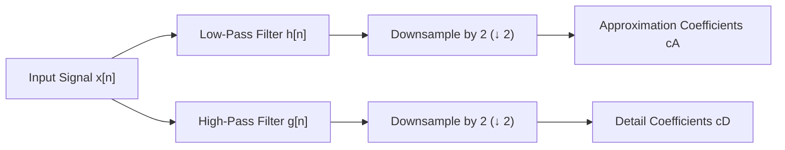
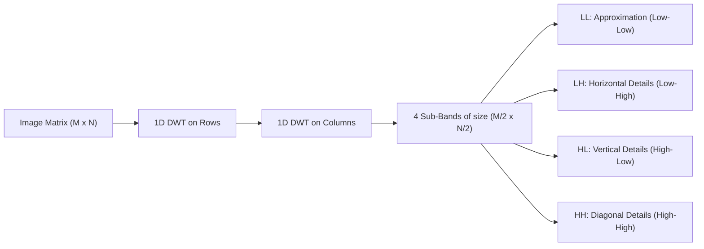
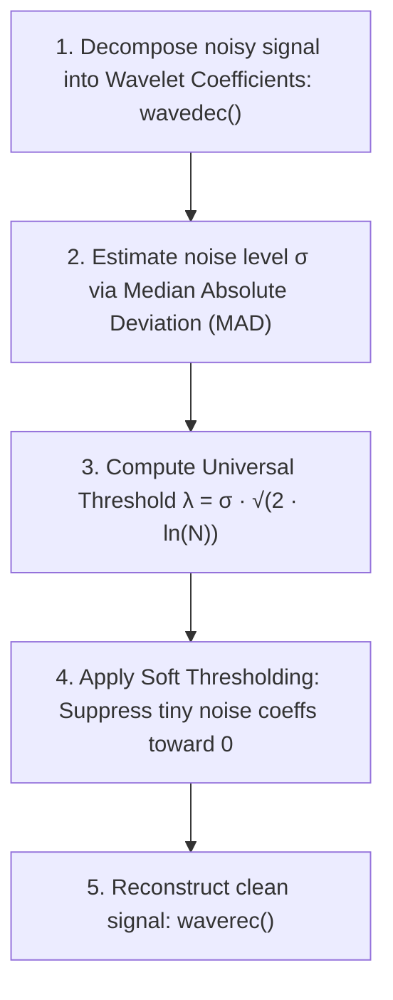

# Discrete Wavelet Transform (DWT) 101: An Intuitive (ELI5) and Technical Guide

> **Target Audience:** From beginners seeking an intuitive conceptual grasp to software, robotics, optical tracking, and signal processing engineers implementing multi-resolution analysis, transient shock detection, and edge-preserving denoising.

---

## Executive Summary & ELI5 (Explain Like I'm 5)

The **Discrete Wavelet Transform (DWT)** is a mathematical microscope for signals and images. While the Fourier Transform (FFT) tells you **what frequencies exist** across an entire signal, it cannot tell you **when** they happened. 

The Wavelet Transform solves this fundamental limitation. It cuts a signal into different frequency components and studies each component with a resolution matched to its scale:
- **For fast, sudden spikes (shocks, clicks, edges):** It zooms in with **high time precision**.
- **For slow, rolling waves (drifts, rumbles, background lighting):** It zooms out to capture **broad frequency trends**.

---

### The Intuitive Analogy: The Zoom Lens & The Sheet Music

```
[ Time Domain (Waveform) ]       [ Fourier Transform (FFT) ]         [ Wavelet Transform (DWT) ]
 Shows amplitude over time.       Shows all frequencies present.      Shows sheet music:
 "Something happened."            "There are C, E, and G notes."      "C note was played at 0:12,
                                  (Doesn't say WHEN!)                 E note was played at 0:14."
```

#### 1. The Symphony Orchestra & The Sheet Music
Imagine attending a 2-hour orchestral concert:
- **The FFT approach:** It analyzes the entire audio recording and outputs a list: *"This concert contained 35% C-notes, 25% G-notes, and 10% F-sharp notes."*
  - This is completely useless if you want to play the song. You don't know if the tuba played in the first minute or the final minute!
- **The DWT approach:** It generates the **actual musical sheet music**. It shows both the pitch (frequency) of every note and the exact bar and beat (time) where that note occurred.

---

### The Russian Nesting Dolls Analogy (Multi-Resolution Pyramid)

Imagine inspecting a wooden Russian nesting doll (*Matryoshka*):

```
┌────────────────────────────────────────────────────────┐
│ Outer Big Doll: Coarse Shape (Approximation: cA)      │
│   ┌──────────────────────────────────────────────────┐ │
│   │ Middle Doll: Medium Ripples (Detail: cD₂)        │ │
│   │   ┌────────────────────────────────────────────┐ │ │
│   │   │ Inner Tiny Doll: Fine Spikes (Detail: cD₁) │ │ │
│   │   └────────────────────────────────────────────┘ │ │
│   └──────────────────────────────────────────────────┘ │
└────────────────────────────────────────────────────────┘
```

When the DWT analyzes a signal, it splits it into two halves:
1. **The Approximation ($cA$):** The smooth, low-frequency trend (the "big doll").
2. **The Detail ($cD$):** The fast, high-frequency ripples and spikes (the "fine textures").

It then takes the Approximation and repeats the process, producing a hierarchy of coarse-to-fine representations.

---

### Why Wavelets Instead of Fourier Sine Waves?

```
Fourier Sine Wave:
──────────────────/\──────/\──────/\──────/\──────/\──────/\───────────────────► Time
Infinite in duration! Never begins and never ends (-∞ to +∞).
Cannot isolate a sudden 2-millisecond motor shock without distorting the whole spectrum.

Wavelet (e.g., Daubechies / Haar):
                      __
─────────────────────/  \__/\──────────────────────────────────────────────────► Time
Finite, compact duration! Lives in a tiny localized window and quickly decays to zero.
Perfect for detecting sudden transient impacts, edges, and shocks.
```

- A **Fourier sine wave** is eternal: it oscillates forever from $-\infty$ to $+\infty$. If a camera mast gets struck by a rock at $t = 4.2\text{ s}$, a sine wave must vibrate across the entire recording to represent it.
- A **Wavelet** (literally a "small wave", or *ondelette* in French) is localized: it exists only for a brief moment and decays to zero outside its window.

---

## 1. What is the DWT? (The 101 Technical Overview)

Developed in the 1980s by **Jean Morlet**, **Alex Grossman**, **Yves Meyer**, **Stéphane Mallat**, and **Ingrid Daubechies**, the Wavelet Transform revolutionized signal processing by providing **Multi-Resolution Analysis (MRA)**.

### The Heisenberg-Gabor Uncertainty Principle

In signal processing, you cannot simultaneously know the exact frequency and exact time location of a signal:

$$\Delta t \cdot \Delta f \ge \frac{1}{4\pi}$$

- **Standard FFT:** Infinite time uncertainty ($\Delta t = \infty$), perfect frequency resolution ($\Delta f \to 0$).
- **Short-Time Fourier Transform (STFT):** Uses a fixed window size. If you choose a narrow window for good time resolution, your frequency resolution is ruined. If you choose a wide window for good frequency resolution, your time resolution is ruined ("One size fits none").
- **Discrete Wavelet Transform (DWT):** **Adaptive tiling** of the time-frequency plane.

```
       STFT (Fixed Grid)                              DWT (Wavelet Multi-Resolution)
Frequency                                      Frequency
    ▲                                              ▲
    │ ┌───┬───┬───┬───┐                            │ ┌───────┬───────┐  <- High Freq: Fine Time (Narrow)
    │ ├───┼───┼───┼───┤                            │ ├───────┴───────┤
    │ ├───┼───┼───┼───┤                            │ ├───────────────┤  <- Mid Freq: Balanced
    │ └───┴───┴───┴───┘                            │ └───────────────┘  <- Low Freq: Wide Time (Coarse)
────┼───────────────────► Time                 ────┼─────────────────► Time
      Fixed resolution everywhere                     Narrow time at high frequencies;
                                                      Broad time at low frequencies!
```

---

### Comparison: FFT vs. STFT vs. DWT

| Property | Fourier Transform (FFT) | Short-Time Fourier (STFT) | Discrete Wavelet (DWT) |
| :--- | :--- | :--- | :--- |
| **Basis Functions** | Infinite sines & cosines | Windowed sines & cosines | **Scaled & shifted wavelets** |
| **Time Localization** | None (Global spectrum) | Uniform across all frequencies | **Multi-scale (Adaptive)** |
| **Transient Spikes** | Smeared across all bins | Blurry | **Pinpointed precisely** |
| **Edge Preservation** | Poor (Gibbs ringing) | Moderate | **Superior (No edge blur)** |
| **Complexity** | $\mathcal{O}(N \log N)$ | $\mathcal{O}(M \cdot N \log N)$ | **$\mathcal{O}(N)$ (Faster than FFT!)** |
| **Best Application** | Stationary audio/vibration | Speech spectrograms | **Transient shocks, denoising, JPEG 2000** |

---

## 2. Mathematical Foundations: Mallat's Pyramidal Filter Bank

In 1989, **Stéphane Mallat** proved that computing the DWT does not require evaluating complex continuous integrals. Instead, it can be computed using a cascade of discrete digital **low-pass** and **high-pass filters** followed by **downsampling by 2** ($\downarrow 2$).

### 1D Single-Level Forward DWT

Given an input discrete sequence $x[n]$ of length $N$:



The mathematical convolution formulas are:

$$cA[k] = \sum_{n} x[n] \cdot h[2k - n]$$

$$cD[k] = \sum_{n} x[n] \cdot g[2k - n]$$

Where:
- $h[n]$: **Scaling Filter** (Low-pass transfer function). Captures the low-frequency background.
- $g[n]$: **Wavelet Filter** (High-pass transfer function). Captures high-frequency transients.
- $2k$: Downsampling by 2 keeps only every second output sample (satisfying the Nyquist rate since the bandwidth was halved).

---

### Quadrature Mirror Filter (QMF) Relationship

In orthogonal wavelets, the high-pass filter $g[n]$ is directly constructed from the reversed, alternating-sign low-pass filter $h[n]$:

$$g[n] = (-1)^n \cdot h[L - 1 - n]$$

Where $L$ is the filter length. This guarantees **Perfect Reconstruction** without phase distortion.

---

### Inverse DWT (IDWT: Reconstruction)

To reconstruct the original signal, the process is inverted:
1. **Upsample by 2 ($\uparrow 2$):** Insert a zero between every sample of $cA$ and $cD$.
2. Filter $cA$ through synthesis low-pass filter $\tilde{h}[n]$ and $cD$ through synthesis high-pass filter $\tilde{g}[n]$.
3. Sum the filtered branches:

$$x[n] = \sum_{k} cA[k] \cdot \tilde{h}[n - 2k] + \sum_{k} cD[k] \cdot \tilde{g}[n - 2k]$$

---

### Multi-Level Pyramidal Decomposition (`wavedec`)

To analyze deeper frequency bands, the approximation branch $cA$ is recursively decomposed into subsequent levels:

```
Signal x[n] ──► [ Level 1 DWT ] ──┬──► cD₁ (Highest frequency details: Nyquist/2 to Nyquist)
                                  │
                                  └──► cA₁ ──► [ Level 2 DWT ] ──┬──► cD₂ (Mid-high details)
                                                                 │
                                                                 └──► cA₂ ──► [ Level 3 DWT ] ──┬──► cD₃ (Mid-low details)
                                                                                                │
                                                                                                └──► cA₃ (Coarse approximation)
```

At Level $L$, the signal is completely represented by:
$$\{cA_L, \, cD_L, \, cD_{L-1}, \, \dots, \, cD_2, \, cD_1\}$$

Total stored coefficient count equals the original signal length $N$ (non-redundant, critically sampled).

---

## 3. Wavelet Families: Haar vs. Daubechies

### A. Haar Wavelet (`WaveletType::Haar`)
Invented by Alfréd Haar in 1909, this is the simplest and oldest wavelet:
- **Filter Length:** 2 taps ($L = 2$).
- **Low-pass coefficients ($h$):** $\left[ \frac{1}{\sqrt{2}}, \, \frac{1}{\sqrt{2}} \right] \approx [0.7071, 0.7071]$
- **High-pass coefficients ($g$):** $\left[ \frac{1}{\sqrt{2}}, \, -\frac{1}{\sqrt{2}} \right] \approx [0.7071, -0.7071]$

```
Haar Scaling Function φ(t)                    Haar Wavelet Function ψ(t)
    ▲                                             ▲
  1 ┌─────┐                                     1 ┌─────┐
    │     │                                       │     │
────┴─────┴─────► Time                        ────┴─────┼─────┴─────► Time
    0     1                                       0   -1└─────┘
                                                      1/2     1
```

- **Intuition:** $cA[k]$ is the pairwise average $\frac{x_0 + x_1}{\sqrt{2}}$, while $cD[k]$ is the pairwise difference $\frac{x_0 - x_1}{\sqrt{2}}$.
- **Strength:** Instantaneous detection of step edges and shock discontinuities. Lowest possible CPU footprint.

---

### B. Daubechies-4 Wavelet (`WaveletType::Db4`)
Invented by Belgian mathematician **Ingrid Daubechies** in 1988:
- **Filter Length:** 4 taps ($L = 4$).
- Has **2 vanishing moments**: it completely eliminates linear trends (constant and linear polynomial components produce zero detail coefficients).
- **Low-pass filter coefficients ($h$):**
  $$h_0 = \frac{1 + \sqrt{3}}{4\sqrt{2}} \approx 0.48296, \quad h_1 = \frac{3 + \sqrt{3}}{4\sqrt{2}} \approx 0.83652$$
  $$h_2 = \frac{3 - \sqrt{3}}{4\sqrt{2}} \approx 0.22414, \quad h_3 = \frac{1 - \sqrt{3}}{4\sqrt{2}} \approx -0.12941$$
- **High-pass filter coefficients ($g$):**
  $$g = [h_3, \, -h_2, \, h_1, \, -h_0]$$

```
Daubechies-4 Scaling Function φ(t)            Daubechies-4 Wavelet Function ψ(t)
         /\                                            /\
        /  \                                          /  \      /\
───────/────\──────► Time                     ───────/────\────/──\─────► Time
             \__                                           \__/
```

- **Strength:** Smooth, continuous curves. Excellent for real-world vibration signals, sensor denoising, and non-stationary telemetry.

---

## 4. 2D Discrete Wavelet Transform (Image Processing & Tracking)

When applied to 2D images, the DWT is evaluated separably along rows and columns, decomposing an image into **four distinct sub-bands**:



### The 2D Sub-Band Grid

```
┌──────────────────────────────┬──────────────────────────────┐
│                              │                              │
│              LL              │              HL              │
│       (Approximation)        │      (Vertical Details)      │
│     Smooth base image        │      Detects vertical edges  │
│                              │                              │
├──────────────────────────────┼──────────────────────────────┤
│                              │                              │
│              LH              │              HH              │
│     (Horizontal Details)     │      (Diagonal Details)      │
│    Detects horizontal edges  │      Detects corner points   │
│                              │                              │
└──────────────────────────────┴──────────────────────────────┘
```

- **$LL$:** Scaled-down version of the original image (used in progressive image rendering).
- **$HL$:** Highlights vertical lines and boundaries.
- **$LH$:** Highlights horizontal lines and boundaries.
- **$HH$:** Highlights diagonal textures, corners, and point features (vital for optical feature tracking).

---

## 5. Practical Engineering Nuances: Wavelet Denoising & Shock Detection

### A. Edge-Preserving Denoising (VisuShrink)

#### The Problem with Standard Filters
- A standard **moving average** or **Gaussian blur** suppresses high-frequency noise, but also rounds off sharp edges and smears fast motion transitions.

#### The Wavelet Solution: Wavelet Shrinkage
Devised by **David Donoho** and **Iain Johnstone** (1994), wavelet shrinkage relies on the fact that real signal features concentrate in a few large coefficients, while Gaussian white noise scatters evenly into many tiny coefficients.



#### Mathematical Formulation
1. **Noise Variance Estimation ($\hat{\sigma}$):**
   $$\hat{\sigma} = \frac{\text{median}(|cD_1|)}{0.6745}$$
   Uses the median of the finest detail level ($cD_1$) because it is dominated by noise.
2. **Universal Threshold ($\lambda$):**
   $$\lambda = \hat{\sigma} \sqrt{2 \ln(N)}$$
3. **Soft Thresholding Function:**
   $$\eta_{\text{soft}}(w, \lambda) = \text{sgn}(w) \cdot \max(0, \, |w| - \lambda)$$
   Coefficients smaller than $\lambda$ are set to zero (eliminating noise). Larger coefficients are gently shrunk toward zero, preserving crisp physical edges without ringing!

---

### B. Transient Shock & Vibration Impulse Detection

In mechanical systems (such as high-mast PTZ cameras or robotic arms), a sudden mechanical shock (wind blast, vehicle collision with mast, or gear snag) creates a brief, sharp impulse.

```
Incoming Telemetry (Motor Speed / Tracking Error)
Velocity
    ▲
    │                                ┌─── Transient Shock! (10 ms spike)
    │           _.-'''-._            │
    │  _..-''''           ```-.._   / \
────┼─/───────────────────────────\─/───\────────────────────────► Time
    │
    │ High-Pass Wavelet Detail Sub-band (cD₁)
    │                              ▲
    │                             / \  <- High-frequency energy skyrockets!
────┼────────────────────────────/───\───────────────────────────► Time
```

1. Standard low-pass filters or FFTs miss fast 5-millisecond shocks because their energy is diluted across time.
2. By computing the **Detail Energy** of the first decomposition level:
   $$E_{\text{detail}} = \sum_{k} |cD_1[k]|^2$$
3. Comparing $E_{\text{detail}}$ against the running background baseline:
   $$\text{Ratio} = \frac{E_{\text{detail}}}{E_{\text{baseline}}}$$
4. If $\text{Ratio} > \text{Threshold}$ (e.g., $4.0\times$ baseline), the system triggers a **Transient Shock Event** in real time, alerting the controller to enter protective damping mode.

---

## 6. Where DWT is Used in the Real World

```
┌────────────────────────────────────────────────────────────────────────────┐
│                         REAL-WORLD DWT APPLICATIONS                        │
├──────────────────────┬──────────────────────┬──────────────────────────────┤
│ Image Compression    │ Biomedical & Health  │ Structural & Mechanical      │
│ - JPEG 2000 standard │ - ECG heart arrhythmia - Bridge impact detection    │
│ - FBI Fingerprint    │ - EEG seizure alerts │ - Gearbox tooth fault diag   │
│   Database (WSQ)     │ - DNA sequence motifs│ - Drone motor imbalance      │
├──────────────────────┼──────────────────────┼──────────────────────────────┤
│ Geophysics & Radar   │ Video & Surveillance │ Financial Engineering        │
│ - Earthquake P-wave  │ - Transient shock det│ - High-frequency regime shift│
│ - Atmospheric sonar  │ - Edge-preserving den│ - Multiscale volatility      │
│ - Tsunami detection  │ - Sub-band tracking  │ - Noise-free price trends    │
└──────────────────────┴──────────────────────┴──────────────────────────────┘
```

---

## 7. How DWT is Used in This Project (`PelcoD-Controller`)

In the `PelcoD-Controller` codebase, the DWT provides edge-preserving signal processing and real-time mechanical impulse diagnostics:

### 1. Core Wavelet Engine ([`Dwt.h`](../libs/PelcoDCore/Dwt.h) & [`Dwt.cpp`](../libs/PelcoDCore/Dwt.cpp))
Implemented in pure C++17 with zero third-party dependencies:
- **`Math::dwt1D` & `Math::idwt1D`:**
  - Forward and inverse single-level transforms with Haar and Daubechies-4 (Db4) filter banks.
  - Automatic boundary reflection padding.
- **`Math::wavedec` & `Math::waverec`:**
  - Multi-level pyramidal decomposition returning [`WaveletDecomposition1D`](../libs/PelcoDCore/Dwt.h#L18).
- **`Math::waveletDenoise`:**
  - Automatic VisuShrink soft-thresholding denoising with Median Absolute Deviation (MAD) noise estimation.
  - Cleans tracking telemetry without introducing phase lag or blurring sharp motion transients.
- **`Math::dwt2D` & `Math::idwt2D`:**
  - 2D separable image decomposition into $LL, LH, HL, HH$ sub-bands.

---

### 2. Transient Shock & Mast Impact Detection ([`TransientShockDetector.h`](../libs/PelcoDCore/TransientShockDetector.h))
Monitors high-mast security camera telemetry in real time:
- Ingests motor pan/tilt velocities, optical flow tracking errors, and IMU acceleration samples into a sliding circular window (`ShockDetectorConfig::windowSize = 64`).
- Evaluates multi-level Db4 wavelet decomposition (`levels = 3`).
- Tracks running background noise floor (`m_baselineEnergy`).
- If an impact, bird collision, or sudden wind blast causes high-frequency detail energy to exceed threshold (`energyThresholdFactor = 4.0`), outputs [`ShockEvent`](../libs/PelcoDCore/TransientShockDetector.h#L23):
  ```cpp
  ShockEvent event = shockDetector.addSample(ptzVelocity);
  if (event.isShockDetected) {
      // Disengage high-gain tracking; activate mechanical brake damping
      pidController.reset();
  }
  ```

---

## 8. References & Verified Further Reading

The following landmark papers, authoritative textbooks, and standard literature provide verified, authoritative details on wavelet theory and applications:

1. **Mallat, Stéphane G. (1989).**  
   "A Theory for Multiresolution Signal Decomposition: The Wavelet Representation."  
   *IEEE Transactions on Pattern Analysis and Machine Intelligence*, Vol. 11, No. 7, pp. 674–693.  
   DOI: [10.1109/34.192463](https://doi.org/10.1109/34.192463)  
   *(The foundational paper formulating modern multiresolution analysis and pyramidal filter banks).*

2. **Daubechies, Ingrid. (1992).**  
   *Ten Lectures on Wavelets*.  
   Society for Industrial and Applied Mathematics (SIAM), CBMS-NSF Regional Conference Series in Applied Mathematics.  
   ISBN: 978-0-89871-274-2.  
   *(The definitive mathematical monograph constructing compactly supported orthogonal wavelets).*

3. **Donoho, David L., and Johnstone, Iain M. (1994).**  
   "Ideal Spatial Adaptation by Wavelet Shrinkage."  
   *Biometrika*, Vol. 81, No. 3, pp. 425–455.  
   DOI: [10.1093/biomet/81.3.425](https://doi.org/10.1093/biomet/81.3.425)  
   *(The seminal paper inventing wavelet soft thresholding, VisuShrink, and minimax risk bounds).*

4. **Strang, Gilbert, and Nguyen, Truong. (1996).**  
   *Wavelets and Filter Banks*.  
   Wellesley-Cambridge Press.  
   ISBN: 978-0-9614088-7-9.  
   *(Classic textbook providing an intuitive bridge between linear algebra, digital filters, and wavelets).*

5. **Taubman, David S., and Marcellin, Michael W. (2002).**  
   *JPEG2000 Image Compression Fundamentals, Standards and Practice*.  
   Springer.  
   ISBN: 978-1-4613-5247-1.  
   *(Comprehensive engineering reference detailing 2D DWT sub-band decomposition in modern imaging).*

6. **Related Documentation in This Repository:**  
   - [`docs/Integral_Images_101.md`](Integral_Images_101.md): Complementary guide explaining Integral Images (Summed-Area Tables).
   - [`docs/Notch_Filter_101.md`](Notch_Filter_101.md): Complementary guide explaining the Digital Notch Filter.
   - [`docs/DCT_101.md`](DCT_101.md): Complementary guide explaining the Discrete Cosine Transform (DCT).
   - [`docs/FFT_101.md`](FFT_101.md): Complementary guide explaining the Fast Fourier Transform (FFT).
   - [`docs/PID_Controller_101.md`](PID_Controller_101.md): Complementary guide explaining the PID controller.
   - [`docs/Kalman_Filter_101.md`](Kalman_Filter_101.md): Complementary guide explaining the Kalman filter.
   - [`libs/PelcoDCore/Dwt.h`](../libs/PelcoDCore/Dwt.h): Core C++17 DWT and wavelet shrinkage implementation.
   - [`libs/PelcoDCore/TransientShockDetector.h`](../libs/PelcoDCore/TransientShockDetector.h): Wavelet-based mechanical shock and impulse detector.
