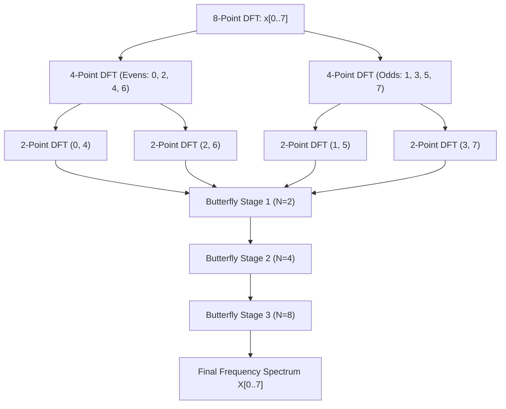
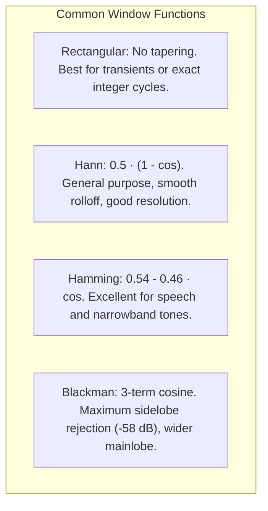
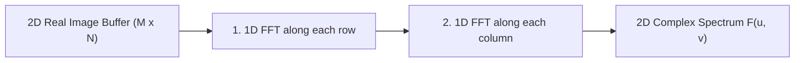

# Fast Fourier Transform (FFT) 101: An Intuitive (ELI5) and Technical Guide

> **Target Audience:** From beginners seeking an intuitive conceptual grasp to software, audio, computer vision, and control engineers implementing spectral analysis, vibration diagnostics, and frequency-domain signal processing.

---

## Executive Summary & ELI5 (Explain Like I'm 5)

The **Fast Fourier Transform (FFT)** is widely regarded as one of the top ten most important mathematical algorithms of the 20th century. It takes a complex signal measured over time (such as audio, motor vibration, or video frames) and decomposes it into its individual **constituent sine and cosine frequencies**.

---

### The Intuitive Analogy: The Fruit Smoothie & The Magical Reverse Blender

Imagine drinking a fruit smoothie made from bananas, strawberries, and blueberries:

```
[ Time Domain: The Blended Smoothie ] ──► [ FFT: The Magical Reverse Blender ] ──► [ Frequency Domain: Individual Bowls ]
```

1. **The Time Domain (The Smoothie):**
   - You look into the glass. Everything is blended into a single purple liquid.
   - If someone asks: *"Exactly how much banana and how much blueberry is in here?"*, it is almost impossible to tell just by looking at the blended liquid.
   - In signal processing, this is a **time-domain signal**: a sensor records a single wavy line of voltage or position over time. It is a mix of motor hum, structural vibration, wind buffeting, and sensor noise all blended together.

2. **The Frequency Domain (The Individual Bowls of Fruit):**
   - The **Fourier Transform** is a magical reverse-blender.
   - It takes the blended smoothie and un-blends it into separate bowls:
     - 50% Banana (Low frequency bass rumble)
     - 35% Strawberry (Mid-range voice/motor speed)
     - 15% Blueberry (High-frequency gear whine)
   - It tells you:
     - **Which frequencies are present** (the pitch/color).
     - **How loud each frequency is** (the magnitude/amplitude).
     - **When each wave started** (the phase).

---

### The Glass Prism Analogy

When white sunlight hits a glass triangular prism, the glass bends different light wavelengths by different amounts:

```
                                  ┌─── Red (Low Frequency)
                                  ├─── Orange
White Light (Composite Wave) ──► /│─── Yellow
                                / │─── Green
                               /  │─── Blue
                              /___│─── Violet (High Frequency)
```

The prism does not create the colors; the colors were already present inside the white light. The prism is a physical Fourier transform that separates the composite waveform into its individual frequency components.

---

### The Musical Chord Analogy

When a pianist plays a **C Major Chord** ($C_4 - E_4 - G_4$):
- **Microphone (Time Domain):** Records a single complex, pulsating pressure wave. Looking at the waveform graph on an oscilloscope, you cannot easily decipher the musical notes.
- **Sheet Music (Frequency Domain):** Shows three distinct notes sitting at $261.6\text{ Hz}$ ($C_4$), $329.6\text{ Hz}$ ($E_4$), and $392.0\text{ Hz}$ ($G_4$).
- The Fourier Transform converts the microphone waveform directly into sheet music.

---

## 1. What is the Fourier Transform & FFT? (The 101 Technical Overview)

### Time Domain vs. Frequency Domain

```
Time Domain: x(t)                             Frequency Domain: X(f)
Amplitude                                     Magnitude
    ▲                                             ▲
    │    _.-'''-._        _.-'''-._               │       Peak at f1 (Motor RPM)
    │  .'         `.    .'         `.             │          │       Peak at f2 (Gear Mesh)
    │ /             \  /             \            │          │          │
────┼/───────────────\/───────────────\──► Time   ┼──────────┼──────────┼────────► Frequency
    │                                             │         f1         f2
```

Every physical signal that varies over time can be represented identically in two dual domains:
- **Time Domain ($x(t)$):** Shows **when** events occur. Useful for detecting sudden shocks, step changes, and latency.
- **Frequency Domain ($X(f)$):** Shows **which rates of repetition** are present. Useful for diagnosing motor hunting, identifying resonance, filtering noise, and compressing images.

---

### The Continuous Fourier Transform

First proposed by French mathematician **Jean-Baptiste Joseph Fourier** in 1807 for heat propagation, the continuous Fourier transform converts a continuous function of time $x(t)$ into a continuous function of frequency $X(f)$:

$$X(f) = \int_{-\infty}^{\infty} x(t) \, e^{-j 2\pi f t} \, dt$$

Where $j = \sqrt{-1}$ is the imaginary unit, and Euler's formula defines complex sinusoids:
$$e^{-j \theta} = \cos(\theta) - j \sin(\theta)$$

---

### The Discrete Fourier Transform (DFT)

Because digital computers and microcontrollers work with discrete samples $x[n]$ taken at a fixed sample rate $f_s$ ($\Delta t = 1 / f_s$), we use the **Discrete Fourier Transform (DFT)** for $N$ samples ($n = 0, 1, \dots, N-1$):

$$X[k] = \sum_{n=0}^{N-1} x[n] \cdot e^{-j \frac{2\pi}{N} k n}, \quad k = 0, 1, \dots, N-1$$

Where:
- $x[n]$: $n$-th time-domain sample.
- $X[k]$: $k$-th frequency-domain complex bin (representing magnitude and phase).
- $k$: Frequency index corresponding to physical frequency $f_k = k \cdot \frac{f_s}{N}$.
- $W_N = e^{-j \frac{2\pi}{N}}$: The complex constant known as the **Twiddle Factor**.

---

### The Computational Bottleneck: Why We Need the FFT

To evaluate the naive DFT directly:
- There are $N$ frequency bins ($k = 0 \dots N-1$).
- Each bin requires summing over $N$ samples ($n = 0 \dots N-1$).
- Each step requires a complex multiplication and addition.
- **Total computational complexity:** $\mathcal{O}(N^2)$.

```
   N Samples       Direct DFT Operations (N²)       FFT Operations (N log₂ N)       Speedup Factor
   ─────────       ──────────────────────────       ─────────────────────────       ──────────────
          64                            4,096                             384                  11×
         256                           65,536                           2,048                  32×
       1,024                        1,048,576                          10,240                 102×
       4,096                       16,777,216                          49,152                 341×
      65,536                    4,294,967,296                       1,048,576               4,096×
   1,048,576                1,099,511,627,776                      20,971,520              52,428×
```

At $N = 1024$, the naive DFT takes a million operations, while the FFT takes only ten thousand. At $N = 1\text{ Megasample}$, the FFT is **over 50,000 times faster**. Without the FFT, real-time audio processing, Wi-Fi, 5G cellular communication, MRI scanners, and digital video streaming would be computationally impossible.

---

## 2. The Cooley-Tukey FFT Algorithm

Published by **James Cooley** and **John Tukey** in 1965 (rediscovering an idea originally sketched by Carl Friedrich Gauss in 1805), the **Radix-2 Decimation-in-Time (DIT)** algorithm uses a **divide-and-conquer** strategy.

### The Mathematical Insight: Even vs. Odd Decomposition

A DFT of length $N$ (where $N$ is a power of 2) is split into two smaller DFTs of length $N/2$:
1. One DFT for the **even-indexed** samples ($x[0], x[2], x[4], \dots$)
2. One DFT for the **odd-indexed** samples ($x[1], x[3], x[5], \dots$)

$$X[k] = \sum_{m=0}^{N/2 - 1} x[2m] \, e^{-j \frac{2\pi}{N} k (2m)} + \sum_{m=0}^{N/2 - 1} x[2m+1] \, e^{-j \frac{2\pi}{N} k (2m+1)}$$

$$X[k] = \sum_{m=0}^{N/2 - 1} x[2m] \, e^{-j \frac{2\pi}{N/2} k m} + W_N^k \sum_{m=0}^{N/2 - 1} x[2m+1] \, e^{-j \frac{2\pi}{N/2} k m}$$

$$X[k] = E[k] + W_N^k \cdot O[k]$$

Because complex exponentials are periodic ($W_N^{k + N/2} = -W_N^k$), the second half of the spectrum is computed for free:

$$X\left[k + \frac{N}{2}\right] = E[k] - W_N^k \cdot O[k]$$

This fundamental operation is called a **Butterfly**.

---

### The Radix-2 Butterfly Operation

```
Input A: E[k] ───────────────┬────────────────────────► Output Top:    X[k]       = E[k] + W_N^k · O[k]
                             │       ▲
                              \     /
                               \   /
                                \ /
                                 X
                                / \
                               /   \
                              /     \
                             ▼       ▼
Input B: O[k] ───►[ × W_N^k ]────────┴──►[ × (-1) ]──► Output Bottom: X[k + N/2] = E[k] - W_N^k · O[k]
```

---

### Cooley-Tukey Divide-and-Conquer Architecture



---

### In-Place Execution and Bit-Reversal Permutation

To compute an in-place Radix-2 FFT without allocating recursive temporary buffers, the input array is pre-ordered using **Bit-Reversal Permutation**:

```
Normal Index       Binary       Reversed Binary       Permuted Index
────────────       ──────       ───────────────       ──────────────
     0              000               000                   0
     1              001               100                   4
     2              010               010                   2
     3              011               110                   6
     4              100               001                   1
     5              101               101                   5
     6              110               011                   3
     7              111               111                   7
```

Once reordered by bit reversal, the algorithm computes $\log_2(N)$ stages of butterflies completely in-place.

---

### The Inverse FFT (IFFT)

To reconstruct the original time-domain signal from its frequency spectrum, the **Inverse Fast Fourier Transform (IFFT)** is applied:

$$x[n] = \frac{1}{N} \sum_{k=0}^{N-1} X[k] \cdot e^{+j \frac{2\pi}{N} k n}$$

The math is nearly identical to the forward FFT:
1. Invert the sign of the imaginary exponent (conjugate the twiddle factors).
2. Divide the final outputs by $N$ (normalization).

---

## 3. Fundamental Rules: Sampling, Nyquist, and Resolution

### The Nyquist-Shannon Sampling Theorem

A digital system sampling at frequency $f_s$ can only uniquely represent frequencies up to **half the sample rate**, known as the **Nyquist Frequency**:

$$f_{\text{Nyquist}} = \frac{f_s}{2}$$

- Any frequency component above $f_s / 2$ will fold back into the lower spectrum as an erroneous phantom frequency (**Aliasing**).
- To prevent aliasing, hardware inputs must pass through an analog low-pass **anti-aliasing filter** before digital sampling.

---

### Frequency Bin Resolution ($\Delta f$)

An $N$-point FFT on data sampled at $f_s$ produces $N$ bins spanning from $0\text{ Hz}$ to $f_s$.
The spacing between adjacent frequency bins is:

$$\Delta f = \frac{f_s}{N} = \frac{1}{T_{\text{total}}}$$

Where $T_{\text{total}} = N / f_s$ is the total duration of the recorded sample buffer in seconds.

| Sampling Rate ($f_s$) | Window Size ($N$) | Total Duration ($T_{\text{total}}$) | Frequency Resolution ($\Delta f$) |
| :--- | :--- | :--- | :--- |
| $100\text{ Hz}$ (Camera PTZ telemetry) | $128$ samples | $1.28\text{ s}$ | $0.781\text{ Hz}$ |
| $100\text{ Hz}$ (Camera PTZ telemetry) | $512$ samples | $5.12\text{ s}$ | $0.195\text{ Hz}$ |
| $48,000\text{ Hz}$ (Studio Audio) | $1,024$ samples | $21.3\text{ ms}$ | $46.88\text{ Hz}$ |
| $48,000\text{ Hz}$ (Studio Audio) | $8,192$ samples | $170.7\text{ ms}$ | $5.86\text{ Hz}$ |

> **Key Rule of Thumb:** To see finer frequency details (smaller $\Delta f$), you **must record for a longer period of time ($T_{\text{total}}$)**. Zero-padding does not increase physical resolution.

---

## 4. Practical Engineering Nuances: Why Textbook FFT Fails

A pure textbook FFT applied to raw sensor samples will produce corrupted results unless fortified with proper windowing, scaling, and peak analysis:

### A. Spectral Leakage & Discontinuity

#### The Problem
The mathematical Fourier transform assumes that the $N$-sample buffer **repeats indefinitely in both directions** ($-\infty$ to $+\infty$).
If the recording window does not capture an exact integer number of wave cycles, the end of the buffer will not match the beginning. When repeated, this creates an artificial, sharp vertical step discontinuity:

```
Recorded Window [ 0 to N-1 ]                 Virtual Repetition (What the FFT sees)
       _.-'''-._                                  _.-'''-._      Step Discontinuity!
     .'         `.                              .'         `.     │
    /             \                            /             \    ▼
───/───────────────\──────────────────────────/───────────────\───█─────────
                    \____.-'                                   \_/│
                                                                  │◄── Infinite high frequencies!
```

This artificial step acts like an impulse, causing energy to splatter across the entire spectrum. A pure single sine wave will look like a smeared hill across multiple bins (**Spectral Leakage**).

---

### B. Windowing Functions

To eliminate the boundary step discontinuity, the time-domain signal is multiplied by a smooth **Window Function** $w[n]$ that gently tapers both edges to zero before computing the FFT:

$$x_{\text{windowed}}[n] = x[n] \cdot w[n]$$

```
Raw Signal x[n]            Window w[n] (e.g. Hann)          Windowed Signal
     /\    /\                    .---------.                       /\
    /  \  /  \                  /           \                     /  \  /\
───/────\/────\───   ×   ──────/─────────────\──────  =   ───────/────\/──\─────
                               Smoothly tapers                     Edges are zero!
                               edges to 0                          Zero discontinuity!
```

#### Comparison of Standard Windows



| Window Type | Mainlobe Width (Resolution) | Sidelobe Suppression (Leakage Protection) | Best Used For |
| :--- | :--- | :--- | :--- |
| **Rectangular** | $2 \cdot \Delta f$ (Sharpest) | $-13\text{ dB}$ (Poor) | Transients shorter than buffer; exact harmonics |
| **Hann (Hanning)** | $4 \cdot \Delta f$ (Good) | $-32\text{ dB}$ (Very Good) | General vibration, audio, continuous signals |
| **Hamming** | $4 \cdot \Delta f$ (Good) | $-43\text{ dB}$ (Excellent) | Speech processing, communication channels |
| **Blackman** | $6 \cdot \Delta f$ (Wider) | $-58\text{ dB}$ (Superb) | Wide dynamic range, detecting weak signals near strong ones |

---

### C. Single-Sided vs. Double-Sided Spectrum

For real-valued time-domain signals ($x[n] \in \mathbb{R}$), the negative frequency bins ($N/2 < k < N$) are complex conjugates of the positive bins (**Hermitian Symmetry**):

$$X[N - k] = X^*[k]$$

The negative frequency bins contain identical redundant energy. In practical applications, we compute the **Single-Sided Spectrum** ($k = 0 \dots N/2$):
1. Bin $k = 0$ is the **DC component** (average value): $\text{Magnitude} = |X[0]| / N$.
2. Bins $k = 1 \dots N/2 - 1$ are AC harmonics: $\text{Magnitude} = 2 \cdot |X[k]| / N$ (multiplied by 2 to account for positive and negative halves).
3. Bin $k = N/2$ is the **Nyquist component**: $\text{Magnitude} = |X[N/2]| / N$.

---

### D. Power Spectral Density (PSD)

The Power Spectral Density measures the distribution of power per unit frequency ($\text{units}^2 / \text{Hz}$):

$$P[k] = \frac{|X[k]|^2}{N \cdot f_s}$$

PSD allows comparing signals recorded at different sample rates or window lengths on an absolute, physically consistent power scale.

---

## 5. Multidimensional & Time-Varying Extensions

### A. 2D Fast Fourier Transform (Image Processing & Optical Flow)

The 2D DFT transforms a 2D image matrix $f(x, y)$ of size $M \times N$ into spatial frequency space $F(u, v)$.
Because the 2D Fourier kernel is **separable**:

$$e^{-j 2\pi \left(\frac{ux}{M} + \frac{vy}{N}\right)} = e^{-j 2\pi \frac{ux}{M}} \cdot e^{-j 2\pi \frac{vy}{N}}$$

The 2D FFT is computed simply by:
1. Executing a 1D FFT across every **row**.
2. Executing a 1D FFT down every **column** of the result.



#### Application: Phase Correlation Global Motion Estimation
To detect sub-pixel camera shake or panning velocity between two video frames $f_1(x, y)$ and $f_2(x, y)$, phase correlation evaluates the **Normalized Cross-Power Spectrum**:

$$R(u, v) = \frac{F_1(u, v) \cdot F_2^*(u, v)}{|F_1(u, v) \cdot F_2^*(u, v)|}$$

Taking the 2D Inverse FFT of $R(u, v)$ yields a sharp, single Dirac delta peak whose coordinate $(\Delta x, \Delta y)$ directly reveals the exact camera displacement!

---

### B. Short-Time Fourier Transform (STFT) & Spectrograms

Standard FFT tells you **what frequencies exist**, but does **not tell you when they occurred**.
If a motor shakes violently for 2 seconds and then stops, a standard FFT smears that vibration across the entire time recording.

The **Short-Time Fourier Transform (STFT)** applies a sliding window $w[n]$ that hops forward in time:

$$\text{STFT}\{x\}(m, k) = \sum_{n=0}^{N-1} x[n + m \cdot H] \cdot w[n] \cdot e^{-j \frac{2\pi}{N} k n}$$

Where $H$ is the **Hop Size** (e.g., advancing by $N/2$ samples for 50% overlap).

```
Time ──►
Window 1:  [ Hann ]
Window 2:       [ Hann ]
Window 3:            [ Hann ]
             │         │         │
             ▼         ▼         ▼
          FFT #1    FFT #2    FFT #3
             │         │         │
             └─────────┴─────────┴──► 2D Spectrogram Heatmap (Time vs. Frequency)
```

The squared magnitude is plotted as a **Waterfall Spectrogram**, showing how vibration harmonics shift as camera motors accelerate or decelerate.

---

### C. The Goertzel Algorithm (Single-Frequency Detection)

If a system only needs to detect a single specific frequency (for example, a $12.5\text{ Hz}$ gear resonance), computing an entire $N$-point FFT ($\mathcal{O}(N \log N)$) wastes CPU cycles.
The **Goertzel Algorithm** evaluates a single DFT bin using a second-order IIR digital filter with complexity $\mathcal{O}(N)$.

---

## 6. Where FFT is Used in the Real World

```
┌────────────────────────────────────────────────────────────────────────────┐
│                         REAL-WORLD FFT APPLICATIONS                        │
├──────────────────────┬──────────────────────┬──────────────────────────────┤
│ Telecommunications   │ Audio & Music        │ Medical & Scientific         │
│ - 4G / 5G (OFDM)     │ - MP3 / AAC encoding │ - MRI reconstruction         │
│ - Wi-Fi modulation   │ - Noise cancellation │ - CT scan tomography         │
│ - Radar & Sonar DSP  │ - Pitch correction   │ - EEG brainwave monitoring   │
├──────────────────────┼──────────────────────┼──────────────────────────────┤
│ Computer Vision      │ Mechanical & Defense │ Astronomy & Geophysics       │
│ - Video stabilization│ - Bearing fault diag │ - Gravitational wave search  │
│ - Phase correlation  │ - Motor hunting / PID│ - Earthquake seismology      │
│ - Optical autofocus  │ - Structural fatigue │ - Radio telescope arrays     │
└──────────────────────┴──────────────────────┴──────────────────────────────┘
```

---

## 7. How FFT is Used in This Project (`PelcoD-Controller`)

In this project, FFT and spectral analysis form the signal processing backbone for diagnostic monitoring, video stabilization, and physical plant identification:

### 1. Core 1D & 2D FFT Library ([`Fft.h`](../libs/PelcoDCore/Fft.h) & [`Fft.cpp`](../libs/PelcoDCore/Fft.cpp))
Implemented in pure C++17 with zero third-party dependencies:
- **`Math::fft(std::vector<Complex>& data, bool inverse)`:** In-place Radix-2 Cooley-Tukey FFT/IFFT with bit-reversal indexing.
- **`Math::rfft(const std::vector<double>& realSignal)`:** Optimized real-to-complex forward transform with zero-padding to next power of 2.
- **`Math::irfft(const std::vector<Complex>& spectrum)`:** Inverse transform extracting real-valued signals.
- **`Math::applyWindow()` & `Math::applyWindow2D()`:** In-place Hann, Hamming, and Blackman windowing.
- **`Math::computePsd()`:** Windowed Power Spectral Density calculation with sorted [`SpectralPeak`](../libs/PelcoDCore/Fft.h#L25) extraction.
- **`Math::fft2D()`:** Separable 2D FFT/IFFT for image processing matrices.

---

### 2. Video Frame Stabilization ([`PhaseCorrelation.h`](../libs/PelcoDCore/PhaseCorrelation.h))
Detects global camera shake caused by wind buffeting on high-mast surveillance towers:
1. Applies 2D Hann windowing via `Math::applyWindow2D()`.
2. Computes forward 2D FFTs via `Math::fft2D(fRef)` and `Math::fft2D(fCur)`.
3. Computes normalized cross-power spectrum and inverse 2D FFT.
4. Identifies the sub-pixel correlation peak to estimate frame displacement $(\Delta x, \Delta y)$ for electronic stabilization.

---

### 3. Motor Oscillation & Resonance Detection ([`OscillationDetector.h`](../libs/PelcoDCore/OscillationDetector.h))
When a PTZ camera's [`PidController`](../libs/PelcoDCore/PidController.h) is tuned too aggressively, the camera enters high-frequency limit-cycle oscillation ("hunting"):
- Ingests command error telemetry into a circular buffer.
- Evaluates `Math::computePsd()` across incoming frames.
- If a dominant peak emerges in the $2\text{--}15\text{ Hz}$ band exceeding threshold power, flags mechanical resonance and automatically calls `autoAttenuate()` on the PID gains to protect physical gears.

---

### 4. Sliding Window Spectrograms ([`Stft.h`](../libs/PelcoDCore/Stft.h))
Generates real-time waterfall spectrograms of pan and tilt error signals:
- Configurable window sizes (32, 64, 128, 256, 512).
- 50% hop overlap for continuous tracking of non-stationary vibration frequencies.

---

### 5. Physical Plant Transfer Function Identification ([`PlantIdentifier.h`](../libs/PelcoDCore/PlantIdentifier.h))
Uses Welch's averaged periodogram method:
- Injects chirp or PRBS excitation commands $u(t)$ into the PTZ motor.
- Measures resulting camera position $y(t)$.
- Evaluates cross-spectral density $S_{yu}(f)$ and auto-spectral density $S_{uu}(f)$ via `Math::rfft`.
- Computes empirical transfer function estimate:
  $$\hat{H}(f) = \frac{S_{yu}(f)}{S_{uu}(f)}$$
  Extracting natural resonant poles, damping ratios, and dead-time latency.

---

## 8. References & Verified Further Reading

The following seminal papers, authoritative textbooks, and standard literature provide verified, authoritative details on Fourier analysis and the FFT:

1. **Cooley, James W., and Tukey, John W. (1965).**  
   "An Algorithm for the Machine Calculation of Complex Fourier Series."  
   *Mathematics of Computation*, Vol. 19, No. 90, pp. 297–301.  
   DOI: [10.1090/S0025-5718-1965-0178586-1](https://doi.org/10.1090/S0025-5718-1965-0178586-1)  
   *(The landmark paper introducing the Radix-2 Cooley-Tukey algorithm).*

2. **Oppenheim, Alan V., and Schafer, Ronald W. (2009).**  
   *Discrete-Time Signal Processing* (3rd ed.). Prentice Hall / Pearson.  
   ISBN: 978-0-13-198842-2.  
   *(The definitive academic textbook on DFT mathematics, filter structures, and circular convolution).*

3. **Harris, Fredric J. (1978).**  
   "On the Use of Windows for Harmonic Analysis with the Discrete Fourier Transform."  
   *Proceedings of the IEEE*, Vol. 66, No. 1, pp. 51–83.  
   DOI: [10.1109/PROC.1978.10837](https://doi.org/10.1109/PROC.1978.10837)  
   *(The classic engineering reference evaluating spectral leakage, mainlobe resolution, and window tradeoffs).*

4. **Brigham, E. Oran. (1988).**  
   *The Fast Fourier Transform and Its Applications*. Prentice-Hall.  
   ISBN: 978-0-13-307505-2.  
   *(A comprehensive, accessible manual illustrating FFT butterfly signal-flow graphs).*

5. **Press, William H., Teukolsky, Saul A., Vetterling, William T., and Flannery, Brian P. (2007).**  
   *Numerical Recipes: The Art of Scientific Computing* (3rd ed.). Cambridge University Press.  
   ISBN: 978-0-521-88068-8.  
   *(Covers in-place bit-reversal permutations, multidimensional FFTs, and power spectrum estimation).*

6. **Related Documentation in This Repository:**  
   - [`docs/PID_Controller_101.md`](PID_Controller_101.md): Complementary 101/ELI5 guide explaining the PID controller.
   - [`docs/Kalman_Filter_101.md`](Kalman_Filter_101.md): Complementary 101/ELI5 guide explaining the Kalman filter.
   - [`docs/PID_Kalman_Tracking.md`](PID_Kalman_Tracking.md): Architectural analysis comparing the observer (Kalman) and actuator (PID).
   - [`libs/PelcoDCore/Fft.h`](../libs/PelcoDCore/Fft.h): Core C++17 FFT implementation.
   - [`libs/PelcoDCore/PhaseCorrelation.h`](../libs/PelcoDCore/PhaseCorrelation.h): 2D FFT global motion estimator.
