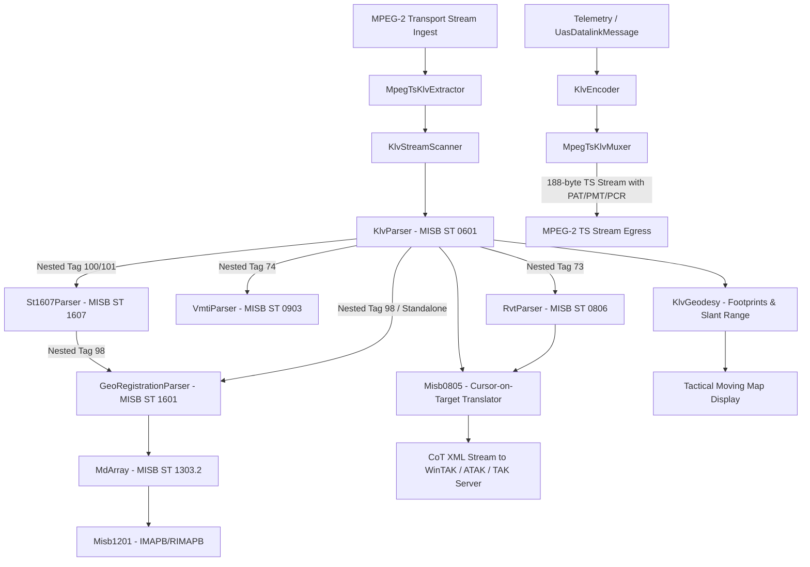

# STANAG 4609 / MISB KLV Metadata Engine & Standards Implementation

This document details the architecture, standards compliance, and features implemented within the `libs/Klv` subsystem of PelcoD-Controller.

---

## 1. Standards Compliance Matrix

The `libs/Klv` library provides a high-performance, zero-Qt, C++17 telemetry encoding, decoding, extraction, and translation suite compliant with Motion Imagery Standards Board (MISB) and NATO STANAG 4609 profiles:

| Standard | Title | Status | Primary Implementation |
|---|---|---|---|
| **MISB ST 0601.19** | UAS Datalink Local Set | **Fully Implemented** | [KlvParser.h](../libs/Klv/KlvParser.h), [KlvEncoder.h](../libs/Klv/KlvEncoder.h) |
| **MISB ST 0806.4** | Remote Video Terminal (RVT) Local Set | **Fully Implemented** | [RvtParser.h](../libs/Klv/RvtParser.h), [RvtEncoder.h](../libs/Klv/RvtEncoder.h), [RvtTypes.h](../libs/Klv/RvtTypes.h) |
| **MISB ST 0805.1** | Cursor-on-Target (CoT) Metadata Translation | **Fully Implemented** | [Misb0805.h](../libs/Klv/Misb0805.h), [Misb0805.cpp](../libs/Klv/Misb0805.cpp) |
| **MISB ST 1601.2** | Geo-Registration Local Set | **Fully Implemented** | [GeoRegistrationParser.h](../libs/Klv/GeoRegistrationParser.h), [GeoRegistrationEncoder.h](../libs/Klv/GeoRegistrationEncoder.h), [GeoRegistrationTypes.h](../libs/Klv/GeoRegistrationTypes.h) |
| **MISB ST 1607.2** | Constructs to Amend/Segment KLV Metadata | **Fully Implemented** | [St1607Parser.h](../libs/Klv/St1607Parser.h), [St1607Encoder.h](../libs/Klv/St1607Encoder.h), [St1607Types.h](../libs/Klv/St1607Types.h) |
| **MISB ST 1204.3** | Motion Imagery Identification System (MIIS) Core Identifier | **Fully Implemented** | [MiisCoreId.h](../libs/Klv/MiisCoreId.h), [MiisCoreId.cpp](../libs/Klv/MiisCoreId.cpp) |
| **MISB ST 1303.2** | Multi-Dimensional Array Pack (MDARRAY) | **Fully Implemented** | [MdArray.h](../libs/Klv/MdArray.h), [MdArray.cpp](../libs/Klv/MdArray.cpp) |
| **MISB ST 1201.5** | Floating Point to Integer Mapping (IMAPB) | **Fully Implemented** | [Misb1201.h](../libs/Klv/Misb1201.h), [Misb1201.cpp](../libs/Klv/Misb1201.cpp) |
| **MISB ST 0903.6** | Video Moving Target Indicator (VMTI) | **Fully Implemented** | [VmtiParser.h](../libs/Klv/VmtiParser.h), [VmtiEncoder.h](../libs/Klv/VmtiEncoder.h), [VmtiTypes.h](../libs/Klv/VmtiTypes.h) |
| **MISB ST 0102.13** | Security Classification Local Set | **Fully Implemented** | [KlvTypes.h](../libs/Klv/KlvTypes.h) (`SecurityMetadata`) |
| **STANAG 4609** | NATO Digital Motion Imagery Architecture (MPEG-TS PES) | **Fully Implemented** | [MpegTsKlvExtractor.h](../libs/Klv/MpegTsKlvExtractor.h), [MpegTsKlvMuxer.h](../libs/Klv/MpegTsKlvMuxer.h), [KlvStreamScanner.h](../libs/Klv/KlvStreamScanner.h) |
| **WGS-84 Geodesy** | Earth Curvature, Frustum Footprints & Slant Range | **Fully Implemented** | [KlvGeodesy.h](../libs/Klv/KlvGeodesy.h), [KlvGeodesy.cpp](../libs/Klv/KlvGeodesy.cpp) |
| **PTZ Slew-to-Cue Bridge** | WGS-84 / CoT / VMTI Cue Slewing & Auto-Framing | **Fully Implemented** | [PtzSlewToCueBridge.h](../libs/Tracking/PtzSlewToCueBridge.h), [PtzSlewToCueBridge.cpp](../libs/Tracking/PtzSlewToCueBridge.cpp) |

---

## 2. Architecture & Data Flow

### ASCII Architecture Diagram

```
+----------------------------------------------------------------------------------------------------+
|                                    libs/Klv Architecture & Pipeline                                |
+----------------------------------------------------------------------------------------------------+
|                                                                                                    |
|    MPEG-2 Transport Stream (188-byte TS Packets)           MPEG-2 Transport Stream Egress          |
|                 |                                                        ^                         |
|                 v                                                        |                         |
|   +----------------------------+                           +----------------------------+          |
|   |    MpegTsKlvExtractor      |                           |      MpegTsKlvMuxer        |          |
|   +----------------------------+                           +----------------------------+          |
|   | - Auto PID Discovery       |                           | - PAT/PMT Generation (CRC) |          |
|   | - PES Reassembly & CC Check|                           | - 90kHz PTS & 27MHz PCR    |          |
|   | - SMPTE ST 336 Alignment   |                           | - 188-byte Framing & Pad   |          |
|   +----------------------------+                           +----------------------------+          |
|                 |                                                        ^                         |
|                 v                                                        |                         |
|   +----------------------------+                           +----------------------------+          |
|   |     KlvStreamScanner       |                           |        KlvEncoder          |          |
|   +----------------------------+                           +----------------------------+          |
|                 |                                                        ^                         |
|       +---------+-------+--------------------+---------------------+     |                         |
|       |                 |                    |                     |     |                         |
|       v                 v                    v                     v     |                         |
| +-------------+   +-------------+      +-------------+       +-------------+                       |
| |  KlvParser  |   |  RvtParser  |      |GeoReg-Parser|       |St1607Parser |                       |
| |(MISB ST0601)|   |(MISB ST0806)|      |(MISB ST1601)|       |(MISB ST1607)|                       |
| +-------------+   +-------------+      +-------------+       +-------------+                       |
|       |     \           |                    |                     |                               |
|       |      \Tag 73    |                    v                     |                               |
|       |       +-------->|              +-------------+             |                               |
|       |                 v              |   MdArray   |             |                               |
|       |Tag 74     +-------------+      |(MISB ST1303)|             |                               |
|       +---------> | VmtiParser  |      +-------------+             |                               |
|       |           |(MISB ST0903)|            |                     |                               |
|       |           +-------------+            v                     |                               |
|       | Tag 100/101                    +-------------+             |                               |
|       +--------------------------------|  Misb1201   |------------>+                               |
|                                        |(IMAPB/RIMAPB|                                             |
|                                        +-------------+                                             |
|                                                                                                    |
|  Tactical Ingestion & Conversion Services                                                          |
|       |                                     |                                                      |
|       v                                     v                                                      |
| +-------------------+             +-------------------+                                            |
| |    KlvGeodesy     |             |     Misb0805      |                                            |
| | - Ground Frustum  |             |  - ST0601 -> CoT  |                                            |
| | - Slant Range     |             |  - ST0806 -> CoT  |                                            |
| | - Target Geo-Loc  |             |  - XML Generator  |                                            |
| +-------------------+             +-------------------+                                            |
|       |                                     |                                                      |
|       v                                     v                                                      |
| Tactical Map / WinTAK / ATAK       CoT Streaming Router (UDP/Multicast/TAK Server)                 |
+----------------------------------------------------------------------------------------------------+
```

### Mermaid Architecture Diagram



---

## 3. Subsystem Breakdown

### 3.1 MISB ST 0601 UAS Datalink Local Set
- **Files**: [KlvTypes.h](../libs/Klv/KlvTypes.h), [KlvParser.h](../libs/Klv/KlvParser.h)/[.cpp](../libs/Klv/KlvParser.cpp), [KlvEncoder.h](../libs/Klv/KlvEncoder.h)/[.cpp](../libs/Klv/KlvEncoder.cpp)
- **Features**:
  - Full support for Tags 1 through 118, including sensor attitude (Heading Tag 5, Pitch Tag 6, Roll Tag 7, Relative Azimuth Tag 18, Relative Elevation Tag 19, Relative Roll Tag 20), optical FOV (HFOV Tag 16, VFOV Tag 17), slant range (Tag 21), target width (Tag 22), frame center (Tags 23–25), corner coordinates (Tags 26–33 and 82–89), Target Location Error (CE90 Tag 45, LE90 Tag 46), Security Classification Local Set (Tag 48), nested RVT (Tag 73), nested VMTI (Tag 74), and sensor roll angle (Tag 118).
  - CRC-16-CCITT packet verification and generation (Tag 1).

### 3.2 MISB ST 0806.4 Remote Video Terminal (RVT) Local Set
- **Files**: [RvtTypes.h](../libs/Klv/RvtTypes.h), [RvtParser.h](../libs/Klv/RvtParser.h)/[.cpp](../libs/Klv/RvtParser.cpp), [RvtEncoder.h](../libs/Klv/RvtEncoder.h)/[.cpp](../libs/Klv/RvtEncoder.cpp), [KlvCrc.h](../libs/Klv/KlvCrc.h)/[.cpp](../libs/Klv/KlvCrc.cpp)
- **Features**:
  - Standalone KLV packet processing with 16-byte Universal Label (`06.0E.2B.34.02.0B.01.01.0E.01.03.03.02.00.00.00`) and nested embedding within ST 0601 Tag 73.
  - Sub-tag 1: MPEG-2 32-bit CRC (`0x04C11DB7`, non-reflected, init `0xFFFFFFFF`) validation and serialization.
  - Sub-tag 2: Microsecond timestamp.
  - Subordinate Local Sets:
    - **Point of Interest (POI)** (Sub-tag 101): POI Number, Latitude/Longitude, MSL Altitude, Symbol Code, Text Label.
    - **Area of Interest (AOI)** (Sub-tag 102): AOI Number, Type, Priority, Boundary coordinates.
    - **User Defined Data** (Sub-tag 103): Numeric Key and Arbitrary Payload.

### 3.3 MISB ST 0805.1 Cursor-on-Target (CoT) Translation
- **Files**: [Misb0805.h](../libs/Klv/Misb0805.h), [Misb0805.cpp](../libs/Klv/Misb0805.cpp)
- **Features**:
  - Translates MISB ST 0601 platform position into CoT `a-f-A-M-F-Q` (Air Track) / `b-m-p-s-p-loc` events.
  - Translates MISB ST 0601 Sensor Point of Interest (SPI) / frame center into CoT `b-m-p-s-p-i` (Sensor Point of Interest) events with Slant Range and Target Width.
  - Translates MISB ST 0806 RVT Point of Interest (POI) packs into MIL-STD-2525B / 2525D CoT events (e.g. `a-f-G-E-V-C` Ground Combat Track) with CE90/LE90 error circular bounds.
  - Formats strict ISO-8601 UTC Zulu timestamps (`YYYY-MM-DDTHH:MM:SS.fffZ`) and generates standard CoT event envelopes (`uid`, `type`, `time`, `start`, `stale`, `how`).

### 3.4 MISB ST 1601.2 Geo-Registration Local Set
- **Files**: [GeoRegistrationTypes.h](../libs/Klv/GeoRegistrationTypes.h), [GeoRegistrationParser.h](../libs/Klv/GeoRegistrationParser.h)/[.cpp](../libs/Klv/GeoRegistrationParser.cpp), [GeoRegistrationEncoder.h](../libs/Klv/GeoRegistrationEncoder.h)/[.cpp](../libs/Klv/GeoRegistrationEncoder.cpp)
- **Features**:
  - Standalone 16-byte Universal Label (`06.0E.2B.34.02.0B.01.01.0E.01.03.03.01.00.00.00`, CRC 39238) and nested Amend Local Set (Tag 98) parsing and serialization.
  - Mandatory metadata items: Tag 1 (Document Version = 2), Tag 2 (Algorithm Name), Tag 3 (Algorithm Version).
  - Tie point pixel space correspondence: Tag 4 (Row/Col points for 1 or 2 images).
  - Ground geodetic tie point correspondence: Tag 5 (Lat/Lon points) and Tag 8 (HAE Elevation).
  - Unpaired parameters: Tag 6 (Second Image Name), Tag 7 (Algorithm Configuration UUID).
  - Uncertainty modeling: Tag 9 (Row/Col Standard Deviation and Cross-Correlation) and Tag 10 (Lat/Lon/Elev Standard Deviation and Cross-Correlation).
  - Strict validation of constraint **ST 1601.1-03** (point count parity across all included tie point arrays).

### 3.5 MISB ST 1303.2 Multi-Dimensional Array Pack (MDARRAY)
- **Files**: [MdArray.h](../libs/Klv/MdArray.h), [MdArray.cpp](../libs/Klv/MdArray.cpp)
- **Features**:
  - Multi-dimensional array pack header encoding: `ndim`, dimensions (`dim1`, `dim2`), element byte length (`ebytes`), Array Processing Algorithm (`apa`).
  - Supports `MdArrayApa::NaturalFormat` (0x01) for big-endian raw integers and IEEE-754 floats.
  - Supports `MdArrayApa::ST1201` (0x02) for floating-point values compressed using MISB ST 1201 IMAPB, including Array Processing Algorithm Support (APAS) minimum and maximum range limits (both 64-bit and 32-bit APAS boundaries).
  - Supports `MdArrayApa::UnsignedInteger` (0x04) with BER-OID bias and delta offsets.

### 3.6 MISB ST 1201.5 Floating Point to Integer Mapping
- **Files**: [Misb1201.h](../libs/Klv/Misb1201.h), [Misb1201.cpp](../libs/Klv/Misb1201.cpp)
- **Features**:
  - Starting Point A (IMAPA): computes optimal byte length $L$ from value range $[a, b]$ and precision $g$.
  - Starting Point B (IMAPB): calculates forward scaling factor $s_F$, reverse scaling factor $s_R$, and zero-point offset $Z_{\text{offset}}$.
  - Reverse mapping (RIMAPB) recovering floating-point values from raw integers.
  - Full IEEE-754 special value handling: Below Minimum, Above Maximum, Positive/Negative Infinity, Quiet NaN, Signaling NaN, User Defined.

### 3.7 MPEG-TS Stream Ingestion, Parsing, Multiplexing & Video Elementary Streams
- **Files**: [MpegTsKlvExtractor.h](../libs/Klv/MpegTsKlvExtractor.h)/[.cpp](../libs/Klv/MpegTsKlvExtractor.cpp), [MpegTsKlvMuxer.h](../libs/Klv/MpegTsKlvMuxer.h)/[.cpp](../libs/Klv/MpegTsKlvMuxer.cpp), [MpegTsMuxerTypes.h](../libs/Klv/MpegTsMuxerTypes.h), [KlvStreamScanner.h](../libs/Klv/KlvStreamScanner.h)/[.cpp](../libs/Klv/KlvStreamScanner.cpp), [VideoTypes.h](../libs/Klv/VideoTypes.h), [VideoNaluParser.h](../libs/Klv/VideoNaluParser.h)/[.cpp](../libs/Klv/VideoNaluParser.cpp), [VideoPesPacketizer.h](../libs/Klv/VideoPesPacketizer.h)/[.cpp](../libs/Klv/VideoPesPacketizer.cpp), [PtsSyncTypes.h](../libs/Klv/PtsSyncTypes.h), [MasterTimeBase.h](../libs/Klv/MasterTimeBase.h)/[.cpp](../libs/Klv/MasterTimeBase.cpp), [PtsSyncManager.h](../libs/Klv/PtsSyncManager.h)/[.cpp](../libs/Klv/PtsSyncManager.cpp), [MpegTsNetworkPublisher.h](../libs/Transport/MpegTsNetworkPublisher.h)/[.cpp](../libs/Transport/MpegTsNetworkPublisher.cpp), [TsNetworkTypes.h](../libs/Transport/TsNetworkTypes.h)
- **Features**:
  - **MPEG-TS Demuxing**: 188-byte MPEG-TS packet demuxing with automatic sync byte (`0x47`) synchronization.
  - **Auto PID Discovery**: Automatic metadata stream PID discovery via SMPTE ST 336 / MISB Universal Label matching across PMT and raw Elementary Streams.
  - **PES Reassembly**: Robust multi-packet PES payload reassembly, continuity counter (CC) drop detection, and adaptation field handling.
  - **Live Video NALU Parsing**: Fast, zero-allocation Annex B start code (`0x000001` and `0x00000001`) scanning, Access Unit (AU) boundary grouping, slice header exp-Golomb parsing (I/P/B), and IDR/IRAP keyframe identification for both H.264 (AVC) and H.265 (HEVC) streams.
  - **Video PES Packetizer**: Formats Video Elementary Streams into ISO/IEC 13818-1 PES packets (Stream ID `0xE0`), injecting 33-bit 90 kHz PTS and optional DTS, AUD headers, data alignment indicators, and unbounded length fields (`0x0000`) for large HD/4K frames.
  - **Multi-Stream TS Muxing (STANAG 4609 & MISB ST 1402)**: Complete 188-byte packet multiplexing of Video Elementary Streams (Stream Type `0x1B` AVC or `0x24` HEVC on PID `0x0101`) alongside KLV Metadata (Stream Type `0x15` or `0x06` on PID `0x01E0`).
  - **Master Time Base Engine**: Drift-compensated monotonic and UTC epoch clock conversions (`SystemMasterTimeBase`) transforming microsecond capture timestamps onto standard 33-bit 90 kHz PTS timebases.
  - **PTS Synchronization Manager (`PtsSyncManager`)**: Enforces strict temporal alignment between live video frames and asynchronous metadata packets within the STANAG 4609 required $\pm 50\text{ ms}$ window via a sliding jitter buffer and configurable synchronization policies (`NearestFrame`, `StrictClamp`, `DropStale`).
  - **PCR Clock Discipline**: Stamping periodic 27 MHz PCR clock references ($\le 40\text{ ms}$) on Video adaptation fields.
  - **PSI Table Generation**: Periodic injection of Program Association Tables (PAT, PID `0x0000`) and Program Map Tables (PMT, configurable PID) with ISO/IEC 13818-1 32-bit CRC calculation via [KlvCrc](../libs/Klv/KlvCrc.h).
  - **Registration Descriptors**: Automatic injection of Format Identifier `"KLVA"` (or `"KLVN"`) Registration Descriptors (Tag `0x05`) per MISB ST 1402.
  - **Transport Stream Network Egress (`MpegTsNetworkPublisher`)**: Industrial-grade, zero-allocation network streaming socket broadcasting multiplexed 188-byte STANAG 4609 / MISB MPEG-TS packets directly to network clients over IPv4 Unicast and Multicast.
  - **MTU-Safe TS Packet Aggregation**: Bundles up to 7 TS packets ($7 \times 188 = 1316\text{ bytes}$) per UDP datagram, maximizing network throughput while preventing IP fragmentation on standard 1500-byte Ethernet MTUs.
  - **RFC 3550 & RFC 2250 RTP Encapsulation**: Formats datagrams into compliant RTP payloads with 12-byte header, Payload Type 33 (`MP2T`), 90 kHz timestamping, and sequence numbering.
  - **Multicast Management & Kernel Send Buffering**: Automatic multicast IP classification (`224.0.0.0`–`239.255.255.255`), configurable hop limit (`IP_MULTICAST_TTL`), interface binding (`IP_MULTICAST_IF`), loopback control (`IP_MULTICAST_LOOP`), and 1 MB kernel socket send buffering (`SO_SNDBUF`).
  - **Streaming & Buffer Modes**: High-efficiency per-packet streaming callbacks for network egress (UDP/RTP) and contiguous buffer serialization (`muxToBuffer`, `muxMessageToBuffer`, `muxVideoToBuffer`, `muxSynchronizedToBuffer`).

### 3.8 MISB ST 1607.2 Constructs to Amend/Segment KLV Metadata
- **Files**: [St1607Types.h](../libs/Klv/St1607Types.h)/[.cpp](../libs/Klv/St1607Types.cpp), [St1607Parser.h](../libs/Klv/St1607Parser.h)/[.cpp](../libs/Klv/St1607Parser.cpp), [St1607Encoder.h](../libs/Klv/St1607Encoder.h)/[.cpp](../libs/Klv/St1607Encoder.cpp)
- **Features**:
  - Full support for Amend Local Set (`06.0E.2B.34.02.0B.01.01.0E.01.03.03.03.01.00.00`, CRC 17182) and Segment Local Set (`06.0E.2B.34.02.0B.01.01.0E.01.03.03.03.00.00.00`, CRC 29742).
  - Integration with MISB ST 0601 as Tag 100 (Segment Local Set) and Tag 101 (Amend Local Set).
  - Encoding and decoding of Item 143 Metadata Substream Identifier (MSID) Pack supporting both BER-OID Local IDs and 16-byte UUIDs per ST 0601.19-46/47.
  - Support for embedded Tag 98 (ST 1601 Geo-Registration Local Set) within Amend Local Sets.
  - Security Local Set filtering per ST 1607.2-09 / ST 1607-04 (Items 12 & 13 only for localized country codes).
  - Strict compliance checks for ST 1607.2-07 (no simultaneous Amend/Segment sets at same level) and ST 1607.2-08 (no Segment set inside an Amend set).
  - High-performance "union and override" resolution engine via `applyTo(UasDatalinkMessage&)` methods.

### 3.9 MISB ST 1204.3 Motion Imagery Identification System (MIIS) Core Identifier
- **Files**: [MiisCoreId.h](../libs/Klv/MiisCoreId.h)/[.cpp](../libs/Klv/MiisCoreId.cpp)
- **Features**:
  - RFC 4122 compliant 128-bit UUID generation, validation, and serialization.
  - Generators for UUID Version 1 (MAC node + 60-bit 100ns timestamp), Version 4 (Random entropy), and Version 5 (SHA-1 name-based deterministic hashing).
  - Strongly-typed Sub-Identifiers with `MiisIdType` (Sensor, Platform, Window) and `MiisIdQuality` (Physical vs. Virtual).
  - Multi-mode binary encoding & decoding:
    - 16-byte raw binary stream UUID.
    - 32-byte dual UUID (Sensor UUID + Platform UUID).
    - 33-byte versioned composite pack (Version + Sensor UUID + Platform UUID).
    - 35-byte versioned quality composite pack (Version + Sensor Quality + Sensor UUID + Platform Quality + Platform UUID).
    - RFC 4122 canonical 8-4-4-4-12 hex string and URN (`urn:uuid:...`) parsing and formatting.
  - Full subsystem integration:
    - MISB ST 0601 Tag 94 (`UasDatalinkMessage::miisCoreId`).
    - MISB ST 1607 Tag 94 (`SegmentLocalSet::miisCoreId` and `applyTo` union-and-override).
    - MISB ST 0903 VMTI Tag 13 (`VmtiLocalSet::miisId`).

### 3.10 PTZ Slew-to-Cue Bridge

- **Files**: [PtzSlewToCueBridge.h](../libs/Tracking/PtzSlewToCueBridge.h)/[.cpp](../libs/Tracking/PtzSlewToCueBridge.cpp)
- **Features**:
  - Transforms geodetic target cues (MISB ST 0601 Target Location, ST 0806 POIs, Cursor-on-Target, radar tracks, VMTI detections) into topocentric Azimuth-Elevation-Range (AER).
  - Full 3D platform attitude compensation (Yaw/Heading, Pitch, Roll) using DCM derotation to determine gimbal angles in the sensor body frame.
  - Dual-mode actuation state machine:
    - **Coarse Slew Mode**: Emits Pelco-D absolute pan (`0x4B`) and tilt (`0x4D`) centidegree commands to acquire distant cues.
    - **Fine Tracking Mode**: Hands off line-of-sight tracking errors to [PtzAutoTracker](../libs/Tracking/PtzAutoTracker.h) closed-loop PID velocity commands.
  - **Dynamic Optical Auto-Framing**: Dynamically adjusts camera HFOV to frame the target based on target bounding radius and calculated slant range.

---

## 4. Test Verification & Coverage

All modules in `libs/Klv` and tracking integration bridges are verified by comprehensive GoogleTest suites:

| Test Suite | File | Test Count | Key Scenarios Tested |
|---|---|---|---|
| **TestKlvBer** | [TestKlvBer.cpp](../libs/Klv/tests/TestKlvBer.cpp) | 7 | BER short/long form length encoding, BER-OID tag encoding/decoding, boundary values |
| **TestKlvCrc** | [TestKlvCrc.cpp](../libs/Klv/tests/TestKlvCrc.cpp) | 4 | CRC-16-CCITT (ST 0601) and MPEG-2 CRC-32 (ST 0806) test vectors |
| **TestKlvEncoderParser** | [TestKlvEncoderParser.cpp](../libs/Klv/tests/TestKlvEncoderParser.cpp) | 6 | Full ST 0601 round-trip, sparse updates, Security Local Set, CRC failure detection |
| **TestKlvStreamScanner** | [TestKlvStreamScanner.cpp](../libs/Klv/tests/TestKlvStreamScanner.cpp) | 4 | Stream boundary re-sync, fragmented packets, corrupted prefixes |
| **TestMpegTsKlvExtractor** | [TestMpegTsKlvExtractor.cpp](../libs/Klv/tests/TestMpegTsKlvExtractor.cpp) | 8 | PID auto-discovery, single/multi-packet PES reassembly, CC drops, real flight TS extraction |
| **TestMpegTsKlvMuxer** | [TestMpegTsKlvMuxer.cpp](../libs/Klv/tests/TestMpegTsKlvMuxer.cpp) | 10 | PAT/PMT CRC-32 validation, multi-stream PMT (Video 0x1B/0x24 + KLV 0x15), 90kHz PTS & 27MHz PCR, synchronized frame multiplexing (<= 50ms) |
| **TestVideoNaluParser** | [TestVideoNaluParser.cpp](../libs/Klv/tests/TestVideoNaluParser.cpp) | 5 | 3-byte/4-byte Annex B start codes, H.264 & H.265 NALU type extraction, keyframe detection, streaming chunk AU boundary slicing |
| **TestVideoPesPacketizer** | [TestVideoPesPacketizer.cpp](../libs/Klv/tests/TestVideoPesPacketizer.cpp) | 4 | Video Stream ID 0xE0 framing, 33-bit 90kHz PTS/DTS encoding, AUD prepending, unbounded PES lengths (> 65535 bytes) |
| **TestMasterTimeBase** | [TestMasterTimeBase.cpp](../libs/Klv/tests/TestMasterTimeBase.cpp) | 3 | System epoch and monotonic clock timebases, 90kHz PTS tick bidirectional scaling, 33-bit rollover wrapping |
| **TestPtsSyncManager** | [TestPtsSyncManager.cpp](../libs/Klv/tests/TestPtsSyncManager.cpp) | 6 | In-sync nominal alignment, compliant skew handling, StrictClamp (<= 50ms), NearestFrame snapping, DropStale policy, MpegTsKlvMuxer binding |
| **TestKlvGeodesy** | [TestKlvGeodesy.cpp](../libs/Klv/tests/TestKlvGeodesy.cpp) | 5 | WGS-84 direct geodetic, slant range, camera frustum footprints, horizon clipping |
| **TestVmtiEncoderParser** | [TestVmtiEncoderParser.cpp](../libs/Klv/tests/TestVmtiEncoderParser.cpp) | 4 | VMTI standalone and embedded round-trips, target row-major pixel coordinates |
| **TestMisb1201** | [TestMisb1201.cpp](../libs/Klv/tests/TestMisb1201.cpp) | 5 | ST 1201 Appendix A standard test vectors (IMAPA, IMAPB, Zero Offset, Special Values) |
| **TestFlightStreamValidation** | [TestFlightStreamValidation.cpp](../libs/Klv/tests/TestFlightStreamValidation.cpp) | 5 | End-to-end telemetry playback from day/night flight video streams, seek recovery |
| **TestRvtLocalSet** | [TestRvtLocalSet.cpp](../libs/Klv/tests/TestRvtLocalSet.cpp) | 7 | Standalone ST 0806 packet with CRC-32, POI/AOI/UserDefined serialization, ST 0601 Tag 73 embedding |
| **TestMisb0805** | [TestMisb0805.cpp](../libs/Klv/tests/TestMisb0805.cpp) | 6 | ISO-8601 formatting, CE90/LE90 conversion, Platform CoT, Sensor POI CoT, RVT POI to CoT batch conversion |
| **TestGeoRegistration** | [TestGeoRegistration.cpp](../libs/Klv/tests/TestGeoRegistration.cpp) | 10 | MDARRAY 1D/2D NaturalFormat and ST 1201 IMAPB, 2-image tie points, geo tie points, covariances, ST 1601.1-03 parity rule |
| **TestSt1607LocalSet** | [TestSt1607LocalSet.cpp](../libs/Klv/tests/TestSt1607LocalSet.cpp) | 9 | ST 1607 UL matching, MSID local/universal ID, standalone packets, embedded Tags 100/101, embedded Tag 98, ST 1607.2 rules, union-and-override |
| **TestMiisCoreId** | [TestMiisCoreId.cpp](../libs/Klv/tests/TestMiisCoreId.cpp) | 10 | RFC 4122 UUID v1/v4/v5, 16/32/33/35-byte binary packs, ST 0601 Tag 94, ST 1607 Tag 94, ST 0903 Tag 13 |
| **TestPtzSlewToCueBridge** | [TestPtzSlewToCueBridge.cpp](../libs/Tracking/tests/TestPtzSlewToCueBridge.cpp) | 8 | Stationary mast target bearing, platform attitude derotation, coarse-to-fine transitions, auto-zoom framing |
| **TestMpegTsNetworkPublisher** | [TestMpegTsNetworkPublisher.cpp](../libs/Transport/tests/TestMpegTsNetworkPublisher.cpp) | 8 | Raw UDP streaming (1316 B), partial packet accumulation & flush, RFC 3550 RTP encapsulation (1328 B), multicast TTL/loopback, invalid buffer rejection, bitrate tracking |
| **Total** | | **125** | **100% Pass Rate** |


