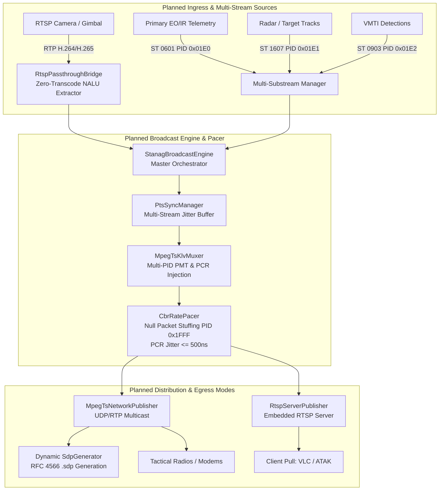

# STANAG 4609 & MISB KLV: Future Architecture & Planned Capabilities

This document outlines the architectural roadmap, planned features, and future enhancements for the STANAG 4609 / MISB video and telemetry ecosystem in `PelcoD-Controller`.

---

## 1. Roadmap Architecture & Data Flow

The planned extensions will evolve the system into an end-to-end, zero-transcode broadcasting and multi-sensor dissemination platform.

### 1.1 ASCII Architecture Diagram

```text
+---------------------------------------------------------------------------------------------------------+
|                                    FUTURE BROADCAST ARCHITECTURE ROADMAP                                |
+---------------------------------------------------------------------------------------------------------+
|                                                                                                         |
|  [ Planned: RTSP Ingest Bridge ]                               [ Planned: Multi-Substream Ingest ]      |
|  - RTSP Client (RFC 2326/7826)                                 - Primary Sensor (EO/IR ST 0601)         |
|  - RFC 6184 / RFC 7798 RTP Depacketizer                        - Secondary Radar / Sightline Tracks     |
|  - Zero-Transcode Annex B Extraction                           - ST 1607 MSID Multi-PID Stream Packs   |
|                 \                                                               /                       |
|                  v                                                             v                        |
|        +-------------------------------------------------------------------------------+                |
|        |                [ Planned: StanagBroadcastEngine (Orchestrator) ]              |                |
|        |  - Coordinates Lifecycle, Threading, Buffer Monitoring, and Auto-Reconnection |                |
|        +-------------------------------------------------------------------------------+                |
|                                                |                                                        |
|                                                v                                                        |
|        +-------------------------------------------------------------------------------+                |
|        |                   PtsSyncManager (Sliding Jitter Buffer)                      |                |
|        |           Clamps Skew to <= 50 ms across Multiple Independent Metadata PIDs   |                |
|        +-------------------------------------------------------------------------------+                |
|                                                |                                                        |
|                                                v                                                        |
|        +-------------------------------------------------------------------------------+                |
|        |                   MpegTsKlvMuxer (Multi-Stream Multiplexer)                   |                |
|        |  - Video PID 0x0101 (H.264 / H.265) + Periodic 27MHz PCR Base/Extension       |                |
|        |  - Multi-PID Metadata: 0x01E0 (EO/IR), 0x01E1 (Radar), 0x01E2 (VMTI ST 0903)  |                |
|        +-------------------------------------------------------------------------------+                |
|                                                |                                                        |
|                                                v                                                        |
|        +-------------------------------------------------------------------------------+                |
|        |                [ Planned: Constant Bitrate (CBR) Rate Pacer ]                 |                |
|        |  - Null Packet Stuffing (PID 0x1FFF, 0xFF Payload) for Fixed Tactical Pipes   |                |
|        |  - Hardware Clock Discipline Enforcing PCR Jitter <= 500 ns                   |                |
|        +-------------------------------------------------------------------------------+                |
|                                                |                                                        |
|                                                v                                                        |
|        +-------------------------------------------------------------------------------+                |
|        |                              Network Egress Options                           |                |
|        |   +-------------------------------+       +-------------------------------+   |                |
|        |   |   MpegTsNetworkPublisher      |       |  [ Planned: RtspServerEgress ]|   |                |
|        |   | - Raw UDP Multicast (1316 B)  |       | - Embedded RTSP 1.0/2.0 Server|   |                |
|        |   | - RFC 3550 RTP MP2T (1328 B)  |       | - TCP Interleaved & UDP Pull  |   |                |
|        |   | - [Planned: Dynamic SDP Gen]  |       |   (rtsp://<host>:8554/live.ts)|   |                |
|        |   +-------------------------------+       +-------------------------------+   |                |
|        +-------------------------------------------------------------------------------+                |
|                                                |                                                        |
+------------------------------------------------|--------------------------------------------------------+
                                                 |
                                                 v
           +----------------------------------------------------------------------------+
           |               Tactical Downlinks, Radios, and Network Clients              |
           |      - VLC Media Player           - ATAK / WinTAK / Android Tactical Assault   |
           |      - QGroundControl             - Mission Control Systems                    |
           |      - Line-of-Sight Radios (CBR) - Satcom Downlinks (Fixed Bandwidth)         |
           +----------------------------------------------------------------------------+
```

### 1.2 Mermaid Functional Flowchart



---

## 2. Planned Subsystems & Features

### 2.1 High-Level Broadcast Pipeline Orchestrator (`StanagBroadcastEngine`)
- **Target Files**: `libs/Klv/StanagBroadcastEngine.h`, `libs/Klv/StanagBroadcastEngine.cpp`
- **Objective**: Provide an integrated facade orchestrating video ingestion, master clock conversion, telemetry queueing, PTS/PCR synchronization, TS multiplexing, and network egress behind a unified, thread-safe API.
- **Key Features**:
  - Encapsulates `VideoNaluParser`, `MasterTimeBase`, `PtsSyncManager`, `MpegTsKlvMuxer`, and `MpegTsNetworkPublisher`.
  - Automatic thread management with bounded lock-free queues to isolate socket I/O from video parsing.
  - Stream health monitoring, dropped frame detection, and automatic reconnection on source loss.
  - High-level configuration structure (`StanagBroadcastConfig`) controlling video codec, PIDs, multicast destinations, and sync thresholds.
- **Proposed Interface**:
  ```cpp
  class StanagBroadcastEngine {
  public:
      explicit StanagBroadcastEngine(StanagBroadcastConfig config);
      ~StanagBroadcastEngine();

      [[nodiscard]] bool start();
      void stop();
      [[nodiscard]] bool isRunning() const noexcept;

      void pushVideoChunk(const std::uint8_t* data, std::size_t size, std::uint64_t timestampUs);
      void pushTelemetry(const UasDatalinkMessage& message);

      [[nodiscard]] StanagBroadcastStats stats() const;
  };
  ```

---

### 2.2 RTSP Direct Ingest & Zero-Transcode NALU Bridge (`RtspPassthroughBridge`)
- **Target Files**: `libs/Video/RtspPassthroughBridge.h`, `libs/Video/RtspPassthroughBridge.cpp`
- **Objective**: Extract compressed H.264/H.265 Access Units directly from RTSP IP cameras and gimbals without decoding to uncompressed RGB/YUV video (transmuxing/passthrough).
- **Key Features**:
  - Built on cross-platform sockets in [`libs/Transport`](../libs/Transport) and RTSP protocol handling.
  - RFC 6184 H.264 RTP depacketizer supporting Single NALU, STAP-A aggregation packets, and FU-A fragmentation units.
  - RFC 7798 H.265 RTP depacketizer supporting Single NALU, AP, and FU packets.
  - Reassembles fragmented RTP packets into standard Annex B byte streams with `00 00 00 01` delimiters.
  - Eliminates video decoding and re-encoding overhead: near-zero CPU usage and sub-5 ms ingestion latency.

---

### 2.3 Constant Bitrate (CBR) Rate Pacer & Null Packet Stuffing (PID `0x1FFF`)
- **Target Files**: `libs/Transport/CbrRatePacer.h`, `libs/Transport/CbrRatePacer.cpp`
- **Objective**: Convert bursty Variable Bitrate (VBR) video streams into compliant Constant Bitrate (CBR) broadcasts required by tactical satellite modems, microwave datalinks, and hardware decoders.
- **Key Features**:
  - Dynamically calculates bit consumption over high-precision sub-millisecond intervals.
  - Interleaves standard ISO/IEC 13818-1 Null TS packets (PID `0x1FFF`, payload filled with `0xFF`) to maintain exact configured target bitrate (e.g. 2.0 Mbps, 4.0 Mbps, 8.0 Mbps).
  - High-resolution monotonic timer discipline enforcing maximum PCR jitter limits ($\le 500\text{ ns}$) per ISO/IEC 13818-1 Clause 2.4.2.2.
  - Optional smoothing buffer with configurable watermark thresholds.

---

### 2.4 Dynamic SDP (Session Description Protocol) Generator
- **Target Files**: `libs/Transport/SdpGenerator.h`, `libs/Transport/SdpGenerator.cpp`
- **Objective**: Automate stream configuration and client setup by generating standard RFC 4566 Session Description Protocol (`.sdp`) descriptors for RTP MPEG-TS unicast and multicast streams.
- **Key Features**:
  - Generates text representations compliant with RFC 4566 / RFC 2327:
    ```text
    v=0
    o=- 1609459200 1 IN IP4 127.0.0.1
    s=STANAG 4609 Broadcast Stream
    c=IN IP4 239.255.0.1/16
    t=0 0
    m=video 1234 RTP/AVP 33
    a=rtpmap:33 MP2T/90000
    ```
  - Exposes `toFile(const std::string& path)` and `toString()` methods.
  - Allows instant drag-and-drop or command-line playback in VLC (`vlc stream.sdp`) and tactical software.

---

### 2.5 Multi-PID Metadata Substream Multiplexing (MISB ST 1607 & ST 0601 MSID)
- **Target Files**: Updates to [`MpegTsKlvMuxer.h`](../libs/Klv/MpegTsKlvMuxer.h) and [`MpegTsKlvMuxer.cpp`](../libs/Klv/MpegTsKlvMuxer.cpp)
- **Objective**: Support simultaneous broadcast of multiple independent telemetry streams over dedicated elementary stream PIDs within the same MPEG-TS transport stream.
- **Key Features**:
  - Extends Program Map Table (PMT) generation to define multiple metadata streams with distinct PIDs:
    - Primary Sensor Local Set (PID `0x01E0`, Stream Type `0x15`, Registration `"KLVA"`).
    - Secondary Sensor / Radar Track Local Set (PID `0x01E1`, Stream Type `0x15`).
    - VMTI Detections / Tracks Local Set (PID `0x01E2`, Stream Type `0x15`, Registration `"VMTI"`).
  - Integrates MISB ST 1607 Item 143 Metadata Substream Identifier (MSID) packs to disambiguate sensor sources.
  - Per-stream continuity counter tracking and PTS stamping.

---

### 2.6 Embedded RTSP Server Egress (`RtspServerPublisher`)
- **Target Files**: `libs/Transport/RtspServerPublisher.h`, `libs/Transport/RtspServerPublisher.cpp`
- **Objective**: Provide an embedded, lightweight RTSP 1.0 (RFC 2326) and RTSP 2.0 (RFC 7826) streaming server allowing clients to pull STANAG 4609 streams over TCP or UDP without requiring an external multicast network.
- **Key Features**:
  - Built directly on [`libs/Transport`](../libs/Transport) primitives without external RTSP server dependencies.
  - Supports standard RTSP methods: `OPTIONS`, `DESCRIBE`, `SETUP`, `PLAY`, `TEARDOWN`.
  - Stream delivery modes:
    - Interleaved TCP transport for traversal through restrictive firewalls.
    - RTP/AVP over UDP unicast for low-latency local connections.
  - Endpoint routing supporting multiple simultaneous mount points (e.g. `rtsp://<server>:8554/live.ts`, `rtsp://<server>:8554/ir.ts`).

---

### 2.7 KML & GeoJSON Spatial Exporter (`KmlExporter`, `GeoJsonExporter`)
- **Target Files**: `libs/Mapping/SpatialExportTypes.h`, `libs/Mapping/SpatialDataRecorder.h`, `libs/Mapping/KmlExporter.h`, `libs/Mapping/GeoJsonExporter.h`
- **Objective**: Export 4D flight tracks, 3D volumetric sensor frustum pyramids, 2D ground footprints, and target ground tracks to Google Earth Pro/Web and QGIS.
- **Detailed Plan**: See [KML_GeoJSON_Exporter_Plan.md](KML_GeoJSON_Exporter_Plan.md).
- **Key Features**:
  - Standard OGC KML 2.2 with `<gx:Track>`, `<gx:angles>`, and `<TimeSpan>` temporal animation sliders.
  - Volumetric 3D sensor frustum pyramids (`<MultiGeometry>` polyhedrons) with altitude-dependent semi-transparent shading.
  - RFC 7946 GeoJSON layers: 3D flight path (`LineString Z`), 2D ground footprints (`Polygon`), 3D frustum meshes (`MultiPolygon Z`), and target tracks (`Point`/`LineString`).
  - Adaptive decimation engine (uniform $\Delta t$, distance threshold, heading change) to optimize GIS rendering performance.
  - Pure C++17 implementation in [`libs/Mapping`](../libs/Mapping) with zero Qt dependencies.

---

## 3. Implementation Priorities & Phasing

| Phase | Milestone | Priority | Dependencies |
| :---: | :--- | :---: | :--- |
| **Phase 1** | **Broadcast Engine Orchestrator (`StanagBroadcastEngine`)**<br>Unifies all existing components into an intuitive 3-line application API. | **High** | [MpegTsKlvMuxer](../libs/Klv/MpegTsKlvMuxer.h), [PtsSyncManager](../libs/Klv/PtsSyncManager.h), [MpegTsNetworkPublisher](../libs/Transport/MpegTsNetworkPublisher.h) |
| **Phase 2** | **Dynamic SDP Generator**<br>Enables seamless one-click stream ingestion in VLC, ATAK, and media players. | **High** | [TsNetworkTypes.h](../libs/Transport/TsNetworkTypes.h) |
| **Phase 3** | **CBR Rate Pacer & Null Packet Stuffing (PID `0x1FFF`)**<br>Enables deployment over fixed-bandwidth satcom links and hardware modulators. | **Medium** | [MpegTsNetworkPublisher](../libs/Transport/MpegTsNetworkPublisher.h) |
| **Phase 4** | **RTSP Passthrough Bridge (`RtspPassthroughBridge`)**<br>Zero-transcode H.264/H.265 NALU depacketization from IP cameras and gimbals. | **Medium** | [VideoNaluParser](../libs/Klv/VideoNaluParser.h), [SocketUtils](../libs/Transport/SocketUtils.h) |
| **Phase 5** | **Multi-PID Metadata Substream Multiplexing**<br>Simultaneous broadcast of EO/IR, Radar, and VMTI on separate PIDs per MISB ST 1607. | **Medium** | [MpegTsKlvMuxer](../libs/Klv/MpegTsKlvMuxer.h), [St1607Parser](../libs/Klv/St1607Parser.h) |
| **Phase 6** | **Embedded RTSP Server Egress (`RtspServerPublisher`)**<br>Allows clients on non-multicast networks to pull streams on demand via RTSP. | **Low** | [SocketUtils](../libs/Transport/SocketUtils.h), [BaseTransport](../libs/Transport/BaseTransport.h) |
| **Phase 7** | **KML & GeoJSON Spatial Exporter**<br>Exports 4D flight tracks and 3D sensor frustum pyramids to Google Earth and QGIS. | **Medium** | [KlvGeodesy](../libs/Klv/KlvGeodesy.h), [GeoTypes.h](../libs/Mapping/GeoTypes.h) |

