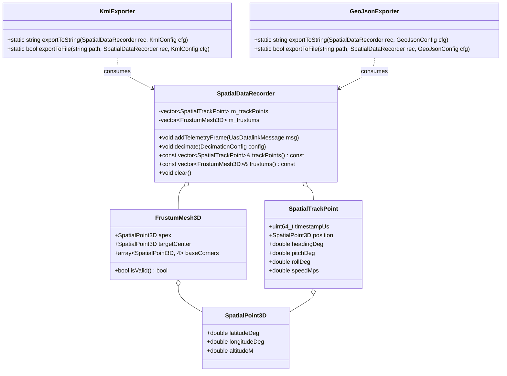
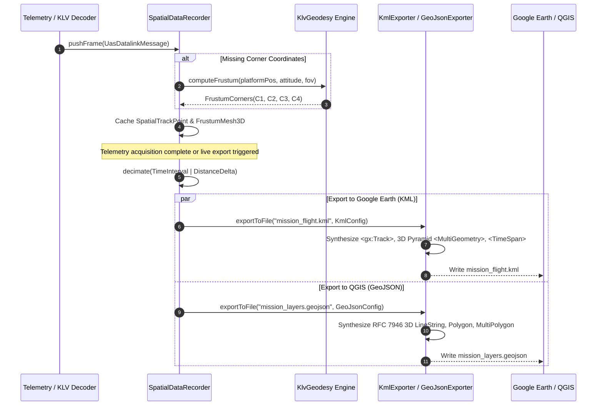

# KML & GeoJSON Spatial Exporter: Architecture & Implementation Plan

This document outlines the architecture, data structures, and phased implementation plan for the **KML / GeoJSON Spatial Exporter** subsystem in `PelcoD-Controller`.

---

## 1. Executive Summary & Capabilities

The **Spatial Exporter** converts STANAG 4609 / MISB ST 0601 UAS telemetry into standard geospatial formats:
- **Google Earth Pro & Web**: OGC KML 2.2 with `<gx:Track>` for flight trajectories and 3D `<MultiGeometry>` volumetric pyramids for electro-optical / infrared (EO/IR) sensor frustums with `<TimeSpan>` animation.
- **QGIS 3.x, Cesium, & Web GIS**: RFC 7946 GeoJSON layers with 3D flight paths (`LineString Z`), 2D ground footprints (`Polygon`), 3D frustum volumes (`MultiPolygon Z`), and target boresight tracks (`Point` / `LineString`).

The subsystem resides in [`libs/Mapping`](../libs/Mapping) and maintains **zero Qt dependencies** for seamless use in CLI tools, backend streaming servers, and GUI applications.

---

## 2. Architecture & Data Flow

### 2.1 ASCII Architecture & Geometry Diagram

```text
+---------------------------------------------------------------------------------------------------+
|                                  SPATIAL EXPORT ENGINE PIPELINE                                   |
+---------------------------------------------------------------------------------------------------+
|                                                                                                   |
|  [ MISB ST 0601 Telemetry Stream ]                     [ MISB ST 0903 VMTI Target Tracks ]       |
|  (UasDatalinkMessage: Lat, Lon, Alt,                   (Target lat/lon, bounding boxes,           |
|   Attitude, Pan, Tilt, Roll, HFOV, VFOV)                track IDs, target classifications)        |
|                       \                                                /                          |
|                        v                                              v                           |
|          +------------------------------------------------------------------+                     |
|          |                   SpatialDataRecorder (Buffer)                   |                     |
|          |  - Time-series buffering & monotonic epoch sorting               |                     |
|          |  - Adaptive decimation (Uniform Δt, Distance Δd, Angular Δθ)     |                     |
|          +------------------------------------------------------------------+                     |
|                                           |                                                       |
|                                           v                                                       |
|          +------------------------------------------------------------------+                     |
|          |                   FrustumGeometryBuilder                         |                     |
|          |  - Computes 3D Apex: P(lat, lon, alt)                            |                     |
|          |  - Decodes or computes 4-corner ground base: C1, C2, C3, C4      |                     |
|          |  - Builds 4 triangular side walls: (P,C1,C2), (P,C2,C3), etc.    |                     |
|          |  - Generates boresight ray: (P -> Target Center)                 |                     |
|          +------------------------------------------------------------------+                     |
|                         /                                    \                                    |
|                        v                                      v                                   |
|   +---------------------------------------+      +----------------------------------------+       |
|   |             KmlExporter               |      |            GeoJsonExporter             |       |
|   | - OGC KML 2.2 / Google gx: extensions |      | - RFC 7946 FeatureCollection           |       |
|   | - <gx:Track> with <when> & <gx:coord> |      | - Layer 1: Flight Track (LineString Z) |       |
|   | - 3D Frustum Pyramids (<MultiGeometry>|      | - Layer 2: Sensor Footprints (Polygon) |       |
|   | - <TimeSpan> interactive time slider  |      | - Layer 3: 3D Frustums (MultiPolygon Z)|       |
|   | - Styled balloons with telemetry HTML |      | - Layer 4: Target Tracks & VMTI Points |       |
|   +---------------------------------------+      +----------------------------------------+       |
|                        |                                      |                                   |
+------------------------|--------------------------------------|-----------------------------------+
                         v                                      v
          +-----------------------------+        +------------------------------+
          |      Google Earth Pro       |        |             QGIS             |
          |  - 4D Time-Slider Playback  |        |  - 2D Cartographic Analysis  |
          |  - 3D Volumetric FOV Cones  |        |  - 3D Canvas Mesh Draping    |
          |  - Flight Cockpit View Tour |        |  - Rule-based styling & symb |
          +-----------------------------+        +------------------------------+
```

```text
               3D SENSOR FRUSTUM PYRAMID GEOMETRY
               
                           Apex P (Platform Pos: lat, lon, alt)
                                  /\
                                 /  \
                                / |  \
                               /  |   \   <-- Optical Boresight Ray (LOS)
                              /   |    \
                             /    v     \
                            /   Target   \
                           /       T      \
             Corner 1 C1  +----------------+ C2 Corner 2
                         /                /
                        /   Footprint    /
                       /    Ground Base /
           Corner 4 C4+----------------+ C3 Corner 3
```

### 2.2 Mermaid Architecture & Class Diagram



### 2.3 Mermaid Temporal Sequence Diagram



---

## 3. Subsystem Components & Target Files

### 3.1 `SpatialExportTypes.h` (`libs/Mapping/SpatialExportTypes.h`)
- **Objective**: Define core 3D spatial points, frustum mesh structures, decimation policies, and styling options.
- **Key Types**:
  - `SpatialPoint3D`: Latitude, longitude, altitude (MSL/HAE).
  - `SpatialTrackPoint`: Epoch timestamp (microseconds), 3D position, Euler attitude angles (heading, pitch, roll), velocity.
  - `FrustumMesh3D`: Apex platform point, target ground point, 4-corner ground polygon (`C1` through `C4`), and 4 triangular side walls.
  - `ColorRgba`: 32-bit color supporting conversions to KML `aabbggrr` hex and web hex `#rrggbbaa`.
  - `DecimationConfig`: Decimation modes (`None`, `UniformTime`, `DistanceThreshold`, `HeadingThreshold`).
  - `KmlConfig`: Toggles for `<gx:Track>`, 3D volumetric pyramids, `<TimeSpan>` timestamps, and color styling.
  - `GeoJsonConfig`: Toggles for flight track `LineString`, footprint `Polygon`, 3D frustum `MultiPolygon`, and coordinate precision.

### 3.2 `SpatialDataRecorder.h` & `.cpp` (`libs/Mapping/SpatialDataRecorder.h`, `libs/Mapping/SpatialDataRecorder.cpp`)
- **Objective**: Time-series accumulator and decimation filter.
- **Key Methods**:
  - `void addTelemetryFrame(const Klv::UasDatalinkMessage& msg)`: Ingests ST 0601 telemetry. Automatically invokes [`KlvGeodesy::computeFrustum`](../libs/Klv/KlvGeodesy.h) if corners are not populated in the raw stream.
  - `void decimate(const DecimationConfig& config)`: Filters high-frequency 30 Hz/60 Hz streams down to GIS-friendly rates (e.g. 1 Hz–5 Hz) while retaining key turns and attitude changes.
  - `[[nodiscard]] const std::vector<SpatialTrackPoint>& trackPoints() const noexcept`: Accessor for platform points.
  - `[[nodiscard]] const std::vector<FrustumMesh3D>& frustums() const noexcept`: Accessor for 3D frustums.

### 3.3 `KmlExporter.h` & `.cpp` (`libs/Mapping/KmlExporter.h`, `libs/Mapping/KmlExporter.cpp`)
- **Objective**: Generates OGC KML 2.2 / Google Earth XML with 4D tracks and 3D frustum pyramids.
- **Key Methods**:
  - `[[nodiscard]] static std::string exportToString(const SpatialDataRecorder& rec, const KmlConfig& cfg)`
  - `[[nodiscard]] static bool exportToFile(const std::string& path, const SpatialDataRecorder& rec, const KmlConfig& cfg)`
- **Key Features**:
  - `<gx:Track>` with `<when>` and `<gx:coord>` for continuous path visualization and Google Earth time-slider playback.
  - `<gx:angles>` for accurate heading, pitch, and roll orientation of 3D aircraft models.
  - `<MultiGeometry>` per video frame containing:
    1. Base footprint: `<Polygon>` on ground with semi-transparent yellow/green fill.
    2. 3D Frustum pyramid: `<Polygon>` side walls in 3D (`<altitudeMode>absolute</altitudeMode>`) with semi-transparent cyan fill.
    3. Boresight vector: `<LineString>` from platform to target center.
  - Structured HTML description balloons with platform tail number, speed, altitude, and sensor azimuth/elevation.

### 3.4 `GeoJsonExporter.h` & `.cpp` (`libs/Mapping/GeoJsonExporter.h`, `libs/Mapping/GeoJsonExporter.cpp`)
- **Objective**: Generates RFC 7946 GeoJSON for QGIS 3.x and Cesium.
- **Key Methods**:
  - `[[nodiscard]] static std::string exportToString(const SpatialDataRecorder& rec, const GeoJsonConfig& cfg)`
  - `[[nodiscard]] static bool exportToFile(const std::string& path, const SpatialDataRecorder& rec, const GeoJsonConfig& cfg)`
- **Key Features**:
  - Counter-clockwise (CCW) winding order for all polygon rings per RFC 7946.
  - Layer separation:
    - Layer 1: **Flight Track** (`LineString` with 3D coordinates `[lon, lat, alt]`).
    - Layer 2: **Sensor Footprints** (`Polygon` ground quadrilaterals with sensor metadata properties).
    - Layer 3: **3D Frustums** (`MultiPolygon` 3D meshes for QGIS 3D canvas).
    - Layer 4: **Target Tracks** (`Point` or `LineString` for frame center).

---

## 4. Phased Implementation Roadmap

| Phase | Milestone | Deliverables | Target Directory |
| :---: | :--- | :--- | :--- |
| **Phase 1** | **Spatial Data Types & Recorder** | `SpatialExportTypes.h`, `SpatialDataRecorder.h`, `SpatialDataRecorder.cpp` | [`libs/Mapping`](../libs/Mapping) |
| **Phase 2** | **Frustum 3D Mesh Synthesis & Decimation** | Corner auto-calculation fallback via `KlvGeodesy`, decimation algorithms | [`libs/Mapping`](../libs/Mapping) |
| **Phase 3** | **RFC 7946 GeoJSON Exporter & Tests** | `GeoJsonExporter.h`, `GeoJsonExporter.cpp`, `TestGeoJsonExporter.cpp` | [`libs/Mapping`](../libs/Mapping), [`libs/Mapping/tests`](../libs/Mapping/tests) |
| **Phase 4** | **OGC KML 2.2 / Google Earth Exporter & Tests** | `KmlExporter.h`, `KmlExporter.cpp`, `TestKmlExporter.cpp` | [`libs/Mapping`](../libs/Mapping), [`libs/Mapping/tests`](../libs/Mapping/tests) |
| **Phase 5** | **Packaging & Tooling** | KMZ archive generation, QGIS layer styling, CLI export command | [`libs/Mapping`](../libs/Mapping) |

---

## 5. Verification Checklist & Compliance

Before code submission, verify against all project rules:
1. **MISRA C++:2023 / SEI CERT C++**: No raw `new`/`delete`, strictly RAII, no implicit lossy conversions.
2. **Include Guards**: Use `#pragma once` across all new headers.
3. **File Co-location**: `.h` and `.cpp` co-located in [`libs/Mapping`](../libs/Mapping).
4. **Zero Qt Dependencies**: Pure standard C++17 (`<string>`, `<vector>`, `<sstream>`).
5. **Function Names**: All function names strictly $< 30$ characters.
6. **Initialization**: All struct members and variables explicitly `{}` initialized.
7. **Nodiscard**: `[[nodiscard]]` applied to all export methods and queries.
8. **Doxygen**: Full Doxygen templates (`/// @brief`, `@details`, `@param`, `@return`) for all public APIs.
