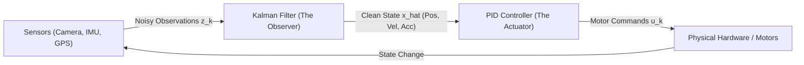
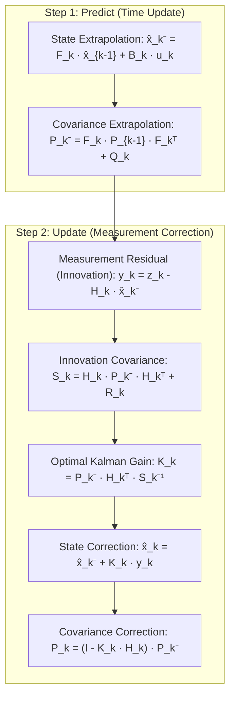

# Kalman Filter 101: An Intuitive (ELI5) and Technical Guide

> **Target Audience:** From beginners seeking an intuitive conceptual grasp to software, robotics, and computer vision engineers designing state estimation, sensor fusion, and predictive tracking pipelines.

---

## Executive Summary & ELI5 (Explain Like I'm 5)

A **Kalman Filter** is an optimal mathematical algorithm that estimates the true, hidden state of a moving system from a series of noisy, uncertain, or incomplete measurements over time. It continuously fuses two imperfect sources of information:
1. **The Physics-Based Prediction** (*"Where does Newton's law of motion say we should be?"*)
2. **The Sensor Measurement** (*"Where does our noisy camera or GPS say we are right now?"*)

By calculating an optimal weighting factor called the **Kalman Gain ($K$)**, the filter creates an estimate that is provably more accurate than either the sensor or the physical model alone.

---

### The Intuitive Analogy: Driving into a Dark Mountain Tunnel

Imagine driving your car at 100 km/h and entering a long, dark tunnel where GPS signal drops:

```
[ Highway with GPS ] ──► [ Entering Dark Tunnel ] ──► [ Inside Tunnel: No GPS ]
```

1. **The Pure Prediction (Physics Model):**
   - You glance at your speedometer: you are moving at exactly 100 km/h ($27.8\text{ m/s}$).
   - Even without GPS, you can multiply speed by time ($\text{distance} = v \cdot t$) to calculate your position inside the tunnel.
   - **The Problem:** Your speedometer isn't 100% accurate, tires slip slightly, and wind resistance varies. Over time, your mathematical prediction accumulates drift and uncertainty grows.

2. **The Noisy Sensor (Uncertain Measurement):**
   - Inside the tunnel, your phone occasionally catches a degraded, reflected GPS bounce from an exhaust grate.
   - The phone screen jumps erratically: one second it says you are 50 meters ahead, the next second 20 meters behind.
   - **The Problem:** If your navigation system believed every raw sensor reading, the map marker would jump violently across the screen.

3. **The Kalman Fusion (The Optimal Compromise):**
   - The Kalman filter asks: *"How confident am I in my physical speed model vs. this erratic GPS ping?"*
   - When GPS is noisy and your physics model is fresh, it **trusts the physics** and barely budges for the noisy ping.
   - If you've been in the tunnel for 10 minutes and your prediction has grown very uncertain, it **listens more to the sensor**.
   - It outputs a smooth, rock-solid trajectory that glides seamlessly through the tunnel.

---

### The Two Weighing Scales Analogy

Imagine trying to determine your exact body weight:
- **Scale A (Old mechanical bathroom scale):** Cheap, wobbly spring. You step on it and it says $78\text{ kg} \pm 4\text{ kg}$ error.
- **Scale B (Friend's digital scale):** High quality, but uneven floor. It says $74\text{ kg} \pm 1\text{ kg}$ error.

How do you combine them? You don't just take a simple 50/50 average ($76\text{ kg}$); you weight the answer toward the scale with the **lower uncertainty (variance)**.

```
                  Scale A (High Variance)
                         ▼
        ┌────────────────────────────────┐
        │  Uncertain: 78 kg (± 4 kg)     │
        └──────────────┬─────────────────┘
                       │
                       ▼
        ┌────────────────────────────────┐       Kalman Optimal Estimate:
        │ Optimal Bayesian Combination   │ ───►  74.2 kg (± 0.97 kg)
        └──────────────▲─────────────────┘       More accurate than either!
                       │
        ┌──────────────┴─────────────────┐
        │  Precise: 74 kg (± 1 kg)       │
        └────────────────────────────────┘
                         ▲
                  Scale B (Low Variance)
```

The Kalman filter does this mathematically in real time, frame after frame, across position, velocity, and acceleration vectors.

---

## 1. What is a Kalman Filter? (The 101 Technical Overview)

Developed by Hungarian-American mathematician **Rudolf E. Kálmán** in 1960, the Kalman Filter is an **optimal recursive data estimator**. 

### Why is it Called a "Filter"?
In electrical engineering, a physical filter removes unwanted frequencies (like a low-pass capacitor filter). In mathematics, a Kalman filter "filters out" statistical measurement noise and process uncertainty to reveal the true underlying state signal.

### Why is it "Recursive"?
The algorithm does not need to store the entire history of past measurements. It only needs:
- The **previous state estimate** ($\mathbf{\hat{x}}_{k-1}$)
- The **previous error covariance** ($\mathbf{P}_{k-1}$)
- The **latest sensor measurement** ($\mathbf{z}_k$)

This makes it exceptionally fast, requiring minimal memory, and ideal for microcontrollers, embedded DSPs, and real-time 60 FPS vision systems.

---

### The Fundamental Duality: Observer vs. Controller

In automated tracking and robotics, systems rely on the classic duality:



| Component | Responsibility | Question Answered |
| :--- | :--- | :--- |
| **Kalman Filter (Observer)** | Extracts state from noise; predicts through latency. | *"Where is the target right now, and where is it heading?"* |
| **PID Controller (Actuator)** | Commands physical motors smoothly without shaking. | *"How much voltage or torque should we send to the motors?"* |

---

## 2. Mathematical Foundations: The Linear Kalman Filter

### State-Space Representation

At any discrete time step $k$, a physical system is represented by its **state vector** $\mathbf{x}_k \in \mathbb{R}^n$:

$$\mathbf{x}_k = \begin{bmatrix} x \\ y \\ v_x \\ v_y \\ a_x \\ a_y \end{bmatrix}$$

The physical universe evolves according to two linear equations:

#### 1. Process Equation (State Transition):
$$\mathbf{x}_k = \mathbf{F}_k \mathbf{x}_{k-1} + \mathbf{B}_k \mathbf{u}_k + \mathbf{w}_k$$

#### 2. Measurement Equation (Sensor Model):
$$\mathbf{z}_k = \mathbf{H}_k \mathbf{x}_k + \mathbf{v}_k$$

Where:
- $\mathbf{F}_k$: **State Transition Matrix** (encapsulates kinematic physics, e.g., $\Delta t$, $v \cdot \Delta t$, $\frac{1}{2} a \Delta t^2$).
- $\mathbf{B}_k$: **Control Input Matrix** (maps deliberate inputs $\mathbf{u}_k$, like motor throttle).
- $\mathbf{w}_k \sim \mathcal{N}(0, \mathbf{Q})$: **Process Noise** (wind gusts, road bumps, target maneuvering). Covariance matrix $\mathbf{Q}$.
- $\mathbf{z}_k \in \mathbb{R}^m$: **Sensor Measurement Vector** (e.g. 2D camera pixel centroid $[u, v]^T$).
- $\mathbf{H}_k$: **Observation Matrix** (maps hidden state dimensions to measured dimensions).
- $\mathbf{v}_k \sim \mathcal{N}(0, \mathbf{R})$: **Measurement Noise** (pixel jitter, electrical sensor noise). Covariance matrix $\mathbf{R}$.

---

### The Two-Step Recursive Cycle

The Kalman filter executes an endless cycle of **Predict (Time Update)** followed by **Update (Measurement Correction)**:

```
                     ┌────────────────────────────────────┐
                     │           1. PREDICT               │
                     │  Extrapolate state & covariance    │
                     │   x̂_k⁻ = F · x̂_{k-1}               │
                     │   P_k⁻ = F · P_{k-1} · Fᵀ + Q      │
                     └─────────────────┬──────────────────┘
                                       │
                         Prior Estimate (x̂⁻, P⁻)
                                       │
                                       ▼
                     ┌────────────────────────────────────┐
                     │            2. UPDATE               │
                     │  Compute gain & correct with z_k   │
                     │   y_k = z_k - H · x̂_k⁻             │
                     │   S_k = H · P_k⁻ · Hᵀ + R          │
                     │   K_k = P_k⁻ · Hᵀ · S_k⁻¹          │
                     │   x̂_k = x̂_k⁻ + K_k · y_k           │
                     │   P_k = (I - K_k · H) · P_k⁻       │
                     └─────────────────┬──────────────────┘
                                       │
                        Posterior Estimate (x̂, P)
                                       │
                                       └─────────► Next Time Step (k+1)
```

---

### Detailed Equation Breakdown



#### Step 1: Predict
1. **State Projection ($\mathbf{\hat{x}}_k^-$):**
   $$\mathbf{\hat{x}}_k^- = \mathbf{F}_k \mathbf{\hat{x}}_{k-1} + \mathbf{B}_k \mathbf{u}_k$$
   Projects where the target should be using the kinematic model. The superscript minus sign ($-$) denotes a *prior* estimate before looking at the new sensor data.
2. **Error Covariance Projection ($\mathbf{P}_k^-$):**
   $$\mathbf{P}_k^- = \mathbf{F}_k \mathbf{P}_{k-1} \mathbf{F}_k^T + \mathbf{Q}_k$$
   Because time has elapsed without a sensor check, our uncertainty ($\mathbf{P}$) grows by the process noise $\mathbf{Q}$.

#### Step 2: Update
1. **Innovation Residual ($\mathbf{y}_k$):**
   $$\mathbf{y}_k = \mathbf{z}_k - \mathbf{H}_k \mathbf{\hat{x}}_k^-$$
   The discrepancy between the actual sensor reading $\mathbf{z}_k$ and the expected reading $\mathbf{H}_k \mathbf{\hat{x}}_k^-$.
2. **Innovation Covariance ($\mathbf{S}_k$):**
   $$\mathbf{S}_k = \mathbf{H}_k \mathbf{P}_k^- \mathbf{H}_k^T + \mathbf{R}_k$$
   The combined uncertainty of both our state prediction and the sensor noise.
3. **The Kalman Gain ($\mathbf{K}_k$):**
   $$\mathbf{K}_k = \mathbf{P}_k^- \mathbf{H}_k^T \mathbf{S}_k^{-1}$$
   The optimal blending weight matrix.
   - If measurement noise is massive ($\mathbf{R} \to \infty$), $\mathbf{K} \to 0$: the filter ignores the measurement.
   - If prediction uncertainty is massive ($\mathbf{P}^- \to \infty$), $\mathbf{K} \to \mathbf{H}^{-1}$: the filter believes the sensor completely.
4. **State Update ($\mathbf{\hat{x}}_k$):**
   $$\mathbf{\hat{x}}_k = \mathbf{\hat{x}}_k^- + \mathbf{K}_k \mathbf{y}_k$$
   Adjusts the prediction toward the measurement by an amount scaled by $\mathbf{K}_k$.
5. **Covariance Update ($\mathbf{P}_k$):**
   $$\mathbf{P}_k = (\mathbf{I} - \mathbf{K}_k \mathbf{H}_k) \mathbf{P}_k^-$$
   Because we incorporated a new measurement, our uncertainty shrinks ($\mathbf{P}_k < \mathbf{P}_k^-$).

---

### The 1D Intuition: Gaussian Multiplication

In one dimension, the Kalman update is equivalent to multiplying two Gaussian probability density functions:

```
Probability
 Density
    ▲
    │                      Posterior (Kalman Estimate)
    │                             ▲ (Sharper peak = Higher certainty!)
    │                           .─┴─.
    │        Prior (Model)     /  │  \         Measurement (Sensor)
    │           .───.         /   │   \             .───.
    │          /     \       /    │    \           /     \
    │         /       \     /     │     \         /       \
    │        /         \   /      │      \       /         \
────┼───────/───────────\─/───────┼───────\─────/───────────\──────► State (x)
           x_prior               x_hat         z_sensor
```

When two Gaussian distributions are multiplied, the resulting Gaussian has a **smaller variance** (taller, narrower curve) than either of the original two. **Measuring an uncertain world with uncertain tools yields an estimate more certain than either tool!**

---

## 3. Nonlinear Kalman Filters: EKF and UKF

The standard Kalman filter assumes linear physics ($\mathbf{F} \mathbf{x}$) and linear sensing ($\mathbf{H} \mathbf{x}$). But the real world is inherently nonlinear:
- Radar measures range and azimuth ($r = \sqrt{x^2 + y^2}, \theta = \arctan(y/x)$).
- Cameras project 3D spherical angles to 2D planar pixels through pinhole perspective: $u = f_x \frac{X}{Z} + c_x$.

When a Gaussian distribution passes through a nonlinear function, the output is **no longer Gaussian**, breaking the basic Kalman assumptions.

```
       Linear:  Gaussian In ──────► [ Linear System ]  ──────► Gaussian Out (Preserved!)
    Nonlinear:  Gaussian In ──────► [ Nonlinear Func ] ──────► Distorted Non-Gaussian Out!
```

Two primary methods resolve this:

---

### A. Extended Kalman Filter (EKF)

The EKF linearizes nonlinear functions $f(\mathbf{x})$ and $h(\mathbf{x})$ using a **first-order Taylor series expansion** evaluated at the current state estimate.

$$\mathbf{F}_k = \left. \frac{\partial f}{\partial \mathbf{x}} \right|_{\mathbf{\hat{x}}_{k-1}}, \quad \mathbf{H}_k = \left. \frac{\partial h}{\partial \mathbf{x}} \right|_{\mathbf{\hat{x}}_k^-}$$

- **Advantage:** Low computational overhead. Fast matrix multiplications.
- **Limitation:** Can diverge if the system is highly nonlinear or if the state estimate is far from reality (because the tangent line slope misrepresents the true curve).

---

### B. Unscented Kalman Filter (UKF)

Developed by Jeffrey Uhlmann and Simon Julier in 1997, the UKF uses the **Unscented Transform**. Instead of approximating the nonlinear function with derivatives, it approximates the probability distribution using a small set of deterministic **Sigma Points** ($2n + 1$ points for an $n$-dimensional state).

```
   Gaussian Distribution ──► Pick 2n+1 Sigma Points ──► Pass points through exact f(x)
                                                                 │
   Reconstruct new Gaussian Mean & Covariance ◄──────────────────┘
```

- **Advantage:** Captures higher-order moments (up to 3rd order for Gaussian inputs); requires **zero Jacobian derivatives**.
- **Limitation:** Slightly higher CPU usage than EKF due to multiple function evaluations.

---

### EKF vs. UKF Comparison

| Feature | Extended Kalman Filter (EKF) | Unscented Kalman Filter (UKF) |
| :--- | :--- | :--- |
| **Linearization Method** | Analytical Jacobian matrices ($\frac{\partial h}{\partial x}$) | Deterministic Sigma Points ($2n + 1$) |
| **Derivatives Required?** | **Yes** (Complex calculus required) | **No** (Black-box function evaluations) |
| **Accuracy** | 1st-order Taylor series approximation | 3rd-order Taylor series approximation |
| **Computational Cost** | Lowest ($O(n^3)$ for inversion) | Moderate ($2n + 1$ point propagations) |
| **Best Used For** | Weakly nonlinear systems (e.g. PTZ angles) | Severe nonlinearities, coordinate transforms |

---

## 4. Practical Engineering Nuances: Why Textbook Filters Fail

In production, a naive Kalman filter will suffer from numerical instability, outlier corruption, or divergence unless fortified with the following mechanisms:

### A. The Joseph Form Covariance Update (Numerical Stability)

#### The Problem
The standard covariance update formula:
$$\mathbf{P}_k = (\mathbf{I} - \mathbf{K}_k \mathbf{H}_k) \mathbf{P}_k^-$$
is mathematically exact in infinite precision. However, on standard IEEE 754 floating-point hardware (32-bit or 64-bit float), subtle truncation errors accumulate. Over thousands of frames, $\mathbf{P}$ can lose its **symmetry** ($\mathbf{P} \neq \mathbf{P}^T$) and its **positive definiteness**, producing negative variances (e.g. standard deviation $\sigma = \sqrt{-0.04} = \text{NaN}$). The filter instantly crashes.

#### The Solution: Joseph Stabilized Form
Peter Joseph derived a mathematically equivalent formulation that is guaranteed to remain symmetric and positive semi-definite:

$$\mathbf{P}_k = (\mathbf{I} - \mathbf{K}_k \mathbf{H}_k) \mathbf{P}_k^- (\mathbf{I} - \mathbf{K}_k \mathbf{H}_k)^T + \mathbf{K}_k \mathbf{R}_k \mathbf{K}_k^T$$

Because both terms are in the quadratic form $\mathbf{A} \mathbf{M} \mathbf{A}^T$, any rounding error will not destroy positive definiteness.

---

### B. Outlier Gating via Mahalanobis Distance

#### The Problem
In visual tracking, a bird flies across the camera, or sunlight glints off a car window. Optical flow detects a false centroid 300 pixels away from the tracked human. If fed directly to the Kalman filter, this single outlier will yank the velocity vector and throw the camera wildly off-target.

#### The Solution: Chi-Square ($\chi^2$) Gating
The filter tests the statistical credibility of the measurement before accepting it using the **squared Mahalanobis distance** ($d_M^2$):

$$d_M^2 = \mathbf{y}_k^T \mathbf{S}_k^{-1} \mathbf{y}_k$$

Where $\mathbf{y}_k$ is the innovation residual and $\mathbf{S}_k$ is the innovation covariance.

```
       If d_M^2 > Threshold (e.g. 5.99 for 95% confidence in 2-DOF):
           Reject measurement! Treat as Outlier.
           Do not update state. Continue in Coasting Mode.
```

---

### C. Occlusion Coasting (Handling Target Dropouts)

When a tracked object passes behind a bridge, pillar, or tree, optical features vanish.
- **Without Kalman:** Tracking fails immediately; camera stops abruptly.
- **With Kalman:** When no valid measurement arrives, the filter skips the **Update** step and executes only the **Predict** step:
  $$\mathbf{\hat{x}}_k = \mathbf{F} \mathbf{\hat{x}}_{k-1}$$
  The bounding box continues coasting along its expected kinematic trajectory. When the target emerges on the other side, it is right where the filter predicted.

---

### D. Lookahead Latency Compensation

Real-time video streaming has unavoidable pipeline latency:
$$\text{Latency} = t_{\text{RTSP}} + t_{\text{H.264 Decode}} + t_{\text{Inference}} + t_{\text{Pelco-D RS485}} \approx 60\text{--}120\,\text{ms}$$

By the time the processor detects pixel $(x, y)$, the physical object is already ahead.
Because the Kalman filter estimates true velocity ($v_x, v_y$) and acceleration ($a_x, a_y$), it can extrapolate the state into the future by the measured latency $\tau$:

$$\mathbf{\hat{x}}_{\text{future}} = \mathbf{\hat{x}}_{\text{now}} + \mathbf{\hat{v}} \cdot \tau + \frac{1}{2} \mathbf{\hat{a}} \cdot \tau^2$$

This provides **zero-latency lookahead**, allowing PTZ motors to aim at where the target *will be* when the mechanical command executes.

---

## 5. Where Kalman Filters are Used in the Real World

```
┌────────────────────────────────────────────────────────────────────────────┐
│                    REAL-WORLD KALMAN FILTER APPLICATIONS                   │
├──────────────────────┬──────────────────────┬──────────────────────────────┤
│ Aerospace & Defense  │ Automotive & Robotics│ Navigation & Geodesy         │
│ - Apollo Lunar Module│ - Self-driving cars  │ - GPS / GNSS receivers      │
│ - Missile guidance   │ - Robot SLAM mapping │ - IMU dead-reckoning         │
│ - Aircraft autopilot │ - Drone altitude hold│ - Submarine INS navigation   │
├──────────────────────┼──────────────────────┼──────────────────────────────┤
│ Computer Vision      │ Weather & Climate    │ Finance & Econometrics       │
│ - PTZ Target Tracking│ - Numerical weather  │ - High-frequency trading     │
│ - Optical flow filter│ - Ocean temperature  │ - Volatility forecasting     │
│ - Augmented Reality  │ - Satellite orbit det│ - Dynamic beta estimation    │
└──────────────────────┴──────────────────────┴──────────────────────────────┘
```

---

## 6. How the Kalman Filter is Used in This Project (`PelcoD-Controller`)

In the `PelcoD-Controller` codebase, Kalman filtering is deployed across multiple architectural tiers:

### 1. 2D Image-Space Kinematic Tracking ([`VideoFilters.cpp`](../libs/PelcoDVideo/VideoFilters.cpp))
Inside `CentroidTargetTrackerFilter`, a 6-state constant-acceleration linear Kalman filter tracks pixel centroids:
- **State Vector:** $\mathbf{x} = [x, y, v_x, v_y, a_x, a_y]^T$
- **Measurement Vector:** $\mathbf{z} = [u, v]^T$ (Centroid from Lucas-Kanade optical flow)
- **Transition Matrix ($\mathbf{F}$):**
  $$\mathbf{F} = \begin{bmatrix} 
  1 & 0 & \Delta t & 0 & 0.5 \Delta t^2 & 0 \\
  0 & 1 & 0 & \Delta t & 0 & 0.5 \Delta t^2 \\
  0 & 0 & 1 & 0 & \Delta t & 0 \\
  0 & 0 & 0 & 1 & 0 & \Delta t \\
  0 & 0 & 0 & 0 & 1 & 0 \\
  0 & 0 & 0 & 0 & 0 & 1
  \end{bmatrix}$$
- **Process Noise Tuning:** Dynamically scales $q_{\text{Acc}}$ when target acceleration changes or zoom level shifts.

---

### 2. High-Performance Nonlinear Filters ([`ExtendedKalmanFilter.h`](../libs/PelcoDCore/ExtendedKalmanFilter.h) & [`UnscentedKalmanFilter.h`](../libs/PelcoDCore/UnscentedKalmanFilter.h))
In `libs/PelcoDCore/`, the project includes standalone, pure C++17 non-linear filters implemented with zero external library dependencies:
- **`ExtendedKalmanFilter`:**
  - Implements **Joseph stabilized covariance updates** (`ExtendedKalmanFilter.cpp#L112`):
    ```cpp
    const Math::Matrix<6, 6> I_KH = I - (K * H);
    m_P = I_KH * m_P * I_KH.transpose() + K * R * K.transpose();
    ```
  - Calculates continuous squared Mahalanobis distance for outlier gating:
    ```cpp
    m_mahalanobisSq = m_y[0] * (S_inv(0, 0) * m_y[0] + S_inv(0, 1) * m_y[1])
                    + m_y[1] * (S_inv(1, 0) * m_y[0] + S_inv(1, 1) * m_y[1]);
    ```
- **`UnscentedKalmanFilter`:**
  - Propagates 13 deterministic sigma points ($2n + 1$ for $n=6$) through arbitrary non-linear projection equations with configurable $\alpha$, $\beta$, and $\kappa$ scaling.

---

### 3. Domain-Specific 3D Spherical Tracking ([`PtzSphericalEstimator.h`](../libs/PelcoDCore/PtzSphericalEstimator.h))
Fuses raw 2D pixel coordinates with physical camera gimbal telemetry (pan and tilt encoder angles):
- Converts 2D pixel offsets into true 3D spherical angles (Azimuth $\theta$, Elevation $\phi$, and angular rates $\omega_{\text{pan}}, \omega_{\text{tilt}}$).
- Compensates for optical lens distortion and zoom-dependent focal length.
- Projects lookahead target coordinates directly into [`PidController`](../libs/PelcoDCore/PidController.h) to drive the Pelco-D physical pan/tilt head.

---

## 7. References & Verified Further Reading

The following standard reference texts, seminal papers, and academic resources provide verified, authoritative details on Kalman filtering theory:

1. **Kalman, Rudolf E. (1960).**  
   "A New Approach to Linear Filtering and Prediction Problems."  
   *Transactions of the ASME–Journal of Basic Engineering*, Vol. 82, No. D, pp. 35–45.  
   DOI: [10.1115/1.3662552](https://doi.org/10.1115/1.3662552)  
   *(The original seminal paper founding modern Kalman filtering).*

2. **Welch, Greg, and Bishop, Gary (2006).**  
   "An Introduction to the Kalman Filter."  
   University of North Carolina at Chapel Hill, Department of Computer Science, Technical Report TR 95-041.  
   Full text available at UNC:  
   [https://www.cs.unc.edu/~welch/kalman/](https://www.cs.unc.edu/~welch/kalman/)

3. **Julier, Simon J., and Uhlmann, Jeffrey K. (2004).**  
   "Unscented Filtering and Nonlinear Estimation."  
   *Proceedings of the IEEE*, Vol. 92, No. 3, pp. 401–422.  
   DOI: [10.1109/JPROC.2003.823141](https://doi.org/10.1109/JPROC.2003.823141)  
   *(The definitive paper describing the UKF algorithm and its advantages over the EKF).*

4. **Bar-Shalom, Yaakov, Li, X. Rong, and Kirubarajan, Thiagalingam (2001).**  
   *Estimation with Applications to Tracking and Navigation: Theory Algorithms and Software*.  
   John Wiley & Sons.  
   ISBN: 978-0-471-41655-5.  
   *(The comprehensive engineering textbook on multi-target tracking, gating, and kinematics).*

5. **Brown, Robert Grover, and Hwang, Patrick Y. C. (2012).**  
   *Introduction to Random Signals and Applied Kalman Filtering* (4th ed.).  
   John Wiley & Sons.  
   ISBN: 978-0-470-60812-8.  
   *(Practical guide covering discrete-time implementation, covariance stability, and GPS/INS integration).*

6. **Related Documentation in This Repository:**  
   - [`docs/Integral_Images_101.md`](Integral_Images_101.md): Complementary guide explaining Integral Images (Summed-Area Tables).
   - [`docs/Notch_Filter_101.md`](Notch_Filter_101.md): Complementary guide explaining the Digital Notch Filter.
   - [`docs/PID_Controller_101.md`](PID_Controller_101.md): Complementary 101/ELI5 guide explaining the PID controller.
   - [`docs/FFT_101.md`](FFT_101.md): Complementary 101/ELI5 guide explaining the Fast Fourier Transform (FFT).
   - [`docs/DCT_101.md`](DCT_101.md): Complementary 101/ELI5 guide explaining the Discrete Cosine Transform (DCT).
   - [`docs/DWT_101.md`](DWT_101.md): Complementary 101/ELI5 guide explaining the Discrete Wavelet Transform (DWT).
   - [`docs/PID_Kalman_Tracking.md`](PID_Kalman_Tracking.md): Architectural analysis comparing the observer (Kalman) and actuator (PID) visual servoing duality.
   - [`libs/PelcoDCore/ExtendedKalmanFilter.h`](../libs/PelcoDCore/ExtendedKalmanFilter.h): C++17 Extended Kalman Filter implementation.
   - [`libs/PelcoDCore/UnscentedKalmanFilter.h`](../libs/PelcoDCore/UnscentedKalmanFilter.h): C++17 Unscented Kalman Filter implementation.
