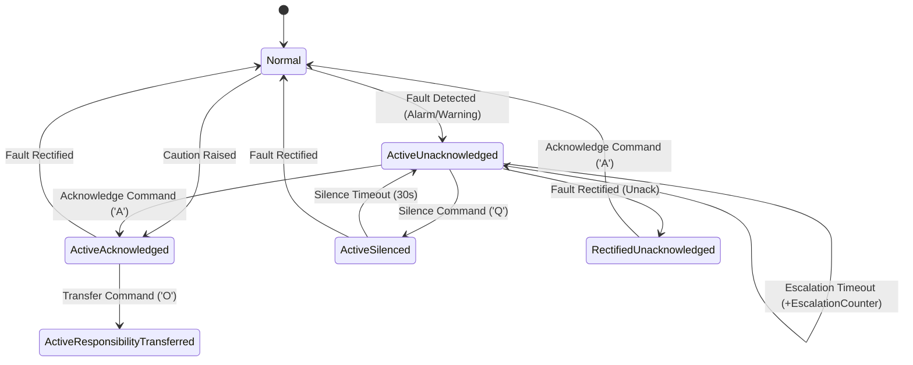
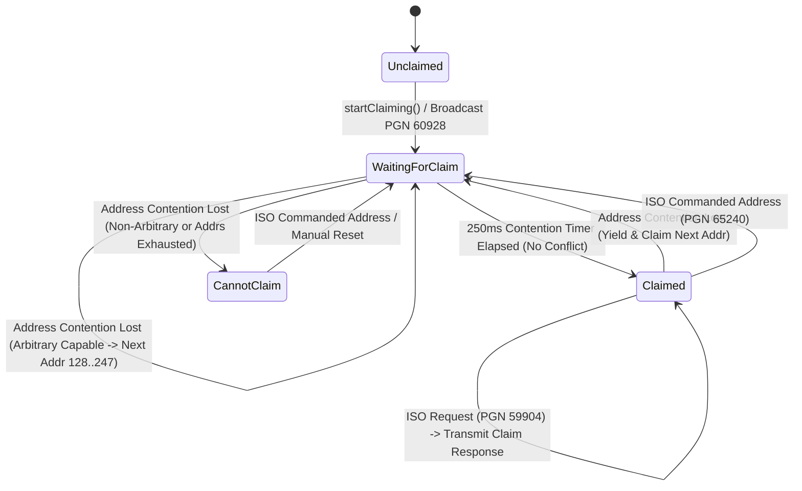
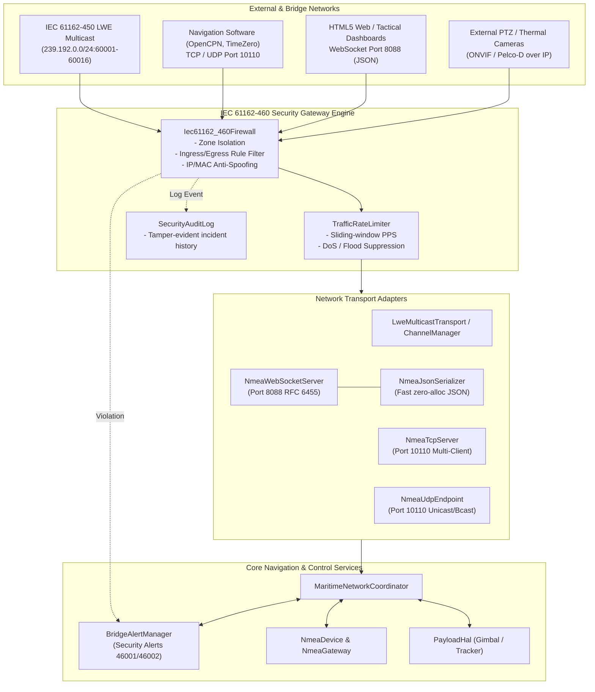
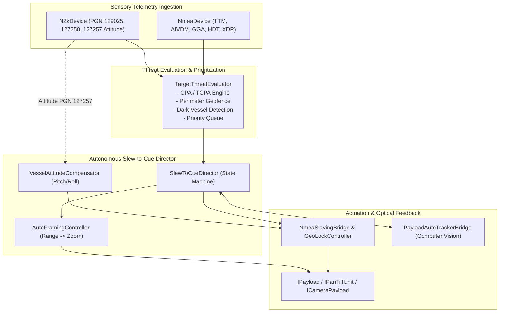
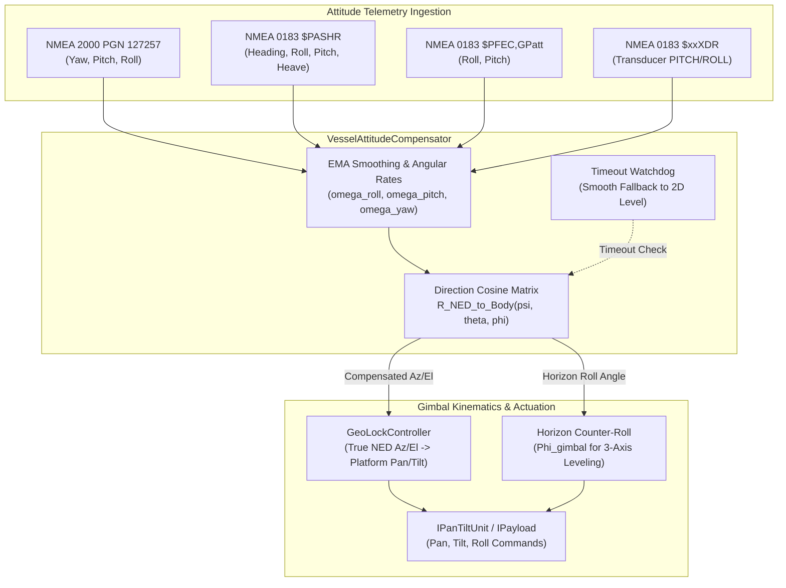
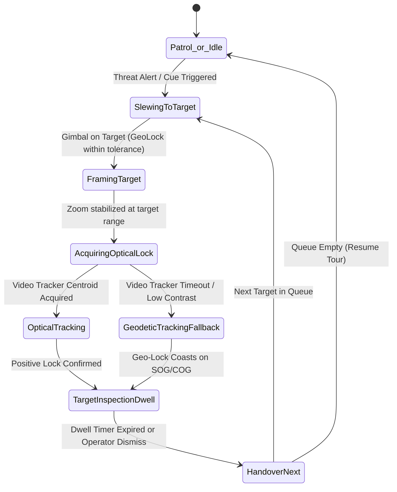
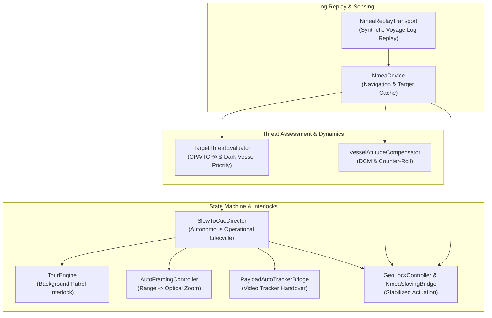

# NMEA Features & Marine PTZ Automation

Here is a breakdown of NMEA features and extensions that can be added to the controller, categorized by how they integrate with the existing modules:

---

### 1. PTZ Slew-to-Cue & Tracking (Camera Automation)
*Building directly on top of [NmeaSentenceParser](../libs/Nmea/NmeaSentenceParser.h), [AisDecoder](../libs/Nmea/AisDecoder.h), and [NmeaSensorArbiter](../libs/Nmea/arbiter/NmeaSensorArbiter.h)*

* **Slew-to-Cue (Radar & AIS to PTZ Tracking)**:
  * Automatically steer the camera to target coordinates from **$xxTTM** (Radar Tracked Target), **$xxTLL** (Target Lat/Lon), or **AIS Class A/B** positions.
  * Calculates the relative azimuth/bearing and elevation angle from own-ship coordinates (GGA/RMC) and heading (HDT/THS) to the target.
* **CPA / TCPA Collision Threat Cueing**:
  * Engine calculating **Closest Point of Approach (CPA)** and **Time to CPA (TCPA)** for all active AIS and Radar targets.
  * Triggers visual PTZ inspection / slewing toward high-risk targets on collision courses.
* **Pitch & Roll Attitude Compensation (Vessel Motion Stabilization)**:
  * Parse pitch, roll, and heave from **$xxXDR** transducers, proprietary sentences (e.g. `$PASHR`, `$PFEC,GPatt`, TSS1), or N2K **PGN 127257 (Attitude)**.
  * Compensates pan/tilt angles in real-time to keep the horizon or target stable in high sea states.

---

### 2. Additional NMEA 0183 & IEC 61162 Sentences (Implemented)
*Implemented in [NmeaSentenceParser](../libs/Nmea/NmeaSentenceParser.h), [NmeaSentenceBuilder](../libs/Nmea/NmeaSentenceBuilder.h), [BridgeAlertManager](../libs/Nmea/bam/BridgeAlertManager.h), [BridgeAlertTypes](../libs/Nmea/bam/BridgeAlertTypes.h), [NmeaDevice](../libs/Nmea/NmeaDevice.h), and [FlirPfecDevice](../libs/Nmea/FlirPfecDevice.h)*

* **Bridge Alert Management (BAM - IEC 62923-1 / IEC 62923-2 / IEC 61162-1)**:
  * **$xxALF** (Alert Sentence): Reports alert priority (`Emergency`, `Alarm`, `Warning`, `Caution`), category (`A`, `B`, `C`), state (`ActiveUnack`, `Silenced`, `ActiveAck`, `Transferred`, `RectifiedUnack`, `Normal`), identifier, instance, revision, and escalation counters.
  * **$xxALC** (Alert Cyclic List): Periodic broadcast of all active alert identifiers, instances, and revision counters.
  * **$xxARC** (Alert Command Request): Ingestion of bridge operator acknowledge (`A`), temporary acoustic silence (`Q`), and responsibility transfer (`O`) requests.
  * **$xxHBT** (Heartbeat Supervision): Periodic supervisor sentence confirming equipment operational integrity and configured heartbeat intervals.
  * **Legacy $xxALR / $xxACK**: Backward-compatibility alarm state generation and acknowledge reception.
  * **BridgeAlertManager Lifecycle Engine**: Thread-safe coordinator managing alert transitions, silence timeouts (reverting to unacknowledged after 30 s), escalation timers, and cyclic broadcasts.

#### BAM State Machine Architecture

##### ASCII State Diagram

```
+-----------------------------------------------------------------------------------+
|                        Bridge Alert Management (BAM) Engine                       |
|                               (IEC 62923 / IEC 61162-1)                           |
+-----------------------------------------------------------------------------------+
                                        |
                            registerAlert(priority, cat)
                                        v
                               +-----------------+
                               |     Normal      |
                               +-----------------+
                                 |             ^
                 Fault Raised /  |             | Ack when Rectified /
                 Alarm Triggered |             | Normal Transition
                                 v             |
                      +-----------------------------+
                      |   Active-Unacknowledged     | <-----------+
                      |        (Visual/Audio)       |             |
                      +-----------------------------+             |
                        |      |             |                    |
             Ack ('A')  |      | Silence('Q')| Fault Cleared      | Silence
                        |      |             |                    | Timeout
                        v      v             v                    | (30s)
            +--------------+  +---------------+  +--------------------------+
            |    Active-   |  |    Active-    |  |       Rectified-         |
            | Acknowledged |  |   Silenced    |  |     Unacknowledged       |
            +--------------+  +---------------+  +--------------------------+
                   |                 |                         |
             Fault |                 +-------------------------+
            Normal |                 |
                   v                 v
            +---------------------------------+
            |             Normal              |
            +---------------------------------+
```

##### Mermaid State Diagram



* **GNSS Constellation & Signal Quality**:
  * **$xxGSA**: Dilution of precision (PDOP, HDOP, VDOP) and up to 12 active satellite PRNs for georeferencing precision gating.
  * **$xxGSV**: Multi-sentence satellite constellation telemetry reporting space vehicle ID, elevation, azimuth, and SNR (dB-Hz) across GPS, GLONASS, Galileo, and BeiDou.
  * **$xxZDA**: High-precision UTC time, date, and local zone offset for camera on-screen display (OSD) and video metadata synchronization.
* **Vessel Speed & Water Depth**:
  * **$xxVBW**: Dual ground and water speed tracking (fore/aft longitudinal and port/starboard transverse speeds). Integrated with [NmeaSensorArbiter](../libs/Nmea/arbiter/NmeaSensorArbiter.h).
  * **$xxVHW**: Water speed (knots and km/h) and heading true/magnetic.
  * **$xxDPT / $xxDBT**: Water depth and transducer keel/waterline offset telemetry.
* **Extended FLIR PFEC Commands**:
  * Digital zoom magnification: `setDigitalZoom` (`1x`, `2x`, `4x`, `8x`).
  * Gyro stabilization toggle: `setStabilization` (`on` / `off`).
  * Color palette selection: `setColorPalette` (`WhiteHot`, `BlackHot`, `Ironbow`, `Rainbow`, `Sepia`).
  * Thermal calibration: `triggerNuc` (Non-Uniformity Correction).

* **Unit Tests & Verification**:
  * [TestBridgeAlertManager.cpp](../libs/Nmea/tests/TestBridgeAlertManager.cpp): Complete BAM alert lifecycle, timeouts, escalations, ARC commands, and cyclic broadcasts.
  * [TestNmeaSentenceParser.cpp](../libs/Nmea/tests/TestNmeaSentenceParser.cpp): Parsing of GSA, GSV, ZDA, VBW, VHW, DPT, DBT, ALF, ALC, ARC, HBT, ALR, ACK.
  * [TestNmeaSentenceBuilder.cpp](../libs/Nmea/tests/TestNmeaSentenceBuilder.cpp): Roundtrip sentence framing and extended PFEC commands.
  * [TestNmeaDevice.cpp](../libs/Nmea/tests/TestNmeaDevice.cpp): Thread-safe callback dispatch and telemetry caching.
  * [TestFlirPfecDevice.cpp](../libs/Nmea/tests/TestFlirPfecDevice.cpp): Optical/thermal digital zoom, gyro stabilization, and palette commands.

---

### 3. NMEA 2000 (N2K) / CAN Network Features
*Expanding [N2kDevice](../libs/Nmea/n2k/N2kDevice.h), [N2kDecoder](../libs/Nmea/n2k/N2kDecoder.h), [N2kEncoder](../libs/Nmea/n2k/N2kEncoder.h), [N2kAddressClaimer](../libs/Nmea/n2k/N2kAddressClaimer.h), and [NmeaGateway](../libs/Nmea/gateway/NmeaGateway.h)*

#### Network Architecture & Address Claiming

##### ASCII Architecture Diagram

```
+---------------------------------------------------------------------------------------------------------+
|                                    NMEA 2000 (CAN Bus) Network Stack                                    |
+---------------------------------------------------------------------------------------------------------+
|                                                                                                         |
|   +--------------------------+                                      +-------------------------------+   |
|   | SocketCAN / Hardware Bus | <-----------------+                  |  Dynamic Address Claimer      |   |
|   | 29-bit CAN Identifier    |                   |                  |  (ISO 11783-5 / SAE J1939-81) |   |
|   +------------+-------------+                   |                  +---------------+---------------+   |
|                | Inbound                         | Outbound Frames                  |                   |
|                v                                 +----------------------------------+                   |
|   +-----------------------------------------------------------------------------+   |                   |
|   |                          N2kDevice CAN Controller                           |   |                   |
|   |  - Fast Packet Multi-Frame Reassembly (N2kFastPacketAssembler)              |   |                   |
|   |  - Dynamic Address Claiming & ISO Request / Commanded Handler               |   |                   |
|   |  - Telemetry Decoding (N2kDecoder) & Cache Storage                          |   |                   |
|   |  - Copy-On-Write Deadlock-Free Callback Dispatching                         |   |                   |
|   +--------------------------------------+--------------------------------------+   |                   |
|                                          |                                              |                   |
|                +-------------------------+-------------------------+                    |                   |
|                |                                                   |                    |                   |
|                v                                                   v                    |                   |
|   +---------------------------+                       +-----------------------------+   |                   |
|   | Telemetry Subscribers     |                       | NmeaGateway Bridging        |   |                   |
|   | - Position Rapid (129025) |                       | - PGN 127245 <-> $xxRSA     |   |                   |
|   | - COG / SOG (129026)      |                       | - PGN 126992 <-> $xxZDA     |   |                   |
|   | - Heading (127250)        |                       | - PGN 127258 <-> $xxHDG     |   |                   |
|   | - Attitude (127257)       |                       | - PGN 127257 <-> $xxXDR     |   |                   |
|   | - Wind (130306)           |                       | - Rate Decimation Limiter   |   |                   |
|   | - Rudder (127245)         |                       +--------------+--------------+   |                   |
|   | - Mag Variation (127258)  |                                      |                  |                   |
|   | - System Time (126992)    |                                      v                  |                   |
|   | - Heartbeat (126993)      |                       +-----------------------------+   |                   |
|   | - PGN List (126464)       |                       | NMEA 0183 Serial / Network  |   |                   |
|   +---------------------------+                       +-----------------------------+   |                   |
+-----------------------------------------------------------------------------------------+
```

##### Mermaid Address Claiming State Machine



* **ISO 11783-5 / SAE J1939-81 Dynamic Address Claiming Engine**:
  * Managed by [N2kAddressClaimer](../libs/Nmea/n2k/N2kAddressClaimer.h).
  * **64-bit NAME Field Bit-Packing**: Encodes Unique Identity (bits 0..20), Manufacturer Code (bits 21..31), ECU Instance (bits 32..34), Function Instance (bits 35..39), Function (bits 40..47), Vehicle System (bits 49..55), Industry Group (bits 60..62 = 4 for Marine), and Arbitrary Address Capable flag (bit 63).
  * **Contention Arbitration**: Resolves address collisions according to ISO 11783-5 rules where lower numeric 64-bit NAME takes priority. If an inbound claim arrives for the same address with higher numerical priority (lower NAME), the node yields and claims the next available candidate in the 128..247 range. If lower priority, the node re-asserts its claim.
  * **Contention Window Timer**: Non-blocking `pollTimer` enforces the standard 250ms dispute silence period before transitioning to the `Claimed` operational state.
  * **ISO Protocol Support**: Inbound ISO Request (PGN 59904) for PGN 60928 immediately triggers address claim transmission; ISO Commanded Address (PGN 65240) reassigns the node's CAN address.

* **Marine Telemetry PGN Decoders & Encoders**:
  * Implemented in [N2kDecoder](../libs/Nmea/n2k/N2kDecoder.h) and [N2kEncoder](../libs/Nmea/n2k/N2kEncoder.h).
  * **PGN 127245 (Rudder)**: Decodes and encodes rudder instance, direction order (`MoveToPort`, `MoveToStarboard`), physical rudder position angle, and commanded angle order.
  * **PGN 127258 (Magnetic Variation)**: Decodes and encodes magnetic variation angle, model calculation source (WMM/Calculation/Chart/Manual), and age of service in days.
  * **PGN 126992 (System Time)**: Decodes and encodes time source (GPS/GLONASS), calendar date (days since 1970-01-01), and high-resolution time of day (seconds since midnight with 100 µs resolution).
  * **PGN 126993 (Heartbeat)**: Decodes and encodes cyclic transmit interval (ms), 8-bit rolling sequence counter, controller state, and equipment operational status.
  * **PGN 126464 (Transmit / Receive PGN List)**: Decodes and encodes Fast Packet transmission groups containing the complete list of 24-bit PGNs supported for transmission or reception.
  * **PGN 127257 (Attitude)**: Pitch, roll, and yaw telemetry with 0.0001 radian resolution for gimbal stabilization.

* **N2kDevice Telemetry Cache & Dispatching**:
  * Managed by [N2kDevice](../libs/Nmea/n2k/N2kDevice.h).
  * Integrated [N2kAddressClaimer](../libs/Nmea/n2k/N2kAddressClaimer.h) instance for autonomous CAN bus arbitration.
  * Copy-on-write subscription callbacks and thread-safe telemetry caching for `position()`, `cogSog()`, `heading()`, `attitude()`, `wind()`, `rudder()`, `magneticVariation()`, `systemTime()`, and `heartbeat()`.

* **Bidirectional NMEA 0183 $\leftrightarrow$ N2K Gateway Integration**:
  * Handled by [NmeaGateway](../libs/Nmea/gateway/NmeaGateway.h).
  * **Rudder Sensor Angle**: Translates PGN 127245 (Rudder) $\longleftrightarrow$ `$xxRSA` sentences.
  * **System Time & Date**: Translates PGN 126992 (System Time) $\longleftrightarrow$ `$xxZDA` sentences with civil calendar conversion.
  * **Magnetic Variation**: Translates PGN 127258 (Magnetic Variation) $\longleftrightarrow$ `$xxHDG` / `$xxRMC` variation fields.
  * **Attitude**: Translates PGN 127257 (Attitude) $\longleftrightarrow$ `$xxXDR` transducer pitch and roll measurements.
  * Configurable sliding-window rate decimation preventing buffer overrun on legacy 4800/38400 baud serial connections.

* **Unit Tests & Verification**:
  * [TestN2kAddressClaimer.cpp](../libs/Nmea/tests/TestN2kAddressClaimer.cpp): 64-bit NAME composition, normal claim sequence, 250ms contention timing, contention arbitration win/loss, ISO Request handling, and ISO Commanded Address reassignment.
  * [TestN2kDecoder.cpp](../libs/Nmea/tests/TestN2kDecoder.cpp): Fast Packet reassembly and roundtrip parsing/encoding of PGN 129025, 129026, 127250, 127257, 130306, 129038, 127245, 127258, 126992, 126993, and 126464.
  * [TestN2kDevice.cpp](../libs/Nmea/tests/TestN2kDevice.cpp): Thread-safe callback dispatch, address claimer integration, telemetry caching, and target pruning.
  * [TestNmeaGateway.cpp](../libs/Nmea/tests/TestNmeaGateway.cpp): Bidirectional translation between N2K PGNs and NMEA 0183 sentences (`RSA`, `ZDA`, `HDG`, `XDR`, `GGA`, `RMC`, `HDT`, `MWV`) and rate decimation throttling.


---

### 4. IEC 61162-460 & Network Transport
*Expanding [LweMulticastTransport](../libs/Nmea/lwe/LweMulticastTransport.h), [LweChannelManager](../libs/Nmea/lwe/LweChannelManager.h), and [NmeaGateway](../libs/Nmea/gateway/NmeaGateway.h)*

#### Network & Security Architecture

##### ASCII Architecture Diagram

```
+---------------------------------------------------------------------------------------------------------+
|                                     Maritime Network Architecture                                       |
+---------------------------------------------------------------------------------------------------------+
|                                                                                                         |
|   +-----------------------+   +------------------------+   +---------------------+   +--------------+   |
|   | IEC 61162-450 LWE Bus |   |  OpenCPN / TimeZero    |   | HTML5 Web Dashboard |   | External PTZ |   |
|   | 239.192.0.0/24 (UDP)  |   | TCP / UDP Port 10110   |   | WebSocket Port 8088 |   | IP Cameras   |   |
|   +-----------+-----------+   +-----------+------------+   +----------+----------+   +-------+------+   |
|               |                           |                           |                      |          |
|               v                           v                           v                      v          |
|   +-------------------------------------------------------------------------------------------------+   |
|   |                     IEC 61162-460 Security Gateway (Iec61162_460Firewall)                       |   |
|   |  - Interface Zone Isolation (BridgeNetwork, ExternalCamera, GeneralShipLan)                     |   |
|   |  - Source IP & MAC Address Verification / Anti-Spoofing Tables                                  |   |
|   |  - Transmission Group & Sentence Type Ingress/Egress Whitelist                                  |   |
|   |  - Sliding-Window Rate Limiting & DoS / Packet Storm Suppression                                 |   |
|   |  - Security Violation Event Logger & Audit Trail                                                |   |
|   +---------------------------------------+---------------------------------------------------------+   |
|                                           |                                                             |
|                       Security Violations | (Alert ID 46001 / 46002)                                    |
|                                           v                                                             |
|                          +--------------------------------+                                             |
|                          |    Bridge Alert Management     |                                             |
|                          |   (IEC 62923 / IEC 61162-1)    |                                             |
|                          +----------------+---------------+                                             |
|                                           ^                                                             |
|                                           |                                                             |
|   +---------------------------------------v---------------------------------------------------------+   |
|   |                         MaritimeNetworkCoordinator                                              |   |
|   |  +------------------------+  +------------------------+  +------------------------------------+ |   |
|   |  |     NmeaTcpServer      |  |    NmeaUdpEndpoint     |  |        NmeaWebSocketServer         | |   |
|   |  | - Port 10110 multi-cli |  | - Port 10110 bcast/uni |  | - RFC 6455 framing & handshake     | |   |
|   |  | - Async broadcast      |  | - Direct ITransport    |  | - Real-time JSON telemetry stream  | |   |
|   |  +-----------+------------+  +-----------+------------+  +-----------------+------------------+ |   |
|   +--------------|---------------------------|---------------------------------|--------------------+   |
|                  |                           |                                 |                        |
|                  +---------------------------v---------------------------------+                        |
|                                              |                                                          |
|                                              v                                                          |
|                       +-----------------------------------------------+                                 |
|                       |            NmeaDevice & NmeaGateway           |                                 |
|                       |  - Sentence Parsing & Validation              |                                 |
|                       |  - N2K Fast-Packet Translation                |                                 |
|                       |  - Telemetry Caching & Arbitration            |                                 |
|                       +----------------------+------------------------+                                 |
|                                              |                                                          |
|                                              v                                                          |
|                       +-----------------------------------------------+                                 |
|                       |       PayloadHal (Gimbal / Camera / Tracker)  |                                 |
|                       +-----------------------------------------------+                                 |
+---------------------------------------------------------------------------------------------------------+
```

##### Mermaid Architecture Diagram



* **IEC 61162-460 Secure Marine Gateway Compliance**:
  * [Iec61162_460Firewall.h](../libs/Nmea/network/Iec61162_460Firewall.h) / [Iec61162_460Firewall.cpp](../libs/Nmea/network/Iec61162_460Firewall.cpp):
    * Network zone isolation (`BridgeNetwork`, `ExternalCamera`, `GeneralShipLan`, `InternetShore`).
    * Source IP CIDR subnet filtering and MAC address anti-spoofing binding table.
    * Ingress sentence formatter whitelist (e.g. restrict camera zone to `XDR`, `HDT` while blocking navigation injections).
    * Outbound egress leak prevention (blocks sensitive Bridge Alert Management `$xxALF` or proprietary camera control sentences from leaking to public networks).
    * Sliding-window traffic rate limiter per source IP to prevent packet storms and denial-of-service.
    * Anomaly reporting directly into [BridgeAlertManager](../libs/Nmea/bam/BridgeAlertManager.h) generating IEC 62923 Warning alerts:
      * Alert ID `46001`: Security Policy Violation.
      * Alert ID `46002`: Bridge Network Flood Detected.

* **NMEA 0183 TCP/UDP Server / Client**:
  * [NmeaTcpServer.h](../libs/Nmea/network/NmeaTcpServer.h) / [NmeaTcpServer.cpp](../libs/Nmea/network/NmeaTcpServer.cpp):
    * Multi-client TCP broadcast server listening on marine standard port `10110`.
    * Non-blocking client polling, async sentence broadcast to all connected chartplotters (OpenCPN, TimeZero), and bidirectional sentence ingestion.
  * [NmeaUdpEndpoint.h](../libs/Nmea/network/NmeaUdpEndpoint.h) / [NmeaUdpEndpoint.cpp](../libs/Nmea/network/NmeaUdpEndpoint.cpp):
    * Unicast and subnet broadcast transceiver on port `10110`.
    * Implements `Transport::ITransport` for direct integration with `NmeaDevice`.

* **WebSocket / JSON Telemetry Stream**:
  * [NmeaWebSocketServer.h](../libs/Nmea/network/NmeaWebSocketServer.h) / [NmeaWebSocketServer.cpp](../libs/Nmea/network/NmeaWebSocketServer.cpp):
    * Standalone, pure C++17 RFC 6455 compliant WebSocket server (default port `8088`).
    * Self-contained RFC 3174 SHA-1 ([Sha1.h](../libs/Nmea/network/Sha1.h)) and RFC 4648 Base64 ([Base64.h](../libs/Nmea/network/Base64.h)) HTTP Upgrade handshake with zero external crypto dependencies.
    * Text frame broadcast, payload unmasking, and ping/pong keepalives.
  * [NmeaJsonSerializer.h](../libs/Nmea/network/NmeaJsonSerializer.h) / [NmeaJsonSerializer.cpp](../libs/Nmea/network/NmeaJsonSerializer.cpp):
    * Fast, zero-allocation JSON serialization for:
      * Vessel navigation state (lat, lon, SOG, COG, heading, pitch, roll, depth).
      * PTZ camera gimbal state (pan, tilt, zoom, HFOV, track status, target ID).
      * Radar and AIS targets (ID, bearing, range, CPA, TCPA, threat level).
      * BAM alerts (alert ID, priority, category, state, text).
    * Inbound JSON command parser (`slewToCue`, `ptzMove`).

* **Maritime Network Coordinator**:
  * [MaritimeNetworkCoordinator.h](../libs/Nmea/network/MaritimeNetworkCoordinator.h) / [MaritimeNetworkCoordinator.cpp](../libs/Nmea/network/MaritimeNetworkCoordinator.cpp):
    * Central coordinator orchestrating firewall security policies, TCP broadcast, UDP endpoints, and WebSocket telemetry dispatch.

* **Unit Tests & Verification**:
  * [TestNetworkCrypto.cpp](../libs/Nmea/tests/TestNetworkCrypto.cpp): Base64 roundtrip, RFC 3174 SHA-1 vectors, and RFC 6455 WebSocket accept token verification.
  * [TestIec61162_460Firewall.cpp](../libs/Nmea/tests/TestIec61162_460Firewall.cpp): MAC anti-spoofing, zone formatter whitelist, PPS flood detection, and BAM alert triggers.
  * [TestNmeaTcpServer.cpp](../libs/Nmea/tests/TestNmeaTcpServer.cpp): Multi-client connection lifecycle, sentence broadcast, and client command ingestion.
  * [TestNmeaUdpEndpoint.cpp](../libs/Nmea/tests/TestNmeaUdpEndpoint.cpp): Bidirectional UDP loopback communication.
  * [TestNmeaJsonSerializer.cpp](../libs/Nmea/tests/TestNmeaJsonSerializer.cpp): Vessel, gimbal, target, alert JSON serialization, and slew command parsing.
  * [TestNmeaWebSocketServer.cpp](../libs/Nmea/tests/TestNmeaWebSocketServer.cpp): RFC 6455 handshake, JSON frame broadcasting, and masked frame reception.
  * [TestMaritimeNetworkCoordinator.cpp](../libs/Nmea/tests/TestMaritimeNetworkCoordinator.cpp): End-to-end integration, routing, and multi-transport coordination.

---

# Implementation Plan: PTZ Slew-to-Cue & Tracking Automation

This plan outlines the architecture, mathematical models, state machines, and implementation phases to turn the existing navigation slaving components ([NmeaDevice](../libs/Nmea/NmeaDevice.h), [NmeaSlavingBridge](../libs/PayloadHal/NmeaSlavingBridge.h), [GeoLockController](../libs/PayloadHal/GeoLockController.h), and [PayloadAutoTrackerBridge](../libs/PayloadHal/PayloadAutoTrackerBridge.h)) into a fully autonomous **Slew-to-Cue, Threat Assessment, and Optical Tracking System**.

---

## 1. Architectural Overview & Component Hierarchy

The goal is to automatically steer the camera to high-priority marine targets, calculate optimal optical zoom, hand off line-of-sight to the video tracker, and return to patrol once inspection is complete.



---

## 2. Key Modules to Implement

### Module A: `TargetThreatEvaluator` (CPA/TCPA & Priority Queue)
*Location: [TargetThreatEvaluator.h](../libs/PayloadHal/TargetThreatEvaluator.h) / [TargetThreatEvaluator.cpp](../libs/PayloadHal/TargetThreatEvaluator.cpp)*

Computes real-time threat scores and maintains a prioritized target queue.
* **CPA & TCPA Calculation**:
  Given own-ship position $\mathbf{P}_0$, velocity $\mathbf{V}_0$ and target position $\mathbf{P}_t$, velocity $\mathbf{V}_t$:
  $$\Delta \mathbf{P} = \mathbf{P}_t - \mathbf{P}_0, \quad \Delta \mathbf{V} = \mathbf{V}_t - \mathbf{V}_0$$
  $$t_{\text{CPA}} = -\frac{\Delta \mathbf{P} \cdot \Delta \mathbf{V}}{\|\Delta \mathbf{V}\|^2}, \quad d_{\text{CPA}} = \|\Delta \mathbf{P} + \Delta \mathbf{V} \cdot t_{\text{CPA}}\|$$
* **Threat Scoring Function**:
  $$S = w_{\text{cpa}} \cdot f(d_{\text{CPA}}) + w_{\text{tcpa}} \cdot g(t_{\text{CPA}}) + w_{\text{range}} \cdot h(\text{Range}) + w_{\text{dark}} \cdot B_{\text{dark}} + w_{\text{sart}} \cdot B_{\text{emergency}}$$
  * **$B_{\text{dark}}$**: High bonus score if an ARPA radar target has no matching AIS broadcast within spatial/velocity tolerance (potential unidentified / dark vessel).
  * **$B_{\text{emergency}}$**: Instant maximum override for AIS-SART, MOB, or EPIRB.
* **Geofence Alarm Zones**:
  * *Warning Zone* (e.g., 2 NM perimeter): Target placed in cue queue.
  * *Exclusion / Security Zone* (e.g., 500 m perimeter): Immediate slew pre-emption.

### Module B: `AutoFramingController` (Range-Adaptive Optical Zoom)
*Location: [AutoFramingController.h](../libs/PayloadHal/AutoFramingController.h) / [AutoFramingController.cpp](../libs/PayloadHal/AutoFramingController.cpp)*

Computes required camera optical magnification and sensor Field of View (HFOV) so the target subtends a configurable fraction of the video frame (e.g. 25%–35% of frame width).
* **Optics Math**:
  $$\text{HFOV}_{\text{desired}} = 2 \cdot \arctan\left(\frac{L_{\text{target}}}{2 \cdot R_{\text{slant}} \cdot F_{\text{target\_ratio}}}\right)$$
  Where $L_{\text{target}}$ is target length (from AIS static data or default 15m), $R_{\text{slant}}$ is range from [GeoreferenceUtils](../libs/PayloadHal/GeoreferenceUtils.h), and $F_{\text{target\_ratio}}$ is the desired on-screen occupancy ratio.
* Translates desired HFOV into camera continuous zoom or discrete optical magnification steps via [ICameraPayload](../libs/PayloadHal/ICameraPayload.h).

### Module C: `VesselAttitudeCompensator` (Wave Motion / Pitch & Roll Stabilization)
*Location: [VesselAttitudeCompensator.h](../libs/PayloadHal/VesselAttitudeCompensator.h) / [VesselAttitudeCompensator.cpp](../libs/PayloadHal/VesselAttitudeCompensator.cpp)*

* Ingests high-frequency attitude data:
  * NMEA 0183: `$xxXDR` (transducers: pitch/roll), `$PASHR` (inertial attitude: pitch, roll, heading, heave), `$PFEC,GPatt` (Furuno/FLIR attitude).
  * NMEA 2000: **PGN 127257** (Attitude: Yaw, Pitch, Roll at 10–20 Hz).
* Projects the gimbal line-of-sight vector from NED (North-East-Down) frame through the platform's time-varying body rotation matrix $\mathbf{R}_{\text{NED} \to \text{Body}}(\psi, \theta, \phi)$ so wave motion does not induce camera horizon tilt or point-of-interest drift.
* Computes active 3-axis horizon counter-roll angle to level the camera sensor on compliant PTUs.

### Dynamic Attitude Transformation Pipeline

#### ASCII Diagram

```
  +-------------------------------------------------------------------+
  |                  Attitude Telemetry Streams                       |
  |  - NMEA 2000 PGN 127257 (Attitude: Yaw, Pitch, Roll)              |
  |  - NMEA 0183 $PASHR (Heading, Roll, Pitch, Heave)                 |
  |  - NMEA 0183 $PFEC,GPatt (Roll, Pitch)                            |
  |  - NMEA 0183 $xxXDR (Transducer: PITCH, ROLL)                     |
  +---------------------------------+---------------------------------+
                                    |
                                    v
  +---------------------------------+---------------------------------+
  |                  VesselAttitudeCompensator                        |
  |  - Exponential Moving Average (EMA) rate calculation              |
  |  - Direction Cosine Matrix (DCM): R_NED_to_Body(yaw, pitch, roll) |
  |  - Heartbeat / Timeout watchdog (fall back to 2D level model)     |
  +-----------------+-------------------------------+-----------------+
                    |                               |
          Line-of-Sight Az/El               Counter-Roll
                    v                               v
  +-----------------+---------------+ +-------------+-----------------+
  |        GeoLockController        | |       Horizon Leveling        |
  |  Compensates Pan & Tilt to      | |  Computes PTU Roll angle to   |
  |  counter vessel pitch & roll    | |  keep horizon horizontal      |
  +-----------------+---------------+ +-------------+-----------------+
                    |                               |
                    +---------------+---------------+
                                    |
                                    v
                    +---------------+---------------+
                    |  IPanTiltUnit (2-Axis/3-Axis) |
                    +-------------------------------+
```

#### Mermaid Diagram



### Module D: `SlewToCueDirector` (Automated Workflow State Machine)
*Location: [SlewToCueDirector.h](../libs/PayloadHal/SlewToCueDirector.h) / [SlewToCueDirector.cpp](../libs/PayloadHal/SlewToCueDirector.cpp)*

Coordinates the complete operational lifecycle:



---

## 3. Step-by-Step Implementation Phases

### Phase 1: Threat Assessment & Prioritization
* **Files**:
  * New: [TargetThreatEvaluator.h](../libs/PayloadHal/TargetThreatEvaluator.h) & [TargetThreatEvaluator.cpp](../libs/PayloadHal/TargetThreatEvaluator.cpp)
  * New: [TestTargetThreatEvaluator.cpp](../libs/PayloadHal/tests/TestTargetThreatEvaluator.cpp)
* **Tasks**:
  1. Implement CPA & TCPA 2D/3D vector calculations with unit tests.
  2. Implement radar-to-AIS target correlation (associating TTM track numbers with AIS MMSIs based on spatial proximity $\le 150\,\text{m}$ and velocity difference $\le 2\,\text{knots}$).
  3. Implement configurable threat scoring matrix and priority queue.

### Phase 2: Range-Adaptive Framing & Zoom Scheduling (Completed)
* **Files**:
  * [AutoFramingController.h](../libs/PayloadHal/AutoFramingController.h) & [AutoFramingController.cpp](../libs/PayloadHal/AutoFramingController.cpp)
  * [SlewToCueDirector.h](../libs/PayloadHal/SlewToCueDirector.h) & [SlewToCueDirector.cpp](../libs/PayloadHal/SlewToCueDirector.cpp)
  * [TestAutoFramingController.cpp](../libs/PayloadHal/tests/TestAutoFramingController.cpp) & [TestSlewToCueDirector.cpp](../libs/PayloadHal/tests/TestSlewToCueDirector.cpp)
* **Tasks Completed**:
  1. Implemented aspect-aware apparent target geometry ($W_{\text{apparent}} = L \cdot |\sin\alpha| + B \cdot |\cos\alpha|$) and height-constrained HFOV framing.
  2. Implemented optical lens curve models (Logarithmic Focal Length and Linear HFOV) mapping FOV to normalized zoom coordinate $[0.0 .. 1.0]$.
  3. Implemented AIS ship type envelope estimation (Cargo, Tanker, Fishing, Tug, High Speed Craft, Passenger, SAR/Pilot).
  4. Implemented rate-limited zoom velocity profiler, range/zoom deadband hysteresis filtering, and one-push autofocus trigger on convergence.
  5. Integrated asynchronous zoom convergence monitoring into [SlewToCueDirector](../libs/PayloadHal/SlewToCueDirector.h) ensuring line-of-sight stabilization before video tracker handover.

### Phase 3: Slew-to-Cue Director & Optical Tracker Handover (Completed)
* **Files**:
  * [SlewToCueDirector.h](../libs/PayloadHal/SlewToCueDirector.h) & [SlewToCueDirector.cpp](../libs/PayloadHal/SlewToCueDirector.cpp)
  * Updates: [NmeaSlavingBridge.h](../libs/PayloadHal/NmeaSlavingBridge.h) & [NmeaSlavingBridge.cpp](../libs/PayloadHal/NmeaSlavingBridge.cpp) (boresight lock tolerance, lock query, and `TargetLockCallback` notifications)
  * Updates: [TargetThreatEvaluator.h](../libs/PayloadHal/TargetThreatEvaluator.h) & [TargetThreatEvaluator.cpp](../libs/PayloadHal/TargetThreatEvaluator.cpp) (target inspection cooldown management, `InspectedTargetRecord`, `getNextUninspectedCandidate`)
  * Tests: [TestSlewToCueDirector.cpp](../libs/PayloadHal/tests/TestSlewToCueDirector.cpp), [TestNmeaSlavingBridge.cpp](../libs/PayloadHal/tests/TestNmeaSlavingBridge.cpp), [TestTargetThreatEvaluator.cpp](../libs/PayloadHal/tests/TestTargetThreatEvaluator.cpp)
* **Delivered Capabilities**:
  1. Implemented the complete autonomous lifecycle state machine (`SlewToCueDirector`), covering `Idle`, `SlewingToTarget`, `FramingTarget`, `AcquiringOpticalLock`, `OpticalTracking`, `GeodeticTrackingFallback`, `DwellInspection`, and `TargetCompleted`.
  2. Integrated boresight lock detection with configurable angular tolerance (`setLockToleranceDeg`) and state change callbacks in `NmeaSlavingBridge`.
  3. Integrated target dwell cooldown tracking (`markTargetInspected`, `isTargetInCooldown`, `cleanupExpiredCooldowns`, `getNextUninspectedCandidate`) in `TargetThreatEvaluator` to prevent inspection loops.
  4. Wired background patrol interlock with [TourEngine](../libs/PayloadHal/TourEngine.h): active patrols automatically pause on target cueing and resume once the candidate queue is exhausted.
  5. Implemented geodetic fallback resilience: if visual lock fails or drops during dwell, the director seamlessly transitions to geodetic coasting on SOG/COG without aborting inspection.
  6. Added manual inspection controls (`extendDwell`, `pause`, `resume`, `dismissActiveTarget`).

### Phase 4: Dynamic Attitude Stabilization Integration (Completed)
* **Files**:
  * [NmeaTypes.h](../libs/Nmea/NmeaTypes.h) (added `PashrData`, `PfecAttitudeData`, `AttitudeData`, `NmeaSentenceId::PASHR`)
  * [NmeaSentenceParser.h](../libs/Nmea/NmeaSentenceParser.h) & [NmeaSentenceParser.cpp](../libs/Nmea/NmeaSentenceParser.cpp) (implemented `parsePashr`, `parsePfecAtt`)
  * [NmeaDevice.h](../libs/Nmea/NmeaDevice.h) & [NmeaDevice.cpp](../libs/Nmea/NmeaDevice.cpp) (attitude callbacks, XDR pitch/roll transducer parsing, multi-protocol dispatch)
  * [VesselAttitudeCompensator.h](../libs/PayloadHal/VesselAttitudeCompensator.h) & [VesselAttitudeCompensator.cpp](../libs/PayloadHal/VesselAttitudeCompensator.cpp) (new dynamic attitude compensator)
  * [GeoLockController.h](../libs/PayloadHal/GeoLockController.h) & [GeoLockController.cpp](../libs/PayloadHal/GeoLockController.cpp) (wave-stabilized kinematics & active horizon counter-roll)
  * [NmeaSlavingBridge.h](../libs/PayloadHal/NmeaSlavingBridge.h) & [NmeaSlavingBridge.cpp](../libs/PayloadHal/NmeaSlavingBridge.cpp) (attitude compensator binding and real-time attitude forwarding)
  * Tests: [TestNmeaSentenceParser.cpp](../libs/Nmea/tests/TestNmeaSentenceParser.cpp), [TestNmeaDevice.cpp](../libs/Nmea/tests/TestNmeaDevice.cpp), [TestVesselAttitudeCompensator.cpp](../libs/PayloadHal/tests/TestVesselAttitudeCompensator.cpp)
* **Delivered Capabilities**:
  1. Multi-protocol attitude telemetry ingestion covering NMEA 2000 PGN 127257 (Attitude), NMEA 0183 `$PASHR` (inertial), Furuno/FLIR `$PFEC,GPatt`, and standard `$xxXDR` transducers.
  2. Complete 3D line-of-sight stabilization using Direction Cosine Matrix ($\mathbf{R}_{\text{NED} \to \text{Body}}$) transformation, converting geodetic target bearing and elevation into platform-relative pan/tilt angles that counteract instantaneous vessel pitch and roll in high sea states.
  3. Active 3-axis horizon counter-roll calculation ($\Phi_{\text{gimbal}} = -\phi_{\text{vessel}} \cdot \cos(\text{pan}) + \theta_{\text{vessel}} \cdot \sin(\text{pan})$) with automated PTU actuation for gimbals equipped with an active roll axis.
  4. Real-time rate estimation ($\omega_{\text{roll}}, \omega_{\text{pitch}}, \omega_{\text{yaw}}$) with configurable Exponential Moving Average (EMA) smoothing for predictive look-ahead and damping.
  5. Timeout expiration and degradation management: automatically falls back to a 2D level deck model when telemetry drops, ensuring continuous, glitch-free tracking.

### Phase 5: Verification & End-to-End Simulation (Completed)
* **Files**:
  * [TestMarineSlewToCueSimulation.cpp](../libs/PayloadHal/tests/TestMarineSlewToCueSimulation.cpp)
* **Delivered Capabilities**:
  1. Validated CPA / TCPA mathematical edge cases (reciprocal parallel tracks, identical parallel velocities with $\Delta \mathbf{V} = 0$, overtaking scenarios, past CPA divergence, stationary targets, stationary own-ship, and 55+ knot high-speed intercepts) without division by zero or NaN singularities.
  2. Multi-sensor radar-to-AIS target fusion correlation and dark vessel heuristics (elevating unidentified radar contacts without AIS transponders to Priority #1).
  3. Full-stack voyage log replay simulation using [NmeaReplayTransport](../libs/Nmea/replay/NmeaReplayTransport.h): demonstrated autonomous preemption of [TourEngine](../libs/PayloadHal/TourEngine.h) cyclical patrol, boresight slew lock, range-adaptive framing, optical handover, dwell inspection, target cooldown recording, and automatic resumption of background patrol.
  4. Real-time dynamic attitude stabilization and 3-axis horizon counter-roll under combined heavy sea state wave motion ($\pm 10^\circ$ roll, $\pm 5^\circ$ pitch) and graceful timeout watchdog degradation.
  5. Emergency distress beacon immediate preemption (AIS-SART / MOB interrupting active inspection dwell to pivot to distress coordinates).
  6. Optical tracker loss-of-lock fault tolerance with seamless fallback to geodetic SOG/COG coasting without mission interruption.

#### Simulation Verification Pipeline

##### ASCII Diagram

```
  +-------------------------------------------------------------------------+
  |                          NmeaReplayTransport                            |
  |  - Ingests synchronized synthetic logs (GGA, RMC, HDT, PASHR, TTM)      |
  +------------------------------------+------------------------------------+
                                       |
                                       v
  +------------------------------------+------------------------------------+
  |                             NmeaDevice                                  |
  |  - Real-time telemetry parsing, target caching, & dispatch              |
  +-----------------+------------------+------------------+-----------------+
                    |                  |                  |
                    v                  v                  v
  +-----------------+----+ +-----------+----------+ +-----+-----------------+
  | TargetThreatEvaluator| |VesselAttitudeCompens.| |  GeoLockController    |
  | - CPA/TCPA & Fusion  | | - DCM Stabilization  | |  - Boresight Slaving  |
  | - Dark Vessel Heurist| | - Horizon Counter-Rol| |  - Roll Leveling      |
  +-----------------+----+ +-----------+----------+ +-----+-----------------+
                    |                  |                  |
                    +------------------+------------------+
                                       |
                                       v
  +------------------------------------+------------------------------------+
  |                        SlewToCueDirector                                |
  |  - Tour Preemption -> Slewing -> Framing -> Handover -> Dwell -> Resume |
  +-----------------+-------------------------------------+-----------------+
                    |                                     |
                    v                                     v
  +-----------------+------------------+ +----------------+-----------------+
  |      AutoFramingController         | |    PayloadAutoTrackerBridge      |
  |  - Range-adaptive optical zoom     | |  - Centroid acquisition & lock   |
  +------------------------------------+ +----------------------------------+
```

##### Mermaid Diagram



---

## 4. Verification & Testing Strategy
* **Strict C++17 Compliance**: Adhere to `cpp-verification` guidelines (no raw heap leaks, `std::string_view` where zero-copy is possible, thread-safety using copy-on-write callbacks or granular locks).
* **Comprehensive Doxygen**: Document classes, state transitions, units (degrees, knots, meters), and thread-safety models via `doxygen-docs`.
* **TDD & Regression Prevention**: Create GoogleTest fixtures validating mathematical precision (using `EXPECT_NEAR` within geometric tolerances) before and after each phase.