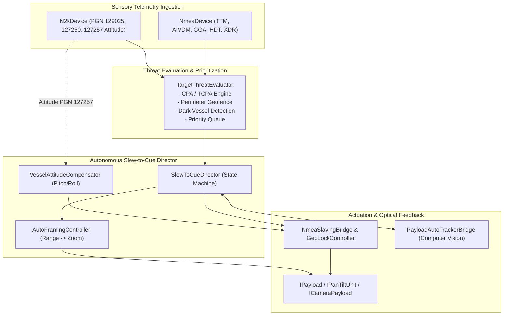
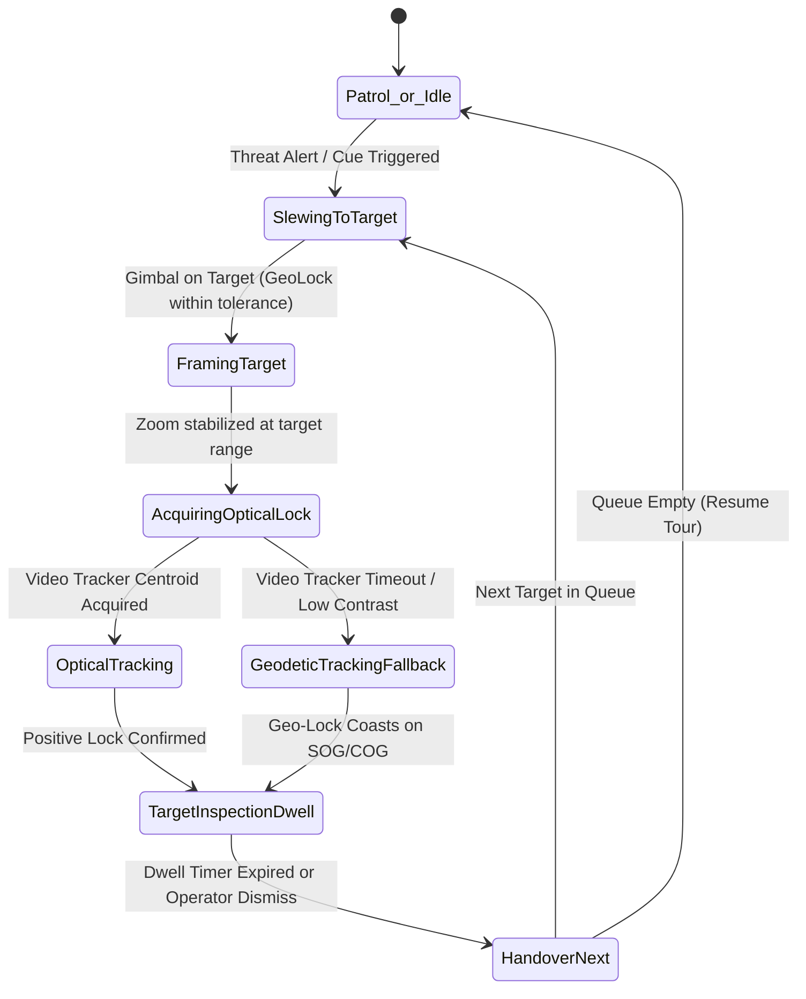

# NMEA Features & Marine PTZ Automation

Here is a breakdown of NMEA features and extensions that can be added to the controller, categorized by how they integrate with the existing modules:

---

### 1. PTZ Slew-to-Cue & Tracking (Camera Automation)
*Building directly on top of [NmeaSentenceParser](../libs/Nmea/NmeaSentenceParser.h), [AisDecoder](../libs/Nmea/AisDecoder.h), and [NmeaSensorArbiter](../libs/Nmea/arbiter/NmeaSensorArbiter.h)*

* **Slew-to-Cue (Radar & AIS to PTZ Tracking)**:
  * Automatically steer the camera to target coordinates from **$xxTTM** (Radar Tracked Target), **$xxTLL** (Target Lat/Lon), or **AIS Class A/B** positions.
  * Calculates the relative azimuth/bearing and elevation angle from own-ship coordinates (GGA/RMC) and heading (HDT/THS) to the target.
* **CPA / TCPA Collision Threat Cueing**:
  * Engine calculating **Closest Point of Approach (CPA)** and **Time to CPA (TCPA)** for all active AIS and Radar targets.
  * Triggers visual PTZ inspection / slewing toward high-risk targets on collision courses.
* **Pitch & Roll Attitude Compensation (Vessel Motion Stabilization)**:
  * Parse pitch, roll, and heave from **$xxXDR** transducers, proprietary sentences (e.g. `$PASHR`, `$PFEC,GPatt`, TSS1), or N2K **PGN 127257 (Attitude)**.
  * Compensates pan/tilt angles in real-time to keep the horizon or target stable in high sea states.

---

### 2. Additional NMEA 0183 & IEC 61162 Sentences
*Expanding [NmeaSentenceParser](../libs/Nmea/NmeaSentenceParser.h) and [NmeaSentenceBuilder](../libs/Nmea/NmeaSentenceBuilder.h)*

* **Bridge Alert Management (BAM - IEC 62923 / IEC 61162-1)**:
  * **$xxALF** (Alert Sentence), **$xxALC** (Alert Circular), **$xxARC** (Alert Command), **$xxHBT** (Heartbeat supervision), and legacy **$xxALR / $xxACK**.
  * Allows the PTZ controller to participate in integrated bridge alert and alarm annunciator systems.
* **GNSS Constellation & Signal Quality**:
  * **$xxGSA** (DOP and active satellites: PDOP, HDOP, VDOP) for precision thresholding.
  * **$xxGSV** (Satellites in view: PRN, elevation, azimuth, SNR across GPS/GLONASS/Galileo/BeiDou).
  * **$xxZDA** (UTC time, day, month, year, local time zone offset) for synchronizing camera video timestamp overlays.
* **Vessel Speed & Water Depth**:
  * **$xxVBW** (Dual ground and water speed: longitudinal/transverse).
  * **$xxVHW** (Water speed and heading).
  * **$xxDPT / $xxDBT** (Depth below transducer / keel).
* **Extended FLIR PFEC Commands**:
  * Full control command synthesis: `$PFEC,GPcmd` for optical/thermal palette selection, digital zoom, Non-Uniformity Correction (NUC), and gyro-stabilization toggles in [FlirPfecDevice](../libs/Nmea/FlirPfecDevice.h).

---

### 3. NMEA 2000 (N2K) / CAN Network Features
*Expanding [N2kDevice](../libs/Nmea/n2k/N2kDevice.h), [N2kDecoder](../libs/Nmea/n2k/N2kDecoder.h), and [NmeaGateway](../libs/Nmea/gateway/NmeaGateway.h)*

* **ISO 11783-5 / J1939 Dynamic Address Claiming (PGN 60928)**:
  * Full network node claiming with NAME field (device class, function, manufacturer code) and address contention handling so the device behaves as a certified N2K bus participant.
* **Additional PGNs**:
  * **PGN 127257 (Attitude)**: Vessel yaw, pitch, and roll angles.
  * **PGN 127245 (Rudder)**: Rudder position angle and direction order.
  * **PGN 127258 (Magnetic Variation)**.
  * **PGN 126992 (System Time)** & **PGN 126993 (Heartbeat)**.
* **Diagnostic & Network Management PGNs**:
  * PGN 126464 (Transmit/Receive PGN List) and PGN 65240 (ISO Commanded Address).

---

### 4. IEC 61162-460 & Network Transport
*Expanding [LweMulticastTransport](../libs/Nmea/lwe/LweMulticastTransport.h) and [NmeaGateway](../libs/Nmea/gateway/NmeaGateway.h)*

* **IEC 61162-460 Secure Marine Gateway Compliance**:
  * Network security filtering, interface isolation (bridge network vs external cameras), and source IP/MAC verification for IEC 61162-450 LWE multicast streams.
* **WebSocket / JSON Telemetry Stream**:
  * Streaming parsed NMEA/N2K navigation telemetry and camera gimbal position over WebSockets or MQTT to HTML5/web dashboards.
* **NMEA 0183 TCP/UDP Server / Client**:
  * Configurable TCP client/server (e.g. port 10110) for standard marine navigation software integration (e.g., OpenCPN, TimeZero, radar displays).

---

# Implementation Plan: PTZ Slew-to-Cue & Tracking Automation

This plan outlines the architecture, mathematical models, state machines, and implementation phases to turn the existing navigation slaving components ([NmeaDevice](../libs/Nmea/NmeaDevice.h), [NmeaSlavingBridge](../libs/PayloadHal/NmeaSlavingBridge.h), [GeoLockController](../libs/PayloadHal/GeoLockController.h), and [PayloadAutoTrackerBridge](../libs/PayloadHal/PayloadAutoTrackerBridge.h)) into a fully autonomous **Slew-to-Cue, Threat Assessment, and Optical Tracking System**.

---

## 1. Architectural Overview & Component Hierarchy

The goal is to automatically steer the camera to high-priority marine targets, calculate optimal optical zoom, hand off line-of-sight to the video tracker, and return to patrol once inspection is complete.

---

## 2. Key Modules to Implement

### Module A: `TargetThreatEvaluator` (CPA/TCPA & Priority Queue)
*Location: [TargetThreatEvaluator.h](../libs/PayloadHal/TargetThreatEvaluator.h) / [TargetThreatEvaluator.cpp](../libs/PayloadHal/TargetThreatEvaluator.cpp)*

Computes real-time threat scores and maintains a prioritized target queue.
* **CPA & TCPA Calculation**:
  Given own-ship position $\mathbf{P}_0$, velocity $\mathbf{V}_0$ and target position $\mathbf{P}_t$, velocity $\mathbf{V}_t$:
  $$\Delta \mathbf{P} = \mathbf{P}_t - \mathbf{P}_0, \quad \Delta \mathbf{V} = \mathbf{V}_t - \mathbf{V}_0$$
  $$t_{\text{CPA}} = -\frac{\Delta \mathbf{P} \cdot \Delta \mathbf{V}}{\|\Delta \mathbf{V}\|^2}, \quad d_{\text{CPA}} = \|\Delta \mathbf{P} + \Delta \mathbf{V} \cdot t_{\text{CPA}}\|$$
* **Threat Scoring Function**:
  $$S = w_{\text{cpa}} \cdot f(d_{\text{CPA}}) + w_{\text{tcpa}} \cdot g(t_{\text{CPA}}) + w_{\text{range}} \cdot h(\text{Range}) + w_{\text{dark}} \cdot B_{\text{dark}} + w_{\text{sart}} \cdot B_{\text{emergency}}$$
  * **$B_{\text{dark}}$**: High bonus score if an ARPA radar target has no matching AIS broadcast within spatial/velocity tolerance (potential unidentified / dark vessel).
  * **$B_{\text{emergency}}$**: Instant maximum override for AIS-SART, MOB, or EPIRB.
* **Geofence Alarm Zones**:
  * *Warning Zone* (e.g., 2 NM perimeter): Target placed in cue queue.
  * *Exclusion / Security Zone* (e.g., 500 m perimeter): Immediate slew pre-emption.

### Module B: `AutoFramingController` (Range-Adaptive Optical Zoom)
*Location: [AutoFramingController.h](../libs/PayloadHal/AutoFramingController.h) / [AutoFramingController.cpp](../libs/PayloadHal/AutoFramingController.cpp)*

Computes required camera optical magnification and sensor Field of View (HFOV) so the target subtends a configurable fraction of the video frame (e.g. 25%–35% of frame width).
* **Optics Math**:
  $$\text{HFOV}_{\text{desired}} = 2 \cdot \arctan\left(\frac{L_{\text{target}}}{2 \cdot R_{\text{slant}} \cdot F_{\text{target\_ratio}}}\right)$$
  Where $L_{\text{target}}$ is target length (from AIS static data or default 15m), $R_{\text{slant}}$ is range from [GeoreferenceUtils](../libs/PayloadHal/GeoreferenceUtils.h), and $F_{\text{target\_ratio}}$ is the desired on-screen occupancy ratio.
* Translates desired HFOV into camera continuous zoom or discrete optical magnification steps via [ICameraPayload](../libs/PayloadHal/ICameraPayload.h).

### Module C: `VesselAttitudeCompensator` (Wave Motion / Pitch & Roll Stabilization)
*Location: `libs/PayloadHal/marine/VesselAttitudeCompensator.h/.cpp`*

* Ingests high-frequency attitude data:
  * NMEA 0183: `$xxXDR` (transducers), `$PASHR` (inertial attitude: pitch, roll, heading).
  * NMEA 2000: **PGN 127257** (Attitude: Yaw, Pitch, Roll at 10–20 Hz).
* Projects the gimbal line-of-sight vector from NED (North-East-Down) frame through the platform's time-varying body rotation matrix $\mathbf{R}_{\text{body\_to\_ned}}(\psi, \theta, \phi)$ so wave motion does not induce camera horizon tilt or point-of-interest drift.

### Module D: `SlewToCueDirector` (Automated Workflow State Machine)
*Location: [SlewToCueDirector.h](../libs/PayloadHal/SlewToCueDirector.h) / [SlewToCueDirector.cpp](../libs/PayloadHal/SlewToCueDirector.cpp)*

Coordinates the complete operational lifecycle:

---

## 3. Step-by-Step Implementation Phases

### Phase 1: Threat Assessment & Prioritization
* **Files**:
  * New: [TargetThreatEvaluator.h](../libs/PayloadHal/TargetThreatEvaluator.h) & [TargetThreatEvaluator.cpp](../libs/PayloadHal/TargetThreatEvaluator.cpp)
  * New: [TestTargetThreatEvaluator.cpp](../libs/PayloadHal/tests/TestTargetThreatEvaluator.cpp)
* **Tasks**:
  1. Implement CPA & TCPA 2D/3D vector calculations with unit tests.
  2. Implement radar-to-AIS target correlation (associating TTM track numbers with AIS MMSIs based on spatial proximity $\le 150\,\text{m}$ and velocity difference $\le 2\,\text{knots}$).
  3. Implement configurable threat scoring matrix and priority queue.

### Phase 2: Range-Adaptive Framing & Zoom Scheduling
* **Files**:
  * New: [AutoFramingController.h](../libs/PayloadHal/AutoFramingController.h) & [AutoFramingController.cpp](../libs/PayloadHal/AutoFramingController.cpp)
  * New: [TestAutoFramingController.cpp](../libs/PayloadHal/tests/TestAutoFramingController.cpp)
* **Tasks**:
  1. Implement HFOV calculation from slant range and target profile dimensions.
  2. Bind to [ICameraPayload](../libs/PayloadHal/ICameraPayload.h) to drive optical zoom while taking into account lens focal length limits and zoom velocity profiler.

### Phase 3: Slew-to-Cue Director & Optical Tracker Handover
* **Files**:
  * New: [SlewToCueDirector.h](../libs/PayloadHal/SlewToCueDirector.h) & [SlewToCueDirector.cpp](../libs/PayloadHal/SlewToCueDirector.cpp)
  * Updates: [NmeaSlavingBridge.h](../libs/PayloadHal/NmeaSlavingBridge.h) (expose cue hooks and lock-status queries)
  * New: [TestSlewToCueDirector.cpp](../libs/PayloadHal/tests/TestSlewToCueDirector.cpp)
* **Tasks**:
  1. Implement the autonomous state machine (`SlewToCueDirector`).
  2. Wire candidate selection to [NmeaSlavingBridge::slaveToRadarTarget](../libs/PayloadHal/NmeaSlavingBridge.h#L93) and [slaveToAisVessel](../libs/PayloadHal/NmeaSlavingBridge.h#L98).
  3. Connect handoff trigger to [PayloadAutoTrackerBridge::engage](../libs/PayloadHal/PayloadAutoTrackerBridge.h#L92) upon spatial convergence.
  4. Implement dwell timer (e.g. inspect target for 15 seconds) and resume previous mode ([TourEngine](../libs/PayloadHal/TourEngine.h) or stationary watch).

### Phase 4: Dynamic Attitude Stabilization Integration
* **Files**:
  * Updates: [N2kDecoder](../libs/Nmea/n2k/N2kDecoder.h) & [N2kTypes](../libs/Nmea/n2k/N2kTypes.h) (support PGN 127257 Attitude)
  * Updates: [NmeaSentenceParser](../libs/Nmea/NmeaSentenceParser.h) (parse `$PASHR` / `$PFEC,GPatt` / `$xxXDR`)
  * New: `libs/PayloadHal/marine/VesselAttitudeCompensator.h` & `.cpp`
* **Tasks**:
  1. Decode PGN 127257 (Pitch, Roll, Yaw) and XDR/PASHR sentences.
  2. Apply rotational transform in [GeoLockController](../libs/PayloadHal/GeoLockController.h) to eliminate wave-induced gimbal pointing errors.

### Phase 5: Verification & End-to-End Simulation
* **Files**:
  * `libs/PayloadHal/tests/TestMarineSlewToCueSimulation.cpp`
* **Tasks**:
  1. Unit tests for CPA/TCPA mathematical edge cases (parallel tracks, overtaking, diverging courses).
  2. Mocked scenario test:
     * Feed simulated NMEA log ([NmeaReplayTransport](../libs/Nmea/replay/NmeaReplayTransport.h)) with own vessel, 3 AIS vessels, and 1 approaching fast radar contact.
     * Verify `TargetThreatEvaluator` raises the approaching contact to priority #1.
     * Verify `SlewToCueDirector` preempts patrol, commands gimbal to target azimuth/elevation, adjusts zoom, signals auto-tracker lock, dwells, and resumes patrol.

---

## 4. Verification & Testing Strategy
* **Strict C++17 Compliance**: Adhere to `cpp-verification` guidelines (no raw heap leaks, `std::string_view` where zero-copy is possible, thread-safety using copy-on-write callbacks or granular locks).
* **Comprehensive Doxygen**: Document classes, state transitions, units (degrees, knots, meters), and thread-safety models via `doxygen-docs`.
* **TDD & Regression Prevention**: Create GoogleTest fixtures validating mathematical precision (using `EXPECT_NEAR` within geometric tolerances) before and after each phase.