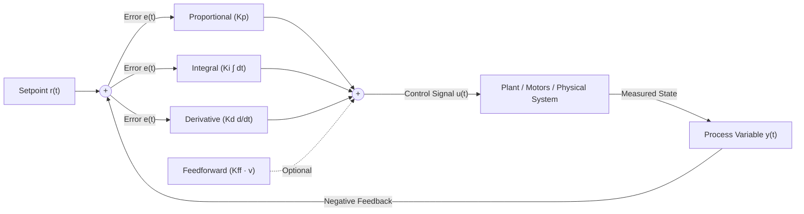
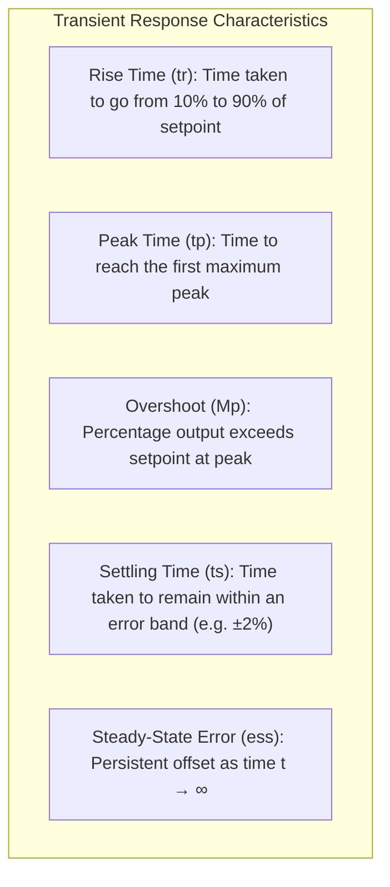
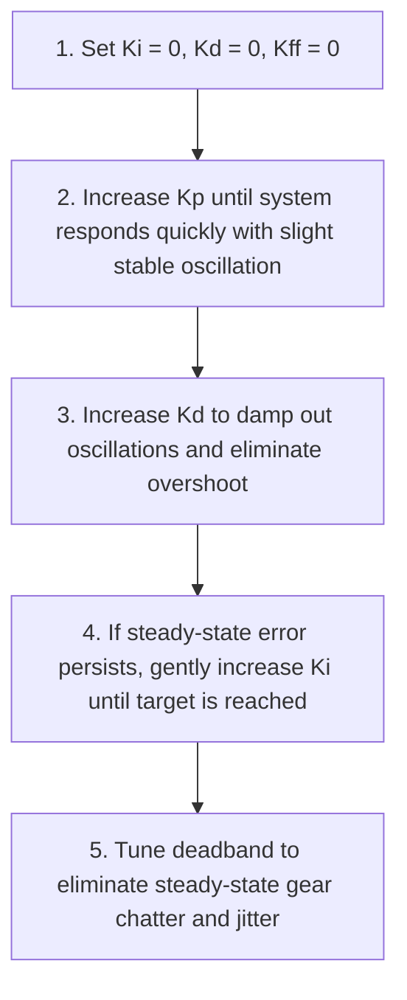
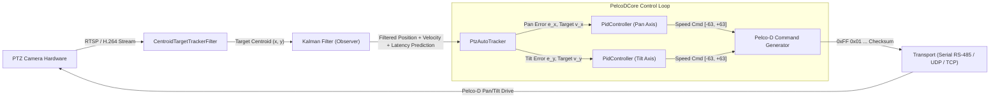

# PID Controller 101: An Intuitive (ELI5) and Technical Guide

> **Target Audience:** From beginners seeking an intuitive conceptual grasp to software and control engineers designing embedded, robotic, or optical tracking loops.

---

## Executive Summary & ELI5 (Explain Like I'm 5)

A **PID controller** (Proportional-Integral-Derivative controller) is the most widely used feedback control algorithm in modern engineering. It continuously calculates an **error value** as the difference between a desired setpoint and a measured process variable, then computes an actuator correction based on:
1. **The Present Error** (Proportional, **$P$**)
2. **The Past Accumulated Error** (Integral, **$I$**)
3. **The Future Trend of Error** (Derivative, **$D$**)

---

### The Intuitive Analogy: Adjusting a Hot Shower

Imagine stepping into a hotel shower where the water temperature is unpredictable:

```
[ Ice Cold Water ] ──────────────► [ Target: 38°C Comfortable ]
```

1. **The Proportional Term ($P$ — "Reacting to the Present"):**
   - You step in, and the water is freezing ($15^\circ\text{C}$). The error is massive ($+23^\circ\text{C}$).
   - You instantly turn the knob hard toward hot.
   - **The Problem ($P$-only limit):** As the water approaches $36^\circ\text{C}$, the error is tiny ($2^\circ\text{C}$). Because your reaction is proportional to the remaining error, you stop adjusting the knob. The water stays lukewarm at $36^\circ\text{C}$ forever. This persistent deficit is called **steady-state error** (or droop).

2. **The Integral Term ($I$ — "Accumulating the Past"):**
   - You stand there for 30 seconds thinking: *"It's still 2 degrees too cold, and it has been too cold for a while."*
   - Because time is passing and the error remains uncorrected, your impatience builds. You gently nudge the knob slightly hotter, bit by bit, until the water finally hits exactly $38^\circ\text{C}$.
   - **The Role of $I$:** It remembers uncorrected past error and ramps up power until the error is eliminated to absolute zero.

3. **The Derivative Term ($D$ — "Predicting the Future"):**
   - Suddenly, the hotel boiler kicks on and the water starts heating up at $+10^\circ\text{C}$ per second.
   - If you wait until you actually feel boiling water, you will get scalded. Instead, you see the rapid upward rate of change and proactively nudge the knob back *before* the water overshoots $38^\circ\text{C}$.
   - **The Role of $D$:** It acts as an **electronic brake** or shock absorber, damping oscillations and preventing overshoot.

---

### The Automobile Analogy: Adaptive Cruise Control

| Scenario | Component | Action & Intuitive Meaning |
| :--- | :--- | :--- |
| **You want to drive at 100 km/h, but you're doing 60 km/h** | **$P$ (Proportional)** | Press the gas pedal down hard. Large speed deficit $\rightarrow$ large throttle command. |
| **Cruising up a long, steep highway incline** | **$I$ (Integral)** | Gravity slows the car down to 93 km/h. With $P$ alone, the throttle balances the hill at 93 km/h. The integral notes the sustained 7 km/h deficit over time and presses the gas pedal further to restore 100 km/h. |
| **Approaching the crest of the hill at 100 km/h** | **$D$ (Derivative)** | The car begins accelerating rapidly as the slope levels off. The derivative detects the sudden rapid change in speed and eases off the gas early to avoid flying over the crest at 115 km/h. |

---

## 1. What is a PID Controller? (The 101 Technical Overview)

A PID controller is a **closed-loop feedback controller**. 

### Open-Loop vs. Closed-Loop Control

```
Open-Loop Control:
[ Setpoint ] ───► [ Controller ] ───► [ Actuator/Plant ] ───► [ Output ]
(No feedback. Blind execution. Vulnerable to wind, friction, mass changes.)

Closed-Loop Control (Feedback):
[ Setpoint r(t) ] ──(+)
                     │
                    (─)◄───────────── Error e(t) ◄──────────────┐
                     │                                          │
                     ▼                                          │
            ┌─────────────────┐                                 │
            │ PID Controller  │                                 │
            └────────┬────────┘                                 │
                     │ Control Signal u(t)                      │
                     ▼                                          │
            ┌─────────────────┐                                 │
            │ Plant / Actuator│ ───► [ Output y(t) ] ───────────┘
            └─────────────────┘      (Physical system)
```

In an open-loop system, if you tell a motor to spin at 50% power, you have no guarantee what physical speed it reaches under differing loads or temperatures. In a closed-loop PID system, the output is measured by a sensor (encoder, camera, gyroscope, thermometer), compared against the desired setpoint, and continuously corrected.

---

### High-Level Block Architecture

The classic parallel PID controller splits the error into three parallel channels and sums them together:



---

## 2. Mathematical Foundations

### The Continuous-Time PID Equation

In continuous time, the standard parallel PID control law is expressed as:

$$u(t) = K_p \, e(t) + K_i \int_{0}^{t} e(\tau) \, d\tau + K_d \frac{d e(t)}{d t}$$

Where:
- $r(t)$ = Desired Setpoint
- $y(t)$ = Measured Process Variable
- $e(t) = r(t) - y(t)$ = Instantaneous tracking error
- $u(t)$ = Output command signal sent to the actuator
- $K_p$ = Proportional gain
- $K_i$ = Integral gain
- $K_d$ = Derivative gain

---

### Standard (ISA) Form vs. Parallel Form

In literature and industrial programmable logic controllers (PLCs), PID is often written in **standard (ideal / ISA) form**:

$$u(t) = K_p \left( e(t) + \frac{1}{T_i} \int_{0}^{t} e(\tau) \, d\tau + T_d \frac{d e(t)}{d t} \right)$$

The relationships between the representations are:
- $K_i = \frac{K_p}{T_i}$, where $T_i$ is the **integral time** (or *reset time* in seconds).
- $K_d = K_p \cdot T_d$, where $T_d$ is the **derivative time** (in seconds).

The parallel form allows independent tuning of each parameter, while the ISA form highlights how proportional gain scales the entire loop sensitivity.

---

### Detailed Breakdown of the Three Terms

```
                    ┌────────────────────────────┐
                    │ u(t) = P(t) + I(t) + D(t)  │
                    └────────────────────────────┘
                     │          │          │
        ┌────────────┘          │          └────────────┐
        ▼                       ▼                       ▼
   PROPORTIONAL              INTEGRAL               DERIVATIVE
   "The Present"           "The Past"              "The Future"
  Scales with size      Accumulates over time   Rates of change damping
   of current error     Eliminates droop/bias   Prevents overshoot
```

#### 1. Proportional Term ($P$)
$$u_P(t) = K_p \, e(t)$$
- **Function:** Generates a control output directly proportional to the magnitude of the current error.
- **Physical intuition:** Like a mechanical spring. The farther you stretch it away from equilibrium ($e$), the harder it pulls back ($u$).
- **Limitation:** Pure proportional control almost always exhibits a non-zero **steady-state error** when operating against friction, gravity, or load resistance. If $e(t) \to 0$, then $u_P(t) \to 0$, which leaves no force to hold the actuator against a static load.

#### 2. Integral Term ($I$)
$$u_I(t) = K_i \int_{0}^{t} e(\tau) \, d\tau$$
- **Function:** Continuously sums error over time.
- **Physical intuition:** Like a persistence meter. Even if the error is tiny, as long as it does not equal zero, the integral term continuously inflates until the motor overcomes friction and reaches the setpoint.
- **Limitation:** Introduces a $90^\circ$ phase lag in frequency response, which reduces system stability and can cause low-frequency ringing or instability if $K_i$ is set too high.

#### 3. Derivative Term ($D$)
$$u_D(t) = K_d \frac{d e(t)}{d t}$$
- **Function:** Measures the slope (velocity) of the error curve.
- **Physical intuition:** Like a viscous hydraulic shock absorber or electronic dashpot. If the error is collapsing rapidly towards zero, $\frac{de}{dt}$ is negative, which subtracts from the control output and exerts a counter-torque to brake the system before it blows past the setpoint.
- **Limitation:** Sensitive to high-frequency sensor noise. Differentiating high-frequency noise yields huge derivative spikes:
  $$\frac{d}{dt} \left( A \sin(\omega t) \right) = A \omega \cos(\omega t)$$
  As frequency $\omega \to \infty$, the derivative amplifies noise without bound.

---

### Discrete-Time Implementation (Digital Computers & Microcontrollers)

Because digital microprocessors and software run at discrete sample times $t_k = k \cdot \Delta t$, the continuous equations must be discretized.

#### 1. Sampling and Error
$$\Delta t = t_k - t_{k-1}, \quad e_k = r_k - y_k$$

#### 2. Numerical Integration (Euler Backward / Forward)
$$I_k = I_{k-1} + e_k \cdot \Delta t$$

*(Or trapezoidal integration: $I_k = I_{k-1} + \frac{e_k + e_{k-1}}{2} \Delta t$)*

#### 3. Numerical Differentiation with Low-Pass Filtering
A raw finite difference $\frac{e_k - e_{k-1}}{\Delta t}$ amplifies noise. Practical digital controllers apply an exponential moving average (single-pole low-pass filter with smoothing factor $\alpha \in [0, 1]$):

$$D_{\text{raw}, k} = \frac{e_k - e_{k-1}}{\Delta t}$$
$$D_{\text{filtered}, k} = \alpha \cdot D_{\text{raw}, k} + (1 - \alpha) \cdot D_{\text{filtered}, k-1}$$

#### 4. Discrete Output
$$u_k = K_p \, e_k + K_i \, I_k + K_d \, D_{\text{filtered}, k}$$

---

## 3. Visualizing Closed-Loop Step Responses

When an instantaneous step change in setpoint is requested, the system trajectory varies dramatically depending on PID gains:

### ASCII Response Waveforms

```
Setpoint ───────┬──────────────────────────────────────────────────────────
                │
                │        Underdamped (High Kp, Low Kd)
                │         _.-''''-._
                │       .'    ▲     `.  <- Overshoot (Mp)
                │      /   Peak Time  \        .-''-.
                │     /       (tp)     \      /      \
────────────────┼────/──────────────────'────/────────\───────────────────── Setpoint
                │   /                    `.-'          `--..____ Settled (ts)
                │  /
                │ /      Critically Damped (Ideal tuning: Fast rise, zero overshoot)
                │/   _..----------------------------------------------------
                │ .-´
                │/
                │
────────────────┼───────────────────────────────────────────────────────────
                │
                │        Overdamped / Pure P Droop (Sluggish or steady-state offset)
                │
                │       _..--------------------------------- <- Steady-State Error (ess)
                │  _.-´
                │.´
                │
                └──────────────────────────────────────────────────────────► Time (t)
```

### Key Performance Metrics Defined



---

## 4. Practical Engineering Nuances: Why Textbook PID Fails

A pure mathematical PID loop will fail or damage hardware in real-world systems unless equipped with essential real-world defenses:

### A. Integral Windup & Anti-Windup

#### The Problem
Physical actuators have saturation limits (e.g., a motor driver cannot exceed $\pm 100\%$ duty cycle, or Pelco-D discrete speed cannot exceed $63$).
If a heavy load or barrier prevents the motor from reaching the target, the error $e(t)$ stays large. The integrator continues accumulating:

$$I(t) = \int_0^t e(\tau) d\tau \longrightarrow \infty$$

When the physical obstacle clears or setpoint reverses, the massive accumulated value keeps the motor driven at maximum speed in the wrong direction for seconds, blowing far past the setpoint before the integral can unwind.

```
Actuator Limit ─────────────────────────────── Maximum Speed (+63)
                                              ▲
Actual Motor Speed:  ───────────────/─────────┴────────────\────────
                                   /                        \
Integrator State:                /   <- Continues winding up \
                                /       to massive numbers!   \
```

#### The Solutions
1. **Clamping (Hard Limiter):** Clamp $I(t)$ to $[-I_{\text{max}}, +I_{\text{max}}]$.
2. **Conditional Integration (Freeze Integration):** If output $u(t)$ is already saturated at $u_{\text{max}}$, only allow the integrator to update if the incoming error is *negative* (pulling the output away from saturation).

---

### B. Derivative Kick & Derivative on Measurement

#### The Problem
When an operator abruptly changes the setpoint from $0^\circ$ to $90^\circ$ in one frame, the error jumps instantaneously from $0$ to $90$.
Computing $\frac{de}{dt} = \frac{90 - 0}{\Delta t}$ at $\Delta t = 20\text{ ms}$ yields a massive derivative spike of $4500\text{ units/s}$, causing an instantaneous shock to gears and motors (**Derivative Kick**).

#### The Solution: Derivative on Process Variable
Because $e(t) = r(t) - y(t)$, and for constant setpoints $\frac{dr}{dt} = 0$:

$$\frac{de(t)}{dt} = \frac{d(r(t) - y(t))}{dt} = -\frac{dy(t)}{dt}$$

By differentiating only the measured sensor variable $y(t)$ instead of error $e(t)$, setpoint steps do not induce infinite spikes into the actuator.

---

### C. Actuator Deadband

#### The Problem
Mechanical systems have gear backlash, stiction, and optical sensor noise. A 0.5-pixel visual oscillation would cause the controller to issue commands such as `Pan Left 1` $\leftrightarrow$ `Pan Right 1` 30 times a second. This "hunting" vibrates the camera and strips mechanical gears.

#### The Solution: Deadband Threshold
```
If |e(t)| <= Deadband:
    e(t) = 0
    u(t) = 0
```
When error falls within the tolerance window, the actuator rests quietly.

---

### D. Velocity Feedforward ($K_{ff}$)

A standard feedback controller is purely **reactive**; it cannot command non-zero velocity without having non-zero error.
When tracking a moving object (e.g. an aircraft moving across the sky at constant angular velocity $v$), pure PID will lag behind by a fixed tracking error.

By adding **Velocity Feedforward**:

$$u(t) = \text{PID}(e) + K_{ff} \cdot v_{\text{target}}$$

The feedforward term supplies the base cruising speed, allowing the camera or motor to travel in unison with the target with near-zero tracking error.

---

## 5. PID Tuning Guide

### Parameter Tuning Impact Matrix

| Parameter Increase | Rise Time | Overshoot | Settling Time | Steady-State Error | Stability Margin |
| :--- | :--- | :--- | :--- | :--- | :--- |
| **Increase $K_p$** | Decreases (Faster) | Increases | Small Change | Decreases (Less droop) | Degrades |
| **Increase $K_i$** | Decreases | Increases | Increases | **Eliminated to 0** | Severely Degrades |
| **Increase $K_d$** | Minor Change | **Decreases (Damps)** | **Decreases** | No Effect | Improves (within limits) |

---

### Field Heuristic Tuning Procedure (Manual Method)



---

### Ziegler-Nichols Closed-Loop Method (Classic Standard)

Published by John G. Ziegler and Nathaniel B. Nichols in 1942, this frequency-response method finds the **Ultimate Gain** ($K_u$) and **Ultimate Period** ($T_u$):
1. Set $K_i = 0$ and $K_d = 0$.
2. Slowly raise $K_p$ until the process exhibits sustained, stable, non-decaying sinusoidal oscillations.
3. Record this gain as $K_u$ and measure the time period between consecutive peaks as $T_u$ (in seconds).
4. Calculate PID gains using the classical formulas:

| Controller Type | $K_p$ | $K_i$ | $K_d$ |
| :--- | :--- | :--- | :--- |
| **P** | $0.50 \cdot K_u$ | — | — |
| **PI** | $0.45 \cdot K_u$ | $\frac{0.54 \cdot K_u}{T_u}$ | — |
| **Classic PID** | $0.60 \cdot K_u$ | $\frac{1.20 \cdot K_u}{T_u}$ | $0.075 \cdot K_u \cdot T_u$ |
| **Pessen Integral** | $0.70 \cdot K_u$ | $\frac{1.75 \cdot K_u}{T_u}$ | $0.105 \cdot K_u \cdot T_u$ |
| **No Overshoot** | $0.20 \cdot K_u$ | $\frac{0.40 \cdot K_u}{T_u}$ | $0.066 \cdot K_u \cdot T_u$ |

---

## 6. Where PID is Used in the Real World

```
┌────────────────────────────────────────────────────────────────────────────┐
│                       EVERYDAY REAL-WORLD PID APPLICATIONS                 │
├──────────────────────┬──────────────────────┬──────────────────────────────┤
│ Automotive           │ Aerospace & Drones   │ Industrial Process Control   │
│ - Cruise control     │ - Quadcopter pitch   │ - Chemical reactor temp      │
│ - Electronic throttle│ - Gimbal stabilizers │ - Boiler steam pressure      │
│ - ABS anti-lock brake│ - Rocket thrust bias │ - Flow rate valves           │
├──────────────────────┼──────────────────────┼──────────────────────────────┤
│ Consumer Electronics │ Robotics & Motion    │ Scientific & Optical         │
│ - 3D printer nozzles │ - Robot arm joints   │ - Laser beam steering        │
│ - Drone battery temp │ - CNC machine tools  │ - Telescope azimuth tracking │
│ - Hard disk read head│ - Conveyor alignment │ - PTZ Surveillance Cameras   │
└──────────────────────┴──────────────────────┴──────────────────────────────┘
```

---

## 7. How PID is Used in This Project (`PelcoD-Controller`)

In this project, the PID controller is a core component of the automated visual tracking system for PTZ (Pan-Tilt-Zoom) security and defense cameras. It translates pixel-level tracking errors into standard **Pelco-D protocol pan/tilt motor speed commands**.

### Software Architecture Overview



---

### Project-Specific Implementations and Features

The controller is implemented in [`libs/PelcoDCore/PidController.h`](../libs/PelcoDCore/PidController.h) and [`libs/PelcoDCore/PidController.cpp`](../libs/PelcoDCore/PidController.cpp). Key engineering adaptations include:

#### 1. Discrete Output Saturation to Pelco-D Speed Range
The Pelco-D protocol defines pan and tilt speeds as 1-byte discrete values from `0x00` (stop) to `0x3F` (decimal 63, maximum speed):
- `m_minOutput = -63.0`
- `m_maxOutput = +63.0`

The signed output sign indicates direction (e.g. $+35 \implies$ Pan Right at speed 35, $-35 \implies$ Pan Left at speed 35).

#### 2. Conditional Anti-Windup Clamping
To prevent integrator accumulation when the camera is already moving at maximum speed (`PidController.cpp`):
```cpp
double candidateIntegral = m_integral + (std::abs(error) > m_deadband ? error * dt : 0.0);
double candidateOutput = pTerm + (m_ki * candidateIntegral) + dTerm + ffTerm;

if (candidateOutput > m_maxOutput) {
    // Only integrate if error is negative (pulling back from saturation)
    if (error < 0.0) {
        m_integral = candidateIntegral;
    }
    return m_maxOutput;
}
```

#### 3. Low-Pass Filtered Derivative
Video-based bounding boxes experience 1-2 pixel noise between frames. Differentiating raw pixel differences without filtering creates harsh motor chatter.
We apply an exponential single-pole low-pass filter ($\alpha = 0.8$):
```cpp
double dRaw = (error - m_prevError) / dt;
m_filteredDerivative = m_derivativeFilterAlpha * dRaw + (1.0 - m_derivativeFilterAlpha) * m_filteredDerivative;
```

#### 4. Deadband Protection for Mechanical Gears
PTZ heads use mechanical worm gears. Constant hunting around zero strips gear teeth:
```cpp
if (std::abs(error) <= m_deadband && std::abs(ffTerm) < 1e-9) {
    return 0.0; // Rest motor
}
```

#### 5. Zoom Gain Scheduling (`PtzAutoTracker`)
When a telephoto lens (such as the Fujinon SX800) zooms from $1\times$ to $40\times$, the camera's field of view shrinks from $60^\circ$ to $1.5^\circ$. A 10-pixel error at full zoom represents a tiny fraction of a degree, whereas at wide zoom it represents a large physical angle.
- In [`PtzAutoTracker`](../libs/PelcoDCore/PtzAutoTracker.h), gains are dynamically scaled with zoom ratio:
  $$K_{p,\text{effective}} = \frac{K_{p,\text{base}}}{\text{Zoom Factor}}$$
  This prevents high-speed oscillation when zoomed in on distant targets.

#### 6. Automatic Oscillation Attenuation (`OscillationDetector`)
If external vibration, wind, or improper gain tuning causes continuous sign-reversals in the control output, [`OscillationDetector`](../libs/PelcoDCore/OscillationDetector.h) flags resonance and calls:
```cpp
oscillationDetector.autoAttenuate(m_panPid, 0.85);
```
This automatically reduces proportional and integral gains by 15% to restore system stability without operator intervention.

---

## 8. References & Verified Further Reading

The following standard reference texts, seminal papers, and official resources provide authoritative information on PID and feedback control theory:

1. **Åström, Karl Johan, and Murray, Richard M. (2021).**  
   *Feedback Systems: An Introduction for Scientists and Engineers* (2nd ed.). Princeton University Press.  
   Open access companion and full text available at Caltech:  
   [http://www.cds.caltech.edu/~murray/amwiki](http://www.cds.caltech.edu/~murray/amwiki)

2. **Åström, Karl Johan, and Hägglund, Tore. (2006).**  
   *Advanced PID Control*. ISA (The Instrumentation, Systems, and Automation Society).  
   ISBN: 978-1-55617-942-6.  
   *(The definitive industrial treatise on anti-windup, reset, and discrete derivative filtering).*

3. **Ziegler, John G., and Nichols, Nathaniel B. (1942).**  
   "Optimum Settings for Automatic Controllers."  
   *Transactions of the ASME*, Vol. 64, No. 8, pp. 759–768.  
   *(The seminal paper introducing the classic Z-N frequency response tuning rules).*

4. **National Instruments (NI) Whitepaper.**  
   "PID Theory Explained."  
   Accessible at: [https://www.ni.com/en/shop/compactrio/pid-theory-explained.html](https://www.ni.com/en/shop/compactrio/pid-theory-explained.html)

5. **Franklin, Gene F., Powell, J. David, and Workman, Michael L. (1998).**  
   *Digital Control of Dynamic Systems* (3rd ed.). Ellis-Kagle Press.  
   ISBN: 978-0-9791226-1-3.  
   *(Covers discrete-time sampling, z-transforms, and digital anti-windup strategies).*

6. **Related Documentation in This Repository:**  
   - [`docs/Kalman_Filter_101.md`](Kalman_Filter_101.md): Complementary 101/ELI5 guide explaining the Kalman Filter.
   - [`docs/FFT_101.md`](FFT_101.md): Complementary 101/ELI5 guide explaining the Fast Fourier Transform (FFT).
   - [`docs/DCT_101.md`](DCT_101.md): Complementary 101/ELI5 guide explaining the Discrete Cosine Transform (DCT).
   - [`docs/DWT_101.md`](DWT_101.md): Complementary 101/ELI5 guide explaining the Discrete Wavelet Transform (DWT).
   - [`docs/PID_Kalman_Tracking.md`](PID_Kalman_Tracking.md): Architectural comparison between the Kalman filter (Observer) and PID controller (Actuator) in automated visual tracking.
   - [`libs/PelcoDCore/PidController.h`](../libs/PelcoDCore/PidController.h): Core C++17 PID implementation.
