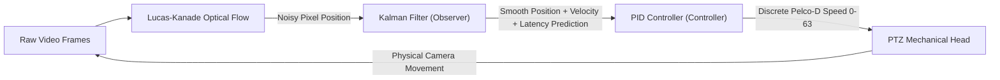

In an automated camera tracking system (often called **Visual Servoing**), tracking a target smoothly across a pan/tilt/zoom (PTZ) camera requires solving two fundamentally different problems:

1. **State Estimation Problem (Sensor Level):** *"Where is the target right now, where is it heading, and where will it be when our camera commands actually execute?"* $\rightarrow$ Solved by the **Kalman Filter**.
2. **Plant Actuation Problem (Control Level):** *"How fast and in what direction should we drive the physical motors to center the target without overshooting, oscillating, or shaking the camera to pieces?"* $\rightarrow$ Solved by the **PID Controller**.

---

### Architecture: The Classic Observer-Controller Duality

Neither the Kalman filter nor the PID controller can do the other's job. Here is why each is indispensable.

---

## 1. Why We Need the Kalman Filter (The Observer)

Optical flow and visual bounding boxes (from [CentroidTargetTrackerFilter](../libs/PelcoDVideo/VideoFilters.h#L320)) produce noisy, delayed, 2D pixel measurements. The Kalman filter acts as the **state estimator**:

### A. Extracting Velocity from Position
Computer vision only tells you where the target *is* ($x, y$), not how fast it is moving ($v_x, v_y$).
- Simply doing finite differences $\Delta x / \Delta t$ between consecutive frames amplifies sensor noise drastically (a 1-pixel jitter between frames sampled at 30 fps translates to a false velocity spike of 30 pixels/sec!).
- The Kalman filter's continuous kinematic model ($\mathbf{x}_k = \mathbf{F} \mathbf{x}_{k-1}$) optimally fuses process dynamics and measurement noise covariance ($Q$ and $R$) to extract clean, filtered velocity vectors ($v_x, v_y$).

### B. Overcoming Video Latency (Lookahead Prediction)
A video tracking pipeline suffers from unavoidable latency:
$$\text{Total Delay} = \text{RTSP Transport} + \text{H.264 Decoding} + \text{Frame Processing} + \text{RS-485 Pelco-D Transmission} \approx 60\text{--}120\,\text{ms}$$
By the time the frame processor detects a moving car at pixel $(x, y)$, the car is already dozens of pixels ahead in reality!
- Because the Kalman filter maintains the velocity state, it can project the target's trajectory forward into the future:
  $$\hat{x}_{\text{actual}} = x_{\text{measured}} + v_x \cdot \Delta t_{\text{latency}}$$
- In [CentroidTargetTrackerFilter::getTargetState(lookahead)](../libs/PelcoDVideo/VideoFilters.cpp#L1916), we use this lookahead prediction so the PTZ motors steer towards where the target **will be**, eliminating systematic pursuit lag.

### C. Occlusion Coasting (Handling Obstacles)
If a tracked person walks behind a lamppost, tree, or pillar, optical flow instantly loses its feature points:
- **Without Kalman:** Feature tracking fails $\rightarrow$ confidence drops to 0 $\rightarrow$ tracking is aborted $\rightarrow$ camera stops dead. When the person emerges on the other side, the lock is already lost.
- **With Kalman:** When optical flow detects no features, the filter transitions to **coasting mode** (`isCoasting = true`). It uses the internal state prediction $\mathbf{x}_k = \mathbf{F} \mathbf{x}_{k-1}$ to continue moving the target bounding box along its expected trajectory for up to `maxCoastFrames` (30 frames / 1.0 s). When the target emerges from behind the obstacle, the features reappear right inside the predicted box, maintaining unbroken lock-on.

---

## 2. Why We Need the PID Controller (The Actuator)

Even with an accurate Kalman-filtered target position, you cannot simply feed raw pixel errors directly to the camera motors. PTZ heads are physical mechanical systems subject to **inertia, mass, gear backlash, friction, and motor acceleration limits**.

[PidController](../libs/PelcoDCore/PidController.h) (see [PID Controller 101](PID_Controller_101.md) for an intuitive ELI5 and technical reference) and [PtzAutoTracker](../libs/PelcoDCore/PtzAutoTracker.h) solve these physical control problems:

### A. Proportional Control ($K_p$): Scaling the Urgency
- A target near the edge of the screen ($e = 0.9$) needs rapid panning to prevent it from escaping the frame.
- A target near the center bore ($e = 0.05$) needs a gentle crawl.
- The proportional term scales motor speed directly proportional to distance from boresight: $u_P = K_p \cdot e$.

### B. Integral Control ($K_i$) & Anti-Windup: Eliminating Steady-State Error
- Mechanical friction and gear resistance mean that very small control signals cannot overcome motor stiction.
- Without integral action, a target moving slowly across the scene might stabilize at an offset (e.g. 5% off-center) because the proportional term alone isn't strong enough to nudge the motor.
- The integral term accumulates this persistent error over time: $u_I = K_i \int e \, dt$, gently ramping up torque until the target is centered on boresight.
- **Anti-Windup:** If the camera hits its maximum speed (Pelco-D speed 63), accumulating more integral would cause huge overshoot when stopping. Our controller clamps the integrator to avoid windup.

### C. Derivative Control ($K_d$) & Filter: Preventing Overshoot and Oscillation
- When a heavy camera swings at high speed toward the target, its physical inertia will cause it to blow past the center unless it begins decelerating *before* it arrives.
- The derivative term acts as an **electronic brake** based on the rate of error closure: $u_D = K_d \frac{de}{dt}$.
- When the camera is closing in fast, $\frac{de}{dt}$ is negative, which actively dampens motor drive and brings the camera to a smooth halt precisely on target.
- Our low-pass filter ($\alpha = 0.8$) prevents high-frequency video jitter from causing sudden motor shudder.

### D. Velocity Feedforward ($K_{ff}$): Zero-Lag Pursuit
- In pure PID control, the camera only reacts *after* an error appears. If a drone is flying across the sky at constant speed, the camera will always trail slightly behind it.
- Because the Kalman filter provides the target's estimated velocity, the PID controller injects a **feedforward term**:
  $$u = \text{PID}(e) + K_{ff} \cdot v_{\text{target}}$$
- This allows the camera head to match the target's cruising speed automatically without needing an error to accumulate first!

### E. Deadband Suppression: Saving the Gears
- Pelco-D pan/tilt heads use mechanical worm gears or stepper/servo drives.
- Without a deadband, a 1-pixel micro-shift caused by wind or pixel noise would constantly issue `Pan Left 1` $\leftrightarrow$ `Pan Right 1` commands 25 times a second. This "hunting" causes visual vibration and rapidly strips the mechanical drive gears.
- Our deadband window ($|e| < \text{deadband} \implies u = 0$) lets the motors rest quietly when the target is centered.

---

## 3. Summary: What Happens If You Omit One?

| Architecture | Behavior & Failure Modes |
| :--- | :--- |
| **No Kalman, No PID** *(Naive direct speed)* | **Violent hunting & oscillation.** Camera repeatedly overshoots the target, jerks back and forth, drops frames due to motion blur, and loses the target the moment it passes a tree or slows down. |
| **PID Only** *(No Kalman)* | **Delayed pursuit & jitter.** The PID reacts to noisy raw frame positions. Video latency causes the camera to constantly lag behind moving objects. Any temporary occlusion immediately aborts tracking. |
| **Kalman Only** *(No PID)* | **Mechanical overshoot.** The system knows where the target is, but driving the motors without derivative damping causes heavy camera heads to overshoot the boresight and oscillate endlessly. Low-speed friction causes steady-state centering error. |
| **Kalman + PID** *(Our Implementation)* | **Smooth, predictive, broadcast-grade tracking.** Kalman estimates velocities, predicts through latency, and coasts through obstacles; PID translates those trajectories into smooth, deadband-protected, anti-windup motor commands. |