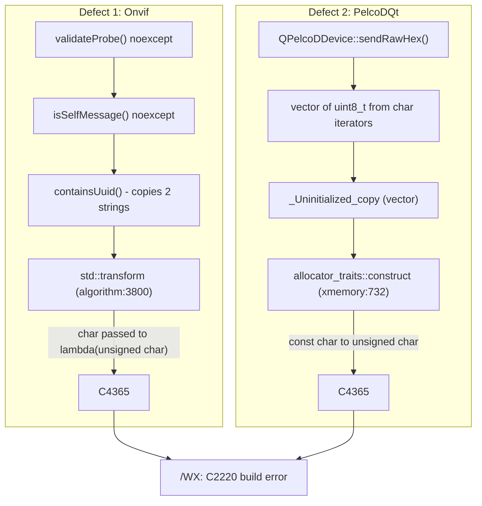
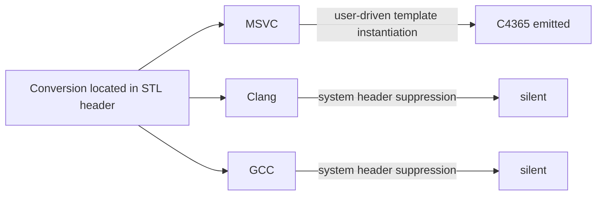

# MSVC C4365 / C2220 Build Break: Analysis, Fix and Cross-Compiler Detection Report

| Field | Value |
|---|---|
| Date | 2026-10-08 |
| Affected targets | `Onvif`, `PelcoDQt` → blocked `PayloadHal`, `PelcoDAppTui`, `PelcoDAppQt` and all Onvif test executables |
| Toolchains examined | MSVC 19.44 (VS 2022, toolset 14.44.35207), Clang 23.1.0 (Windows, MSVC STL) |
| Build directory | `build-verify/` (Visual Studio generator, Debug) |
| Status | Fixed and verified on MSVC; detection gap on GCC/Clang documented |

---

## 1. Executive Summary

The Windows build failed with:

```
algorithm(3800,25): error C2220: the following warning is treated as an error
algorithm(3800,25): warning C4365: 'argument': conversion from 'char' to
                    'unsigned char', signed/unsigned mismatch
```

Two independent defects of the same class were found:

| # | Location | Pattern | STL line reported |
|---|---|---|---|
| 1 | [`libs/Onvif/WsDiscoveryValidator.cpp`](../libs/Onvif/WsDiscoveryValidator.cpp) — `containsUuid()` | `std::transform` over `std::string` with a lambda taking `unsigned char` | `algorithm(3800)` |
| 2 | [`libs/PelcoDQt/QPelcoDDevice.cpp`](../libs/PelcoDQt/QPelcoDDevice.cpp) — `QPelcoDDevice::sendRawHex()` | `std::vector<std::uint8_t>(QByteArray::begin(), QByteArray::end())` | `xmemory(732)` |

Defect 2 was hidden behind defect 1: it only surfaced once `Onvif` compiled.

In both cases an **implicit `char` → `unsigned char` conversion** is performed *inside a
Standard Library template*, driven by a type supplied by project code. MSVC reports it
(`/w14365` + `/WX`); GCC and Clang suppress it by default because the conversion's source
location is inside a **system header**, even though the project enables
`-Wconversion -Wsign-conversion -Werror`.

---

## 2. Symptom and Reproduction

```powershell
cmake --build build-verify --config Debug --target Onvif
```

Full instantiation context (MSVC, `/v:normal`):

```
WsDiscoveryValidator.cpp
algorithm(3800,25): error C2220: the following warning is treated as an error
algorithm(3800,25): warning C4365: 'argument': conversion from 'char' to 'unsigned char',
                    signed/unsigned mismatch
  see reference to function template instantiation
  '_OutIt std::transform<std::_String_iterator<...>, std::_String_iterator<...>,
   Onvif::`anonymous-namespace'::containsUuid::<lambda_1>>(...)' being compiled
```

After fixing `Onvif`, building `PelcoDQt` produced:

```
QPelcoDDevice.cpp
xmemory(732,82): error C2220: the following warning is treated as an error
xmemory(732,82): warning C4365: 'initializing': conversion from 'const char' to '_Ty',
                 signed/unsigned mismatch  [_Ty=unsigned char]
  see reference to 'std::vector<uint8_t>::vector<QByteArray::const_iterator,0>(...)'
  see reference to 'std::vector<uint8_t>::_Construct_n<const char*, const char*>(...)'
  see reference to 'std::_Uninitialized_copy<...>(...)'
  see reference to 'std::_Uninitialized_backout_al<...>::_Emplace_back<const char&>(...)'
  see reference to 'std::_Default_allocator_traits<...>::construct<_Ty, const char&>(...)'
```

Relevant MSVC flags (from [`cmake/CompilerFlags.cmake`](../cmake/CompilerFlags.cmake)):

```
/W4 /WX /permissive- /external:anglebrackets /external:W0 /w14365 /w14244 /w14267 ...
```

---

## 3. Root Cause Analysis

### 3.1 Defect 1 — `containsUuid()` (Onvif)

Original code (introduced by commit `6e48d52 fix(onvif): prevent WS-Discovery self-amplification`):

```cpp
std::string textLower = text;
std::string uuidLower = uuid;
std::transform(textLower.begin(), textLower.end(), textLower.begin(),
    [](unsigned char ch) { return static_cast<char>(std::tolower(ch)); });
```

The MSVC STL implements `std::transform` as `*_UDest = _Func(*_UFirst);` (`algorithm:3800`).
`*_UFirst` is a `char&`; `_Func` takes `unsigned char`. The signed → unsigned conversion is
**implicit** and happens **inside** `<algorithm>`, not on any line of project code.

The `unsigned char` parameter is the well-known idiom to avoid undefined behaviour in
`std::tolower` for negative `char` values, but it moves the conversion into the library
where it is implicit.

Secondary issues found in the same function:

| Issue | Impact | Rule |
|---|---|---|
| Implicit `char` → `unsigned char` | Build break under `/WX` | MISRA C++:2023 7.0.6, CERT INT31-C |
| `std::tolower` is locale-dependent | UUID matching depends on global C locale | CERT STR37-C, determinism |
| Two `std::string` copies inside `noexcept` callers (`isSelfMessage`, `validateProbe`) | `std::bad_alloc` → `std::terminate` on the network receive path | CERT ERR55-CPP |

### 3.2 Defect 2 — `sendRawHex()` (PelcoDQt)

```cpp
std::vector<std::uint8_t> frame(hexData.begin(), hexData.end());
```

The iterator-range constructor copies each `const char` into an `unsigned char` element via
`allocator_traits::construct` (`xmemory:732`). Again, the conversion is implicit and located
in the library.

### 3.3 Call-chain diagrams

ASCII:

```
 Defect 1                                         Defect 2
 --------                                         --------
 WsDiscoveryServer (UDP recv)                     QPelcoDDevice::sendRawHex(QByteArray)
          |                                                   |
          v                                                   v
 validateProbe()  noexcept                         std::vector<uint8_t>(begin, end)
          |                                                   |
          v                                                   v
 isSelfMessage()  noexcept                         _Uninitialized_copy  (<vector>)
          |                                                   |
          v                                                   v
 containsUuid()  -- 2x std::string copy            allocator_traits::construct (<xmemory>)
          |                                                   |
          v                                                   v
 std::transform  (<algorithm>:3800)                 unsigned char = const char  (xmemory:732)
          |                                                   |
          v                                                   v
 lambda(unsigned char) <- char   ==> C4365          ==> C4365
          \___________________  /WX  ___________________/
                              v
                        C2220 build error
```

Mermaid:



---

## 4. Fixes Applied

### 4.1 `containsUuid()` — non-allocating ASCII case-insensitive search

File: [`libs/Onvif/WsDiscoveryValidator.cpp`](../libs/Onvif/WsDiscoveryValidator.cpp)

```cpp
[[nodiscard]] constexpr char toLowerAscii(char ch) noexcept
{
    return ((ch >= 'A') && (ch <= 'Z')) ? static_cast<char>((ch - 'A') + 'a') : ch;
}

[[nodiscard]] bool containsUuid(std::string_view text, std::string_view uuid) noexcept
{
    if (uuid.empty() || (text.size() < uuid.size())) {
        return false;
    }
    const auto it { std::search(text.cbegin(), text.cend(), uuid.cbegin(), uuid.cend(),
        [](char lhs, char rhs) noexcept { return toLowerAscii(lhs) == toLowerAscii(rhs); }) };
    return it != text.cend();
}
```

| Property | Before | After |
|---|---|---|
| Implicit conversion in STL | Yes (C4365) | No — predicate takes `char` |
| Locale dependence | `std::tolower` (global C locale) | None — ASCII only |
| Heap allocation | 2 × `std::string` copy | None |
| `noexcept` callers can throw | Yes (`bad_alloc` → terminate) | No |
| `<cctype>` dependency | Yes | Removed (`<string_view>` added) |

The `toLowerAscii` idiom matches existing helpers in
[`libs/Onvif/HttpDigest.cpp`](../libs/Onvif/HttpDigest.cpp) and
[`libs/Onvif/PasswordPolicy.cpp`](../libs/Onvif/PasswordPolicy.cpp).

### 4.2 `sendRawHex()` — explicit byte conversion

File: [`libs/PelcoDQt/QPelcoDDevice.cpp`](../libs/PelcoDQt/QPelcoDDevice.cpp)

```cpp
std::vector<std::uint8_t> frame {};
frame.reserve(static_cast<std::size_t>(hexData.size()));
for (const char ch : hexData) {
    frame.push_back(static_cast<std::uint8_t>(ch));
}
```

Behaviour is unchanged; the conversion is now explicit and located in project code.

### 4.3 Tests

File: [`libs/Onvif/tests/TestOnvifDiscoverySecurity.cpp`](../libs/Onvif/tests/TestOnvifDiscoverySecurity.cpp)

New regression tests (written first; "red" state = translation unit failed to compile):

| Test | Asserts |
|---|---|
| `RejectsSelfUuidUpperWire` | Lower-case local UUID matches upper-case `MessageID` → `isSelfMessage == true` |
| `RejectsSelfUuidMixedLocal` | Mixed-case local UUID matches lower-case wire value → `isSelfMessage == true` |
| `AcceptsNonAsciiUuidBytes` | UTF-8 bytes (`0xC3 0x84`) are not folded to ASCII → no false self-match, probe valid |

Additionally, a pre-existing latent defect was fixed: the test file used `std::array` without
`#include <array>` (it previously compiled only via transitive includes in other configurations).

---

## 5. Verification Results (MSVC, Debug, `build-verify/`)

| Step | Result |
|---|---|
| `Onvif` | ✅ 0 warnings, 0 errors |
| `PelcoDQt` | ✅ 0 warnings, 0 errors |
| `PayloadHal` | ✅ built |
| `PelcoDAppTui` | ✅ built |
| `PelcoDAppQt` | ✅ built (+ `windeployqt`) |
| `TestOnvifDiscoverySecurity` | ✅ 10/11 — new tests pass |
| `ctest -R "Onvif\|XmlUtils"` | ✅ 147/148 |

The single failure is environmental:

> [!NOTE]
> `TestOnvifDiscoverySecurity.LiveServerDropsProbeMatchesAndSelfLoop` sends a unicast probe to
> `127.0.0.1:3702`. On the test host, UDP 3702 is already bound by the Windows **Device
> Association Framework** (`dasHost.exe`), so the datagram is delivered to that socket and the
> test server never replies. The test's `GTEST_SKIP` only triggers if `bind()` fails, which it
> does not under address reuse. This is unrelated to the change.

---

## 6. Why GCC and Clang Did Not Report It

### 6.1 The flags are present

[`cmake/CompilerFlags.cmake`](../cmake/CompilerFlags.cmake) already enables, for GCC/Clang:

```
-Wall -Wextra -Wpedantic -Wconversion -Wsign-conversion -Werror
```

So the missing diagnostic is **not** a missing flag.

### 6.2 System-header suppression

GCC and Clang suppress **all** warnings whose source location lies in a system header
(Standard Library headers, or anything found via `-isystem`), **including warnings in template
instantiations requested from user code**. The `char` → `unsigned char` conversion is located
in `<algorithm>` / `<xmemory>`, so it is silently dropped.

Experiment (Clang 23.1.0): a user-written `myTransform` template with the identical conversion,
placed in a header and included two different ways:

| Header included via | Default | `-Wsystem-headers` |
|---|---|---|
| `-I` (project header) | **warns** | **warns** |
| `-isystem` (system header) | silent | **warns** |

The same experiment with the template defined directly in the `.cpp` file warns with a full
`note: in instantiation of ...` chain, proving Clang does diagnose conversions inside template
instantiations — the only difference is the system-header classification.

### 6.3 Why MSVC reports it

MSVC also classifies the STL as external (`/external:anglebrackets /external:W0`), but it
still emits warnings from external templates when the instantiation originates in project code
and the problematic operation is driven by a user-supplied type (here, the lambda's
`unsigned char` parameter, or the `QByteArray` iterator value type). This behaviour is governed
by `/external:templates`. Combined with `/w14365` (closest analogue of `-Wsign-conversion`),
MSVC is the strictest of the three compilers for this pattern.

```
                         conversion site inside STL header
                                       |
           +---------------------------+---------------------------+
           |                           |                           |
         MSVC                         Clang                        GCC
  external template, but         system header ->            system header ->
  user-driven instantiation      diagnostic suppressed       diagnostic suppressed
           |                           |                           |
      C4365 emitted                  silent                      silent
```



> [!NOTE]
> GCC behaviour is per its documented system-header rules; it could not be executed on the
> analysis host (MSYS2 `g++ 16.1.0` fails with `cannot execute 'cc1plus'`).

---

## 7. Options to Catch the Pattern with Clang

All results below were measured with Clang 23.1.0 against the MSVC STL.

| Option | `transform` + `unsigned char` lambda | `vector<uint8_t>(char iters)` | Noise on a clean STL-heavy TU |
|---|---|---|---|
| Default project flags | ❌ | ❌ | 0 |
| `-Wsystem-headers` (full project warning set) | ✅ | ✅ | **340** warnings |
| `-Wno-everything -Wsign-conversion -Wsystem-headers` | ✅ | ✅ | **15** warnings |
| `--no-system-header-prefix=algorithm` | ✅ | n/a | 0 |
| `--no-system-header-prefix=xmemory` | n/a | ❌ | 0 |

### 7.1 `-Wsystem-headers`

Detects both defects (Clang words the first as
`'value_type' (aka 'char') to 'unsigned char'`). However, a clean translation unit using
`<map>`, `<sstream>`, `<unordered_map>` produced 15 sign-conversion warnings from MSVC STL
internals (`xlocale`, `xlocinfo`, `xlocnum`, `sstream`) plus one STL4043 deprecation. Eight of
those carry `note: in instantiation ...` chains pointing back to user code, so filtering by
"instantiated from project sources" does **not** eliminate the false positives.

Usable only as a **non-blocking audit** job.

### 7.2 `--no-system-header-prefix=<prefix>`

Marks headers whose `#include` spelling starts with `<prefix>` as non-system. It is precise
(zero noise) for `<algorithm>` when included directly by project code, but **does not work**
for STL-internal headers such as `<xmemory>`: these are first reached via another system header
(`<cstdint>` → `<xstring>` → `<xmemory>`) and keep the system classification. Header names are
also library-specific (libstdc++ `bits/stl_algo.h`, libc++ `__algorithm/...`), making the
approach fragile across platforms.

### 7.3 clang-tidy

clang-tidy applies the same system-header filtering; `--system-headers` produces noise
comparable to 7.1. No built-in check is known to target "callable parameter type differs from
the range's `value_type`"; catching it precisely would require a custom check.

---

## 8. Recommendations

| Priority | Recommendation | Rationale |
|---|---|---|
| **1** | Keep a **required MSVC `/W4 /WX /w14365` CI job** | Only configuration that detects this class precisely with zero noise |
| **2** | Adopt a **coding rule**: callables passed to STL algorithms take the range's `value_type`; any conversion is an explicit `static_cast` inside the callable. Same for copying `char` ranges into `uint8_t` containers. | Moves the conversion into project code, so *every* compiler sees it |
| **3** | Prefer ASCII helpers (`toLowerAscii`) over `std::tolower` for protocol tokens (UUIDs, header names, schemes) | Locale-independent, no UB on negative `char`, no conversions |
| **4** | Do not allocate inside functions declared `noexcept` on network paths | Prevents `std::terminate` on `bad_alloc` (CERT ERR55-CPP) |
| 5 | Optional: opt-in CMake option for a non-blocking Clang audit with `-Wsign-conversion -Wsystem-headers` | Occasional manual review; too noisy for `-Werror` |
| 6 | Optional: consolidate the duplicated `toLowerAscii` helpers (`HttpDigest.cpp`, `PasswordPolicy.cpp`, `WsDiscoveryValidator.cpp`) into a shared header | Removes duplication |
| 7 | Harden `LiveServerDropsProbeMatchesAndSelfLoop` to skip when UDP 3702 is owned by another process | Avoids environmental false failures on Windows hosts |

Suggested addition to [`.agents/rules/verification-checklist.md`](../.agents/rules/verification-checklist.md):

```
15. Do callables passed to STL algorithms (and iterator-range constructors) use the
    range's exact value_type, with any conversion made explicit inside project code?
```

---

## 9. Files Changed

| File | Change |
|---|---|
| [`libs/Onvif/WsDiscoveryValidator.cpp`](../libs/Onvif/WsDiscoveryValidator.cpp) | `containsUuid` rewritten (non-allocating ASCII `std::search`), `toLowerAscii` added, `<cctype>` → `<string_view>` |
| [`libs/Onvif/tests/TestOnvifDiscoverySecurity.cpp`](../libs/Onvif/tests/TestOnvifDiscoverySecurity.cpp) | 3 regression tests; `#include <array>` |
| [`libs/PelcoDQt/QPelcoDDevice.cpp`](../libs/PelcoDQt/QPelcoDDevice.cpp) | `sendRawHex` explicit `char` → `uint8_t` conversion |

---

## Appendix A — Experiment Sources

### A.1 STL case vs. user-code case

```cpp
#include <algorithm>
#include <cctype>
#include <string>

std::string lowerViaStl(std::string s)
{
    std::transform(s.begin(), s.end(), s.begin(),
        [](unsigned char ch) { return static_cast<char>(std::tolower(ch)); });
    return s;                                  // Clang default: silent
}

static unsigned char takesUnsigned(unsigned char ch) { return ch; }

unsigned char lowerDirect(char c)
{
    return takesUnsigned(c);                   // Clang default: warns
}
```

### A.2 User-defined template (warns under Clang)

```cpp
template <typename It, typename Fn>
void myTransform(It first, It last, Fn fn)
{
    for (; first != last; ++first) {
        *first = static_cast<char>(fn(*first)); // char -> unsigned char
    }
}

void viaTemplate(char* b, char* e)
{
    myTransform(b, e, [](unsigned char ch) { return ch; });
}
```

### A.3 `vector<uint8_t>` from `char` iterators

```cpp
#include <cstdint>
#include <string>
#include <vector>

std::vector<std::uint8_t> toBytes(const std::string& s)
{
    return std::vector<std::uint8_t>(s.begin(), s.end()); // xmemory:732 under MSVC
}
```

### A.4 `-I` vs `-isystem` experiment

```powershell
# sys/mytr.h contains myTransform from A.2; use.cpp includes <mytr.h> and calls it
clang++ -std=c++17 -fsyntax-only -Wsign-conversion             -I       sys use.cpp  # warns
clang++ -std=c++17 -fsyntax-only -Wsign-conversion -Wsystem-headers -I  sys use.cpp  # warns
clang++ -std=c++17 -fsyntax-only -Wsign-conversion             -isystem sys use.cpp  # silent
clang++ -std=c++17 -fsyntax-only -Wsign-conversion -Wsystem-headers -isystem sys use.cpp  # warns
```

## Appendix B — Commands Used

```powershell
# Reproduce / verify
cmake --build build-verify --config Debug --target Onvif
cmake --build build-verify --config Debug --target PelcoDQt PayloadHal PelcoDAppTui PelcoDAppQt
ctest --test-dir build-verify -C Debug -R "Onvif|XmlUtils" --timeout 120

# Identify the UDP 3702 owner
Get-NetUDPEndpoint -LocalPort 3702 | Select-Object LocalAddress, OwningProcess
Get-Process -Id <pid>

# Clang detection experiments
clang++ -std=c++17 -fsyntax-only -Wsign-conversion -Wsystem-headers -fdiagnostics-format=msvc <file>.cpp
clang++ -std=c++17 -fsyntax-only -Wall -Wextra -Wpedantic -Wconversion -Wsign-conversion `
        --no-system-header-prefix=algorithm <file>.cpp
```
