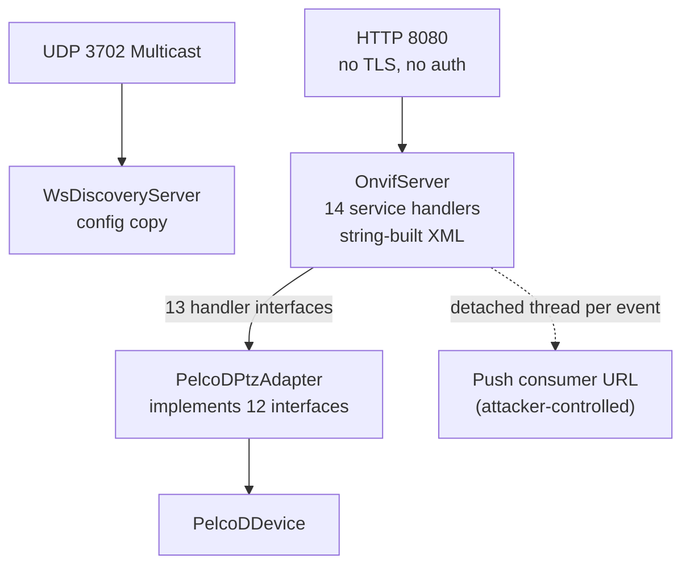
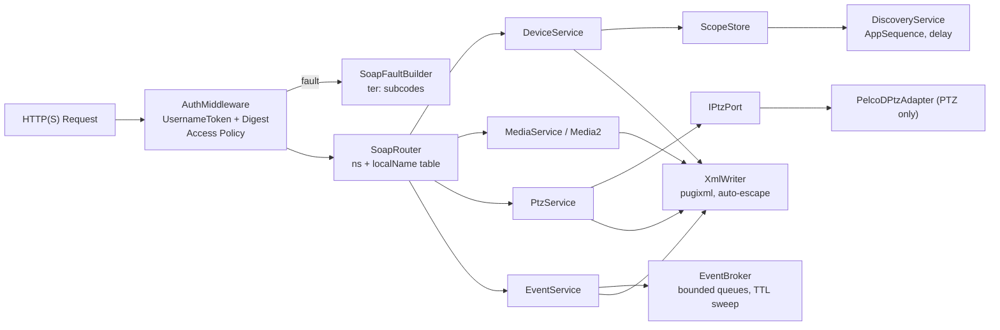

# ONVIF Module Review: Architecture, Completeness & Compliance

**Scope:** `libs/Onvif/` (server, client, WS-Discovery, security, PelcoD adapter, tests)
**Size:** ~15.6k LOC. Main files: `OnvifServer.cpp` (4,735 lines), `OnvifClient.cpp` (5,243 lines), `PelcoDPtzAdapter.cpp` (1,942 lines)
**Reviewed against:** ONVIF Core Spec, Profile S / T / G / M, WS-Discovery 2005/04, WS-BaseNotification, WS-Security UsernameToken, MISRA C++:2023, SEI CERT C++, and the project rules in `.agents/rules/`.

---

## 1. Executive Summary

| Area | Verdict | Notes |
|---|---|---|
| Security | 🔴 **Not deployable** | No authentication on any endpoint, XML injection everywhere, SSRF, hard-coded `admin/admin` |
| ONVIF protocol conformance | 🔴 **Fails** | No SOAP Faults, malformed XML in `GetServices`, mandatory Profile S operations missing |
| Profile claims (S/T/G/M) | 🟠 **Overstated** | Many services are stubs or return fake data (recordings, snapshot) |
| Concurrency / robustness | 🟠 **Major issues** | Data races, subscriptions never expire, unbounded queues, detached threads |
| Architecture | 🟠 **Needs refactor** | God-functions (~950-line handlers), god-adapter (12 interfaces), string-built XML |
| MISRA / CERT | 🟠 **Multiple violations** | FLP34-C, INT32-C, ERR51-CPP, CON43-C, C-style arrays, unchecked returns |
| Project rules | 🟡 **Partial** | 54 function names ≥30 chars, incomplete Doxygen, test granularity |
| Tests | 🟡 **Coarse** | 52 "mega-tests", almost no negative/security tests |

> [!CAUTION]
> The server listens on `0.0.0.0:8080` by default. Anyone on the network can `CreateUsers`, `SetNetworkInterfaces`, `SetSystemFactoryDefault`, `SystemReboot` or move the PTZ head **without credentials**.

---

## 2. Current Architecture

```
                         +-----------------------------+
   UDP 3702 multicast -->|  WsDiscoveryServer          |  (own copy of config)
                         +-----------------------------+
                                       |
   HTTP :8080 ---------> +-----------------------------+
   (no TLS, no auth)     |  OnvifServer (httplib)      |
                         |  14 handleXxxService()      |
                         |  string-concatenated XML    |
                         |  ~25 internal state vectors |
                         |  ~15 mutexes                |
                         +--------------+--------------+
                                        | 13 handler interfaces
                                        v
                         +-----------------------------+
                         |  PelcoDPtzAdapter           |  implements ALL 12
                         |  (PTZ, Imaging, IO, Rec,    |  of the interfaces it can
                         |   Search, Thermal, Certs..) |
                         +--------------+--------------+
                                        v
                                  PelcoDDevice
```



---

## 3. Findings by Severity

### 3.1 🔴 Critical

| # | Finding | Location | Standard |
|---|---|---|---|
| C1 | **No authentication at all.** `parseSoapRequest` never checks `wsse:UsernameToken` or HTTP Digest. All ops, including admin ones, can be called without credentials. Core spec §5.9 requires an access policy (Anonymous/User/Operator/Admin) and `ter:NotAuthorized` faults. | `libs/Onvif/OnvifServer.cpp:667-683` | ONVIF Core §5.9, CWE-306 |
| C2 | **XML injection / malformed output.** ✅ *Resolved.* Full XML escaping and control character sanitization implemented across all server and client SOAP generators using `XmlUtils`. Verified with dedicated unit and end-to-end injection test suites (`TestXmlUtils`, `TestOnvifXmlSecurity`). | Whole server/client; `libs/Onvif/XmlUtils.h`, `libs/Onvif/OnvifServer.cpp`, `libs/Onvif/OnvifClient.cpp`, `libs/Onvif/SoapFault.cpp`, `libs/Onvif/WsDiscoveryServer.cpp` | CWE-91, CWE-116, CERT IDS51-J |
| C3 | **Unknown operations echo the request name back** as `<tds:{opName}Response/>` with HTTP 200. `opName` already contains its prefix, so the output is `<tds:tds:FooResponse/>`, which is malformed. The spec requires a SOAP 1.2 Fault: `env:Receiver / ter:ActionNotSupported`. | `OnvifServer.cpp:1644`, `:1724`, `:2544`, `:3508`, `:3630` (and the other handlers) | ONVIF Core §5.11 |
| C4 | **Malformed `GetServicesResponse`.** Recording, Search and Replay open `<tds:XAddr>` but close `</tt:XAddr>`, so the whole response fails to parse. Most VMS clients call `GetServices` first. | `OnvifServer.cpp:913`, `:918`, `:923` | XML 1.0 well-formedness |
| C5 | **SSRF plus thread exhaustion.** ✅ *Resolved.* Strict URL validation against SSRF via `NotificationUrlValidator` (blocking loopback, cloud metadata, bad schemes, userinfo, and sensitive ports). Detached threads replaced by managed worker pool and bounded dispatch queue in `NotificationDispatcher`. Hard quotas, ISO 8601 lease clamping, bounded event queues, and TTL sweeper in `SubscriptionManager`. Verified with `TestOnvifEventSecurity`. | `libs/Onvif/NotificationUrlValidator.h`, `NotificationDispatcher.h`, `SubscriptionManager.h`, `OnvifServer.cpp`, `SoapFault.cpp` | CWE-918, CWE-400 |
| C6 | **Hard-coded default credentials & plaintext storage.** ✅ *Resolved.* Default user list empty by default; forced first-boot administrator commissioning via `ProvisioningState::Unprovisioned` gating. Password complexity and anti-default policy enforced by `PasswordPolicy` (CWE-798, ETSI EN 303 645 §5.1). Authenticated AES-256-GCM encryption with PBKDF2-HMAC-SHA256 key derivation implemented in `CredentialVault`. Verified with `TestOnvifCredentialsSecurity`. | `libs/Onvif/OnvifServerTypes.h`, `PasswordPolicy.h`, `CredentialVault.h`, `OnvifServer.cpp`, `SoapFault.cpp` | CWE-798, ETSI EN 303 645 §5.1 |
| C7 | **WS-Discovery self-amplification.** The Probe filter `actionText.find("Probe")` also matches `ProbeMatches`. With `SO_REUSEADDR` and `IP_MULTICAST_LOOP`, two instances (or a co-located WSD stack on port 3702) can answer each other in an endless loop. | `WsDiscoveryServer.cpp:189-192` | WS-Discovery §5, CWE-406 |

### 3.2 🟠 High

| # | Finding | Location |
|---|---|---|
| H1 | **Data races (CERT CON43-C).** (a) All `setXxxHandler()` methods assign `shared_ptr` members with no lock while worker threads read them. (b) `AddScopes`/`SetScopes`/`RemoveScopes` modify `m_config.scopes` with no lock, while `GetScopes` and `getConfig()` read it. (c) `GetSystemBackup`/`GetSystemSupportInformation` read `m_internalHostname/Gateway/Dns/Ntp` without `m_deviceMutex`. | `OnvifServer.cpp:463-529`, `:944-964`, `:1323`, `:1340-1343` |
| H2 | **`start()` always returns `true`.** `listen()` runs in a thread and its failure (port in use, bad bind address) is lost. A 50 ms `sleep_for` stands in for synchronisation. Use `bind_to_port()` followed by `listen_after_bind()`. | `OnvifServer.cpp:405-425` |
| H3 | **Event subscriptions are broken.** (a) `terminationTime` is never enforced and nothing removes expired subscriptions, so there is a leak. (b) Per-subscription queues are unbounded. (c) An unknown subscription ID falls back to **another client's** subscription, or creates one implicitly; it should return `wsrf-rw:ResourceUnknownFault`. (d) `Renew` does not extend the termination time. (e) `PullMessages` blocks a pool worker for up to 10 s, so a few clients can starve the HTTP pool. | `OnvifServer.cpp:3539-3552`, `:3620-3628`, `:3566-3570` |
| H4 | **Notification payload is not compliant.** `PropertyOperation` is missing, `tns1` is never declared inside `wsnt:Topic`, and WS-Addressing uses the 2004/08 *submission* namespace where ONVIF events use `http://www.w3.org/2005/08/addressing`. Push notifications send the literal `<NotificationMessage/>`, not a `wsnt:Notify`. | `OnvifServer.cpp:36`, `:3586-3607`, `:579` |
| H5 | **TLS verification disabled unconditionally in the client.** `CURLOPT_SSL_VERIFYPEER/HOST = 0` exposes credentials and digests to MITM. Should be opt-in with certificate pinning (TOFU). | `OnvifHttpClient.cpp:75-76` |
| H6 | **No HTTP Digest support in the client.** Many current cameras reject WS-UsernameToken-only requests. Add `CURLAUTH_DIGEST` with a fallback. | `OnvifHttpClient.cpp` |
| H7 | **Unbounded response and request sizes.** The client `writeCallback` appends without limit. The server sets no `set_payload_max_length` / read timeouts. pugixml parses whatever arrives. | `OnvifHttpClient.cpp:11-17`, `OnvifServer.cpp:405-425` |
| H8 | **PKI is cosmetic.** Generated RSA private keys are **discarded** after signing, so the "server cert" and the CSR cannot be used for TLS. `parseCertificateInfo` makes up validity dates and does not read them from the cert. The serial number is always 1 (RFC 5280 needs unique serials). `X509_set_version` is not set, giving a v1 cert. A 2048-bit keygen runs in **both** the `OnvifServer` and adapter constructors, which slows startup. | `OnvifSecurity.cpp:194-250`, `:302-311`; `OnvifServer.cpp:318`; `PelcoDPtzAdapter.cpp:26` |
| H9 | **Float→int UB (CERT FLP34-C).** `as_float()` accepts `"NaN"`. `std::clamp(NaN,…)` returns NaN, and then `static_cast<uint8_t>(NaN)` is undefined behaviour that drives the motor. | `PelcoDPtzAdapter.cpp:121-122`, `:449`; source `OnvifServer.cpp:2566-2575` |
| H10 | **PTZ semantics wrong for the generic spaces.** `AbsoluteMove`/`RelativeMove` treat the values as **degrees**, but the default `PositionGenericSpace` and `TranslationGenericSpace` are normalised to [-1, 1]. Negative absolute values are ignored, and axes the client omits default to `-1`. `ContinuousMove` ignores `Timeout`, which the spec requires to auto-stop. `ProfileToken` is never validated. | `PelcoDPtzAdapter.cpp:138-159`, `:485-518`; `OnvifServer.cpp:2601-2627` |
| H11 | **Uncaught exceptions → `std::terminate` (CERT ERR51-CPP).** `urlDecode` calls `std::stoi` on `"%zz"`. `loadTours` calls `std::stof`/`std::stoul` on a corrupt file, and it runs **from the constructor**. | `OnvifDiscovery.cpp:24`; `PelcoDPtzAdapter.cpp:742`, `:746`, `:24` |

### 3.3 🟡 Medium

| # | Finding | Location |
|---|---|---|
| M1 | **Substring op dispatch** (`opName.find("Stop")`, `find("GetConfiguration")`) depends on branch order and matches the wrong ops easily. `isOp()` exists; use it everywhere, or better, a dispatch table keyed by `{namespace, localName}`. Namespaces are never checked, so a `tptz:Stop` sent to Imaging would be accepted. | `OnvifServer.cpp:1671-1714`, `:2561-3052`, `:3437-3620` |
| M2 | **Host-header injection.** `resolveHost()` trusts `Host` and writes it into every XAddr. That allows cache poisoning and XML injection, and IPv6 literals (`[::1]:8080`) get cut at the first `:`. | `OnvifServer.cpp:596-612` |
| M3 | `select_node(".//X")` is called on the **document** and not on `reqNode`, so it can match elements in the SOAP Header or other operations. | e.g. `OnvifServer.cpp:748-790`, `:945`, `:982` |
| M4 | `CreateUsers` silently **overwrites** existing users (should fault `ter:UsernameClash`). There are no password-policy checks, and nothing stops deleting the last Administrator. | `OnvifServer.cpp:981-1042` |
| M5 | `SetSystemDateAndTime` performs no range validation (hour 99, month 13…). | `OnvifServer.cpp:746-800` |
| M6 | Callback invoked **while holding `m_mutex`**: `handleGotoPreset` calls `m_eventPublisher`, which goes into `publishEvent` and takes `m_subMutex`. This creates a lock-order hazard. The event also fires on *dispatch*, not when the preset is actually reached. | `PelcoDPtzAdapter.cpp:296-303` |
| M7 | Tour persistence uses hand-rolled JSON without escaping, so a quote in `tour.name` corrupts the file. | `PelcoDPtzAdapter.cpp:642-754` |
| M8 | `GetSystemBackup` returns raw JSON in `tt:Data`. The schema requires `tt:BackupFile{Name, Data:AttachmentData}` (MTOM/xop). | `OnvifServer.cpp:1332-1352` |
| M9 | The client WS-Discovery `MessageID` uses `uuid:`; it should be `urn:uuid:`. Only IPv4 on the default interface is supported, and `Types` is limited to NVT. | `OnvifDiscovery.cpp:66`, `:156-186` |
| M10 | The `serviceUuid` default is random **per process start**. WS-Discovery requires a stable endpoint address across reboots. | `WsDiscoveryServer.cpp:50-52` |

---

## 4. ONVIF Completeness Matrix

### 4.1 WS-Discovery (server)

| Requirement | Status |
|---|---|
| Hello / Bye on start / stop | ✅ |
| ProbeMatches unicast reply | ✅ |
| Random `APP_MAX_DELAY` (0–500 ms) before ProbeMatch/Hello | ❌ |
| `wsd:AppSequence` (InstanceId/MessageNumber) | ❌ |
| `Scopes` matching in Probe (rfc3986 MatchBy) | ❌ (ignored) |
| `Types` QName matching | ⚠️ substring `"Device"` matches anything |
| Resolve / ResolveMatches | ❌ |
| `GetDiscoveryMode` / `SetDiscoveryMode` | ❌ |
| Profile scopes (`onvif://www.onvif.org/Profile/Streaming`, `/T`, `/G`, `/M`) | ❌ **clients will not detect the profiles** |
| Re-send Hello and bump `MetadataVersion` on scope change | ❌ (WSD holds a stale config copy) |
| Percent-encoding of `name/`, `hardware/` scopes | ❌ |
| Multi-NIC / IPv6 (`FF02::C`) | ❌ |

### 4.2 Profile S mandatory operations (device side)

| Service | Implemented | Missing |
|---|---|---|
| Device | GetSystemDateAndTime, Set…, GetDeviceInformation, GetCapabilities, GetServices, Scopes×4, Users×4, NetworkInterfaces, Gateway, DNS, NTP, Hostname, Reboot, FactoryDefault | **GetDiscoveryMode, SetDiscoveryMode, GetNetworkProtocols, SetNetworkProtocols, GetWsdlUrl, GetServiceCapabilities**; `GetServices@IncludeCapability`; `GetCapabilities@Category` |
| Media (ver10) | GetProfiles, GetVideoSources, GetStreamUri, GetSnapshotUri, OSD, Metadata | **GetProfile, CreateProfile, DeleteProfile, GetVideoSourceConfiguration(s), GetVideoEncoderConfiguration(s), SetVideoEncoderConfiguration, GetVideoEncoderConfigurationOptions, Add/Remove*Configuration, AddPTZConfiguration, GetCompatible*, GetGuaranteedNumberOfVideoEncoderInstances, SetSynchronizationPoint, GetServiceCapabilities** |
| Media profile content | VSC + PTZ + Metadata | **No VideoEncoderConfiguration in the profile.** Profile S needs at least one profile with VSC+VEC |
| PTZ | Continuous/Absolute/Relative/Stop, Presets, Home, Nodes, Configurations, Tours, GeoMove, Aux | SetConfiguration, GetServiceCapabilities, `Timeout` handling, `NoProfile`/`NoToken` faults |
| Events | CreatePullPointSubscription, PullMessages, Renew*, Unsubscribe, Subscribe, GetEventProperties | **SetSynchronizationPoint, GetServiceCapabilities, Topic `Filter`**, working Renew, compliant Notify |
| Streaming | – | Snapshot endpoint returns **501**, although `GetSnapshotUri` advertises it |

### 4.3 Profile T / G / M / Thermal

| Profile | Gap |
|---|---|
| **T** (Media2) | Missing CreateProfile, DeleteProfile, AddConfiguration, RemoveConfiguration, SetVideoEncoderConfiguration, GetVideoSourceConfigurations, GetVideoEncoderInstances, SetSynchronizationPoint. No HTTPS or Digest. Motion/tamper events limited to a hard-coded TopicSet. |
| **G** | Recording/Search/Replay hold **in-memory fake data** ("Continuous Recording", "AAC Audio Track") with no storage backend. Advertising Profile G with fake data misleads VMS integrators. |
| **M** | The analytics rule engine exists, but there is no metadata streaming over RTSP (only an HTTP GET endpoint), and the `tt:MetadataStream` schema has not been verified. |
| **Thermal** | `TriggerNUC`, `GetColorPalettes`, `SetColorPalette`, `Get/SetRadiometrySpots/Boxes` are **not** in the ONVIF Thermal WSDL, yet they sit in the standard `ver10/thermal/wsdl` namespace. Vendor extensions must use a vendor namespace. `GetConfiguration(s)`/`SetConfiguration`/`GetConfigurationOptions` are missing. |

### 4.4 SOAP / Transport layer

| Requirement | Status |
|---|---|
| SOAP 1.2 Fault with `ter:` subcodes (`ActionNotSupported`, `InvalidArgVal`, `NotAuthorized`, `NoProfile`…) | ❌ **none implemented** |
| HTTP 400 / 401 / 500 for faults | ⚠️ 400 with empty body on parse error only |
| WS-UsernameToken validation (digest, nonce replay cache, `Created` ±5 min) | ❌ |
| HTTP Digest (RFC 7616) | ❌ server and client |
| `GetSystemDateAndTime` allowed pre-auth | n/a (no auth at all) |
| HTTPS / TLS | ❌ |
| SOAP 1.2 `action` parameter in Content-Type (client sends the SOAP 1.1 `SOAPAction` header) | ⚠️ |
| Service version numbers in `GetServices` (Major 10/17/20 are not valid ONVIF versions) | ❌ |
| `GetCapabilities` required child elements (Network/System/IO/Security under Device, `StreamingCapabilities` under Media, `WSSubscriptionPolicySupport` under Events) | ❌ schema-invalid |

---

## 5. Coding-Standard Compliance

### 5.1 SEI CERT C++

| Rule | Violation | Location |
|---|---|---|
| FLP34-C | NaN/out-of-range float→int cast | `PelcoDPtzAdapter.cpp:121-122`, `:449` |
| INT32-C | `daysValid * 86400` signed overflow for `daysValid > 24855` | `OnvifSecurity.cpp:205`, `:229` |
| ERR51-CPP | Uncaught `std::stoi`/`stof`/`stoul` | `OnvifDiscovery.cpp:24`; `PelcoDPtzAdapter.cpp:742`, `:746` |
| ERR33-C / EXP12-C | Return values ignored: `RAND_bytes`, `EVP_DigestUpdate/Final`, `X509_*`, `setsockopt`, `sendto`, `curl_easy_setopt` | `OnvifSecurity.cpp:31`, `:102-113`, `:227-235`; `WsDiscoveryServer.cpp:74`, `:90`, `:111` |
| CON43-C | Data races (see H1) | `OnvifServer.cpp:463-529`, `:944-964` |
| MSC51-CPP | `std::mt19937` seeded from a single `random_device` word for UUIDs (fine for WSD; **not** for nonces/IDs) | `WsDiscoveryCommon.cpp:14-15` |
| MEM51-CPP | Raw OpenSSL handles freed by hand on every path. Not RAII, so any future early return leaks (use `unique_ptr<EVP_PKEY, decltype(&EVP_PKEY_free)>`) | `OnvifSecurity.cpp:91-114`, `:207-249`, `:258-299` |

### 5.2 MISRA C++:2023

| Rule (approx.) | Violation |
|---|---|
| 11.3.1 – no C-style arrays | `char subjBuf[256]`, `char errorBuffer[CURL_ERROR_SIZE]`, `kBase64Table[]`, `char buf[32]` |
| 8.2.5 – `reinterpret_cast` | Socket APIs (acceptable, but needs a **documented deviation**) |
| 0.1.2 / 0.3.2 – unused or ignored return values | See ERR33-C above |
| 18.3.x – exception handlers | `catch(std::exception&)` then `catch(...)` with empty bodies swallows errors silently (dozens of sites) |
| 6.0.x / complexity | `handleDeviceService` ≈ 950 lines, `handleMedia2Service` ≈ 600 lines. Cyclomatic complexity far beyond the HIS limit (≤ 20) |
| 7.0.x – implicit conversions | `static_cast<int>(pulledEvents.size())`, `long` ↔ `size_t` in curl calls |

### 5.3 Project Checklist (`.agents/rules/verification-checklist.md`)

| # | Rule | Status |
|---|---|---|
| 1 | No raw `new`/`delete` | ✅ (but see MEM51 for OpenSSL handles) |
| 2 | `#pragma once` | ✅ |
| 3 | `.h`/`.cpp` co-located | ✅ |
| 4 | Core is Qt-free | ✅ |
| 5 | Function names < 30 chars | ❌ **54 violations** (e.g. `parseMetadataConfigurationOptionsResponse` = 41, `parseCreatePullPointSubscriptionResponse` = 40, `handleGetMetadataConfigurationOptions` = 37) |
| 6 | Linux + Windows transport | ✅ via `Transport::Net` |
| 7 | `{}` initialisation | ⚠️ inconsistent (`OsdConfig defaultOsd;`, `PrivacyMask mask {}` vs `MetadataConfiguration defMeta;`) |
| 8 | `[[nodiscard]]` | ⚠️ missing on adapter `bool handleXxx()` and `WsDiscoveryServer::start()` call-site discards it via `[[maybe_unused]]` |
| 9 | Full Doxygen | ❌ `OnvifServer` ctor documents only 3 of 8 params; `@details`/`@return` missing on many |
| 10 | MISRA/AUTOSAR | ❌ see §5.2 |
| 11 | Failing test first for bugs | n/a (review) |
| 12 | Warnings-as-errors + hardening | ⚠️ `/W4` present; `-Werror`/`/WX` and hardening flags not verified for `Onvif` |

---

## 6. Test Assessment

* **52 tests** across two files (183 KB + 119 KB). They are coarse "kitchen-sink" tests averaging about 5 KB each, which makes it hard to tell what failed.
* **Missing negative/security tests:** `NotAuthorized` = 0, `ActionNotSupported` = 0, HTTP 4xx/5xx assertions = 0, XML escaping = 0, malformed SOAP = 0, `Renew` = 0.
* No fuzzing of the pugixml entry points. Recommend libFuzzer harnesses for `parseSoapRequest`, `parseProbeMatches` and all client `parseXxxResponse`.
* No conformance run against the **ONVIF Device Test Tool** or an open-source equivalent (e.g. `onvif-cli`, `python-onvif-zeep` with WSDL validation).

---

## 7. Target Architecture (Recommended)

```
 HTTP(S) --> [ AuthMiddleware ] --> [ SoapRouter ] --> [ ServiceModule ] --> [ Domain Port ] --> Adapter
              |  WS-UsernameToken      |  {ns,op} -> fn     |  DeviceService      |  IPtzPort
              |  HTTP Digest           |  schema check      |  MediaService       |  IImagingPort
              |  access-policy table   |  SoapFault builder |  PtzService ...     |  ...
              v                        v                    v
         NonceCache               FaultCode enum       pugixml-built responses (auto-escaped)

 EventBroker (bounded queues, TTL sweeper, Notify sender pool, URL allow-list)
 DiscoveryService (shares ScopeStore with DeviceService; AppSequence; random delay)
```



**Key design moves**
1. **Build responses with `pugi::xml_document`** (or a small `XmlWriter` that escapes automatically) instead of `ostringstream`. This removes C2/C3/C4 as a class of bug.
2. **Dispatch table** `std::unordered_map<OpKey, Handler>` keyed on `{namespaceUri, localName}`, with an access level per entry. Unknown keys produce `ActionNotSupported`.
3. **Split `OnvifServer`** into one translation unit per service (`DeviceService.cpp`, `MediaService.cpp`, …), each under ~500 LOC.
4. **Split `PelcoDPtzAdapter`** (interface segregation): the PTZ/Imaging adapter talks to PelcoD. Recording/Search/Thermal/Certs move to separate stub or real providers, and are **not advertised** when absent.
5. **Pimpl `OnvifServer`** so `httplib.h`/`pugixml.hpp` stay out of the public header (shorter builds, smaller ABI surface).
6. **RAII wrappers** for OpenSSL (`EVP_PKEY`, `X509`, `X509_REQ`, `BIO`, `EVP_MD_CTX`) and sockets.
7. **Single source of truth** for config/scopes shared by Device and Discovery (`std::shared_ptr<ScopeStore>` with a mutex and a change signal that triggers Hello).

---

## 8. Remediation Roadmap

| Phase | Items | Effort |
|---|---|---|
| **P0 – Security blockers** | C1 auth (UsernameToken validation + nonce cache + Digest), C2 escaping helper, C5 Subscribe URL allow-list + bounded sender pool, C6 forced first-boot password + hashed storage, C7 exact Action match, H5 TLS verify opt-out only | 1–2 wk |
| **P1 – Protocol correctness** | C3/C4 SOAP Faults + fix `GetServices`, H3/H4 events (TTL sweep, Renew, ResourceUnknown, `PropertyOperation`, WSA 2005/08, real `Notify`), H2 `start()` result, H1 races, H9/H10 PTZ NaN guard + generic-space mapping + `Timeout` | 2 wk |
| **P2 – Profile S completeness** | Missing Device/Media ops (§4.2), VEC in profiles, Profile scopes, DiscoveryMode, AppSequence/delay, SetSynchronizationPoint, real snapshot or drop the URI | 2–3 wk |
| **P3 – Architecture & hygiene** | Dispatch table, service split, adapter segregation, pimpl, RAII OpenSSL, rename 54 long identifiers, Doxygen, MISRA deviation records | 2–3 wk |
| **P4 – Verification** | Split mega-tests, negative/security tests, libFuzzer harnesses, ONVIF Device Test Tool run, CI with `-Werror`/`/WX` + ASan/TSan/UBSan | ongoing |

> [!IMPORTANT]
> Until P0 is done, the server should be **disabled by default**, or bound to `127.0.0.1`, and the README should state that it is not for production use. Profile G/T/Thermal claims should be removed from `GetCapabilities`/`GetServices`/scopes until they are backed by real implementations.
