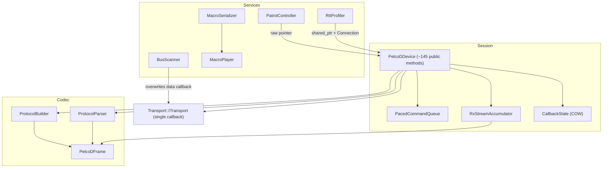
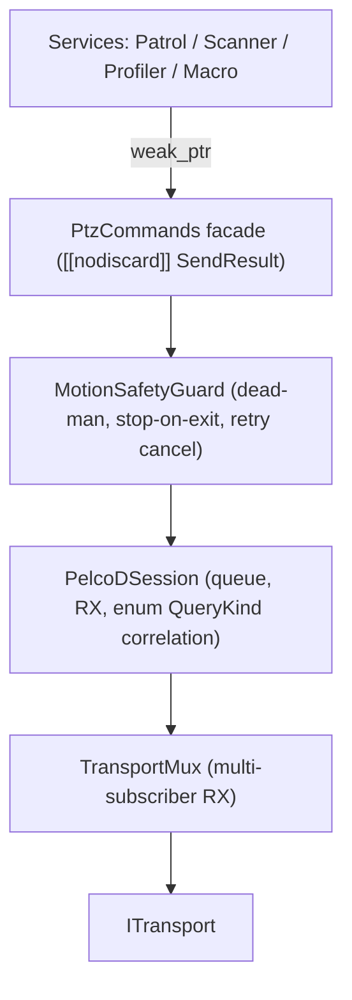

# PelcoDCore — Senior Engineering & Architecture Review

**Scope:** `libs/PelcoDCore/` (14 headers, 13 sources, ~290 KB) plus its unit tests in `libs/PelcoDCore/tests/`.
**Baseline:** the project rules in `.agents/rules/compliance.md` (MISRA C++:2023 and SEI CERT C++) and `.agents/rules/verification-checklist.md`.
**Method:** I read every header and source line by line, ran mechanical checklist scans, and built a standalone repro harness (in the scratch directory, outside the repo) to confirm the most serious defects.

---

## 1. Executive Summary

| Dimension | Verdict |
|---|---|
| Layering / modularity | 🟢 Good. The library is cleanly layered, has zero Qt dependencies, and abstracts transport behind an interface. |
| Protocol coverage (encoder) | 🟢 All 54 `CommandOpcode` values have a builder. |
| Protocol coverage (decoder, state model) | 🟡 Partial. Several responses are thrown away, and many `DeviceStatus` fields are never written. |
| Thread safety | 🔴 Data races, lost updates, use-after-free windows, and `std::terminate` paths. |
| Functional safety (PTZ motion) | 🔴 There is no fail-safe stop, and a retried motion command can run *after* a stop. |
| Input robustness | 🔴 The macro parsers silently corrupt frames. RX framing misreads the default-address ACKs. |
| Checklist compliance | 🟡 6 of 12 items pass. Doxygen, `[[nodiscard]]`, and MISRA/CERT fail. |
| Tests | 🟡 12 suites, good breadth. None of them catch the defects below. No concurrency or boundary tests. |

**Bottom line:** the design is sound and well organised. The library is **not production-ready for unattended or safety-relevant PTZ control** until the P0 items in §7 are fixed. Two of them crash the process today with ordinary API call sequences.

---

## 2. Architecture Assessment

### 2.1 Current structure

```
                        ┌───────────────────────────────────────────────┐
  Higher-level services │ PatrolController  BusScanner  RttProfiler     │  each owns a std::thread
                        │ MacroPlayer ◄── MacroSerializer               │
                        └──────┬───────────────┬────────────┬───────────┘
                               │ raw ptr       │ ITransport │ shared_ptr + Connection
                               ▼               │ (hijacks   ▼
                        ┌─────────────────────────────────────────────┐
  Session / facade      │ PelcoDDevice  (~145 public methods)         │  worker thread
                        │  ├─ PacedCommandQueue (priority, retry)     │  + RX thread (transport)
                        │  ├─ RxStreamAccumulator (framing)           │  + 1 detached thread
                        │  ├─ query correlation (string tags)         │    per *Async() call
                        │  ├─ CallbackState (COW lists)               │
                        │  └─ stats / polling / retry policy          │
                        └──────┬──────────────────────────────────────┘
                               ▼
  Codec                 ProtocolBuilder ──► PelcoDFrame ◄── ProtocolParser
                               ▼
  Transport             Transport::ITransport (single data callback)
```



### 2.2 Strengths
- **Clean dependency direction.** Codec → session → services, with no cycles and no Qt (checklist item 4 passes).
- **Copy-on-write callback lists** (`shared_ptr<const vector>`). Callbacks are invoked without holding locks, which avoids most re-entrancy deadlocks in `PelcoDDevice`.
- **Priority queue with Urgent pre-emption**, bounded capacity, and backoff-scheduled retries.
- **Bounded buffers** (RX accumulator is 4 KB, `splitStream` is capped at 1 MB / 2048 frames). This is a good DoS posture.
- **`Connection` / `ScopedConnection` RAII** subscription model.
- The hardening flags in `cmake/CompilerFlags.cmake` are excellent: `/W4 /WX`, `-Werror`, CFG, EHCONT, `_FORTIFY_SOURCE=3`, stack-clash protection, and ASan/UBSan/TSan options.

### 2.3 Architectural weaknesses

| # | Issue | Impact |
|---|---|---|
| A1 | **`PelcoDDevice` is a god class.** One class owns lifecycle, I/O, framing, correlation, retry, polling, stats, six callback channels, and ~110 command wrappers. | It is hard to reason about thread safety, and every new opcode touches four places. |
| A2 | **Query correlation is stringly typed** (`"QueryPan"` and so on). An unknown tag falls through to "match any query response". | A typo silently matches the wrong frames, and there is no compile-time safety. |
| A3 | **Fire-and-forget command API.** Every command returns `void`. Queue overflow, a closed transport, or a dropped retry is invisible to the caller. | Callers cannot detect lost safety commands. It also conflicts with the intent of checklist item 8. |
| A4 | **`ITransport` allows only one data callback.** `BusScanner` overwrites it and never restores or clears it. | Using a shared transport breaks `PelcoDDevice` and leaves a dangling `this`. |
| A5 | **`Connection::disconnect()` is not a synchronisation barrier.** Snapshot lists can still invoke a callback after disconnect returns. | Use-after-free for any subscriber that captures `this` (see H3). |
| A6 | **Thread proliferation.** There are threads for the device worker, Patrol, BusScanner, RttProfiler, MacroPlayer, plus one detached thread per `*Async()` call. | Lifecycle bugs (C1, C2), unbounded threads, and shutdown hazards. |
| A7 | **Fixed 7-byte frames are heap `std::vector`s.** | Allocation on every command on the hot path. MISRA C++:2023 Rule 21.6.1 (advisory) discourages dynamic memory. `std::array<uint8_t,7>` fits naturally. |
| A8 | **No motion-safety layer** (no dead-man timer, no stop-on-disconnect, no stop-on-shutdown). | The camera keeps moving if the controller dies (see C5). |

### 2.4 Recommended target structure

```
  ┌──────────────────────────────────────────────────────────────────┐
  │ PtzCommands (thin facade, returns [[nodiscard]] SendResult)      │
  └───────────────┬──────────────────────────────────────────────────┘
                  ▼
  ┌──────────────────────────┐   ┌──────────────────────────────────┐
  │ MotionSafetyGuard        │──►│ PelcoDSession                    │
  │  dead-man / stop-on-exit │   │  queue + RX + correlation(enum)  │
  │  cancels stale retries   │   │  single strand, no shared m_status│
  └──────────────────────────┘   └───────────────┬──────────────────┘
                                                 ▼
                       ITransport + TransportMux (fan-out RX to N subscribers)
```



---

## 3. Compliance Matrix (project checklist)

| # | Checklist item | Result | Evidence |
|---|---|---|---|
| 1 | No raw `new`/`delete` | ✅ Pass | The scan found only comments. |
| 2 | `#pragma once` only | ✅ Pass | All 14 headers use it. No `#ifndef` guards. |
| 3 | `.h`/`.cpp` co-located | ✅ Pass | |
| 4 | Zero Qt in Core | ✅ Pass | 0 `#include <Q…>`. |
| 5 | Function names < 30 chars | ✅ Pass | The longest is `buildSetManualRightPanLimit` (27). |
| 6 | Linux + Windows transport | ✅ Delegated | Core contains no OS code. This is delegated to `libs/Transport`. |
| 7 | `{}` initialisation | 🟡 Partial | Copy-init (`const std::size_t len = frame.size();`) is used widely in `PelcoDFrame.cpp`, `ProtocolParser.cpp`, and `PelcoDDevice.cpp`. |
| 8 | `[[nodiscard]]` on status returns | ❌ Fail | It is missing on `PatrolController::start/removeStep/setStep`, `BusScanner::startScan`, `RttProfiler::start/exportCsv/exportJson`, `MacroPlayer::start/stepNext`, and all six `PelcoDDevice::remove*Callback`. All command APIs return `void` (A3). |
| 9 | Full Doxygen on public APIs | ❌ Fail | `PelcoDDevice.h` has ≈93 of 145 declarations undocumented. `PatrolController.h` has 32 of 32 undocumented. About half of `ProtocolBuilder.h` is undocumented. `DeviceStatus`, `PelcoDProtocolStats`, and `CommandItem` fields use `//` instead of `///<`. `@details` is rare. |
| 10 | MISRA / CERT | ❌ Fail | See §4. |
| 11 | Failing test first for bugs | n/a | No regression tests exist for any finding in §4. |
| 12 | Zero warnings `/W4` + hardening | ✅ Pass* | *5 TUs compiled cleanly with `/W4` in the repro harness. The flags are present in `cmake/CompilerFlags.cmake`. |

---

## 4. Findings

Severity scale: **Critical** means a crash, UB, or physical-safety hazard reachable through normal use. **High** means incorrect behaviour or a data race. **Medium** means a robustness or completeness gap. **Low** means style or advisory.
✅ marks findings that were **empirically reproduced** (see §5).

### 4.1 Critical

| ID | Finding | Location | Rule |
|---|---|---|---|
| **C1** ✅ 🛠️ **Fixed** | **`PatrolController::start()` while Paused calls `std::terminate`.** The early-return only checks `Running`, so a new `std::thread` is move-assigned into the still-joinable `m_worker`. **C1b (same class):** `start()` called from a patrol callback on the worker thread joined itself (`std::system_error` → `std::terminate`). **Fix:** `start()` from Paused now signals and joins the old worker (without holding `m_mutex`) and restarts from step 0. `resume()` is still the way to continue a paused tour. `start()` returns `false` when called on the worker thread. Regression tests: `StartWhilePausedRestarts`, `StartAfterSetStepsWhilePaused`, `PauseStartCycleStress`, `StartFromFinishedCbFails`, `RestartAfterTourFinished` in `libs/PelcoDCore/tests/TestPatrolController.cpp`. | `libs/PelcoDCore/PatrolController.cpp` (`start`, `joinWorker`) | CERT CON (thread lifetime) |
| **C2** 🛠️ **Fixed** | **`RttProfiler::start()` after a completed ActiveBurst calls `std::terminate`.** The worker finishes and clears `m_running`, but `m_worker` is never joined before it is reassigned. This is the same defect class as C1 and happens with an ordinary "run burst twice" workflow. **C2b–C2f (same class):** `start()` from a worker-thread callback reassigned its own thread. `stop()`/`setDevice()` from a worker-thread callback self-joined (`std::system_error` → `std::terminate`). `stop()` and the worker disconnected `m_deviceLatencyConn` concurrently. `m_stopRequested` was set outside `m_mutex` (lost wake-up). Concurrent `start()`/`stop()` raced on `m_worker`. **Fix:** `start()` joins a finished worker (`joinWorker()`) before respawning and returns `false` on the worker thread (detected via `std::atomic<std::thread::id>`). `stop()` on the worker thread only requests the stop. A new `m_lifecycleMutex` (never held across callbacks) serialises `start()`/`stop()`. `start()` claims a session, fires `stateCb(true)` unlocked, then spawns only if that session is still live. The latency hook is disconnected only after the join. `start()` is now `[[nodiscard]]`. Regression tests: `BurstTwiceRestarts`, `BurstRestartStress`, `StartFromFinishedCbFails`, `StopFromFinishedCbIsSafe`, `StateCbOrderAcrossRestarts`, `StopInStartedCbNoWorker`, `StopDuringIntervalIsPrompt`, `ConcurrentStartStopStress`, `PassiveActiveCycles` in `libs/PelcoDCore/tests/TestRttProfiler.cpp`. | `libs/PelcoDCore/RttProfiler.cpp` (`start`, `stop`, `joinWorker`) | CERT CON |
| **C3** ✅ 🛠️ **Fixed** | **Derived-class destruction race.** `stop()` runs only in `~PelcoDDevice`. `FujinonSX800Device` overrode `dispatchFrame`/`isResponseMatchingQuery` and had a defaulted destructor, so the RX thread could call virtuals on a partially destroyed object (**C3a**; reproduced as an access violation). **C3b (same class):** `stop()` was not an RX barrier even for the base class. Transports invoke a *copy* of the data/state callback outside their lock (`BaseTransport::invokeDataCallback`, `MockPelcoDDevice`, `LatencyPipeline`), so `setDataCallback(nullptr)` did not stop an in-flight `[this]` callback, and stale callbacks from an earlier session could still mutate a restarted device. **Fix:** a new Qt-free `CallbackGate` (lock-free admission, re-entrant `close()`) is created per session in `start()`. Both transport lambdas enter it. `stop()` closes the gate and waits for in-flight callbacks *without* holding the lifecycle lock (so `stop()` from inside a callback is safe), then joins the worker and closes the transport, emitting exactly one `connected=false` status. The RX-thread virtuals were replaced by a shared-owned `IFrameExtension` hook (`setFrameExt()`): Fujinon's state, subscribers, and query matching moved into `FujinonFrameExt`, which the base co-owns, so it outlives every in-flight RX call. `FujinonSX800Device` is now `final`. The destructor catches exceptions from `stop()`. Destroying a device from inside its own callback remains UB (documented). Regression tests: `StaleRxCbIgnoredAfterStop`, `StaleRxCbIgnoredAfterRestart`, `StaleStateCbIgnoredAfterRestart`, `DtorWaitsForInFlightRx`, `StopFromRxCallbackIsSafe` in `libs/PelcoDCore/tests/TestPelcoDDevice.cpp`; `FujinonDtorWaitsForRx` in `libs/PelcoDFujinon/tests/TestFujinonSX800Device.cpp`; gate unit tests in `libs/PelcoDCore/tests/TestCallbackGate.cpp`. | `libs/PelcoDCore/PelcoDDevice.cpp` (`start`, `stop`, `dispatchFrame`), `libs/PelcoDCore/CallbackGate.h`, `libs/PelcoDCore/FrameExtension.h`, `libs/PelcoDFujinon/FujinonSX800Device.h` | CERT OOP50-CPP, UB |
| **C4** ✅ 🛠️ **Fixed** | **A retried motion command can run after a stop.** A failed send of, say, pan-left is re-queued with backoff (`retryOnTransportError` defaults to `true`). A later Urgent `stopMotion()` goes to the front of the queue but does not cancel the pending retry, so the camera resumes moving after the stop. **Fix:** Each `CommandItem` is tagged with a monotonic motion generation token. Enqueuing a newer motion or stop command advances `m_currentMotionGeneration` and purges older motion items and pending retries from `PacedCommandQueue`. `workerLoop` and `scheduleRetry` reject and drop retries for obsolete motion generations. `zoomStop()`, `focusStop()`, and `irisStop()` are elevated to `CommandPriority::Urgent`. Regression tests: `UrgentStopPurgesPendingMotionRetries`, `NewerMotionPurgesOlderMotionAndRetries`, `ScheduleRetryRejectsObsoleteGeneration` in `libs/PelcoDCore/tests/TestCommandQueue.cpp`; `MotionRetryCancelledByStopMotion`, `MotionRetryCancelledByDirectionChange` in `libs/PelcoDCore/tests/TestPelcoDDevice.cpp`. | `libs/PelcoDCore/PelcoDDevice.cpp`, `libs/PelcoDCore/PacedCommandQueue.cpp`, `libs/PelcoDCore/PelcoDFrame.cpp` | Functional safety |
| **C5** | **No fail-safe stop.** `stop()` and the destructor close the transport without sending a Stop frame. A transport `Disconnected` event doesn't stop motion. `zoomStop`/`focusStop`/`irisStop` are *Normal* priority and are the first to be dropped on queue overflow. A Pelco-D head keeps executing its last motion command forever. | `libs/PelcoDCore/PelcoDDevice.cpp:88-126, 442-475`, `libs/PelcoDCore/PacedCommandQueue.cpp:22-37` | Functional safety |

### 4.2 High

| ID | Finding | Location | Rule |
|---|---|---|---|
| **H1** | **Data race on `m_querySentTime`.** It is written by the worker under `m_statusMutex` and read by the RX thread with no lock. | `libs/PelcoDCore/PelcoDDevice.cpp:1103` vs `:1311` | CERT CON43-C (UB) |
| **H2** | **Lost update in `dispatchFrame`.** It copies `m_status`, mutates the copy unlocked, and writes the whole struct back. A concurrent `connected=false` (state callback) or `setAddress()` gets reverted. | `libs/PelcoDCore/PelcoDDevice.cpp:1286-1307` | CERT CON (TOCTOU) |
| **H3** | **Callbacks can run after disconnect, and `Connection` is not thread-safe despite its documentation.** Because of COW snapshots, a callback can fire after `disconnect()` returns, which is a UAF for `RttProfiler`'s `[this]` lambda. `RttProfiler::stop()` and its worker both call `m_deviceLatencyConn.disconnect()` concurrently, which races on `std::function`. *The concurrent-`disconnect()` race in `RttProfiler` was fixed with C2; the callback-after-disconnect UAF is still open. `CallbackGate` (added for C3) is the intended building block for making `disconnect()` a barrier.* | `libs/PelcoDCore/Connection.h:19,48-54`, `libs/PelcoDCore/RttProfiler.cpp:69-71, 93, 320` | CERT CON43-C, EXP54-CPP |
| **H4** ✅ | **RX framing misreads ACKs from the default address (1).** `FF 01 00 01 …` passes the 4-byte checksum (`01+00 == 01`). When a 7-byte reply arrives in chunks of fewer than 7 bytes, a bogus *General Response* is emitted, the real ACK is lost, and `status.alarms` is overwritten. The same misreading is deterministic for any address equal to the response opcode (0x59, 0x5B, 0x5D…), and probabilistic (~1/256) otherwise. | `libs/PelcoDCore/RxStreamAccumulator.cpp:60-76`, `libs/PelcoDCore/PelcoDFrame.cpp:108-130` | Correctness |
| **H5** ✅ | **`fromScript` drops the checksum byte when the documented-optional delay is omitted.** A trailing all-decimal hex byte (`25`, `01`, …) is taken as the delay, which affects ~39% of frames. `validate()` then **accepts** the 6-byte frame because it only checks 7-byte frames, so malformed frames reach the bus. | `libs/PelcoDCore/MacroScript.cpp:291-305, 370-378` | Input validation |
| **H6** | **`fromJson` is a substring scanner, not a parser.** It finds the end of `steps` with the first `]` and step objects with the first `}`, so a label like `"Pan [fast]"` truncates the macro. Keys are searched globally (a step label containing `"name"` is matched). The header promises `@throws std::runtime_error`, but nothing ever throws. Data is lost silently. | `libs/PelcoDCore/MacroScript.cpp:62-212` | CERT (input validation) |
| **H7** | **BusScanner has three problems.** (a) Any frame that carries the probe address counts as a hit, *including the scanner's own TX echoed back* (common with RS-485 adapters), so every address is "discovered". (b) It overwrites the transport data callback and never restores or clears it, leaving a dangling `this` and breaking a `PelcoDDevice` on the same transport. (c) It invokes `stateCb` while holding `m_mutex`, which deadlocks on re-entry. | `libs/PelcoDCore/BusScanner.cpp:199, 55, 65-68` | Correctness, CERT CON |
| **H8** | **MacroPlayer has three problems.** (a) `setState()` and `stepNext()` invoke user callbacks under `m_mutex`, so a re-entrant `pause()`/`stop()` deadlocks. (b) `sequence()` returns a reference after unlocking, which is a data race. (c) Calling `stepNext()` from Idle sets Paused, and `start()` then takes the resume path with **no worker thread**, so playback silently never runs. | `libs/PelcoDCore/MacroPlayer.cpp:190-196, 125-158, 48-52, 66-70` | CERT CON |
| **H9** ✅ | **Builders silently corrupt values.** Speed uses a bitmask rather than saturation, so `0x80` becomes `0x00` (no motion) and `0x50` becomes `0x10`. Zoom/focus speed wraps (`& 0x03`). `buildSetMagnification(uint16)` drops the MSB. `buildSetBaudRate` maps unsupported rates silently (57600→38400, 1200→2400), so a remote baud change can strand the device. | `libs/PelcoDCore/ProtocolBuilder.cpp:48-49, 192-198, 300-325` | MISRA (implicit narrowing), safety |
| **H10** | **Floating-point and signed overflow UB in backoff and delay maths.** `pow(mult, attempt)` is converted to `long long` with no range check. The Linear strategy multiplies `long long × uint32` (mixed sign, possible overflow). In `MacroPlayer`, `delayMs / speed` is converted to `uint32_t` and can overflow at speed 0.05. | `libs/PelcoDCore/RetryPolicy.h:61-73`, `libs/PelcoDCore/MacroPlayer.cpp:258` | CERT FLP34-C, INT32-C |

### 4.3 Medium

| ID | Finding | Location |
|---|---|---|
| M1 | **Some query outcomes are never reported.** With the default `maxRetries=0`, a send failure emits no completion. Urgent pre-emption and the Urgent enqueue's purge of Low-priority items also drop queries without notifying anyone. Async futures fall back to their detached timer. | `PelcoDDevice.cpp:1139`, `PacedCommandQueue.cpp:39-47` |
| M2 | **Unsolicited frames (alarms, ACKs) are dropped entirely while a query is pending.** | `PelcoDDevice.cpp:1282-1284` |
| M3 | **A user callback that throws reaches the worker or RX thread and calls `std::terminate`.** There is no exception boundary. | all `entry.cb(...)` loops in `PelcoDDevice.cpp` |
| M4 | **Async query problems.** There is one detached thread per `*Async()` call. With `timeout<=0` the callback is never unregistered. `queryStatusAsync` only queries pan, despite being documented as "full status". | `PelcoDDevice.cpp:899-916, 942-946` |
| M5 | **Parser problems.** The per-message `parse*` functions don't check the checksum. Raw bytes are cast to enums (MISRA C++:2023 Rule 10.2.x). Time and Limit responses are discarded. Everest alarms overwrite general alarms. | `ProtocolParser.cpp:25-157, 196, 244-273` |
| M6 | **Dead state model.** `focusPosition`, `irisPosition`, `zoomSpeed`, `focusSpeed`, `autoFocus/autoIris/agc/backlightComp/autoWhiteBalance`, `activePreset`, the four limit fields, and `DeviceInfo::serialNumber` are never written by Core. `PatrolStep::speed` and `MacroStep::expectResponse` are ignored. | `DeviceStatus.h`, `PelcoDTypes.h:217`, `PatrolController.h:30`, `MacroScript.h:19` |
| M7 | **`connected` is never set back to `true` on transport reconnect.** | `PelcoDDevice.cpp:37-64` |
| M8 | **`start()` is not exception-safe.** If the `std::thread` constructor throws, `m_running=true` and the registered `this` callbacks are left behind. | `PelcoDDevice.cpp:74-85` |
| M9 | **`RttProfiler` statistics are polluted and exports are unescaped.** All device queries (including telemetry polling) are recorded as probes. JSON/CSV export doesn't escape `queryTag`. | `RttProfiler.cpp:69-71, 378, 411` |
| M10 | **`PatrolController` holds a raw `PelcoDDevice*` with no lifetime management**, which is a UAF if the device dies first. | `PatrolController.cpp:252-260` |
| M11 | **BusScanner baud handling.** `standardBaudRates()` includes 57600, which `buildSetBaudRate` can't encode. The scanner also changes the baud rate on a possibly shared transport. | `BusScanner.h:58`, `BusScanner.cpp:247` |
| M12 | **`PelcoDDevice` facade gaps.** It has no `setPower`, `setAutoScan`, or combined PTZ+zoom/focus/iris move, even though the builders exist. Pelco-P is mentioned in `MacroScript.h` but isn't implemented. | `PelcoDDevice.h` |

### 4.4 Low / MISRA advisory

| ID | Finding | Location |
|---|---|---|
| L1 | C-style arrays (`kHexDigits`, `candidateSizes`). | MISRA 11.3.1 — `PelcoDFrame.cpp:152`, `RxStreamAccumulator.cpp:60` |
| L2 | Shifts and ORs on promoted *signed* `int`. It is fixed with `uint16_t` casts elsewhere, so it is inconsistent. | MISRA 7.0/8.x — `ProtocolParser.cpp:33,45,57,69`, `PelcoDFrame.cpp:218` |
| L3 | `long long` / `int` used instead of fixed-width types. | `RetryPolicy.h:62,71`, `PelcoDDevice.cpp:1015`, `PatrolController.h:111`, `BusScanner.cpp:269` |
| L4 | Non-basic source character `°` in string literals. | `ProtocolParser.cpp:505,511,527` |
| L5 | `describeFrame` problems: the 18-byte payload isn't filtered for non-printables (log injection). About 25 TX opcodes are missing. Power-on (`cmd1=0x88`) is decoded as "PTZ Stop". Magic numbers duplicate `CommandOpcode`. | `ProtocolParser.cpp:298-579` |
| L6 | `noexcept` functions that can throw: `MacroPlayer::sequence` (mutex), `MacroSerializer::validate` (string alloc), `ScopedConnection::disconnect` → a non-noexcept `std::function`. Any throw becomes `std::terminate`. | various |
| L7 | `MacroPlayer` move operations are `= default` but are implicitly deleted (mutex/cv members), contradicting the "allow moving" comment. | `MacroPlayer.h:63-67` |
| L8 | `std::find_if` is used without `<algorithm>`. `PelcoDStats.h` is missing from CMake sources. `<random>` and `<cmath>` are unused. | `PelcoDDevice.h:515`, `CMakeLists.txt`, `PacedCommandQueue.cpp:7,9` |
| L9 | All-static classes have defaulted constructors (they should be namespaces). The MSB/LSB split is duplicated 6× despite the `build16BitCmd` helper. | `ProtocolBuilder.*`, `ProtocolParser.h` |
| L10 | `fromHexString` silently drops non-hex characters (`"zebra"` → `0xEB`), contradicting "empty if invalid". | `PelcoDFrame.cpp:196-224` |
| L11 | Erasing from the front of a vector is O(n²) under noise. `checksumErrors` counts per-byte slides rather than frames. | `RxStreamAccumulator.cpp:52,84-86` |

---

## 5. Empirical Evidence

The harness lives at `scratch/repro/repro.cpp` in the artifact directory, not in the repo. It was compiled with MSVC 19.44 `/std:c++17 /W4` against the unmodified Core sources.

```text
R1 fromScript without explicit delay (documented as optional):
  frame [6]: FF 01 00 04 20 00          <- checksum 0x25 lost
  delayMs=25  validate=1                <- accepted as valid
R2 buildPan speed masking (0x80 requested):
  frame [7]: FF 01 00 04 00 00 05       <- speed 0 = no motion
R3 buildSetMagnification(0x0250) MSB handling:
  frame [7]: FF 01 00 5F 00 50 B0       <- 0x02 MSB dropped
R4 buildSetBaudRate(57600) / (1200):
  57600 [7]: FF 01 00 67 00 04 6C       <- silently 38400
   1200 [7]: FF 01 00 67 00 00 68       <- silently 2400
R5 ACK frame from address 1 delivered in two chunks (5 + 2 bytes):
  wire [7]: FF 01 00 01 07 01 0A
  chunk1 frame [4]: FF 01 00 01         <- bogus General Response
  leftover buffered=3                   <- real ACK lost
R6 PatrolController: start() -> pause() -> start():
  >>> std::terminate() called           exit code: 99
```

---

## 6. Test Coverage Gaps

The existing 12 suites cover happy paths well. None of them exercise:

- Chunked RX at every byte boundary, or address-collision cases (H4).
- Script lines without a delay, or JSON labels containing `[`, `]`, `{`, `}`, or `"name"` (H5, H6).
- Lifecycle sequences: `stepNext`→`start`, scanner stop from inside a callback (H7, H8). *Patrol start→pause→start (C1) and burst→burst (C2) are now covered.*
- Retry-then-stop ordering (C4). *Destroying a derived device while traffic is flowing (C3) is now covered.*
- Re-entrant callbacks, or callbacks that throw (M3, H8).
- TSan runs. The `-fsanitize=thread` option exists in CMake, but there is no CI evidence that it is used. H1, H2, and H3 would be flagged immediately.

---

## 7. Remediation Roadmap

Per `.agents/rules/verification-checklist.md` item 11, each fix should start with a failing regression test.

### P0 — crashes and physical safety (do first)
1. **C1/C2:** join a finished `m_worker` before reassigning it. Make `start()` from Paused delegate to `resume()`. *C1 and C2 are done. `PatrolController` uses restart-from-step-0 semantics instead of delegating, so that `setSteps()` + `start()` while paused dispatches the new first step. `RttProfiler` reuses the `joinWorker()` pattern.*
2. **C3:** add a protected `shutdown()`. Require derived destructors to call it, or switch to composition (`final` + strategy) so no virtual call can happen during destruction. *Done via composition: a per-session `CallbackGate` makes `stop()` an RX barrier, and a shared-owned `IFrameExtension` replaces the RX-thread virtuals. `FujinonSX800Device` is `final`.*
3. **C4:** tag each `CommandItem` with a motion "generation". Any Urgent or newer motion command purges or invalidates older motion items and their retries. *Done: monotonic motionGeneration token assigned to standard motion and stop frames. PacedCommandQueue purges older generations on enqueue and popReady, and scheduleRetry / workerLoop drop obsolete retries. zoomStop/focusStop/irisStop elevated to Urgent.*
4. **C5:** add a `MotionSafetyGuard`: best-effort Stop in `stop()` and the destructor, Stop on `Disconnected`, an optional dead-man timer, and Urgent priority for all `*Stop()` commands.
5. **H1/H2:** guard `m_querySentTime` with the mutex (or make it atomic). Apply parser updates to `m_status` under the lock instead of copy-and-replace.
6. **H3:** make `disconnect()` wait for in-flight invocations (generation counter + CV), or document that callers must hold a `shared_ptr`/`weak_ptr` and stop capturing raw `this`.

### P1 — correctness
7. **H4:** framing needs context. Wait for 7 bytes unless an inter-byte timeout elapses, and accept 4-byte frames only when a general response is expected. Unify `splitStream` with the accumulator.
8. **H5/H6:** require an explicit delay separator (e.g. `@150`), or reject a final token if the frame isn't 7 bytes. Replace the JSON scanner with a real parser (`nlohmann-json` via vcpkg) and throw as documented. Make `validate()` reject anything that isn't a 4, 7, or 18-byte valid frame.
9. **H7:** require `parsePan` success and ignore frames identical to the probe. Add a transport multiplexer (A4). Invoke callbacks outside the lock.
10. **H8:** move callbacks outside the lock, return `sequence()` by value, and spawn the worker in `start()` when none exists.
11. **H9/H10:** saturate with `std::min` instead of masking. Return `std::optional<Frame>` for unrepresentable inputs (baud, magnification). Range-check before every floating-point to integer conversion.

### P2 — completeness and compliance
12. Add a `QueryKind` enum to replace string tags (A2, M5), `[[nodiscard]] SendResult` returns (A3, checklist 8), and complete Doxygen coverage (checklist 9).
13. Wire up or remove the dead `DeviceStatus` fields (M6). Add the missing facade methods (M12). Decode the Time and Limit responses.
14. Clear the MISRA advisories (L1–L4), use `std::array` frames (A7), and add an exception boundary around callbacks (M3).
15. Add a TSan job and the regression tests from §6 to CI.
