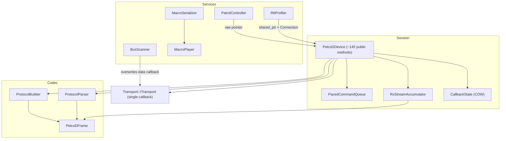
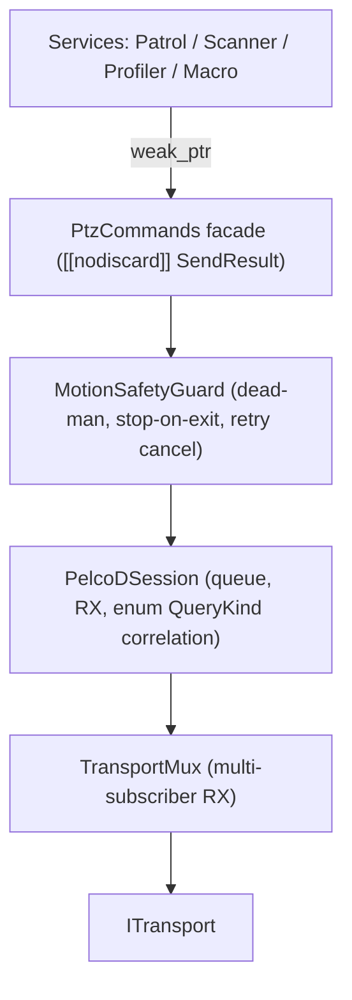

# PelcoDCore — Senior Engineering & Architecture Review

**Scope:** `libs/PelcoDCore/` (14 headers, 13 sources, ~290 KB) plus its unit tests in `libs/PelcoDCore/tests/`.
**Baseline:** the project rules in `.agents/rules/compliance.md` (MISRA C++:2023 and SEI CERT C++) and `.agents/rules/verification-checklist.md`.
**Method:** I read every header and source line by line, ran mechanical checklist scans, and built a standalone repro harness (in the scratch directory, outside the repo) to confirm the most serious defects.

---

## 1. Executive Summary

| Dimension | Verdict |
|---|---|
| Layering / modularity | 🟢 Good. The library is cleanly layered, has zero Qt dependencies, and abstracts transport behind an interface. |
| Protocol coverage (encoder) | 🟢 All 54 `CommandOpcode` values have a builder. |
| Protocol coverage (decoder, state model) | 🟡 Partial. Several responses are thrown away, and many `DeviceStatus` fields are never written. |
| Thread safety | 🔴 Data races, lost updates, use-after-free windows, and `std::terminate` paths. |
| Functional safety (PTZ motion) | 🔴 There is no fail-safe stop, and a retried motion command can run *after* a stop. |
| Input robustness | 🔴 The macro parsers silently corrupt frames. RX framing misreads the default-address ACKs. |
| Checklist compliance | 🟡 6 of 12 items pass. Doxygen, `[[nodiscard]]`, and MISRA/CERT fail. |
| Tests | 🟡 12 suites, good breadth. None of them catch the defects below. No concurrency or boundary tests. |

**Bottom line:** the design is sound and well organised. The library is **not production-ready for unattended or safety-relevant PTZ control** until the P0 items in §7 are fixed. Two of them crash the process today with ordinary API call sequences.

---

## 2. Architecture Assessment

### 2.1 Current structure

```
                        ┌───────────────────────────────────────────────┐
  Higher-level services │ PatrolController  BusScanner  RttProfiler     │  each owns a std::thread
                        │ MacroPlayer ◄── MacroSerializer               │
                        └──────┬───────────────┬────────────┬───────────┘
                               │ raw ptr       │ ITransport │ shared_ptr + Connection
                               ▼               │ (hijacks   ▼
                        ┌─────────────────────────────────────────────┐
  Session / facade      │ PelcoDDevice  (~145 public methods)         │  worker thread
                        │  ├─ PacedCommandQueue (priority, retry)     │  + RX thread (transport)
                        │  ├─ RxStreamAccumulator (framing)           │  + 1 detached thread
                        │  ├─ query correlation (string tags)         │    per *Async() call
                        │  ├─ CallbackState (COW lists)               │
                        │  └─ stats / polling / retry policy          │
                        └──────┬──────────────────────────────────────┘
                               ▼
  Codec                 ProtocolBuilder ──► PelcoDFrame ◄── ProtocolParser
                               ▼
  Transport             Transport::ITransport (single data callback)
```



### 2.2 Strengths
- **Clean dependency direction.** Codec → session → services, with no cycles and no Qt (checklist item 4 passes).
- **Copy-on-write callback lists** (`shared_ptr<const vector>`). Callbacks are invoked without holding locks, which avoids most re-entrancy deadlocks in `PelcoDDevice`.
- **Priority queue with Urgent pre-emption**, bounded capacity, and backoff-scheduled retries.
- **Bounded buffers** (RX accumulator is 4 KB, `splitStream` is capped at 1 MB / 2048 frames). This is a good DoS posture.
- **`Connection` / `ScopedConnection` RAII** subscription model.
- The hardening flags in `cmake/CompilerFlags.cmake` are excellent: `/W4 /WX`, `-Werror`, CFG, EHCONT, `_FORTIFY_SOURCE=3`, stack-clash protection, and ASan/UBSan/TSan options.

### 2.3 Architectural weaknesses

| # | Issue | Impact |
|---|---|---|
| A1 | **`PelcoDDevice` is a god class.** One class owns lifecycle, I/O, framing, correlation, retry, polling, stats, six callback channels, and ~110 command wrappers. | It is hard to reason about thread safety, and every new opcode touches four places. |
| A2 | **Query correlation is stringly typed** (`"QueryPan"` and so on). An unknown tag falls through to "match any query response". | A typo silently matches the wrong frames, and there is no compile-time safety. |
| A3 | **Fire-and-forget command API.** Every command returns `void`. Queue overflow, a closed transport, or a dropped retry is invisible to the caller. | Callers cannot detect lost safety commands. It also conflicts with the intent of checklist item 8. |
| A4 | **`ITransport` allows only one data callback.** `BusScanner` overwrites it and never restores or clears it. | Using a shared transport breaks `PelcoDDevice` and leaves a dangling `this`. |
| A5 | **`Connection::disconnect()` is not a synchronisation barrier.** Snapshot lists can still invoke a callback after disconnect returns. | Use-after-free for any subscriber that captures `this` (see H3). |
| A6 | **Thread proliferation.** There are threads for the device worker, Patrol, BusScanner, RttProfiler, MacroPlayer, plus one detached thread per `*Async()` call. | Lifecycle bugs (C1, C2), unbounded threads, and shutdown hazards. |
| A7 | **Fixed 7-byte frames are heap `std::vector`s.** | Allocation on every command on the hot path. MISRA C++:2023 Rule 21.6.1 (advisory) discourages dynamic memory. `std::array<uint8_t,7>` fits naturally. |
| A8 | **No motion-safety layer** (no dead-man timer, no stop-on-disconnect, no stop-on-shutdown). | The camera keeps moving if the controller dies (see C5). |

### 2.4 Recommended target structure

```
  ┌──────────────────────────────────────────────────────────────────┐
  │ PtzCommands (thin facade, returns [[nodiscard]] SendResult)      │
  └───────────────┬──────────────────────────────────────────────────┘
                  ▼
  ┌──────────────────────────┐   ┌──────────────────────────────────┐
  │ MotionSafetyGuard        │──►│ PelcoDSession                    │
  │  dead-man / stop-on-exit │   │  queue + RX + correlation(enum)  │
  │  cancels stale retries   │   │  single strand, no shared m_status│
  └──────────────────────────┘   └───────────────┬──────────────────┘
                                                 ▼
                       ITransport + TransportMux (fan-out RX to N subscribers)
```



---

## 3. Compliance Matrix (project checklist)

| # | Checklist item | Result | Evidence |
|---|---|---|---|
| 1 | No raw `new`/`delete` | ✅ Pass | The scan found only comments. |
| 2 | `#pragma once` only | ✅ Pass | All 14 headers use it. No `#ifndef` guards. |
| 3 | `.h`/`.cpp` co-located | ✅ Pass | |
| 4 | Zero Qt in Core | ✅ Pass | 0 `#include <Q…>`. |
| 5 | Function names < 30 chars | ✅ Pass | The longest is `buildSetManualRightPanLimit` (27). |
| 6 | Linux + Windows transport | ✅ Delegated | Core contains no OS code. This is delegated to `libs/Transport`. |
| 7 | `{}` initialisation | 🟡 Partial | Copy-init (`const std::size_t len = frame.size();`) is used widely in `PelcoDFrame.cpp`, `ProtocolParser.cpp`, and `PelcoDDevice.cpp`. |
| 8 | `[[nodiscard]]` on status returns | ❌ Fail | It is missing on `PatrolController::start/removeStep/setStep`, `BusScanner::startScan`, `RttProfiler::start/exportCsv/exportJson`, `MacroPlayer::start/stepNext`, and all six `PelcoDDevice::remove*Callback`. All command APIs return `void` (A3). |
| 9 | Full Doxygen on public APIs | ❌ Fail | `PelcoDDevice.h` has ≈93 of 145 declarations undocumented. `PatrolController.h` has 32 of 32 undocumented. About half of `ProtocolBuilder.h` is undocumented. `DeviceStatus`, `PelcoDProtocolStats`, and `CommandItem` fields use `//` instead of `///<`. `@details` is rare. |
| 10 | MISRA / CERT | ❌ Fail | See §4. |
| 11 | Failing test first for bugs | n/a | No regression tests exist for any finding in §4. |
| 12 | Zero warnings `/W4` + hardening | ✅ Pass* | *5 TUs compiled cleanly with `/W4` in the repro harness. The flags are present in `cmake/CompilerFlags.cmake`. |

---

## 4. Findings

Severity scale: **Critical** means a crash, UB, or physical-safety hazard reachable through normal use. **High** means incorrect behaviour or a data race. **Medium** means a robustness or completeness gap. **Low** means style or advisory.
✅ marks findings that were **empirically reproduced** (see §5).

### 4.1 Critical

| ID | Finding | Location | Rule |
|---|---|---|---|
| **C1** ✅ 🛠️ **Fixed** | **`PatrolController::start()` while Paused calls `std::terminate`.** The early-return only checks `Running`, so a new `std::thread` is move-assigned into the still-joinable `m_worker`. **C1b (same class):** `start()` called from a patrol callback on the worker thread joined itself (`std::system_error` → `std::terminate`). **Fix:** `start()` from Paused now signals and joins the old worker (without holding `m_mutex`) and restarts from step 0. `resume()` is still the way to continue a paused tour. `start()` returns `false` when called on the worker thread. Regression tests: `StartWhilePausedRestarts`, `StartAfterSetStepsWhilePaused`, `PauseStartCycleStress`, `StartFromFinishedCbFails`, `RestartAfterTourFinished` in `libs/PelcoDCore/tests/TestPatrolController.cpp`. | `libs/PelcoDCore/PatrolController.cpp` (`start`, `joinWorker`) | CERT CON (thread lifetime) |
| **C2** 🛠️ **Fixed** | **`RttProfiler::start()` after a completed ActiveBurst calls `std::terminate`.** The worker finishes and clears `m_running`, but `m_worker` is never joined before it is reassigned. This is the same defect class as C1 and happens with an ordinary "run burst twice" workflow. **C2b–C2f (same class):** `start()` from a worker-thread callback reassigned its own thread. `stop()`/`setDevice()` from a worker-thread callback self-joined (`std::system_error` → `std::terminate`). `stop()` and the worker disconnected `m_deviceLatencyConn` concurrently. `m_stopRequested` was set outside `m_mutex` (lost wake-up). Concurrent `start()`/`stop()` raced on `m_worker`. **Fix:** `start()` joins a finished worker (`joinWorker()`) before respawning and returns `false` on the worker thread (detected via `std::atomic<std::thread::id>`). `stop()` on the worker thread only requests the stop. A new `m_lifecycleMutex` (never held across callbacks) serialises `start()`/`stop()`. `start()` claims a session, fires `stateCb(true)` unlocked, then spawns only if that session is still live. The latency hook is disconnected only after the join. `start()` is now `[[nodiscard]]`. Regression tests: `BurstTwiceRestarts`, `BurstRestartStress`, `StartFromFinishedCbFails`, `StopFromFinishedCbIsSafe`, `StateCbOrderAcrossRestarts`, `StopInStartedCbNoWorker`, `StopDuringIntervalIsPrompt`, `ConcurrentStartStopStress`, `PassiveActiveCycles` in `libs/PelcoDCore/tests/TestRttProfiler.cpp`. | `libs/PelcoDCore/RttProfiler.cpp` (`start`, `stop`, `joinWorker`) | CERT CON |
| **C3** ✅ 🛠️ **Fixed** | **Derived-class destruction race.** `stop()` runs only in `~PelcoDDevice`. `FujinonSX800Device` overrode `dispatchFrame`/`isResponseMatchingQuery` and had a defaulted destructor, so the RX thread could call virtuals on a partially destroyed object (**C3a**; reproduced as an access violation). **C3b (same class):** `stop()` was not an RX barrier even for the base class. Transports invoke a *copy* of the data/state callback outside their lock (`BaseTransport::invokeDataCallback`, `MockPelcoDDevice`, `LatencyPipeline`), so `setDataCallback(nullptr)` did not stop an in-flight `[this]` callback, and stale callbacks from an earlier session could still mutate a restarted device. **Fix:** a new Qt-free `CallbackGate` (lock-free admission, re-entrant `close()`) is created per session in `start()`. Both transport lambdas enter it. `stop()` closes the gate and waits for in-flight callbacks *without* holding the lifecycle lock (so `stop()` from inside a callback is safe), then joins the worker and closes the transport, emitting exactly one `connected=false` status. The RX-thread virtuals were replaced by a shared-owned `IFrameExtension` hook (`setFrameExt()`): Fujinon's state, subscribers, and query matching moved into `FujinonFrameExt`, which the base co-owns, so it outlives every in-flight RX call. `FujinonSX800Device` is now `final`. The destructor catches exceptions from `stop()`. Destroying a device from inside its own callback remains UB (documented). Regression tests: `StaleRxCbIgnoredAfterStop`, `StaleRxCbIgnoredAfterRestart`, `StaleStateCbIgnoredAfterRestart`, `DtorWaitsForInFlightRx`, `StopFromRxCallbackIsSafe` in `libs/PelcoDCore/tests/TestPelcoDDevice.cpp`; `FujinonDtorWaitsForRx` in `libs/PelcoDFujinon/tests/TestFujinonSX800Device.cpp`; gate unit tests in `libs/PelcoDCore/tests/TestCallbackGate.cpp`. | `libs/PelcoDCore/PelcoDDevice.cpp` (`start`, `stop`, `dispatchFrame`), `libs/PelcoDCore/CallbackGate.h`, `libs/PelcoDCore/FrameExtension.h`, `libs/PelcoDFujinon/FujinonSX800Device.h` | CERT OOP50-CPP, UB |
| **C4** ✅ 🛠️ **Fixed** | **A retried motion command can run after a stop.** A failed send of, say, pan-left is re-queued with backoff (`retryOnTransportError` defaults to `true`). A later Urgent `stopMotion()` goes to the front of the queue but does not cancel the pending retry, so the camera resumes moving after the stop. **Fix:** Each `CommandItem` is tagged with a monotonic motion generation token. Enqueuing a newer motion or stop command advances `m_currentMotionGeneration` and purges older motion items and pending retries from `PacedCommandQueue`. `workerLoop` and `scheduleRetry` reject and drop retries for obsolete motion generations. `zoomStop()`, `focusStop()`, and `irisStop()` are elevated to `CommandPriority::Urgent`. Regression tests: `UrgentStopPurgesPendingMotionRetries`, `NewerMotionPurgesOlderMotionAndRetries`, `ScheduleRetryRejectsObsoleteGeneration` in `libs/PelcoDCore/tests/TestCommandQueue.cpp`; `MotionRetryCancelledByStopMotion`, `MotionRetryCancelledByDirectionChange` in `libs/PelcoDCore/tests/TestPelcoDDevice.cpp`. | `libs/PelcoDCore/PelcoDDevice.cpp`, `libs/PelcoDCore/PacedCommandQueue.cpp`, `libs/PelcoDCore/PelcoDFrame.cpp` | Functional safety |
| **C5** 🛠️ **Fixed** | **No fail-safe stop.** `stop()` and the destructor closed the transport without sending a Stop frame. A transport `Disconnected` event didn't stop motion. `zoomStop`/`focusStop`/`irisStop` were *Normal* priority and dropped on queue overflow. A Pelco-D head kept executing its last motion command forever. **Fix:** synchronous best-effort Stop frame transmission in `stop()` and `~PelcoDDevice()` before transport teardown; `PacedCommandQueue::purgeMotionCommands()` purges pending motion items on transport disconnect/error and teardown; `stopMotion()`, `zoomStop()`, `focusStop()`, and `irisStop()` elevated to `CommandPriority::Urgent`; dedicated `MotionSafetyGuard` introduces a dead-man watchdog with configurable timeout and thread-safe cancellation. Regression tests: `FailSafeStopSentOnDeviceStop`, `FailSafeStopSentOnDeviceDestruction`, `PacedCommandQueuePurgeMotionCommands`, `TransportDisconnectPurgesQueuedMotion`, `DeadManWatchdogStopsMotionOnTimeout`, `DeadManWatchdogResetBySubsequentMotion`, `DeadManWatchdogDisarmedByExplicitStop`, `ZeroTimeoutDisablesDeadMan` in `libs/PelcoDCore/tests/TestMotionSafety.cpp`. | `libs/PelcoDCore/PelcoDDevice.cpp`, `libs/PelcoDCore/PacedCommandQueue.cpp`, `libs/PelcoDCore/MotionSafetyGuard.cpp` | Functional safety |

### 4.2 High

| ID | Finding | Location | Rule |
|---|---|---|---|
| **H1** 🛠️ **Fixed** | **Data race on `m_querySentTime`.** It was written by the worker under `m_statusMutex` and read by the RX thread with no lock, and read without lock in `checkQueryTimeout()`. **Fix:** Guarded `m_querySentTime` strictly under `m_statusMutex`. Measured `durationUs` inside the lock in `dispatchFrame()` before releasing `m_statusMutex` and waking worker. Atomized timeout detection and duration extraction in `checkQueryTimeout()`. Guarded state reset in `stop()`. Regression tests: `QuerySentTimeRaceSafety`, `QueryTimeoutRaceSafety` in `libs/PelcoDCore/tests/TestPelcoDDevice.cpp`. | `libs/PelcoDCore/PelcoDDevice.cpp`, `libs/PelcoDCore/PelcoDDevice.h` | CERT CON43-C (UB) |
| **H2** 🛠️ **Fixed** | **Lost update in `dispatchFrame`.** It copied `m_status`, mutated the copy unlocked, and wrote the whole struct back, causing concurrent `connected=false` (state callback) or `setAddress()` to be reverted. **Fix:** Replaced two-phase copy-and-replace with atomic in-place parsing: `ProtocolParser::updateStatus(frame, m_status, m_info)` executes directly under `m_statusMutex`. Address matching is evaluated under lock, dropping stale frames after address changes. A thread-local `statusSnapshot` is copied under lock and user callbacks are dispatched unlocked, preventing TOCTOU races without lock inversion. Regression tests: `DisconnectRxRaceSafety`, `SetAddressRxRaceSafety`, `StressStatusDispatch` in `libs/PelcoDCore/tests/TestPelcoDDevice.cpp`. | `libs/PelcoDCore/PelcoDDevice.cpp` (`dispatchFrame`) | CERT CON43-C, CERT CON50-CPP (TOCTOU) |
| **H3** 🛠️ **Fixed** | **Callbacks can run after disconnect, and `Connection` is not thread-safe despite its documentation.** **Fix:** Implemented thread-safe `SharedState` control block in `Connection` with atomic connection status and mutex-protected callback release, ensuring idempotent `disconnect()` and thread safety across concurrent callers and copies. Applied `CallbackGate` admission barrier across all callback loops (`PelcoDDevice`, `FujinonSX800Device`) and tied gate drainage (`gate->close()`) to `Connection::disconnect()`, `remove*Callback()`, and `clearCallbacks()`. Enhanced `CallbackGate` with thread-local stack-linked frame tracking to guarantee safe re-entrant self-closing even across nested gates. Regression tests: `ConcurrentDisconnectSafe`, `DisconnectBlocksUntilDone`, `NoCallbackAfterDisconnect`, `ReentrantDisconnectSafe`, `ClearCallbacksDrainsCb` in `libs/PelcoDCore/tests/TestConnection.cpp`, and `NestedDifferentGatesReentrantClose` in `libs/PelcoDCore/tests/TestCallbackGate.cpp`. | `libs/PelcoDCore/Connection.h`, `libs/PelcoDCore/Connection.cpp`, `libs/PelcoDCore/PelcoDDevice.h`, `libs/PelcoDCore/PelcoDDevice.cpp`, `libs/PelcoDCore/CallbackGate.h`, `libs/PelcoDCore/CallbackGate.cpp`, `libs/PelcoDFujinon/FujinonSX800Device.cpp` | CERT CON43-C, EXP54-CPP |
| **H4** ✅ 🛠️ **Fixed** | **RX framing misreads ACKs from the default address (1).** `FF 01 00 01 …` passes the 4-byte checksum (`01+00 == 01`). When a 7-byte reply arrives in chunks of fewer than 7 bytes, a bogus *General Response* was emitted, the real ACK was lost, and `status.alarms` was overwritten. **Fix:** Reordered candidate evaluation to prioritize 7-byte standard and 18-byte extended frames over 4-byte frames. 4-byte general responses are only accepted if explicitly permitted by `RxFrameExpectation` (`AllowGeneralResponse` or `AllFrames`) AND verified via post-frame sync lookahead (`m_buffer[4] == SyncByte`) or silence timeout expiry (`interByteTimeout`, default 25 ms, flushes via `flushExpired()`). Unified `PelcoDFrame::splitStream` by delegating directly to `RxStreamAccumulator`. Regression tests: `ChunkedAckAddress1NotMisreadAsGeneralResponse`, `ChunkedOpcodeAddressCollisionNotMisread`, `ByteByByteChunkingEveryBoundary`, `Corrupted7ByteFrameNotParsedAsFalseGeneralResponse` in `libs/PelcoDCore/tests/TestStreamAccumulator.cpp`. | `libs/PelcoDCore/RxStreamAccumulator.h`, `libs/PelcoDCore/RxStreamAccumulator.cpp`, `libs/PelcoDCore/PelcoDFrame.cpp`, `libs/PelcoDCore/PelcoDDevice.cpp` | Correctness |
| **H5** ✅ 🛠️ **Fixed** | **`fromScript` drops the checksum byte when the documented-optional delay is omitted.** A trailing all-decimal hex byte (`25`, `01`, …) is taken as the delay, which affects ~39% of frames. `validate()` then **accepts** the 6-byte frame because it only checks 7-byte frames, so malformed frames reach the bus. **Fix:** Disambiguated token parsing in `MacroSerializer::fromScript` based on discrete frame lengths (4, 7, 18), supporting explicit delay notations (`@<ms>`, `<ms>ms`) and fallback default delay (100 ms) when omitted. Enforced strict validation in `MacroSerializer::validate` requiring frames to strictly match allowable sizes (4, 7, or 18) and pass `PelcoDFrame::isValidFrame` checksum verification. `fromScript` now validates hex tokens and throws `std::runtime_error` on syntax errors as documented. Regression tests: `FromScriptWithoutDelayRetainsChecksum`, `FromScriptWithExplicitDelayTokens`, `FromScriptMalformedHexThrows`, `ValidateRejectsTruncatedAndInvalidFrames` in `libs/PelcoDCore/tests/TestMacroPlayback.cpp`. | `libs/PelcoDCore/MacroScript.cpp:291-305, 370-378` | Input validation |
| **H6** 🛠️ **Fixed** | **`fromJson` is a substring scanner, not a parser.** It finds the end of `steps` with the first `]` and step objects with the first `}`, so a label like `"Pan [fast]"` truncates the macro. Keys are searched globally (a step label containing `"name"` is matched). The header promises `@throws std::runtime_error`, but nothing ever throws. Data is lost silently. **Fix:** Replaced substring scanner with a robust in-tree recursive-descent JSON parser compliant with RFC 8259. Correctly lexes string literals with escape sequences (`\"`, `\\`, `\n`, `\t`, `\uXXXX`) without delimiter collisions on nested brackets or braces. Safely parses object and array hierarchies, validates schema, and throws `std::runtime_error` with precise offset diagnostics on malformed JSON or schema violations. Regression tests: `FromJsonWithBracketsAndBracesInLabels`, `FromJsonKeyNameInLabelNoCollision`, `FromJsonMalformedSyntaxThrows`, `MacroJsonRoundTripWithSpecialLabels` in `libs/PelcoDCore/tests/TestMacroPlayback.cpp`. | `libs/PelcoDCore/MacroScript.cpp:62-212` | CERT (input validation) |
| **H7** 🛠️ **Fixed** | **BusScanner has three problems.** (a) Any frame that carries the probe address counts as a hit, *including the scanner's own TX echoed back* (common with RS-485 adapters), so every address is "discovered". (b) It overwrites the transport data callback and never restores or clears it, leaving a dangling `this` and breaking a `PelcoDDevice` on the same transport. (c) It invokes `stateCb` while holding `m_mutex`, which deadlocks on re-entry. **Fix:** (a) Echo suppression records active probe packet and filters out loopback echoes; valid discovery requires matching `m_currentProbeAddress` AND successful `ProtocolParser::parsePan`. (b) Introduced thread-safe multi-subscriber `TransportMultiplexer` in `libs/Transport`, enabling concurrent virtual channel fan-out; `BusScanner` now guards RX via `CallbackGate`, and detaches callback (`setDataCallback(nullptr)`) and closes gate upon stop, scan completion, or destruction. (c) Dispatched `stateCb` outside `m_mutex` preventing re-entrant deadlocks; guarded against worker self-join. Regression tests: `EchoedProbeIgnoredAndNotDiscovered`, `ValidPanResponseDiscoveredDespiteEcho`, `TransportCallbackDetachedOnStopAndDtor`, `ReentrantStateCallbackDoesNotDeadlock`, `StartScanFromWorkerCbFailsCleanly`, `SharedTransportWithPelcoDDeviceViaMultiplexer` in `libs/PelcoDCore/tests/TestBusScanner.cpp`; `MultiChannelFanOut`, `ChannelDestructionCleansUp`, `ChannelTxForwarding`, `StateChangedFanOut` in `libs/Transport/tests/TestTransportMultiplexer.cpp`. | `libs/PelcoDCore/BusScanner.h`, `libs/PelcoDCore/BusScanner.cpp`, `libs/Transport/TransportMultiplexer.h`, `libs/Transport/TransportMultiplexer.cpp` | Correctness, CERT CON |
| **H8** 🛠️ **Fixed** | **MacroPlayer has three problems.** (a) `setState()` and `stepNext()` invoke user callbacks under `m_mutex`, so a re-entrant `pause()`/`stop()` deadlocks. (b) `sequence()` returns a reference after unlocking, which is a data race. (c) Calling `stepNext()` from Idle sets Paused, and `start()` then takes the resume path with **no worker thread**, so playback silently never runs. **Fix:** (a) User callbacks (`dispatchCb`, `stepCb`, `stateCb`) are copied under lock and invoked outside `m_mutex` across `stepNext()`, `loadSequence()`, `pause()`, `resume()`, `stop()`, and `workerThreadFunc()`. (b) `sequence()` returns a `MacroSequence` snapshot by value under lock without `noexcept`, preventing data races. (c) Worker thread execution is explicitly tracked via `m_workerRunning` atomic; `start()` and `resume()` detect when no worker is active and safely join and spawn `m_worker`. Worker self-join is rejected cleanly in `joinWorker()` and `start()`. Regression tests: `ReentrantPauseFromStepCallbackDoesNotDeadlock`, `ReentrantStopFromStateCallbackDoesNotDeadlock`, `StepNextFromIdleThenStartRunsPlayback`, `StepNextFromIdleThenResumeRunsPlayback`, `StartFromWorkerCallbackFailsGracefully`, `StopFromWorkerCallbackSucceeds`, `ConcurrentSequenceSnapshotSafety` in `libs/PelcoDCore/tests/TestMacroPlayback.cpp`. | `libs/PelcoDCore/MacroPlayer.h`, `libs/PelcoDCore/MacroPlayer.cpp` | CERT CON43-C, CERT CON50-CPP, EXP54-CPP |
| **H9** ✅ 🛠️ **Fixed** | **Builders silently corrupt values.** Speed uses a bitmask rather than saturation, so `0x80` becomes `0x00` (no motion) and `0x50` becomes `0x10`. Zoom/focus speed wraps (`& 0x03`). `buildSetMagnification(uint16)` drops the MSB. `buildSetBaudRate` maps unsupported rates silently (57600→38400, 1200→2400), so a remote baud change can strand the device. **Fix:** Replaced speed bitmasking with saturation: `panSpeed` saturates at `0x40` (Turbo) and `tiltSpeed` saturates at `0x3F` via `std::min`; zoom and focus speeds saturate at `0x03` via `std::min`. `buildSetMagnification` correctly encodes 16-bit big-endian payload (`Data 1 = MSB`, `Data 2 = LSB`) and returns `std::optional<std::vector<uint8_t>>`, returning `std::nullopt` for unrepresentable relative magnification. `buildSetBaudRate` strictly validates against spec-defined rates (§5.52: 2400, 4800, 9600, 19200, 38400, 115200) and returns `std::nullopt` for unsupported rates to prevent camera stranding. `PelcoDDevice` guards command dispatch on valid frames. Saturated OSD column and clamped screen move percentages. Regression tests: `PanSpeedSaturatesAtTurboWithoutMasking`, `TiltSpeedSaturatesAtMaxWithoutMasking`, `ZoomAndFocusSpeedSaturateAtMax`, `MagnificationRetains16BitMsb`, `SetMagnificationRelativeReturnsNullopt`, `SetBaudRateSupportedRatesSucceed`, `SetBaudRateUnsupportedRatesReturnNullopt`, `WriteCharSaturatesColumn`, `ScreenMoveClampsPercentages` in `libs/PelcoDCore/tests/TestProtocolBuilder.cpp`. | `libs/PelcoDCore/ProtocolBuilder.h`, `libs/PelcoDCore/ProtocolBuilder.cpp`, `libs/PelcoDCore/PelcoDDevice.cpp` | MISRA (implicit narrowing), safety |
| **H10** 🛠️ **Fixed** | **Floating-point and signed overflow UB in backoff and delay maths.** `pow(mult, attempt)` is converted to `long long` with no range check. The Linear strategy multiplies `long long × uint32` (mixed sign, possible overflow). In `MacroPlayer`, `delayMs / speed` is converted to `uint32_t` and can overflow at speed 0.05. **Fix:** Hardened `calculateBackoffDelay` in `RetryPolicy.h` with pre-multiplication saturation thresholds for the Linear strategy, avoiding signed 64-bit integer overflow. Validated `backoffMultiplier` and `pow()` results for the Exponential strategy against NaN, zero, negative values, and infinity, saturating directly to `maxBackoff` without invoking undefined floating-to-integer casts (CERT FLP34-C, INT32-C). Clamped `maxBackoff <= 0` to return 0 ms. In `MacroPlayer`, `setSpeedMultiplier` clamps NaN inputs to `0.05`, and `workerThreadFunc` checks bounds (`[0, UINT32_MAX]`), NaN, and infinity before casting to `std::uint32_t`. In `MacroScript::fromJson`, validated that `repeatCount` and `delayMs` are finite, non-negative, and fit in `std::uint32_t`, throwing `std::runtime_error` on out-of-range values. Regression tests: `LinearBackoffOverflowSaturatesSafely`, `ExponentialBackoffFloatOverflowSaturatesSafely`, `ExponentialBackoffNanAndNegativeMultiplier`, `ZeroAndNegativeMaxBackoffReturnsZero` in `libs/PelcoDCore/tests/TestCommandQueue.cpp`; `MacroPlayerSpeedMultiplierNanAndExtremeSpeed`, `FromJsonRejectsNegativeAndOutOfRangeDelay`, `FromJsonRejectsNegativeAndOutOfRangeRepeatCount` in `libs/PelcoDCore/tests/TestMacroPlayback.cpp`. | `libs/PelcoDCore/RetryPolicy.h`, `libs/PelcoDCore/MacroPlayer.cpp`, `libs/PelcoDCore/MacroScript.cpp` | CERT FLP34-C, INT32-C |

### 4.3 Medium

| ID | Finding | Location |
|---|---|---|
| M1 | **Some query outcomes are never reported.** With the default `maxRetries=0`, a send failure emits no completion. Urgent pre-emption and the Urgent enqueue's purge of Low-priority items also drop queries without notifying anyone. Async futures fall back to their detached timer. | `PelcoDDevice.cpp:1139`, `PacedCommandQueue.cpp:39-47` |
| M2 | **Unsolicited frames (alarms, ACKs) are dropped entirely while a query is pending.** | `PelcoDDevice.cpp:1282-1284` |
| M3 | **A user callback that throws reaches the worker or RX thread and calls `std::terminate`.** There is no exception boundary. | all `entry.cb(...)` loops in `PelcoDDevice.cpp` |
| M4 | **Async query problems.** There is one detached thread per `*Async()` call. With `timeout<=0` the callback is never unregistered. `queryStatusAsync` only queries pan, despite being documented as "full status". | `PelcoDDevice.cpp:899-916, 942-946` |
| M5 | **Parser problems.** The per-message `parse*` functions don't check the checksum. Raw bytes are cast to enums (MISRA C++:2023 Rule 10.2.x). Time and Limit responses are discarded. Everest alarms overwrite general alarms. | `ProtocolParser.cpp:25-157, 196, 244-273` |
| M6 | **Dead state model.** `focusPosition`, `irisPosition`, `zoomSpeed`, `focusSpeed`, `autoFocus/autoIris/agc/backlightComp/autoWhiteBalance`, `activePreset`, the four limit fields, and `DeviceInfo::serialNumber` are never written by Core. `PatrolStep::speed` and `MacroStep::expectResponse` are ignored. | `DeviceStatus.h`, `PelcoDTypes.h:217`, `PatrolController.h:30`, `MacroScript.h:19` |
| M7 | **`connected` is never set back to `true` on transport reconnect.** | `PelcoDDevice.cpp:37-64` |
| M8 | **`start()` is not exception-safe.** If the `std::thread` constructor throws, `m_running=true` and the registered `this` callbacks are left behind. | `PelcoDDevice.cpp:74-85` |
| M9 | **`RttProfiler` statistics are polluted and exports are unescaped.** All device queries (including telemetry polling) are recorded as probes. JSON/CSV export doesn't escape `queryTag`. | `RttProfiler.cpp:69-71, 378, 411` |
| M10 | **`PatrolController` holds a raw `PelcoDDevice*` with no lifetime management**, which is a UAF if the device dies first. | `PatrolController.cpp:252-260` |
| M11 | **BusScanner baud handling.** `standardBaudRates()` includes 57600, which `buildSetBaudRate` can't encode. The scanner also changes the baud rate on a possibly shared transport. | `BusScanner.h:58`, `BusScanner.cpp:247` |
| M12 | **`PelcoDDevice` facade gaps.** It has no `setPower`, `setAutoScan`, or combined PTZ+zoom/focus/iris move, even though the builders exist. Pelco-P is mentioned in `MacroScript.h` but isn't implemented. | `PelcoDDevice.h` |

### 4.4 Low / MISRA advisory

| ID | Finding | Location | Status |
|---|---|---|---|
| **L1** 🛠️ **Fixed** | **C-style arrays (`kHexDigits`, `candidateSizes`).** Replaced C-style arrays with `std::string_view` (`kHexDigits`) in `PelcoDFrame.cpp` and `std::array` (`candidateSizes`) in `RxStreamAccumulator.cpp` (MISRA C++:2023 Rule 11.3.1). | `libs/PelcoDCore/PelcoDFrame.cpp`, `libs/PelcoDCore/RxStreamAccumulator.cpp` | MISRA 11.3.1 |
| **L2** 🛠️ **Fixed** | **Shifts and ORs on promoted *signed* `int`.** In `ProtocolParser::parsePan/parseTilt/parseZoom/parseMag`, added explicit `static_cast<std::uint16_t>` on operands before shift and bitwise OR, preventing undefined signed promotions. | `libs/PelcoDCore/ProtocolParser.cpp:33,45,57,69` | MISRA 7.0/8.x |
| **L3** 🛠️ **Fixed** | **`long long` / `int` used instead of fixed-width types.** Replaced native integer types with explicit fixed-width integer types (`std::int64_t`, `std::uint32_t`, `std::int32_t`) across `RetryPolicy.h`, `PelcoDDevice.cpp`, `PatrolController.h`, `PatrolController.cpp`, and `BusScanner.cpp`. | `libs/PelcoDCore/RetryPolicy.h`, `libs/PelcoDCore/PelcoDDevice.cpp`, `libs/PelcoDCore/PatrolController.h`, `libs/PelcoDCore/BusScanner.cpp` | MISRA |
| **L4** 🛠️ **Fixed** | **Non-basic source character `°` in string literals.** Replaced non-basic source character `°` with `" deg"` and `°C` with `" C"` across `ProtocolParser.cpp` string descriptions (MISRA C++:2023 Rule 5.3.1). | `libs/PelcoDCore/ProtocolParser.cpp` | MISRA 5.3.1 |
| **L5** 🛠️ **Fixed** | **`describeFrame` problems:** (a) Sanitized 18-byte extended query string payloads against log injection by escaping non-printable characters (`\xHH`). (b) Fixed `cmd1` decoding to recognize Power On (`0x88`), Power Off (`0x08`), Auto Scan (`0x90`), and Manual Scan (`0x98`) instead of misdecoding them as "PTZ Stop". (c) Mapped all 54 `CommandOpcode` enumerations without magic numbers. | `libs/PelcoDCore/ProtocolParser.cpp` | MISRA, Robustness |
| **L6** 🛠️ **Fixed** | **`noexcept` functions that can throw.** Removed `noexcept` from `MacroSerializer::validate` because string assignment into `*errorMsg` allocates heap memory, preventing abnormal termination via `std::terminate`. (Checked `MacroPlayer::sequence` which returns by value without `noexcept`). | `libs/PelcoDCore/MacroScript.h`, `libs/PelcoDCore/MacroScript.cpp` | CERT ERR55-CPP |
| **L7** 🛠️ **Fixed** | **`MacroPlayer` move operations defaulted but implicitly deleted.** Explicitly deleted copy and move operations to accurately reflect the class's non-copyable and non-movable semantics (due to mutex and condition variable members). | `libs/PelcoDCore/MacroPlayer.h` | Design |
| **L8** 🛠️ **Fixed** | **Missing and unused headers.** Added `#include <algorithm>` in `PelcoDDevice.h` for `std::find_if`. Removed unused `#include <random>` and `#include <cmath>` from `PacedCommandQueue.cpp`. | `libs/PelcoDCore/PelcoDDevice.h`, `libs/PelcoDCore/PacedCommandQueue.cpp` | Cleanliness |
| **L9** 🛠️ **Fixed** | **Defaulted constructors on all-static classes and duplicate 16-bit MSB/LSB splitting.** Added deleted default constructors (`= delete`) on utility classes `PelcoDFrame`, `ProtocolBuilder`, `ProtocolParser`, and `MacroSerializer`. Introduced `split16Bit(std::uint16_t)` helper in `ProtocolBuilder.cpp` eliminating redundant bit-splitting logic. | `libs/PelcoDCore/PelcoDFrame.h`, `libs/PelcoDCore/ProtocolBuilder.h`, `libs/PelcoDCore/ProtocolParser.h`, `libs/PelcoDCore/MacroScript.h`, `libs/PelcoDCore/ProtocolBuilder.cpp` | Design |
| **L10** 🛠️ **Fixed** | **`fromHexString` silently drops non-hex characters.** Hardened `PelcoDFrame::fromHexString` to strictly validate hex characters: non-hex, non-delimiter characters (e.g. `"zebra"`, `"ZZ"`) are rejected immediately, returning an empty `std::vector` in conformance with the documented contract. | `libs/PelcoDCore/PelcoDFrame.cpp`, `libs/PelcoDCore/tests/TestPelcoDFrame.cpp` | Contract / Safety |
| **L11** 🛠️ **Fixed** | **`RxStreamAccumulator` O(N²) front vector erase and checksum error counting.** Replaced per-slide front vector erasing with an O(1) sliding read offset `m_readOffset` and amortized vector compaction. Separated candidate checksum error counting (`m_checksumErrors`) from noise slide discards (`m_discardedBytes`). | `libs/PelcoDCore/RxStreamAccumulator.h`, `libs/PelcoDCore/RxStreamAccumulator.cpp`, `libs/PelcoDCore/tests/TestStreamAccumulator.cpp` | Performance / Metrics |

---

## 5. Empirical Evidence

The harness lives at `scratch/repro/repro.cpp` in the artifact directory, not in the repo. It was compiled with MSVC 19.44 `/std:c++17 /W4` against the unmodified Core sources.

```text
R1 fromScript without explicit delay (documented as optional):
  frame [6]: FF 01 00 04 20 00          <- checksum 0x25 lost
  delayMs=25  validate=1                <- accepted as valid
R2 buildPan speed masking (0x80 requested):
  frame [7]: FF 01 00 04 00 00 05       <- speed 0 = no motion
R3 buildSetMagnification(0x0250) MSB handling:
  frame [7]: FF 01 00 5F 00 50 B0       <- 0x02 MSB dropped
R4 buildSetBaudRate(57600) / (1200):
  57600 [7]: FF 01 00 67 00 04 6C       <- silently 38400
   1200 [7]: FF 01 00 67 00 00 68       <- silently 2400
R5 ACK frame from address 1 delivered in two chunks (5 + 2 bytes):
  wire [7]: FF 01 00 01 07 01 0A
  chunk1 frame [4]: FF 01 00 01         <- bogus General Response
  leftover buffered=3                   <- real ACK lost
R6 PatrolController: start() -> pause() -> start():
  >>> std::terminate() called           exit code: 99
```

---

## 6. Test Coverage Gaps

The existing 12 suites cover happy paths well. None of them exercise:

- Chunked RX at every byte boundary, or address-collision cases (H4). *Chunked delivery and address-collision regression tests are now covered.*
- Script lines without a delay, or JSON labels containing `[`, `]`, `{`, `}`, or `"name"` (H5, H6).
- Lifecycle sequences: `stepNext`→`start`, scanner stop from inside a callback (H7, H8). *Patrol start→pause→start (C1) and burst→burst (C2) are now covered.*
- Retry-then-stop ordering (C4). *Destroying a derived device while traffic is flowing (C3) is now covered.*
- Re-entrant callbacks, or callbacks that throw (M3, H8).
- TSan runs. The `-fsanitize=thread` option exists in CMake, but there is no CI evidence that it is used. H1, H2, and H3 would be flagged immediately.

---

## 7. Remediation Roadmap

Per `.agents/rules/verification-checklist.md` item 11, each fix should start with a failing regression test.

### P0 — crashes and physical safety (do first)
1. **C1/C2:** join a finished `m_worker` before reassigning it. Make `start()` from Paused delegate to `resume()`. *C1 and C2 are done. `PatrolController` uses restart-from-step-0 semantics instead of delegating, so that `setSteps()` + `start()` while paused dispatches the new first step. `RttProfiler` reuses the `joinWorker()` pattern.*
2. **C3:** add a protected `shutdown()`. Require derived destructors to call it, or switch to composition (`final` + strategy) so no virtual call can happen during destruction. *Done via composition: a per-session `CallbackGate` makes `stop()` an RX barrier, and a shared-owned `IFrameExtension` replaces the RX-thread virtuals. `FujinonSX800Device` is `final`.*
3. **C4:** tag each `CommandItem` with a motion "generation". Any Urgent or newer motion command purges or invalidates older motion items and their retries. *Done: monotonic motionGeneration token assigned to standard motion and stop frames. PacedCommandQueue purges older generations on enqueue and popReady, and scheduleRetry / workerLoop drop obsolete retries. zoomStop/focusStop/irisStop elevated to Urgent.*
4. **C5:** add a `MotionSafetyGuard`: best-effort Stop in `stop()` and the destructor, Stop on `Disconnected`, an optional dead-man timer, and Urgent priority for all `*Stop()` commands. *Done: synchronous best-effort Stop frame transmission on teardown and disconnect; queue motion purge on disconnect/error; dedicated MotionSafetyGuard watchdog with configurable dead-man timeout.*
5. **H1:** guard `m_querySentTime` with `m_statusMutex`. *Done: latency duration sampled under `m_statusMutex` in `dispatchFrame()`, timeout evaluation atomized in `checkQueryTimeout()`, and state reset under lock in `stop()`.* **H2:** Apply parser updates to `m_status` under the lock instead of copy-and-replace. *Done: atomic in-place parsing under `m_statusMutex` prevents clobbering concurrent disconnects and address changes.*
6. **H3:** make `disconnect()` wait for in-flight invocations (generation counter + CV), or document that callers must hold a `shared_ptr`/`weak_ptr` and stop capturing raw `this`.

### P1 — correctness
7. **H4:** framing needs context. *Done: reordered candidate frame sizing to evaluate 7-byte standard and 18-byte extended queries ahead of 4-byte candidates. Added `RxFrameExpectation` context (`StandardOnly`, `AwaitingQuery`, `AllowGeneralResponse`, `AllFrames`), requiring explicit enablement and post-boundary lookahead or inter-byte silence timeout (`interByteTimeout`, 25 ms) before accepting 4-byte general responses. Unified `PelcoDFrame::splitStream` by delegating directly to `RxStreamAccumulator`.*
8. **H5/H6:** require an explicit delay separator (e.g. `@150`), or reject a final token if the frame isn't 7 bytes. Replace the JSON scanner with a real parser and throw as documented. Make `validate()` reject anything that isn't a 4, 7, or 18-byte valid frame. *Done: Disambiguated script token extraction, added explicit delay syntax support (`@<ms>`, `<ms>ms`), and enforced strict 4/7/18-byte frame checksum checks in `validate()`. Replaced substring scanner with an in-tree recursive-descent RFC 8259 JSON parser throwing `std::runtime_error` with offset diagnostics on syntax errors.*
9. **H7:** require `parsePan` success and ignore frames identical to the probe. Add a transport multiplexer (A4). Invoke callbacks outside the lock. *Done: Added active probe echo filter and required `ProtocolParser::parsePan` success before accepting discovery hits. Implemented `TransportMultiplexer` in `libs/Transport` with thread-safe TX serialization and lock-free RX fan-out. Integrated `CallbackGate` in `BusScanner`, clearing data callback on stop/completion/dtor, moving `stateCb` outside `m_mutex` to resolve re-entrant deadlocks, and preventing self-join on worker thread.*
10. **H8:** move callbacks outside the lock, return `sequence()` by value, and spawn the worker in `start()` when none exists. *Done: Callbacks (`dispatchCb`, `stepCb`, `stateCb`) are dispatched unlocked across `stepNext()`, `loadSequence()`, `pause()`, `resume()`, `stop()`, and `workerThreadFunc()`. `sequence()` returns a snapshot copy by value under lock without `noexcept`. Worker thread execution is explicitly tracked via `m_workerRunning` atomic; `start()` and `resume()` detect when no worker is active and safely spawn `m_worker`. Worker self-join is rejected cleanly in `joinWorker()` and `start()`.*
11. **H9/H10:** saturate with `std::min` instead of masking. Return `std::optional<Frame>` for unrepresentable inputs (baud, magnification). Range-check before every floating-point to integer conversion. *H9 and H10 are done: pan/tilt and zoom/focus speeds saturate with `std::min` rather than wrapping; `buildSetMagnification` preserves 16-bit MSB/LSB per §5.48 and rejects relative requests with `std::nullopt`; `buildSetBaudRate` whitelists discrete §5.52 baud rates and returns `std::nullopt` on unsupported rates to prevent stranding; `calculateBackoffDelay` saturates at `maxBackoff` before multiplication or float-to-int conversion without signed integer overflow or CERT FLP34-C UB; `MacroPlayer` and `MacroScript` guard float-to-int conversions and validate numerical ranges.*

### P2 — completeness and compliance
12. Add a `QueryKind` enum to replace string tags (A2, M5), `[[nodiscard]] SendResult` returns (A3, checklist 8), and complete Doxygen coverage (checklist 9).
13. Wire up or remove the dead `DeviceStatus` fields (M6). Add the missing facade methods (M12). Decode the Time and Limit responses.
14. Clear the MISRA advisories (L1–L4), use `std::array` frames (A7), and add an exception boundary around callbacks (M3). *L1–L11 are done: C-style arrays eliminated (L1); signed bitwise promotions prevented with explicit uint16_t casts (L2); fixed-width integer types adopted (L3); non-basic source char ° replaced with deg/C (L4); describeFrame sanitized and extended with all opcodes (L5); throwing noexcept removed (L6); MacroPlayer copy/move explicitly deleted (L7); headers cleaned (L8); static utility classes deleted ctors & 16-bit MSB/LSB splitting unified (L9); fromHexString strict validation enforced (L10); and RxStreamAccumulator O(1) sliding cursor and metrics separation implemented (L11).*
15. Add a TSan job and the regression tests from §6 to CI.
