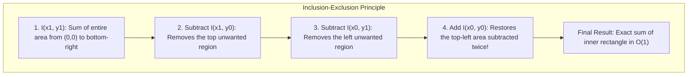

# Integral Images 101: An Intuitive (ELI5) and Technical Guide

> **Target Audience:** From beginners seeking an intuitive conceptual grasp to computer vision, robotics, video tracking, and image processing engineers implementing fast bounding box statistics, real-time adaptive thresholding, and constant-time box filtering.

---

## Executive Summary & ELI5 (Explain Like I'm 5)

An **Integral Image** (also known in computer graphics as a **Summed-Area Table**) is a mathematical data structure that allows you to calculate the sum, average, variance, or standard deviation of pixels inside **any rectangular box in an image in strictly constant time $\mathcal{O}(1)$**.

Whether your bounding box is a tiny $4 \times 4$ icon or a massive $1920 \times 1080$ frame, the calculation always takes the **exact same fraction of a microsecond** (just four array lookups and three basic operations).

---

### The Intuitive Analogy: The Bank Statement Trick

Imagine you want to answer this question:
*"How much money did I spend between March 12th and March 28th?"*

```
[ Slow Naive Way: Count every receipt ] ──► Add 45 individual transactions one-by-one: O(N) operations!

[ Fast Bank Statement Trick ]          ──► Take Balance on March 28th minus Balance on March 11th: O(1)!
```

1. **The Slow Naive Way:**
   - You dump out a shoebox of 45 receipts and add them up one by one:
     $$\$12.50 + \$4.20 + \$98.00 + \dots = \text{Total}$$
   - If there were 1,000 receipts, it would take you 1,000 additions. The time required scales directly with the number of days ($\mathcal{O}(N)$).

2. **The Clever Bank Statement Way (The Integral Table):**
   - Your bank statement already maintains a **running cumulative total** (the balance column).
   - You don't read any receipts! You simply look up two numbers:
     $$\text{Total Spent} = \text{Balance}(\text{March 11}) - \text{Balance}(\text{March 28})$$
   - With **one single subtraction**, you get the exact answer in less than a second ($\mathcal{O}(1)$), whether the date range spans 3 days or 300 days!

---

### Extending the Trick to 2D (The 4-Corner Method)

In an image, pixels are arranged in a 2D grid. Instead of a 1D running balance, the **Integral Image** computes a 2D cumulative sum: each cell stores the sum of **all pixels above and to the left of that point**.

To find the sum of any rectangle, you only need the values at its **four corners**:

```
                       x₀            x₁
                 ┌─────┬─────────────┬─────┐
                 │     │             │     │
              y₀ ├─────A─────────────B─────┤
                 │     │/////////////│     │
                 │     │// RECTANGLE //│     │  <- Sum of shaded area = D + A - B - C
                 │     │/////////////│     │
              y₁ ├─────C─────────────D─────┤
                 │     │             │     │
                 └─────┴─────────────┴─────┘
```

By adding the bottom-right corner $D$, adding the top-left corner $A$, and subtracting the two opposite corners $B$ and $C$, you isolate the shaded rectangle with **four lookups, one addition, and two subtractions**!

---

## 1. What is an Integral Image? (The 101 Technical Overview)

The Summed-Area Table was invented in 1984 by computer graphics pioneer **Frank Crow** for fast texture mapping mipmaps. In 2001, **Paul Viola and Michael Jones** adapted it to computer vision as the "Integral Image" to power the legendary **Viola-Jones real-time face detector**.

### Mathematical Definition

For an input grayscale image $i(x, y)$ of dimensions $W \times H$, the integral image $I(x, y)$ is defined as:

$$I(x, y) = \sum_{x' \le x} \sum_{y' \le y} i(x', y')$$

Each location $(x, y)$ contains the total sum of all pixels contained in the rectangle between the image origin $(0, 0)$ and $(x, y)$:

```
(0, 0) ┌───────────────────────────┐
       │ * * * * * * * * *         │
       │ * * * * * * * * *         │
       │ * * * * * * * * *         │
       │ * * * * * * * *(x, y)     │  <- I(x, y) equals sum of all '*' pixels!
       │                           │
       └───────────────────────────┘ (W, H)
```

---

### Complexity Comparison

| Operation | Naive Image Loop | Integral Image | Speedup Factor ($100 \times 100$ Box) |
| :--- | :--- | :--- | :--- |
| **Precomputation Time** | None ($0$) | Single pass: $\mathcal{O}(W \cdot H)$ | One-time overhead |
| **Query Sum of Box** | $\mathcal{O}(W_{\text{box}} \cdot H_{\text{box}})$ | **$\mathcal{O}(1)$ (Constant time)** | **$10,000\times$ faster** |
| **Query Local Mean ($\mu$)** | $\mathcal{O}(W_{\text{box}} \cdot H_{\text{box}})$ | **$\mathcal{O}(1)$ (Constant time)** | **$10,000\times$ faster** |
| **Query Local Variance ($\sigma^2$)**| $\mathcal{O}(W_{\text{box}} \cdot H_{\text{box}})$ | **$\mathcal{O}(1)$ (Constant time)** | **$10,000\times$ faster** |
| **Box Blur with Radius $R$** | $\mathcal{O}(W \cdot H \cdot R^2)$ | **$\mathcal{O}(W \cdot H)$ (Independent of $R$!)** | Scales to infinite radius |

---

## 2. Mathematical Foundations

### 1. Single-Pass Table Generation in $\mathcal{O}(W \cdot H)$

An integral image is computed in a single sequential sweep over the image using recurrence relations.

By maintaining a cumulative row sum $s(x, y)$:

$$s(x, y) = s(x - 1, y) + i(x, y)$$

$$I(x, y) = I(x, y - 1) + s(x, y)$$

Equivalently, using neighbor values:

$$I(x, y) = i(x, y) + I(x - 1, y) + I(x, y - 1) - I(x - 1, y - 1)$$

```cpp
// Single-pass computation in PelcoD::IntegralImage:
const uint64_t p = static_cast<uint64_t>(rowSrc[x]);
rowSum += p;
m_sumTable[currRow + (x + 1)] = m_sumTable[prevRow + (x + 1)] + rowSum;
```

---

### 2. The $(W+1) \times (H+1)$ Table Format

In practical code, the integral image is sized to $(W + 1) \times (H + 1)$ with a **zero-padded 0th row and column**:
- Row $0 = 0$
- Column $0 = 0$

This eliminates all boundary-checking `if` statements when querying rectangles anchored against the top or left image borders.

---

### 3. The 4-Corner Box Sum Formula

To compute the sum of pixels inside a rectangle $[x_0, y_0]$ to $[x_1, y_1]$ (where $x_1 = x_0 + w$ and $y_1 = y_0 + h$):

$$\text{Sum}(x_0, y_0, w, h) = I(x_1, y_1) + I(x_0, y_0) - I(x_1, y_0) - I(x_0, y_1)$$



---

### 4. Squared Integral Image & Fast Variance

By computing a companion **Squared Integral Image** $I_{sq}(x, y)$ in the same single pass:

$$I_{sq}(x, y) = \sum_{x' \le x} \sum_{y' \le y} \big( i(x', y') \big)^2$$

Any local statistical metric can be computed in $\mathcal{O}(1)$ time:

1. **Pixel Count ($N$):**
   $$N = w \cdot h$$

2. **Local Mean ($\mu$):**
   $$\mu = \frac{\text{Sum}(x_0, y_0, w, h)}{N}$$

3. **Local Variance ($\sigma^2$):**
   Using the algebraic identity $\sigma^2 = E[X^2] - (E[X])^2$:
   $$\sigma^2 = \frac{\text{SumSq}(x_0, y_0, w, h)}{N} - \mu^2$$

4. **Local Standard Deviation ($\sigma$):**
   $$\sigma = \sqrt{\max(0.0, \, \sigma^2)}$$

---

## 3. Practical Computer Vision Applications

### A. Constant-Time Box Blur (Arbitrary Radius)

A box blur replaces every pixel with the average of its neighboring $(2R + 1) \times (2R + 1)$ window.
- **Traditional Convolution:** Blurring with radius $R = 30$ ($61 \times 61$ kernel) requires $3,721$ operations per pixel. A 1080p frame takes several seconds of CPU time.
- **Integral Image Box Blur:** Every pixel simply evaluates one $\mathcal{O}(1)$ box query:
  $$\text{Blurred}(x, y) = \frac{\text{computeSum}(x - R, \, y - R, \, 2R + 1, \, 2R + 1)}{(2R + 1)^2}$$
  Execution time is **completely independent of $R$**. A blur of radius $R = 100$ runs just as fast as $R = 1$!

---

### B. Bradley-Roth Adaptive Thresholding

When tracking outdoor security camera feeds under harsh sun, moving clouds, or headlights, a fixed global threshold (e.g. `pixel > 128`) fails completely.

In 2007, Derek Bradley and Gerhard Roth introduced an adaptive thresholding algorithm based on integral images:

```mermaid
flowchart TD
    FRAME["Input Video Frame"] --> INT["Compute Integral Image: O(W·H)"]
    INT --> SLIDE["For each pixel (x, y):"]
    SLIDE --> MEAN["Compute local neighborhood mean μ in O(1)"]
    MEAN --> CHECK{"pixel(x, y) < μ · (1.0 - thresholdFraction)?"}
    CHECK -->|Yes (Darker than local background)| BLACK["Set dst(x, y) = 0 (Target Binarized)"]
    CHECK -->|No| WHITE["Set dst(x, y) = 255 (Background)"]
```

- Operates in real time ($<2\text{ ms}$ for 1080p).
- Robust to intense shadows, glare, and changing ambient daylight.

---

### C. Haar-like Feature Cascades (Viola-Jones)

To detect faces, vehicles, or pedestrian silhouettes, the Viola-Jones detector evaluates rectangular differential features:

```
Two-Rectangle Feature                  Three-Rectangle Feature
┌───────────┬───────────┐              ┌───────┬───────┬───────┐
│   White   │   Black   │              │ White │ Black │ White │
│  (+1.0)   │  (-1.0)   │              │(+1.0) │(-2.0) │(+1.0) │
└───────────┴───────────┘              └───────┴───────┴───────┘
Detects vertical boundaries.           Detects lines (e.g. bridge of nose).
```

Each rectangular feature is computed by subtracting adjacent integral box queries in $\mathcal{O}(1)$ time, allowing thousands of feature tests per video frame at 60 FPS.

---

## 4. Practical Engineering Nuances: Overflow Prevention

When summing pixel brightness values ($0\text{--}255$) across millions of pixels, **integer overflow** is a critical failure mode:

### 32-bit Integer Overflow Limits
- A 32-bit unsigned integer (`uint32_t`) has a maximum value of:
  $$2^{32} - 1 = 4,294,967,295$$
- For an 8-bit image with all-white pixels ($255$):
  - In a standard $1080\text{p}$ frame ($1920 \times 1080 = 2,073,600$ pixels):
    $$\text{Max Sum} = 2,073,600 \times 255 = 528,768,000 \quad (\approx 12\% \text{ of 32-bit limit — Safe})$$
  - In a $4\text{K UHD}$ frame ($3840 \times 2160 = 8,294,400$ pixels):
    $$\text{Max Sum} = 8,294,400 \times 255 = 2,115,072,000 \quad (\approx 49\% \text{ of 32-bit limit — Dangerously close!})$$
  - **The Squared Sum Table ($I_{sq}$):**
    Each squared pixel is up to $255^2 = 65,025$.
    For $1080\text{p}$:
    $$\text{Max SumSq} = 2,073,600 \times 65,025 = 134,835,840,000 \gg 2^{32} - 1 \quad (\mathbf{\text{Catastrophic Overflow!}})$$

### The Solution: 64-bit Accumulators
Inside [`IntegralImage.h`](../../libs/PelcoDMath/IntegralImage.h#L126), tables are strictly allocated with 64-bit integers:
```cpp
std::vector<uint64_t> m_sumTable;    // Max 1.84 × 10¹⁹ (Immune to overflow)
std::vector<uint64_t> m_sqSumTable;  // Max 1.84 × 10¹⁹ (Immune to overflow)
```
This guarantees safe computation for arbitrarily large 4K and 8K video streams.

---

## 5. Where Integral Images are Used in the Real World

```
┌────────────────────────────────────────────────────────────────────────────┐
│                    REAL-WORLD INTEGRAL IMAGE APPLICATIONS                  │
├──────────────────────┬──────────────────────┬──────────────────────────────┤
│ Computer Vision      │ Optical Character Rec│ Video Surveillance           │
│ - Viola-Jones Face   │ - Bradley-Roth doc   │ - Foreground shadow removal  │
│   Detection (OpenCV) │   binarization       │ - Fast local contrast norm   │
│ - SURF Feature Blobs │ - Uneven scan shadow │ - Target bounding-box energy │
├──────────────────────┼──────────────────────┼──────────────────────────────┤
│ 3D Graphics & Games  │ Medical Diagnostics  │ Autonomous Vehicles          │
│ - Summed-Area Table  │ - Bone density ROI   │ - Pedestrian box detectors   │
│   texture filtering  │   statistical norm   │ - Lane boundary binarization │
│ - Bokeh blur depth   │ - Cell colony counts │ - Traffic sign multi-scale   │
└──────────────────────┴──────────────────────┴──────────────────────────────┘
```

---

## 6. How Integral Images are Used in This Project (`PelcoD-Controller`)

In the `PelcoD-Controller` codebase, [`IntegralImage`](../../libs/PelcoDMath/IntegralImage.h) is implemented in pure C++17 to provide real-time frame analysis and illumination-invariant target tracking:

### 1. Zero-Copy Video Frame Ingestion
- `compute(const uint8_t* pixels, int width, int height, int stride, bool computeSquared)`:
  - Ingests raw video frame buffers directly from decoded RTSP streams.
  - Respects pitch byte stride without intermediate allocations.
  - Builds $(W + 1) \times (H + 1)$ cumulative tables in a single cache-linear pass.

---

### 2. Fast Bounding-Box Statistics for Target Validation
When optical tracking or motion detection locks onto an object:
- `computeMean(const Rect& rect)`: Instantly validates target brightness against background contrast.
- `computeStdDev(const Rect& rect)`: Measures local target texture complexity. If standard deviation collapses to zero, rejects flat clouds, blue sky, or video compression artifacts.

---

### 3. Illumination-Invariant Adaptive Thresholding
The `adaptiveThreshold()` method implements Bradley-Roth binarization:
- Dynamically segments targets from high-glare surfaces, snow, or nighttime parking lots with headlights.
- Eliminates camera auto-exposure hunting from disrupting centroid tracker locks.

---

### 4. Constant-Time Image Pre-Filtering
- `boxBlur(uint8_t* dst, int radius)`: Smooths video frames prior to edge detection or phase correlation at constant speed regardless of blur radius.

---

## 7. References & Verified Further Reading

The following foundational papers and textbooks provide verified, authoritative details on Summed-Area Tables and Integral Images:

1. **Crow, Frank C. (1984).**  
   "Summed-Area Tables for Texture Mapping."  
   *ACM SIGGRAPH Computer Graphics*, Vol. 18, No. 3, pp. 207–212.  
   DOI: [10.1145/964965.808590](https://doi.org/10.1145/964965.808590)  
   *(The seminal paper inventing the summed-area table for computer graphics).*

2. **Viola, Paul, and Jones, Michael J. (2001).**  
   "Rapid Object Detection using a Boosted Cascade of Simple Features."  
   *Proceedings of the 2001 IEEE Computer Society Conference on Computer Vision and Pattern Recognition (CVPR)*, Vol. 1, pp. 511–518.  
   DOI: [10.1109/CVPR.2001.990517](https://doi.org/10.1109/CVPR.2001.990517)  
   *(The landmark paper introducing the term "Integral Image" and real-time Haar cascades).*

3. **Bradley, Derek, and Roth, Gerhard. (2007).**  
   "Adaptive Thresholding using the Integral Image."  
   *Journal of Graphics Tools*, Vol. 12, No. 2, pp. 13–21.  
   DOI: [10.1080/2151237X.2007.10129236](https://doi.org/10.1080/2151237X.2007.10129236)  
   *(The definitive paper on fast, illumination-invariant binarization via integral tables).*

4. **Bay, Herbert, Ess, Andreas, Tuytelaars, Tinne, and Van Gool, Luc. (2008).**  
   "Speeded-Up Robust Features (SURF)."  
   *Computer Vision and Image Understanding*, Vol. 110, No. 3, pp. 346–359.  
   DOI: [10.1016/j.cviu.2007.09.014](https://doi.org/10.1016/j.cviu.2007.09.014)  
   *(Demonstrates how integral images evaluate fast approximate Hessian blob detectors).*

5. **Related Documentation in This Repository:**  
   - [`docs/technical/DCT_101.md`](DCT_101.md): Complementary guide explaining the Discrete Cosine Transform (DCT) for focus scoring.
   - [`docs/technical/DWT_101.md`](DWT_101.md): Complementary guide explaining the Discrete Wavelet Transform (DWT).
   - [`docs/technical/FFT_101.md`](FFT_101.md): Complementary guide explaining the Fast Fourier Transform (FFT).
   - [`docs/technical/PID_Controller_101.md`](PID_Controller_101.md): Complementary guide explaining the PID controller.
   - [`docs/technical/Kalman_Filter_101.md`](Kalman_Filter_101.md): Complementary guide explaining the Kalman filter.
   - [`docs/technical/Notch_Filter_101.md`](Notch_Filter_101.md): Complementary guide explaining the Digital Notch Filter.
   - [`libs/PelcoDMath/IntegralImage.h`](../../libs/PelcoDMath/IntegralImage.h): Core C++17 IntegralImage implementation.
