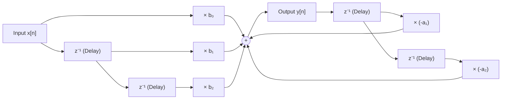
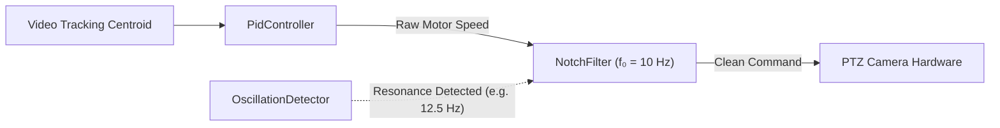

# Notch Filter 101: An Intuitive (ELI5) and Technical Guide

> **Target Audience:** From beginners seeking an intuitive conceptual grasp to software, robotics, control systems, and audio engineers implementing digital biquad filters, resonance elimination, and vibration suppression.

---

## Executive Summary & ELI5 (Explain Like I'm 5)

A **Notch Filter** (also called a **Band-Stop** or **Band-Reject** filter) is the surgical scalpel of signal processing. While a standard filter acts like a broad wall (blocking all high pitches or all low rumbles), a notch filter **eliminates one single, precise frequency while letting every other frequency pass through completely untouched**.

---

### The Intuitive Analogy: The Noise-Canceling Tweezers

Imagine sitting in a quiet room trying to enjoy a classical concert, but there is an old fluorescent ceiling light buzzing with an annoying $60\text{ Hz}$ electrical hum:

```
[ Full Audio Spectrum + Annoying 60 Hz Hum ] ──► [ Notch Filter ] ──► [ Pure Audio: 60 Hz Vanished! ]
```

1. **The Low-Pass Filter Approach (The Heavy Earmuffs):**
   - You put on heavy earmuffs. The $60\text{ Hz}$ hum is gone, but now the violins, flutes, and human voices are muffled and unintelligible.
2. **The Notch Filter Approach (Surgical Precision Tweezers):**
   - You insert an acoustic notch filter tuned exactly to $60\text{ Hz}$.
   - It plucks out the $60\text{ Hz}$ electrical hum with surgical precision. The bass at $45\text{ Hz}$ is untouched, the piano at $70\text{ Hz}$ is untouched, and the violins at $2,000\text{ Hz}$ are crystal clear.

---

### The Singing in a Tiled Bathroom Analogy (Acoustic Resonance)

Have you ever sung in a small, tiled bathroom and noticed that at one specific pitch, the entire room suddenly roars and shakes?
- That is **Mechanical Resonance**: the physical dimensions of the room naturally amplify that one frequency.
- In mechanical systems (such as high-mast security cameras, robotic arms, or quadcopter drones), motor vibrations can accidentally hit the structural resonant frequency of the metal mast. When this happens, the camera shakes violently and self-destructs.
- A **Notch Filter** is programmed to surgically mute that exact resonant pitch from the motor commands, preventing the camera mast from ever vibrating.

---

### The Latency Paradox: Scalpel vs. Sledgehammer

In real-time motion tracking and servo control, **latency (phase lag) is the enemy of stability**:
- If you use a broad low-pass filter to smooth out a camera's jitter, the filter introduces a $50\text{--}100\text{ ms}$ time delay. This delay causes the PID controller to oscillate and lag behind moving targets.
- A **Notch Filter** introduces **near-zero phase lag** across normal operating frequencies. It only acts inside a microscopic slice around the offending vibration frequency.

---

## 1. What is a Notch Filter? (The 101 Technical Overview)

A notch filter is a filter whose frequency response features a sharp, narrow **attenuation notch** centered at frequency $f_0$.

```
Gain (dB)
    ▲
  0 ┼──────────────────.                .─────────────────── Passband (Gain = 1.0 / 0 dB)
    │                   \              /
-10 ┼                    \            /
-20 ┼                     \          /
-30 ┼                      \        /
-40 ┼                       \      /
-∞  ┼                        \    /
    │                         \  /
    │                          ▼   <- Center Frequency f₀ (Transmission Null)
────┼──────────────────────────┼────────────────────────────► Frequency (f)
   0 Hz                       f₀                           Nyquist (fs/2)
```

### Frequency Response Zones
1. **Low-Frequency Passband ($f \ll f_0$):** Signals pass with unity gain ($0\text{ dB}$) and negligible phase shift.
2. **The Notch ($f \approx f_0$):** Extreme attenuation ($-\infty\text{ dB}$ theoretically, typically $-40\text{ to } -60\text{ dB}$ in discrete implementations).
3. **High-Frequency Passband ($f \gg f_0$):** Signals pass with unity gain ($0\text{ dB}$) up to the Nyquist frequency.

---

### The Quality Factor ($Q$)

The sharpness of the notch is governed by the dimensionless **Quality Factor ($Q$)**:

$$Q = \frac{f_0}{\text{BW}_{-3\text{dB}}}$$

Where $\text{BW}_{-3\text{dB}}$ is the bandwidth (in Hertz) measured between the two points where the signal power drops by half ($-3\text{ dB}$):

```
       Low Q (e.g. Q = 1.0): Wide trough              High Q (e.g. Q = 10.0): Sharp needle
Gain                                           Gain
  0 ───\            /───                         0 ────────\  /────────
        \          /                                        \/
         \________/                                          │
            f₀                                              f₀
   Attenuates nearby frequencies.                 Surgically cuts ONLY f₀.
   Wider phase shift disturbance.                 Minimal phase impact on neighboring bands.
```

- **Low $Q$ ($0.5 \le Q \le 2.0$):** Wide notch. Good when the mechanical vibration frequency drifts slightly as temperature or load changes.
- **High $Q$ ($5.0 \le Q \le 20.0$):** Sharp, narrow notch. Minimizes phase lag in control loops, but requires an accurate and stationary resonant frequency.

---

## 2. Mathematical Foundations: The Digital Biquad IIR Filter

### The Analog Prototype ($s$-Domain)

In continuous time (Laplace domain), a 2nd-order notch filter transfer function is:

$$H(s) = \frac{s^2 + \omega_0^2}{s^2 + \frac{\omega_0}{Q} s + \omega_0^2}$$

Where $\omega_0 = 2\pi f_0$ is the angular notch frequency.
- The **zeros** lie directly on the imaginary axis at $s = \pm j\omega_0$. When input frequency $s = j\omega_0$, the numerator becomes $(j\omega_0)^2 + \omega_0^2 = -\omega_0^2 + \omega_0^2 = 0$, producing a mathematical **transmission zero (total null)**.
- The **poles** lie in the left-half plane, providing stability and controlling the bandwidth via $Q$.

---

### Digital Discretization ($z$-Domain Biquad)

Applying the **Bilinear Transform** ($s = \frac{2}{T_s} \frac{1 - z^{-1}}{1 + z^{-1}}$) converts the continuous filter into a discrete **2nd-Order Infinite Impulse Response (IIR) Biquad**:

$$H(z) = \frac{Y(z)}{X(z)} = \frac{b_0 + b_1 z^{-1} + b_2 z^{-2}}{a_0 + a_1 z^{-1} + a_2 z^{-2}}$$

Normalizing by dividing all coefficients by $a_0$:

$$H(z) = \frac{\frac{b_0}{a_0} + \frac{b_1}{a_0} z^{-1} + \frac{b_2}{a_0} z^{-2}}{1 + \frac{a_1}{a_0} z^{-1} + \frac{a_2}{a_0} z^{-2}}$$

---

### The Direct Form I Difference Equation

In firmware and embedded C++, the filter processes input samples $x[n]$ to produce output samples $y[n]$ using the **Direct Form I** difference equation:

$$y[n] = b_0 x[n] + b_1 x[n-1] + b_2 x[n-2] - a_1 y[n-1] - a_2 y[n-2]$$



This computation requires only **5 multiplications and 4 additions per sample**, executing in less than 5 nanoseconds on modern processors.

---

### Robert Bristow-Johnson Audio EQ Cookbook Formulas

The standard, numerically stable coefficient derivation (used in [`NotchFilter.cpp`](../../libs/PelcoDMath/NotchFilter.cpp)) is:

1. **Normalized Angular Frequency:**
   $$\omega_0 = \frac{2\pi f_0}{f_s}$$
2. **Intermediate Alpha:**
   $$\alpha = \frac{\sin(\omega_0)}{2 Q}$$
3. **Coefficients:**
   $$a_0 = 1 + \alpha$$
   $$b_0 = \frac{1}{a_0}, \quad b_1 = \frac{-2\cos(\omega_0)}{a_0}, \quad b_2 = \frac{1}{a_0}$$
   $$a_1 = \frac{-2\cos(\omega_0)}{a_0}, \quad a_2 = \frac{1 - \alpha}{a_0}$$

Notice the elegant symmetry:
- $b_0 = b_2$ (mirror symmetric feedforward coefficients).
- $b_1 = a_1 \cdot a_0$ (numerator and denominator share the cosine center term).

---

### Pole-Zero Constellation on the Complex $z$-Plane

```
                      Imaginary Axis
                            ▲
                            │      Zeros on Unit Circle (|z| = 1)
                       _..-─┼─-.._   (Exact Transmission Null)
                     .´     │  o  `.  <- z = e^(+jω₀)
                    /      x│       \ <- Pole inside circle at radius r ≈ (1 - α)
                   /        │        \   (Guarantees stability!)
                  │         │         │
──────────────────┼─────────┼─────────┼──────────► Real Axis
                  │         │         │
                   \        │        /
                    \      x│       / <- Conjugate Pole
                     `.     │  o  .´  <- Conjugate Zero: z = e^(-jω₀)
                       `^..-┼-..^´
                            │
```

- **Zeros on the Unit Circle:** The zeros sit exactly at $z = e^{\pm j \omega_0}$. When an input sine wave hits this angle, the gain drops to zero.
- **Poles inside the Unit Circle:** The poles sit slightly inside the unit circle along the same radial angle. Because all poles have magnitude $|z| < 1$, the filter is provably **Bounded-Input Bounded-Output (BIBO) stable**.

---

## 3. Practical Engineering Nuances: Closed-Loop Stability & Tuning

Deploying a digital notch filter inside a live camera tracking loop requires careful management of phase margin and sample rates:

### A. The Phase Margin Danger Zone

While a notch filter does not add latency far away from $f_0$, it does introduce **phase lag just before the notch frequency**:

```
Phase (Degrees)
   +90° ┼
        │               Phase Lead (f > f₀)
     0° ┼──────.                 .─────────── Zero phase impact far from f₀
        │       \               /
   -90° ┼        \             /
        │         \           /
  -180° ┼          \         /
        │           \_______/   <- Phase Lag (f < f₀)
────────┼───────────────┼────────────────────► Frequency
                       f₀
```

#### The Stability Rule:
If the notch frequency $f_0$ is placed too close to the **control loop crossover frequency** ($f_c$, the bandwidth of the PID controller), the phase lag can push the system's phase margin below zero, turning a stable camera into an out-of-control oscillator.
- **Rule of Thumb:** Ensure the notch frequency is at least **$3\times$ to $5\times$ higher** than the closed-loop tracking bandwidth:
  $$f_{\text{notch}} \ge 3 \cdot f_{\text{crossover}}$$

---

### B. Nyquist Boundary Guarding

Digital filters cannot operate at or above the Nyquist frequency ($f_0 \ge f_s / 2$).
If an operator accidentally requests a $30\text{ Hz}$ notch on a camera telemetry stream sampled at $50\text{ Hz}$ (where Nyquist is $25\text{ Hz}$), naive math produces negative square roots or severe aliasing.

In [`NotchFilter.cpp`](../../libs/PelcoDMath/NotchFilter.cpp#L34), runtime boundary guarding automatically protects the system:
```cpp
const double nyquist = 0.5 * m_sampleRateHz;
if (m_centerFreqHz <= 0.0 || m_centerFreqHz >= nyquist) {
    // Fallback to pass-through (all-pass identity: y[n] = x[n])
    m_b0 = 1.0; m_b1 = 0.0; m_b2 = 0.0;
    m_a1 = 0.0; m_a2 = 0.0;
    return;
}
```

---

### C. Transient Ringing

When an input step occurs, a high-$Q$ notch filter rings (oscillates internally) at its center frequency $f_0$ before settling:

```
Step Input:  ──────────────┐
                           └──────────────────────────────────────
Notch Output (High Q):
                           ┌─\/\/\/\/\/\__________________________
                             ▲ Transient Ringing!
```

- If $Q = 20$, the filter may ring for dozens of cycles.
- For camera mechanical damping, choose **$Q \in [3.0, 8.0]$** as an optimal compromise between steep frequency rejection and rapid transient settling.

---

## 4. Where Notch Filters are Used in the Real World

```
┌────────────────────────────────────────────────────────────────────────────┐
│                        REAL-WORLD NOTCH FILTER APPLICATIONS                │
├──────────────────────┬──────────────────────┬──────────────────────────────┤
│ Drone & Flight Control│ Robotics & Gimbal    │ Optical PTZ Surveillance     │
│ - Betaflight gyro RPM│ - Joint flexibility  │ - Mast wind sway rejection   │
│   tracking notch     │   harmonic damping   │ - Motor gear hunting trap    │
│ - Propeller wash rej │ - Ball screw chatter │ - Tower vibration isolation  │
├──────────────────────┼──────────────────────┼──────────────────────────────┤
│ Audio Engineering    │ Biomedical Sensors   │ Electrical Power Systems     │
│ - 50 Hz / 60 Hz hum  │ - ECG powerline      │ - Sub-synchronous resonance  │
│   ground loop trap   │   interference trap  │ - Grid harmonic elimination  │
│ - Acoustic feedback  │ - EEG line noise     │ - Arc furnace flicker        │
└──────────────────────┴──────────────────────┴──────────────────────────────┘
```

---

## 5. How the Notch Filter is Used in This Project (`PelcoD-Controller`)

In the `PelcoD-Controller` repository, the [`NotchFilter`](../../libs/PelcoDMath/NotchFilter.h) is an integral component of the active vibration suppression and mechanical protection pipeline:



### 1. High-Mast Tower Vibration Isolation
High-mast security cameras mounted on $15\text{--}30\text{ meter}$ poles suffer from wind-induced **vortex shedding**. The pole oscillates at a fixed mechanical eigenfrequency (typically $8\text{--}14\text{ Hz}$).
- Without filtering, the video tracking system sees this shaking and commands the pan/tilt motors to frantically fight it, creating a positive feedback loop that violently shakes the camera.
- The `NotchFilter` is configured to the pole's natural frequency (e.g. `centerFreqHz = 11.2, qFactor = 6.0`), placing a deep attenuation null right at the structural harmonic.

---

### 2. Hunting Suppression with `OscillationDetector`
When [`OscillationDetector`](../../libs/PelcoDCore/OscillationDetector.h) evaluates the tracking error using [`Math::computePsd`](../../libs/PelcoDMath/Fft.h) and identifies persistent limit-cycle oscillations:
1. It calls `autoAttenuate()` to reduce PID proportional gain.
2. It reconfigures `NotchFilter::setParameters(detectedFreq, sampleRate, 5.0)`.
3. The notch filter immediately suppresses the hunting frequency from the motor command output, preventing gear tooth stripping and restoring smooth tracking.

---

### 3. Zero-Allocation In-Loop Execution
Because the notch filter operates inside high-rate control loops ($50\text{--}100\text{ Hz}$):
- Implemented as a pure C++ class with no heap allocations (`noexcept`).
- Direct Form I state memory uses only four scalar registers (`m_x1, m_x2, m_y1, m_y2`).
- Provides a clean `reset()` method for seamless target re-acquisition without residual state memory.

---

## 6. References & Verified Further Reading

The following standard reference texts, technical manuals, and seminal papers provide verified, authoritative details on notch filtering and biquad implementation:

1. **Bristow-Johnson, Robert. (2001).**  
   "Cookbook Formulae for Audio Equalizer Biquad Filter Coefficients."  
   Audio Engineering Society (AES) Convention Paper.  
   Publicly accessible reference:  
   [https://www.w3.org/TR/audio-eq-cookbook/](https://www.w3.org/TR/audio-eq-cookbook/)  
   *(The industry-standard biquad derivation used worldwide for notch, peaking, and shelf filters).*

2. **Oppenheim, Alan V., and Schafer, Ronald W. (2009).**  
   *Discrete-Time Signal Processing* (3rd ed.). Prentice Hall.  
   ISBN: 978-0-13-198842-2.  
   *(Chapter 5: Transform Analysis of Linear Time-Invariant Systems; pole-zero placement on the unit circle).*

3. **Ellis, George. (2012).**  
   *Control System Design Guide: Using Your Computer to Understand and Diagnose Feedback Controllers* (4th ed.). Butterworth-Heinemann.  
   ISBN: 978-0-12-385920-4.  
   *(Comprehensive treatment of using digital notch filters to cancel structural resonance in motion control).*

4. **Åström, Karl Johan, and Murray, Richard M. (2021).**  
   *Feedback Systems: An Introduction for Scientists and Engineers* (2nd ed.). Princeton University Press.  
   Caltech companion: [http://www.cds.caltech.edu/~murray/amwiki](http://www.cds.caltech.edu/~murray/amwiki)  
   *(Covers loop shaping, resonant poles, and phase margin constraints).*

5. **Related Documentation in This Repository:**  
   - [`docs/technical/Integral_Images_101.md`](Integral_Images_101.md): Complementary guide explaining Integral Images (Summed-Area Tables).
   - [`docs/technical/PID_Controller_101.md`](PID_Controller_101.md): Complementary guide explaining the PID controller.
   - [`docs/technical/Kalman_Filter_101.md`](Kalman_Filter_101.md): Complementary guide explaining the Kalman filter.
   - [`docs/technical/FFT_101.md`](FFT_101.md): Complementary guide explaining the Fast Fourier Transform (FFT).
   - [`docs/technical/DCT_101.md`](DCT_101.md): Complementary guide explaining the Discrete Cosine Transform (DCT).
   - [`docs/technical/DWT_101.md`](DWT_101.md): Complementary guide explaining the Discrete Wavelet Transform (DWT).
   - [`libs/PelcoDMath/NotchFilter.h`](../../libs/PelcoDMath/NotchFilter.h): Core C++17 NotchFilter implementation.
   - [`libs/PelcoDCore/OscillationDetector.h`](../../libs/PelcoDCore/OscillationDetector.h): Motor resonance and hunting detector.
