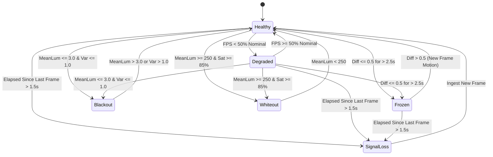

# Stream Health & Freeze / Signal-Loss Monitor 101: An Intuitive (ELI5) and Technical Guide

> **Target Audience:** From operators and junior engineers seeking an intuitive understanding of video pipeline anomalies to robotics, computer vision, surveillance, and PTZ telemetry engineers designing resilient mission-critical video streaming systems.

---

## Executive Summary & ELI5 (Explain Like I'm 5)

Imagine you are a security guard watching a bank monitor. What can go wrong with the picture?
1. **The stream freezes:** The guard thinks everything is fine because the vault door looks closed, but in reality, a hacker or network glitch is playing the exact same frozen picture over and over!
2. **The cable is cut (Signal Loss):** The screen turns completely blank or the camera stops sending data altogether.
3. **Someone sprays spray paint on the camera lens (Blackout):** The screen goes pitch black.
4. **Someone shines a high-power tactical laser or bright spotlight directly into the lens (Whiteout):** The screen turns blindingly white.
5. **The Wi-Fi or cellular link gets choked (Degraded FPS):** The stream stutters down to 3 frames per second instead of 30, making pan-tilt-zoom tracking erratic.

```
+-----------------------------------------------------------------------------------------+
|                                Stream Health Monitor                                    |
|                                                                                         |
|   +-------------------+    Sub-Sampled Grid (<0.05ms)    +--------------------------+   |
|   |   Incoming Frame  | ───────────────────────────────► |  Mean Lum, Variance      |   |
|   |  (1080p / 4K / IR)|                                  |  Spatial Fingerprint Diff|   |
|   +-------------------+                                  +-------------+------------+   |
|                                                                        |                |
|                                                                        ▼                |
|                                                          +--------------------------+   |
|   State Machine Evaluation:                              | Diagnostic State:        |   |
|     - Difference <= 0.5 for > 2.5s?  ──► FROZEN          |   - Healthy              |   |
|     - No frame for > 1.5s?           ──► SIGNAL LOSS     |   - Degraded             |   |
|     - Mean lum < 3.0 & var < 1.0?    ──► BLACKOUT        |   - Frozen               |   |
|     - Mean lum > 250 & sat > 85%?    ──► WHITEOUT        |   - SignalLoss           |   |
|     - FPS < 50% of nominal?          ──► DEGRADED        |   - Blackout             |   |
|                                                          |   - Whiteout             |   |
|                                                          +-------------+------------+   |
|                                                                        |                |
|                                            Auto-Reconnect Callback ◄───+                |
|                                            Health Changed Callback ◄───+                |
+-----------------------------------------------------------------------------------------+
```

The **Stream Health Monitor** (`Video::StreamHealthMonitor`) is an automated, real-time watchdog that sits inside the video decoding pipeline. Without burning CPU power on full-resolution pixel processing, it samples a spatial grid across every frame in under **$0.05\text{ ms}$**, detects anomalies instantaneously, and immediately alerts the system or triggers an automated stream reconnection.

---

## The Anomaly Taxonomy

| Anomaly State | Root Causes | Real-World Impact | Detection Mechanism |
| :--- | :--- | :--- | :--- |
| **`Healthy`** | Normal operation, camera delivering frames at nominal rate. | Operator receives crisp, low-latency live video. | Frame differences $> 0.5$, FPS within nominal range, luminance balanced. |
| **`Degraded`** | Saturated network link, dropped RTP packets, decoding buffer queue spikes. | Choppy video, high control loop latency for PTZ tracking. | Measured rolling FPS drops below `nominalFps * degradedFpsRatio` (default $< 50\%$). |
| **`Frozen`** | RTSP decode loop hung, camera firmware stalled, duplicate frame replay. | False sense of security; operator sees static scene while reality diverges. | Inter-frame fingerprint mean difference $\le 0.5$ continuously for $> 2.5\text{ s}$. |
| **`SignalLoss`** | Severed cable, power failure, Wi-Fi disconnection, socket timeout. | Complete telemetry and situational awareness failure. | Wall-clock elapsed time since last received frame exceeds `signalLossTimeoutSec` (default $> 1.5\text{ s}$). |
| **`Blackout`** | Physical lens cap left on, spray paint, bag placed over camera, complete sensor failure. | Zero visual reconnaissance; total occlusion. | Mean luminance $\le 3.0$ and luminance variance $\le 1.0$ (flat dark frame). |
| **`Whiteout`** | Direct blinding laser attack, vehicle high-beams, sunlight specular reflection. | Optical sensor saturation; burned-out highlights. | Mean luminance $\ge 250.0$ and $\ge 85\%$ of sampled pixels saturated at $\ge 250$. |

---

## Architectural Principles & Algorithms

### 1. Ultra-Low Overhead Sub-Sampled Grid Fingerprinting

Processing every pixel of a $1920 \times 1080$ frame ($6,220,800$ bytes for RGB24) at 60 FPS would consume significant memory bandwidth and CPU cache. 

Instead, `StreamHealthMonitor` evaluates a regular spatial grid with configurable step size $\Delta_s$ (default $\Delta_s = 8$):
- **Sample coordinates:**
  $$x_c = c \cdot \Delta_s, \quad y_r = r \cdot \Delta_s$$
- **1080p Grid Dimension:**
  $$N_{\text{cols}} = \lceil 1920 / 8 \rceil = 240, \quad N_{\text{rows}} = \lceil 1080 / 8 \rceil = 135$$
  $$N_{\text{samples}} = 240 \times 135 = 32,400 \text{ pixels}$$
This reduces computational complexity by a factor of $64\times$ ($1.56\%$ of the pixels), dropping frame inspection time from $\sim 1.5\text{ ms}$ down to $< 0.04\text{ ms}$ on modern x86_64 processors.

### 2. Fast Luminance Extraction

For each sampled pixel at position $(x, y)$, luminance $Y$ is extracted using ITU-R BT.601 integer fixed-point weighting:
$$Y = \frac{77 \cdot R + 150 \cdot G + 29 \cdot B}{256} \approx 0.299 R + 0.587 G + 0.114 B$$
This requires zero floating-point conversions during raw grid parsing.

### 3. Spatial Fingerprint Difference & Motion Metric

A compact 1D vector $F_t \in [0, 255]^{N_{\text{samples}}}$ represents the spatial fingerprint of frame $t$. The inter-frame motion metric is defined as the Mean Absolute Difference (MAD):

$$\Delta F_t = \frac{1}{N_{\text{samples}}} \sum_{k=1}^{N_{\text{samples}}} |F_t(k) - F_{t-1}(k)|$$

- If $\Delta F_t \le \epsilon_{\text{freeze}}$ (default $0.5$ LSB): The frame is identical or differs only by negligible sensor thermal noise.
- If this static condition persists for $\tau_{\text{freeze}} \ge 2.5\text{ s}$, the monitor transitions to `Frozen`.
- The moment $\Delta F_t > \epsilon_{\text{freeze}}$, candidate freeze duration resets to zero and healthy status resumes.

### 4. Luminance Statistics for Occlusion & Glare

Simultaneously during grid extraction, the first and second raw moments of luminance are computed:
$$\mu_Y = \frac{1}{N} \sum_{k=1}^N Y_k, \quad \sigma^2_Y = \frac{1}{N-1} \left( \sum_{k=1}^N Y_k^2 - \frac{1}{N} \left( \sum_{k=1}^N Y_k \right)^2 \right)$$

- **Blackout Detection:**
  $$\mu_Y \le 3.0 \quad \text{AND} \quad \sigma^2_Y \le 1.0$$
  Differentiates a covered lens from a natural night-vision or dark scene (which retains texture and edge variance).
- **Whiteout Detection:**
  $$\mu_Y \ge 250.0 \quad \text{AND} \quad \frac{1}{N} \sum_{k=1}^N \mathbf{1}(Y_k \ge 250) \ge 0.85$$
  Detects blinding attacks and direct glare without triggering on localized specular highlights.

### 5. Rolling Window FPS Estimation

Frame arrival timestamps $t_i$ are collected in a rolling deque of size $K = 30$:
$$\text{FPS}_{\text{measured}} = \frac{K - 1}{t_{\text{latest}} - t_{\text{earliest}}}$$
If $\text{FPS}_{\text{measured}} < \text{FPS}_{\text{nominal}} \times 0.5$, the stream is flagged as `Degraded`.

---

## State Transition Diagram



---

## Thread Safety & Deadlock Prevention

The video pipeline operates in a multithreaded architecture where frames are decoded on dedicated worker threads, while UI rendering and network reconnection handlers execute on different threads.

`StreamHealthMonitor` implements the **Lock-and-Snapshot Callback Pattern**:
1. Internal state, metrics, and fingerprints are protected by `std::scoped_lock(m_mutex)`.
2. When a state transition occurs, callbacks (`m_healthCallback`, `m_reconnectCallback`) are copied to local `std::function` variables.
3. The mutex is **released** before calling user callbacks.
4. This strictly prevents inverted-lock deadlocks when user callbacks trigger pipeline reconnects, teardowns, or PTZ homing routines.

---

## C++17 Implementation & API Reference

### 1. Basic Ingestion Example

```cpp
#include "StreamHealthMonitor.h"

// 1. Instantiate monitor with tailored thresholds
Video::StreamHealthConfig config {};
config.nominalFps = 30.0;
config.freezeDurationThresholdSec = 2.0; // 2 seconds static image = freeze
config.signalLossTimeoutSec = 1.0;       // 1 second no packets = signal loss
config.autoReconnectOnFailure = true;

Video::StreamHealthMonitor monitor(config);

// 2. Attach state transition listener
monitor.setHealthCallback([](Video::StreamHealthState oldState, 
                             Video::StreamHealthState newState, 
                             const Video::StreamHealthMetrics& metrics) {
    std::cout << "[HEALTH] Transitioned from " 
              << Video::StreamHealthMonitor::stateToString(oldState)
              << " to " 
              << Video::StreamHealthMonitor::stateToString(newState)
              << " | Measured FPS: " << metrics.measuredFps
              << " | Luminance: " << metrics.meanLuminance << std::endl;
});

// 3. Attach auto-reconnection trigger
monitor.setReconnectCallback([&]() -> bool {
    std::cout << "[WATCHDOG] Triggering RTSP pipeline reconnection..." << std::endl;
    // Call network layer reconnect
    return true;
});

// 4. Ingest frames from decoder thread (or register as IFrameProcessor)
// monitor.process(rgbBuffer, 1920, 1080, Video::PixelFormat::RGB24);
```

### 2. Periodic Signal Loss Polling

While frame anomalies (Frozen, Blackout, Whiteout) are detected passively as frames arrive in `ingestFrame`, complete signal loss (when the camera stops sending entirely) is detected via periodic heartbeat polling:

```cpp
// Called periodically from a 50 ms timer or watchdog thread
void onWatchdogTimer() {
    monitor.checkTimeout(); // Uses monotonic clock internally
}
```

---

## Verification & Unit Testing

The test suite in `libs/Video/tests/TestStreamHealthMonitor.cpp` exercises all failure modes:
1. **`InitialStateAndConfig`**: Verifies defaults and dynamic configuration mutators.
2. **`HealthyDynamicStreaming`**: Confirms full-rate dynamic streaming produces healthy states and accurate measured FPS.
3. **`FreezeDetectionAndRecovery`**: Asserts identical frames transition to `Frozen` precisely at the threshold deadline and recover immediately upon scene motion.
4. **`SignalLossTimeoutAndRecovery`**: Asserts `checkTimeout()` trips `SignalLoss` after packet starvation and recovers upon frame re-ingestion.
5. **`BlackoutDetection`**: Verifies zero-luminance occlusion detection.
6. **`WhiteoutDetection`**: Verifies saturated glare detection.
7. **`DegradedFpsDetection`**: Validates rolling window FPS warning on bandwidth throttling.
8. **`StateTransitionCallbacksAndAutoReconnect`**: Asserts invocation of user callbacks and watchdog reconnection triggers.
9. **`IFrameProcessorIntegration`**: Confirms in-place safety without image buffer alteration.
10. **`StateToString`**: Validates enum-to-string serializers.
