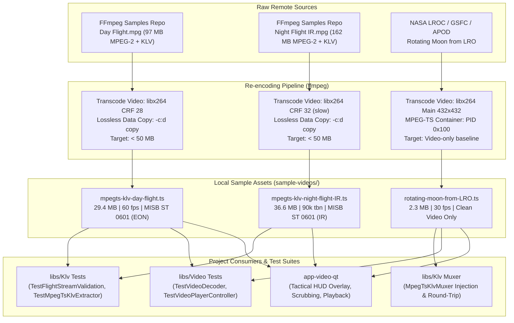

# Sample Videos Reference & Transcoding Guide

This directory contains reference video assets utilized across **PelcoD-Controller** for unit testing, integration testing, timeline scrubbing validation, and STANAG 4609 / MISB ST 0601 KLV metadata extraction and multiplexing.

---

## 1. Inventory & Overview

| Filename | Duration | File Size | Video Format | Telemetry / KLV | Original Origin | Re-encoding Strategy |
| :--- | :--- | :--- | :--- | :--- | :--- | :--- |
| [`mpegts-klv-day-flight.ts`](mpegts-klv-day-flight.ts) | 03:14 (194.88s) | 29.4 MB (30,812,260 B) | H.264 (High @ L3.2), 1280x720, 60 fps, YUV420p | **Yes** (PID `0x101`, MISB ST 0601, Sensor: `EON`) | [FFmpeg Sample Repository](https://samples.ffmpeg.org/MPEG2/mpegts-klv/) (`Day Flight.mpg`) | Transcoded from MPEG-2 to H.264 (CRF 28), lossless KLV stream copy |
| [`mpegts-klv-night-flight-IR.ts`](mpegts-klv-night-flight-IR.ts) | 06:10 (370.82s) | 36.6 MB (38,341,848 B) | H.264 (High @ L6.2), 1280x720, 90k tbn, YUV420p | **Yes** (PID `0x101`, MISB ST 0601, Sensor: `IR`) | [FFmpeg Sample Repository](https://samples.ffmpeg.org/MPEG2/mpegts-klv/) (`Night Flight IR.mpg`) | Transcoded from MPEG-2 to H.264 (CRF 32, slow preset), lossless KLV stream copy |
| [`rotating-moon-from-LRO.ts`](rotating-moon-from-LRO.ts) | 00:21 (21.67s) | 2.3 MB (2,431,028 B) | H.264 (Main @ L3.0), 432x432 (1:1), 30 fps, YUV420p | **None** (Clean video-only elementary stream) | [NASA LROC / SVS / APOD](https://apod.nasa.gov/apod/ap130916.html) (*"Rotating Moon from LRO"*) | Encoded to H.264 MPEG-TS container for video-only / muxer injection testing |

---

## 2. Ingest, Transcoding, and Consumption Pipeline

### ASCII Pipeline Diagram

```
+---------------------------------------------------------------------------------------------------------+
|                                    Video Ingest & Processing Pipeline                                   |
+---------------------------------------------------------------------------------------------------------+
|                                                                                                         |
|  [FFmpeg Sample Repo: Day Flight.mpg]  (97 MB MPEG-2 + KLV)                                             |
|                   |                                                                                     |
|                   v   (ffmpeg -c:v libx264 -crf 28 -c:d copy -copy_unknown)                             |
|  +-------------------------------------+                                                                |
|  | mpegts-klv-day-flight.ts (29.4 MB)  |                                                                |
|  +-------------------------------------+                                                                |
|                   |                                                                                     |
|  [FFmpeg Sample Repo: Night Flight.mpg] (162 MB MPEG-2 + KLV)                                           |
|                   |                                                                                     |
|                   v   (ffmpeg -c:v libx264 -crf 32 -preset slow -c:d copy -copy_unknown)                |
|  +-------------------------------------+                                                                |
|  | mpegts-klv-night-flight-IR.ts(36.6M)|                                                                |
|  +-------------------------------------+                                                                |
|                   |                                                                                     |
|  [NASA LRO / APOD: Rotating Moon]       (Video Animation)                                               |
|                   |                                                                                     |
|                   v   (ffmpeg -c:v libx264 -c:a none -f mpegts)                                         |
|  +-------------------------------------+                                                                |
|  | rotating-moon-from-LRO.ts (2.3 MB)   |                                                                |
|  +-------------------------------------+                                                                |
|                   |                                                                                     |
|                   +------------------------------------+--------------------------------+               |
|                   |                                    |                                |               |
|                   v                                    v                                v               |
|       +-----------------------+            +-----------------------+        +-----------------------+   |
|       | libs/Klv Tests        |            | libs/Video Tests      |        | app-video-qt Player   |   |
|       | - FlightStreamValid.  |            | - FFmpegDecoder       |        | - Monotonic Seek/Scrub|   |
|       | - MpegTsKlvExtractor  |            | - Frame Step / Color  |        | - MISB ST 1909 HUD    |   |
|       | - MpegTsKlvMuxer      |            | - Path Normalization  |        | - Telemetry Sync      |   |
|       +-----------------------+            +-----------------------+        +-----------------------+   |
+---------------------------------------------------------------------------------------------------------+
```

### Mermaid Pipeline Diagram



---

## 3. Detailed Asset Specifications & Origins

### 3.1 [`mpegts-klv-day-flight.ts`](mpegts-klv-day-flight.ts)

* **Origin**: Sourced from the official FFmpeg test sample repository:
  * URL: `https://samples.ffmpeg.org/MPEG2/mpegts-klv/Day%20Flight.mpg`
* **Original Characteristics**:
  * Original format: MPEG-2 Transport Stream (`.mpg`), 97 MB (101,711,872 bytes).
  * Video: MPEG-2 Video, 1280x720 @ 60 fps.
  * Data: SMPTE 336M KLV metadata stream carrying STANAG 4609 / MISB ST 0601 UAS Datalink packets.
* **Content Details**:
  * Authentic daytime flight test captured from an airborne UAS gimbal camera.
  * Sensor identification: `"EON"` (Electro-Optical Narrow).
  * Live telemetry elements: Platform heading, pitch, roll, latitude, longitude, altitude (HAE/MSL), sensor horizontal/vertical Field of View (FOV), slant range, and Sensor Point of Interest (SPI) target coordinates.
  * Checksum method: MISB ST 0601 Section 6.6 Block Check Character (BCC-16).
* **Why Re-encoding Was Required**:
  * The original file size (97 MB) was excessively large for standard Git version control and exceeded repository hygiene recommendations (keeping individual tracked binaries strictly under 50 MB).
* **Re-encoding Configuration**:
  ```powershell
  ffmpeg -i "Day Flight.mpg" -map 0:v -map 0:d -c:v libx264 -crf 28 -c:d copy -copy_unknown "mpegts-klv-day-flight.ts"
  ```
  * **Video Stream**: Transcoded from legacy MPEG-2 to H.264 / AVC (`libx264`) at 720p using Constant Rate Factor (CRF 28), reducing visual data bitrate to ~1.26 Mbps.
  * **Data Stream**: Preserved with 100% bit-exact fidelity via stream copy (`-c:d copy -copy_unknown`). All KLV packets, Universal Labels (`06 0E 2B 34 02 0B 01 01 0E 01 03 01 01 00 00 00`), 90 kHz Presentation Time Stamps (PTS), and Continuity Counters (CC) remained unmodified.
  * **Final Size**: 29.4 MB (30,812,260 bytes) — a ~70% reduction with zero telemetry loss.

---

### 3.2 [`mpegts-klv-night-flight-IR.ts`](mpegts-klv-night-flight-IR.ts)

* **Origin**: Sourced from the official FFmpeg test sample repository:
  * URL: `https://samples.ffmpeg.org/MPEG2/mpegts-klv/Night%20Flight%20IR.mpg`
* **Original Characteristics**:
  * Original format: MPEG-2 Transport Stream (`.mpg`), 162 MB (169,869,312 bytes).
  * Video: MPEG-2 Video, 1280x720, duration > 6 minutes.
  * Data: SMPTE 336M KLV metadata stream carrying STANAG 4609 / MISB ST 0601 UAS Datalink packets.
* **Content Details**:
  * Authentic nighttime thermal flight test captured from an airborne UAS FLIR / IR gimbal sensor.
  * Sensor identification: `"IR"` (Infrared).
  * Live telemetry elements: Aircraft navigation telemetry, sensor azimuth, elevation, platform roll, and target ground location coordinates.
* **Why Re-encoding Was Required**:
  * The uncompressed MPEG-2 stream was 162 MB, far exceeding the GitHub 50 MB soft limit.
* **Re-encoding Configuration**:
  ```powershell
  ffmpeg -i "Night Flight IR.mpg" -map 0:v -map 0:d -c:v libx264 -crf 32 -preset slow -c:d copy -copy_unknown "mpegts-klv-night-flight-IR.ts"
  ```
  * **Video Stream**: Transcoded to H.264 / AVC using CRF 32 with the `slow` preset, optimizing high-noise thermal video compression while maintaining clarity of thermal signatures and crosshairs.
  * **Data Stream**: Exact stream copy (`-c:d copy -copy_unknown`), preserving every STANAG 4609 telemetry packet, PTS alignment, and 16-bit BCC checksum.
  * **Final Size**: 36.6 MB (38,341,848 bytes) — a ~77% reduction while preserving full 6m 10s playback duration.

---

### 3.3 [`rotating-moon-from-LRO.ts`](rotating-moon-from-LRO.ts)

* **Origin**: Created by the **NASA Scientific Visualization Studio (SVS)** and **Arizona State University (ASU)** using data from the **Lunar Reconnaissance Orbiter (LRO)**:
  * Reference: [NASA Astronomy Picture of the Day (APOD) - *"Rotating Moon from LRO"*](https://apod.nasa.gov/apod/ap130916.html)
  * Video Identifier: NASA SVS / YouTube `sNUNB6CMnE8`
* **Content Details**:
  * A synthetic time-lapse simulation showing a complete 360-degree rotation of the Moon.
  * Because the Moon is tidally locked to Earth, observers on Earth can only ever see the nearside. This visualization combines thousands of Lunar Reconnaissance Orbiter Camera (LROC) Wide Angle Camera (WAC) mosaics and Lunar Orbiter Laser Altimeter (LOLA) digital elevation maps to render the lunar farside, Mare Orientale, and south pole highlands.
* **Stream Characteristics**:
  * Container: MPEG-2 Transport Stream (`.ts`, 188-byte packets).
  * Video: H.264 / AVC (Main profile @ Level 3.0), 432x432 resolution (1:1 square aspect ratio), 30 fps progressive, bitrate ~897 kbps.
  * Metadata Track: **None** (clean video-only stream on PID `0x100`).
  * Duration: 21.67 seconds (650 frames).
  * Size: 2.3 MB (2,431,028 bytes).
* **Role in the Project**:
  1. **MPEG-TS KLV Muxer Testing**: Used as a clean, standardized video elementary stream to test [`../libs/Klv/MpegTsKlvMuxer.h`](../libs/Klv/MpegTsKlvMuxer.h). The muxer injects synthetic or captured STANAG 4609 / MISB ST 0601 KLV metadata packets into this pure video stream, outputting a multiplexed multi-stream TS.
  2. **Telemetry Fallback / HUD Degradation Testing**: Validates that [`../app-video-qt/VideoPlayerController.h`](../app-video-qt/VideoPlayerController.h) and tactical HUD overlays ([`../libs/Video/TacticalHudFilter.h`](../libs/Video/TacticalHudFilter.h)) handle streams without KLV metadata gracefully without crashing or stalling playback.
  3. **Continuous Motion & Visual Tracking**: The predictable, uniform spherical rotation provides a repeatable target for PTZ motion tracking and optical flow algorithms.

---

## 4. Test Suite Integration

The sample videos in this directory are directly referenced by automated CTest test suites:

* **[`../libs/Klv/tests/TestFlightStreamValidation.cpp`](../libs/Klv/tests/TestFlightStreamValidation.cpp)**:
  * Demuxes full flight streams (`mpegts-klv-day-flight.ts` and `mpegts-klv-night-flight-IR.ts`).
  * Verifies CRC/BCC checksum validity across thousands of sequential packets.
  * Validates kinematic constraints (e.g. UAS speed <= Mach 1.5, altitude changes <= 100 m/s).
* **[`../libs/Klv/tests/TestMpegTsKlvExtractor.cpp`](../libs/Klv/tests/TestMpegTsKlvExtractor.cpp)**:
  * Tests auto-discovery of metadata PID `0x0101` from stream headers and Universal Labels.
  * Tests tag decoding for timestamp, sensor ID, platform heading, and SPI coordinates.
* **[`../libs/Klv/tests/TestMpegTsKlvMuxer.cpp`](../libs/Klv/tests/TestMpegTsKlvMuxer.cpp)**:
  * Tests multiplexing KLV metadata packets into pure video transport streams (`rotating-moon-from-LRO.ts`).
  * Verifies baseline detection of zero KLV packets in pure video streams.
  * Interleaves simulated lunar orbiter telemetry (LRO mission, LROC sensor, geodetic coordinates, platform attitudes) into the video stream and validates end-to-end extraction fidelity via `MpegTsKlvExtractor`.
* **[`../libs/Video/tests/TestVideoDecoder.cpp`](../libs/Video/tests/TestVideoDecoder.cpp)**:
  * Validates FFmpeg decoding, frame step accuracy, PTS monotonicity, and path normalization across Windows/POSIX environments.
* **[`../tests/TestVideoPlayerController.cpp`](../tests/TestVideoPlayerController.cpp)**:
  * Validates bidirectional timeline scrubbing, binary-search telemetry synchronization, and pause/seek single-frame decoding.
